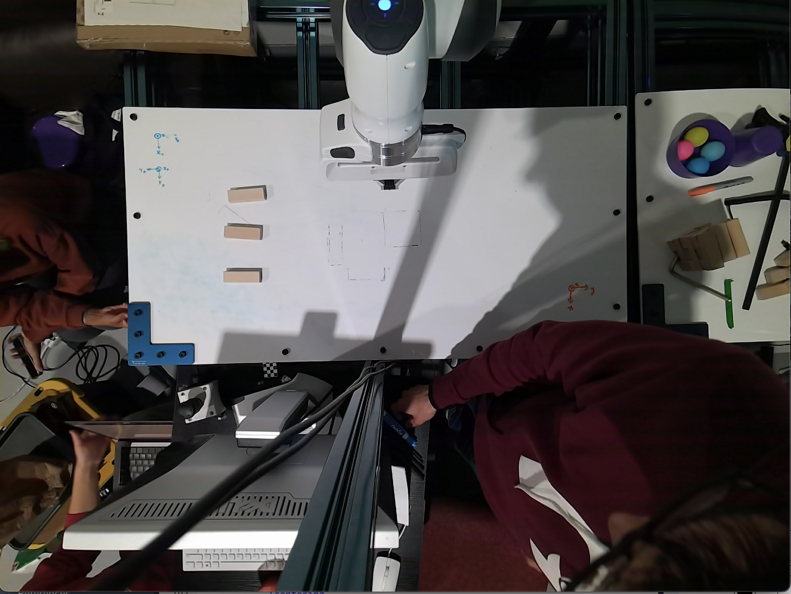
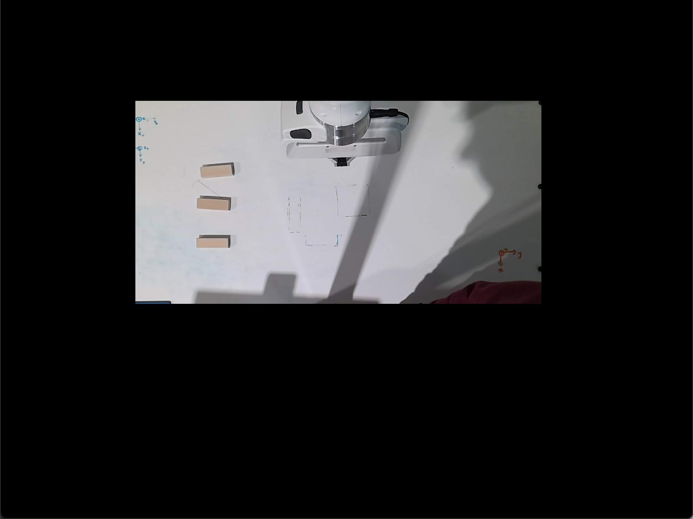

# Point Cloud Library

## PCL Overview
PCL is a large scale open-source library for processing 2D and 3D images and point cloud processing. It is a state of the art library used in most perception related projects. PCL has extensive documentation and ready to use examples for segmentation, recognition, and filtering. It has data structures for kdtree, octree and pointcloud arrays which allows for very fast processing and efficient implementation. Complete documentation for PCL can be found on [their official website](http://pointclouds.org/documentation/).

Using VocelGrid filter pointcloud can be initially downsampled and further sparsification of Kinect data can be done using PassThrough filters. After these basic filtering, you can further perform clustering, cylinderical, or planar segmentation in real-time applications. The PCL tutorials are helpful even if you are an expert and can be found [here](http://pointclouds.org/documentation/tutorials/index.php#filtering-tutorial).

## Installing PCL from source and ros_pcl
Although PCL comes installed with ROS full installation by default, a complete installation of PCL from source might be required in some circumstances along with CUDA for GPU processing. An exhaustive tutorial for the same and also shows how to install openNI can be found [here](http://robotica.unileon.es/mediawiki/index.php/PCL/OpenNI_tutorial_1:_Installing_and_testing).

---
# 3D Sensors using PCL

1. ## Microsoft Kinect

    

    ### Overview:
    Kinect for Xbox 360 is a low-cost vision device equipped with one IR camera, one color camera, and one IR projector to produce RGB images as well as voxel (depth-pixel) images. The RGB video stream gives an 8-bit VGA resolution (640 x 480 pixels) with a Bayer color filter, while the monochrome depth-sensing video stream is in VGA resolution. The sensor has an angular field of view of 57 degrees horizontally and 43 degrees vertically. Kinect has been reverse engineered to a great extent by the open-source community which has revealed many facts on how depth is measured. Kinect uses a structured light approach form in which we can extract the time of return. They use a standard off-the-shelf CMOS sensor for the same.

    ### Libraries for MS Kinect Interfacing in Ubuntu
    Many different open-source libraries can be chosen from for interfacing with Kinect in Ubuntu. Kinect for Windows provides direct interfacing for Windows-based computers. The libraries for Ubuntu are:    

    * #### OpenNI and OpenNI2
        * The older version of Kinect supports openNI whereas the newer version of Kinect uses openNI2. The installation and usage of openNI2 as a standalone library can be found here: http://structure.io/openni
    
    * #### libfreenect and libfreenect2
        libfreenect is also a reliable library that can be used and in my experience have proven to be more reliable than openNI. The only drawback is that while openNI and openNI2 can be used for other sensors such as Asus Xtion Pro or Orbecc Astra depth camera, libfreenect is mostly suited for Kinect only. Useful information on getting started with libfreenect can be found here: https://github.com/OpenKinect/libfreenect

        The full distribution of ROS also includes these libraries by default and the documentation for that can be found at the following links:
        * General libfreenect: http://wiki.ros.org/libfreenect
        * freenect_launch: http://wiki.ros.org/freenect_launch
          * Use `freenect_launch` to access depth data stream which can be visualized on RVIZ.
        * openni_launch: http://wiki.ros.org/openni_launch
          * Similar to libfreenect_launch       

    ### Further Reading
    [This Masters thesis](https://www.nada.kth.se/utbildning/grukth/exjobb/rapportlistor/2011/rapporter11/mojtahedzadeh_rasoul_11107.pdf) is a complete guide for using MS Kinect for navigation.

2. ## Intel Realsense D435i
    
    

    ### Overview:
    The Intel® RealSense™ Depth Camera D400 Series uses stereo vision to calculate depth. The D435 is a USB-powered depth camera and consists of a pair of depth sensors, an RGB sensor, and an infrared projector. It gives a good depth map a well the processed reconstructed 3D point clouds.
    The Intel® RealSense™ D435i is a depth camera that includes a Bosch BMI055 6-axis inertial sensor in addition to the depth camera which measures linear accelerations and angular velocities. Each IMU data packet is timestamped using the depth sensor hardware clock to allow temporal synchronization between gyro, accel and depth frames.
    
    ### Libraries for Intel Realsense Interfacing in Ubuntu
    Many different open-source libraries can be chosen from for interfacing with Realsense in Ubuntu: 
    * #### SDK
        Follow the guidelines at the [official librealsense documentation](https://github.com/IntelRealSense/librealsense) 

    * #### ROS
        This is the most popular and used interface for Robotics applications. You don't have to worry about connecting various stacks such as input, execution in different programming languages, communication protocols, etc. when you have ROS. Follow the guidelines at the [official realsense-ros documentation](https://github.com/IntelRealSense/realsense-ros) 
        
    * #### OpenNI2
        Depth cameras are widely used in a variety of industries, but this technology continues to evolve and new devices hit the market regularly. A solution to the above problems is to use a common framework with a common structure that provides all the basic tools to work with different depth cameras. This is the problem solved by OpenNI2®.   
        Follow the guidelines at the [official librealsense openni2 documentation](https://github.com/IntelRealSense/librealsense/tree/master/wrappers/openni2) 
    
---
# Applications of PCL

* ## Why is PCL useful?
    Recently deep learning has replaced classical vision techniques for various tasks like segmentation and detection. This makes us oblivious to simple and efficient open-source resources for computer vision like PCL and OpenCV. This post will guide you to learn and exploit the power of PCL (Point Cloud Library) which is recently getting more open source contributions after the initial release in 2014.

    One significant application is general 3D object detection (without category label), pose and size estimation for small objects on planar surfaces with dense point clouds from a stereo camera. 

    For 3D point-clouds deep learning techniques require several hours of training and the inference is not real-time. It only works for objects that it is trained for and large data collection is required. We will tackle all these problems with a real-time pipeline for object detection, pose and size estimation with PCL. Much simpler ML techniques like SVD can then be applied to the output for classification.
    
* ## Point Clouds from Stereo Camera
    The robot's depth sensor works by combining a depth camera and an RGB camera. The depth camera tells you how far each pixel is from the camera, while the RGB camera tells you the color of that pixel. These images can be combined into an RGBD (red/green/blue/depth) image, which is often represented as point clouds. A point cloud is simply a list of points, where each point represents an X/Y/Z position and, optionally, R/G/B color.

* ## 3D Object Detection

    The following describes the pipeline in python, which can be improved for speed with C++ implementation:
    
    1. **Get the point clouds by running launch file.**

        ```roslaunch realsense2_camera rs_camera.launch filters:=pointcloud```

    2. **Input raw point cloud from ROS**
    
        The fist step is to read the data coming from the RGBD sensor. We subscribed to the /camera/depth/color/points topic:        
        
        ```python
        # ROS node initialization
        rospy.init_node('clustering', anonymous=True)
        # Create Subscribers
        pcl_sub = rospy.Subscriber("/pr2/world/points", pc2.PointCloud2, pcl_callback, queue_size=1)
        ```
        The function pcl_callback will then be called every time the sensor publishes a new pc2.PointCloud2 message.

        
    
    3. **Voxel Filter Downsampling**
    
        As it turns out 3D Cameras can at times provide too much information. It is often desirable to work with lower resolutions as well as to limit the focus to a specific region of interest (ROI).
        To reduce the resolution of the camera input down to a tractable amount we apply a downsampling filter that reduced the resolution down to 1 cubic cm:
        
        ```python
        # Voxel Grid Downsampling
        vox = plc_msg.make_voxel_grid_filter()
        LEAF_SIZE = 0.01
        # Set the voxel (or leaf) size
        vox.set_leaf_size(LEAF_SIZE, LEAF_SIZE, LEAF_SIZE)
        downsampled = vox.filter()
        ```
        
        
        
    4. **Region cropping**
    
        Then to narrow the focus to the table we apply a pass through filter on the 'z' and 'y' axis to only capture points above and within the table:
        
        ```python
        # PassThrough Filter
        passthrough = outliers_removed.make_passthrough_filter()
        # Assign axis and range to the passthrough filter object.
        filter_axis = 'z'
        passthrough.set_filter_field_name(filter_axis)
        axis_min = 0.6
        axis_max = 1.1
        passthrough.set_filter_limits(axis_min, axis_max)
        passed = passthrough.filter()
        # Limiting on the Y axis too to avoid having the bins recognized as snacks
        passthrough = passed.make_passthrough_filter()
        # Assign axis and range to the passthrough filter object.
        filter_axis = 'y'
        passthrough.set_filter_field_name(filter_axis)
        axis_min = -0.45
        axis_max = +0.45
        passthrough.set_filter_limits(axis_min, axis_max)
        passed = passthrough.filter()
        ```
        
        
    
    5. **RANSAC ground segmentation**
    
        Now we need to start identifying the elements in the scene. We use RANSAC to fit a plane in the point cloud. We can then separate the objects from the table:
        
        ```python
        # RANSAC Plane Segmentation
        seg = passed.make_segmenter()
        seg.set_model_type(pcl.SACMODEL_PLANE)
        seg.set_method_type(pcl.SAC_RANSAC)
        max_distance = LEAF_SIZE
        seg.set_distance_threshold(max_distance)
        inliers, coefficients = seg.segment()

        # Extract inliers and outliers
        # Extract inliers - tabletop
        cloud_table = cloud_filtered.extract(inliers, negative=False)
        # Extract outliers - objects
        cloud_objects = cloud_filtered.extract(inliers, negative=True)
        ```
        
           
        
        
        
        Here Inliers are the points that fit a plane equation, therefore, they should belong to the table. On the other hand, outliers are the remaining points that represent the objects over the table.
        
    6. **Statistical outlier removal**
    
        Statistical Outlier Filtering is used to remove outliers using the number of neighboring points of 10 and a standard deviation threshold of 0.001

        ```python
        def do_statistical_outlier_filtering(pcl_data,mean_k,tresh):
            '''
            :param pcl_data: point could data subscriber
            :param mean_k:  number of neighboring points to analyze for any given point (10)
            :param tresh:   Any point with a mean distance larger than global will be considered outlier (0.001)
            :return: Statistical outlier filtered point cloud data
            '''
            outlier_filter = pcl_data.make_statistical_outlier_filter()
            outlier_filter.set_mean_k(mean_k)
            outlier_filter.set_std_dev_mul_thresh(tresh)
            return outlier_filter.filter()
        ```
            
    7. **Euclidean clustering + post-processing**
        
        Finally, we use Euclidean Clustering to distinguish the objects from one another. This approach differs from k-means in the sense that it doesn't require the prior knowledge of the number of objects we are trying to detect. Unfortunately, it uses a hierarchical representation of the point cloud that can be computationally expensive to obtain.
        
        ```python
        # Euclidean Clustering
        white_cloud = XYZRGB_to_XYZ(cloud_objects)
        tree = white_cloud.make_kdtree()
        # Create a cluster extraction object
        ec = white_cloud.make_EuclideanClusterExtraction()
        # Set tolerances for distance threshold
        # as well as minimum and maximum cluster size (in points)
        ec.set_ClusterTolerance(LEAF_SIZE*2)
        ec.set_MinClusterSize(10)
        ec.set_MaxClusterSize(2500)
        # Search the k-d tree for clusters
        ec.set_SearchMethod(tree)
        # Extract indices for each of the discovered clusters
        cluster_indices = ec.Extract()
        ```

        

    8. **Sprinkle some machine learning**   
    
        That's it! Now that we have all objects separated from one another it is time to classify them. For that, we can use a simple but powerful Machine Learning tool: Support Vector Machine (SVM). The next steps are for you to discover!

* ## 3D SLAM

    The popular package RTABMAP SLAM uses a lot of functionality from the PCL library and is an important application of the 3D stereo cameras.  
     
    Follow [this detailed tutorial](https://github.com/IntelRealSense/realsense-ros/wiki/SLAM-with-D435i) which runs RTABMAP 3D slam out of the box with the ros packages. We don't have to configure any topics for realsense camera. Everything works great, once you run the launch file. 

    Here is a visualization of a sample mapped environment.

    

