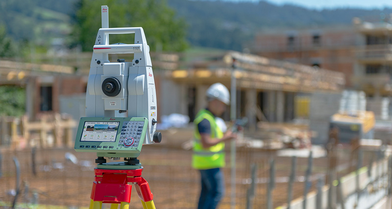

---
# Jekyll 'Front Matter' goes here. Most are set by default, and should NOT be
# overwritten except in special circumstances. 
# You should set the date the article was last updated like this:
date: 2022-12-05 # YYYY-MM-DD
# This will be displayed at the bottom of the article
# You should set the article's title:
title: Robotic Total Station (Leica TS16)
# The 'title' is automatically displayed at the top of the page
# and used in other parts of the site.
---

## Introduction

This page will go into detail about to get started with the TS16 Total Station, manufactured by Leica Geosystems. This information is likely helpful for other robotic total station integration, but is has not been tested.

### How does it work?

Total stations have an extended heritage in civil engineering, where they have been used to precisely survey worksites since the 1970s. The total station sends beams of light directly to a glass reflective prism, and uses the time-of-flight properties of the beam to measure distances. The robotic total station tracks it's calibration orientaiton to high precision, such that the measured distance can be converted into a high-precision 3D position mesaurement. Total stations, depending on the prism type and other factors, can accurate track with in millimeter range at up to 3.5km [Leica-Geosystems](file:///home/john/Downloads/Leica_Viva_TS16_DS-2.pdf).

[Source](https://leica-geosystems.com/)

### Best Use Cases & Expected Quality

There are various companies that make robotic total stations including Leica and Trimble. While there is a wide variety of abilities between different models, there are certain key characteristics that matter when used as a real-time positioning system:

- Range (How far does this need to work at?)
- Angular tracking ability (Can the total station track objects moving closeby?)
- Frequency (How often does it provide measurements?)

Accuracy is the bottom line for robotic total stations. If the system is able to maintain line-of-sight with the total station, it is reasonable to expect <2cm accuracy in positioning, even over rather large distances (unknown exactly). This is especially valuable since it can provide an accurate positioning in XYZ, rather than just XY like many alternatives.

### Limitations

The key limitation of the total station is that it requires constant line-of-sight with the reflector prism it is tracking. Unlike other methods such as UltrawideBand or Ultrasonic positioing, recovery is not trivial.

While certain companies like Caterpillar have official partnerships with total station manufacturers to allow for seemless integration with their vehicles [source](https://www.constructionequipment.com/technology/construction-technology-software/news/10757055/caterpillar-and-trimble-announce-change-to-joint-venture-providing-greater-flexibility-and-customer-focus), this technology is not currently available in such a robust manner to all. For that reason, "hacking" a total station to provide real-time sensory information made result in a unknowable latency with difficult to characterize dropout at times. While this did not become a detriment while the author was working on it, it's important to note. 

Additionally, it's possible for the total station to lose it's track of the reflective prism, meaning that it ceases to provide valuable data. In a more robust system, there could be an automatic search process to return to a tracked state, but it is not explored in this wiki.

## Setup

In order to setup a total station tracking system, it's important to have all of the hardware:

### Hardware

This method has been tested on a TS16, but it would likely work on a TS15 or other Leica products. Most total stations use a [GEOCOM communication standard](https://www.naic.edu/~phil/hardware/theodolites/TPS1200_GeoCOM_Manual.pdf), which means that it's very likely that a similar serial interface could be adapted for most total station hardware. Leica hardware is particularly expensive, so a brand new total station with the best tracking specifications will run approximately [$30k](https://www.allenprecision.com/leica-viva-ts16p-series-robotic-packages).

The other side of the total station is the reflector, which is used to get the high precision ranging. This is an important piece of hardware, especially in this use case. Since the prism will be moving, having high quality glass will reduce the imperfections that could cause the reflected beam to be off-center, resulting in a higher likelihood of losing tracking of the prism. A high quality prism from Leica will cost more than [$1k](https://www.allenprecision.com/360-reflector).

[Source](https://leica-geosystems.com/)

In order to connect the total station to a compute platform, it's possble to use wired or wireless methods. This wiki only explores the usage of USB connections using Leica's custom (and [expensive](https://www.baselineequipment.com/leica-instrument-to-datacollector-laptop-usb-cable)) cable.

### Calibration

In order to calibrate the total station, there are various ways to do it, all outlined in [various videos online](https://www.youtube.com/watch?v=ozbow6OgUlQ).

The simplest way to calibrate the total station in a repeatable fashion is to use the "Orientate to Line" method. The context for the following instructions is to create fixed locations (fixtures) that allow a repeatably placed reflector location at both sites. By default, the line created by these reflectors would now become the X-axis of the local coordinate frame (which can be transformed into any other desired frame at a later point).

1. Prepare reflector
2. Attach reflector to fixture-1
2. Change the Target settings of total station to `REFLECTOR_TYPE` (Settings -> TS Instrument -> Measure & Target)
3. Go to Home -> Setup
4. Choose the “Orientate to Line” method
5. Measure two points that define an axis. 
6. Use default settings (no changes required)
7. The first measured point becomes (0,0)
8. The second line determines the vector of the axis
9. Derive setup height from “Manually enter”. Leave 0.0 as the value
10. Place the reflector in Location A (see Figure 1) via S-hook attachment
11. Ensure the reflector is being tracked via the top bar options (“Target tracking on”)
12. Press “Measure” to measure the first location
13. Move reflector to fixture-2
14. Press “Measure” to measure the second location
15. Press “set” to finish calibration

At this point, any measurement that comes out of the total station will be with respect to the two measured points, which can be repeated for consistent testing and application.

### Publicly Available ROS/ROS2 Nodes

In order to setup the TS16 node into a ROS/ROS2 environment, follow the instructions in the repositories below:

[ROS](https://github.com/arpit6232/Leica_Total_Station_ROS)

[ROS2](https://github.com/John-HarringtonNZ/ts16_ros2_node)
