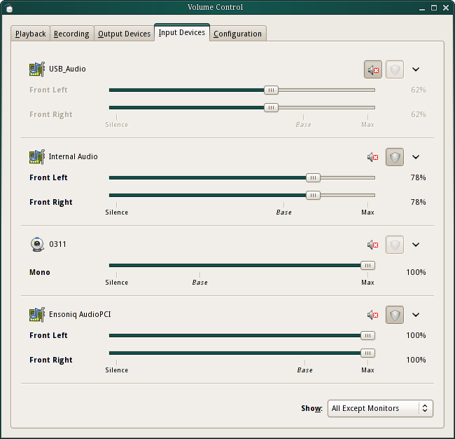

Speech Recognition can be a very efficient and powerful way to interface with a robot. It has its downsides since it requires a parser to do something intelligent and be intuitive to use. Also, it is not the most reliable mode of communication since it is plagued with background noise in a regular environment and is prone to false matches.

## Resources

Here are a few resources to implement speech recognition:
- Offline
  - Among the various options available online, CMU Sphinx is the most versatile and actively supported open source speech recognition system. It gives the user a low level access to the software. You can create custom dictionaries, train it with custom data set, get confidence scores and use C++, Java or Python for development. To get started you can go through the documentation provided here: http://cmusphinx.sourceforge.net/wiki/
  - Many acoustic and language models are available for download over [here](https://sourceforge.net/projects/cmusphinx/files/Acoustic%20and%20Language%20Models/)
  - Even though these might not perform great, they still provide a solid starting point. One can implement many filtration techniques to get the best output by utilizing confidence scores, setting custom dictionaries and sentence structures.
- Online
  - If internet connectivity and uploading data online is not an issue, Google's Speech API massively outperforms any offline system with the only downside being that there is no low level access so the only thing you can do is upload an audio file and get back a string of output.
  - You can make use of [Python's Speech Recognition Package](https://pypi.python.org/pypi/SpeechRecognition/), to use this API and many others. This package also supports CMUSphinx.

> Note: Google's Speech API requires a key which can be found in the source code of this package. You can bypass the use of this entire package if you don't wish to have this additional layer between Google's Speech API and your script.
The source code with examples can be found [here.](https://github.com/Uberi/speech_recognition)
The key can be found [here.](https://github.com/Uberi/speech_recognition/blob/master/speech_recognition/__init__.py#L613)

## Example
Here is a simple example of how to use the Speech Recognition package:
```python
import speech_recognition as sr

# obtain audio from the microphone
r = sr.Recognizer()

# Calibrate the microphone
with sr.Microphone() as source:
    print("Calibrating microphone...")
    r.adjust_for_ambient_noise(source, duration=5)
    print("Calibration complete!")

with sr.Microphone() as source:
    print("Say something!")
    audio = r.listen(source)

# recognize speech using Google Speech Recognition
try:
    print("Google Speech Recognition thinks you said " + r.recognize_google(audio))
except sr.UnknownValueError:
    print("Google Speech Recognition could not understand audio")
except sr.RequestError as e:
    print("Could not request results from Google Speech Recognition service; {0}".format(e))
```

## Hotword/Wakeword Detection

Hotword detection is a very useful feature to have in a robot. It allows the robot to be activated by a simple voice command. This can be used to wake up the robot from sleep mode or to activate a particular function. For example, you can use hotword detection to wake up the robot from sleep mode and then use speech recognition to give it a command.

### Snowboy

Snowboy is a hotword detection engine. It is available [here](https://github.com/seasalt-ai/snowboy). It is available for Python, C++ and Java.

### Porcupine

Porcupine is a hotword detection engine. It is available [here](https://picovoice.ai/platform/porcupine/). Note that this is a paid service with a high level of accuracy.

### Keyword Spotting

Few-shot Keyword Spotting in Any Language and Multilingual Spoken Word Corpus by Harvard University. Follow this [link](https://github.com/harvard-edge/multilingual_kws) to know more.

## Microphone Selection

Choosing the right microphone is crucial for good speech recognition. You would ideally want a microphone with a long pickup range and a high signal-to-noise ratio. You can use a USB microphone for this purpose. One such microphone is the Blue Yeti. It is a high quality USB microphone with a long pickup range and a high signal-to-noise ratio.

If you are looking for a sleek and light-weight design, you can consider using conference microphones such as the Anker PowerConf series. You can also consider Movo MC1000. Both of these require a USB connection and are plug-and-play.

## Noise suppression

Often times, your robot might be operating in a noisy environment. This can cause the speech recognition to fail. To overcome this, you can use a noise suppression algorithm.

### AI-based noise suppression

One such algorithm is the NoiseTorch algorithm. It is a simple noise suppression algorithm that uses PyTorch. It is available [here](https://github.com/noisetorch/NoiseTorch). NoiseTorch is very light weight and works on most modern CPU out-of-the-box with very less computational load.

If you have an NVIDIA GPU, you can try using NVIDIA RTX Voice. It is available [here](https://www.nvidia.com/en-us/geforce/guides/nvidia-rtx-voice-setup-guide/). It is a more advanced noise suppression algorithm that uses AI to remove noise. It is more computationally intensive and requires an NVIDIA GPU with RTX support.

### Hardware-based noise suppression

If you are using a Raspberry Pi, you can use the [ReSpeaker](https://wiki.seeedstudio.com/ReSpeaker_2_Mics_Pi_HAT/) microphone. It has a built-in noise suppression algorithm that works well in most environments.

### Adjusting the microphone sensitivity

The microphone sensitivity can be adjusted using the `pavucontrol` program. This is available on Ubuntu. You can install it using `sudo apt install pavucontrol`. Once installed, you can run it using `pavucontrol`. This will open a GUI. You can then adjust the microphone gain using the slider:



### Echo cancellation

If you are using a speaker and a microphone, you might face issues with echo. This can be solved by using a software echo cancellation algorithm. One such algorithm is the PulseAudio echo cancellation module. It is available [here](https://www.freedesktop.org/wiki/Software/PulseAudio/Documentation/User/Modules/#module-echo-cancel). It is available on Ubuntu and can be installed using `sudo apt install pulseaudio-equalizer`. Once installed, you can enable it using `pactl load-module module-echo-cancel aec_method=webrtc sourc_name=echocancel sink_name=echocancel1`.

You can also enable it permanently by adding the following lines to `/etc/pulse/default.pa`:

```
.ifexists module-echo-cancel.so
load-module module-echo-cancel aec_method=webrtc source_name=echocancel sink_name=echocancel1
set-default-source echocancel
set-default-sink echocancel1
.endif
```

## Speech synthesis

Speech synthesis is the process of generating speech from text. This can be used to make the robot speak. This can be used to give feedback to the user or to make the robot more interactive.

### Google Text-to-Speech

Google Text-to-Speech is a speech synthesis engine. It is available [here](https://cloud.google.com/text-to-speech). You can play around with the base model and choose the voice that you like. You may also consider using the WaveNet or Neural2 models for a more natural sounding voice. These models are bleeding-edge and are developed by DeepMind at Google. Try adjusting the pitch to give a more friendly feel to the robot.

### eSpeak

eSpeak is a speech synthesis engine. It is available [here](http://espeak.sourceforge.net/). It is a light-weight speech synthesis engine that can be used on low-end devices. It is available for Linux, Windows and Mac.

### Festival

Festival is a speech synthesis engine. It is available [here](http://www.cstr.ed.ac.uk/projects/festival/). It is a light-weight speech synthesis engine that can be used on low-end devices. It is available for Linux, Windows and Mac.

### MaryTTS

MaryTTS is a speech synthesis engine. It is available [here](http://mary.dfki.de/). It is written in Java and can be used on low-end devices. It is available for Linux, Windows and Mac.

## References

- [CMU Sphinx](http://cmusphinx.sourceforge.net/wiki/)
- [Python Speech Recognition](https://pypi.python.org/pypi/SpeechRecognition/)
- [Google Speech API](https://cloud.google.com/speech/)
- [NoiseTorch](https://github.com/noisetorch/NoiseTorch)
- [NVIDIA RTX Voice](https://www.nvidia.com/en-us/geforce/guides/nvidia-rtx-voice-setup-guide/)
- [ReSpeaker](https://wiki.seeedstudio.com/ReSpeaker_2_Mics_Pi_HAT/)
- [PulseAudio echo cancellation module](https://www.freedesktop.org/wiki/Software/PulseAudio/Documentation/User/Modules/#module-echo-cancel)
- [Google Text-to-Speech](https://cloud.google.com/text-to-speech)
- [eSpeak](http://espeak.sourceforge.net/)
- [Festival](http://www.cstr.ed.ac.uk/projects/festival/)
- [MaryTTS](http://mary.dfki.de/)
