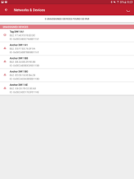
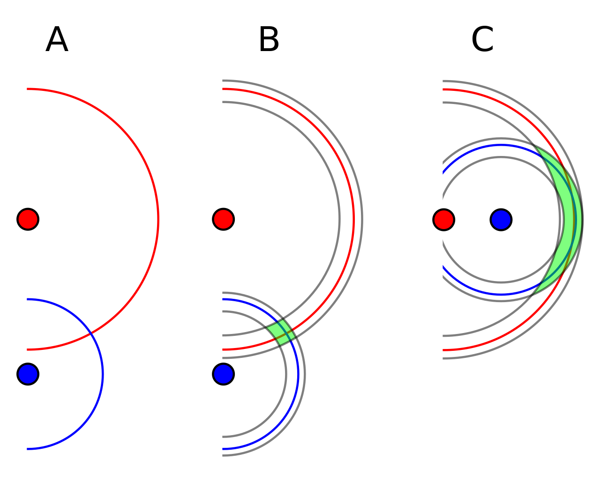

This page will go into detail about to get started with UltraWideband positioning, particuarly with the [DWM1001-Dev module](https://www.qorvo.com/products/p/DWM1001-DEV).

### How does it work?

UltraWideband is a short-range wireless communication protocol, allowing connected devices to communicate across short ranges, similar to bluetooth. Unlike blueooth, UltraWideband transmits over a wider frequency, allowing for a more precise and wider bandwith of communication, albeit over a shorter range. 

Ultrawideband positioning takes advantage of the communication pulses to sense distances between transmitters through a two-way ranging protocol described in detail [here](https://forum.qorvo.com/uploads/short-url/5yIaZ3A99NNf2uPHsUPjoBLr2Ua.pdf). As a simplification, it is able to measure the time period that messages take to transmit between devices, while accouting for potential clock and frequency shift between devices. 

By using multiple stationary devices, a single or multiple mobile beacons can be tracked by combining ranges through trilateration. 

[Source](https://www.researchgate.net/profile/Teijo-Lehtonen/publication/281346001/figure/fig4/AS:284460038803456@1444831966619/DecaWave-UWB-localization-system-SDK-5.png)

### Best Use Cases & Expected Quality

At the time of writing, one of the most common modules for UWB is the DWM1001. Information of how to get started with that can be seen [here](LINK TO WIKI PAGE ON DWM1001). Since these modules are mass manufactured, they can be purchased very inexpensively and should be considered one of the most affordable options for positioning systems.

### Limitations

UltraWideband positioning systems work best in wide open spaces, such as convention spaces or warehouses. Not only will direct line-of-sight interference causes issues for UWB systems, but also multi-pathing can cause [serious problems](https://ieeexplore.ieee.org/document/7790604).

Even in the best scenario, it should be expected that a UWB positioning system will be able to get an accuracy of approximately (15-20cm) accuracy in XY, and even worse in Z (explained more in the calibration section).

## Setup

In order to setup a DWM1001-Dev UltraWideband positioning system, it's important to have enough DWM1001-Dev modules (`beacons`) for your use case. Each one of the `beacons` can either be configured as a `tag`, `anchor`, or `gateway`. `tag`s represent mobile `beacons` that will be on your robot, `anchors` represent stationary anchors, and `gateways` are modules that sole job are to pipe information over serial to your compute stack. While there are multiple ways to get information from these devices, this guide will describes how to access it over a direct USB serial connection. 

Before any work can be done on the `beacons`, they must be flashed with the pre-built software provided by the manufacturer for this task. A detailed guide can be found [here](https://www.google.com/url?sa=t&rct=j&q=&esrc=s&source=web&cd=&ved=2ahUKEwjNrN-T8OP7AhWTFVkFHRNTCzcQFnoECBMQAQ&url=https%3A%2F%2Fwww.qorvo.com%2Fproducts%2Fd%2Fda007972&usg=AOvVaw2va8gKJNC_mfXq5EQZAO0S)

### Configuration & Calibration

Once the beacons have been flashed, they need to be configured and calibrated. This can be one most easily using their provided Android app, [Decawave DRTLS APK](https://apkcombo.com/decawave-drtls-manager-r1/com.decawave.argomanager/). There is also information found [here](https://www.google.com/url?sa=t&rct=j&q=&esrc=s&source=web&cd=&ved=2ahUKEwjNrN-T8OP7AhWTFVkFHRNTCzcQFnoECBMQAQ&url=https%3A%2F%2Fwww.qorvo.com%2Fproducts%2Fd%2Fda007972&usg=AOvVaw2va8gKJNC_mfXq5EQZAO0S) about performing this work directly through a command line, but it is less documented.

In order to use the app, follow the instructions linked [here](https://www.google.com/url?sa=t&rct=j&q=&esrc=s&source=web&cd=&ved=2ahUKEwi-id_G9-P7AhVIGVkFHVIPBZ0QFnoECA0QAQ&url=https%3A%2F%2Fwww.qorvo.com%2Fproducts%2Fd%2Fda007996&usg=AOvVaw09yRMbgwEx7hxTDpJP4G8D). 

#### Instructions Addendums

In the instructions, it shows how to either automatically calibrate the positions of the `anchors` as well as how to manually input their positions. For best results, manually measure the 3D positions of the `anchors` using a high-precision device, including either a MOCAP system, high-fidelity laser scanner (eg. FARO), or a total station. 

It is possible to change the update rate of all `beacons`. For most real time positioning, it is reccomended to maximize this at 10Hz.

During configuration, make note of the `beacon` IDS (eg. from `Tag DW11A1` the tag ID is `11A1`). This should be the ID used in the driver config to identify multiple tags independently.

At this point, the DRTLS app can be used directly to test the 3D positioning. Ensure all modules are powered, and if ther are, enter the "map" page of the app to view all of the `beacons` live, including the dynamic positioning of the `tag`.

#### Dilution of Precision

In most cases, the `anchors` are located around a room, such that they are relatively planar with respect to each other. For 2D localization, this is perfectly acceptable, but it becomes an issue when attempting 3D localization. This is due to the concept of *[dilution of precision](https://en.wikipedia.org/wiki/Dilution_of_precision_(navigation))*, which originated from GPS. For GPS, it means that as GPS satellites attempting to provide a location to a ground side receiver get relatively close to each other, the output precision of the ground side position estimation becomes poorer, as seen below:

For UWB, this means that if the `anchors` are all close to the same Z plane, their Z localization precision will suffer. Ideally, all anchors should be placed at widely different heights to improve this. However, the beacons need to also be placed away from corners (such as the intersection of the floor/ceiling to the wall), leading to a difficulty.

### Publicly Available ROS/ROS2 Nodes

Now with a functioning module setup, including calibration, it is possible to link this up with a robotic system. Below are links to two existing repositories to read serial data into a ROS/ROS2 ecosystem.

[ROS Node](https://github.com/TIERS/ros-dwm1001-uwb-localization)

[ROS2 Node](https://github.com/John-HarringtonNZ/dwm1001_dev_ros2)

If you are linking multiple UART devices to a single compute platform, it is likely that they will showup as different names by default depending on when they are plugged in, etc. To standardize this, you can assign a specific name based on the hardware ID to ensure consistent naming conventions. Follow [this](https://gist.github.com/edro15/1c6cd63894836ed982a7d88bef26e4af) guide for details.
