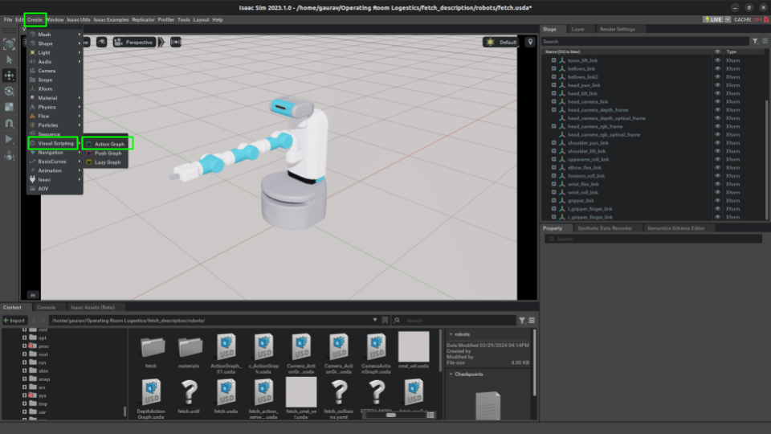
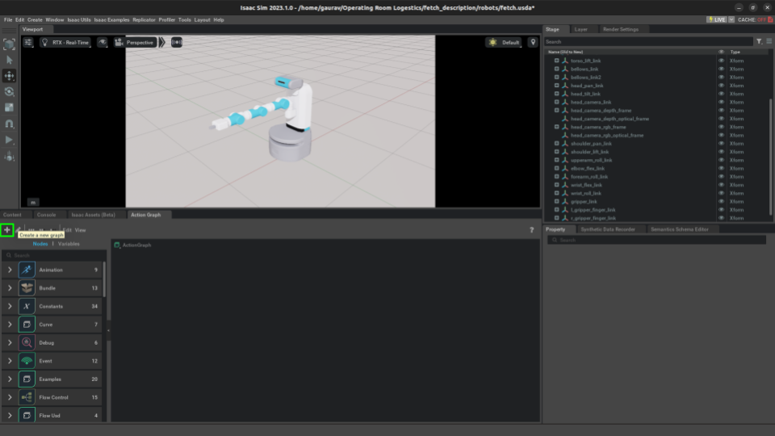

Nvidia's Isaac Sim is quickly becoming a must-know in the world of robotics training through simulation, leveraging powerful GPUs to train numerous agents simultaneously. While our project didn't involve reinforcement learning or parallel simulations, diving into Isaac Sim proved a rewarding detour.

Navigating the complexities of new software can be daunting, and while Nvidia's official documentation provides a solid foundation, it can feel insufficient for beginners. This realization struck me particularly hard as I embarked on my project—there seemed to be a surprising lack of tutorials or comprehensive guides considering Isaac Sim's burgeoning popularity.

Therefore, our took it upon ourself to shed some light on this innovative tool. This blog post aims to simplify your journey with Isaac Sim, providing insights and step-by-step guidance to make your experience as enriching as mine was. So, let’s dive into the world of advanced simulation with Isaac Sim and explore its vast potentials together!

"NVIDIA Isaac Sim is an extensible robotics simulation platform that gives you a faster, better way to design, test, and train AI-based robots. It’s powered by Omniverse to deliver scalable, photorealistic, and physically accurate virtual environments for building high-fidelity simulations".  

## The 1st look
NVIDIA's Isaac Sim is a cutting-edge robotics simulation platform designed to streamline the design, testing, and training of AI-based robots. Harnessing the power of NVIDIA's Omniverse, it offers scalable, photorealistic, and physically accurate virtual environments. This allows for the creation of high-fidelity simulations, significantly enhancing the development process of robotic systems.

But what exactly is NVIDIA Omniverse? It's a comprehensive platform comprising APIs, SDKs, and services that facilitate the integration of Universal Scene Description (OpenUSD) and RTX rendering technologies. This integration is crucial for developers looking to incorporate advanced photorealistic rendering capabilities and GPU-accelerated performance into their existing software tools and simulation workflows, particularly in AI system development.

With a better understanding of the foundational technologies behind Isaac Sim, we can now delve into the practical application of this platform. This involves utilizing Isaac Sim to simulate robotic operations, which I will guide you through step-by-step, ensuring you can leverage this powerful tool to its fullest potential. Let's explore how to effectively simulate robots using NVIDIA Isaac Sim.

## The 1st Delima
As a seasoned roboticist familiar with ROS and Gazebo, I've grown accustomed to working with URDFs (Unified Robot Description Format) when discussing simulation. However, NVIDIA's Isaac Sim introduces a shift by utilizing the USD (Universal Scene Description) format to define robot properties. While this transition might initially raise eyebrows among traditional roboticists, the USD format synergizes with the Omniverse platform to deliver exceptionally photorealistic simulations, a crucial aspect for achieving zero-shot sim-to-real transfer.

NVIDIA supports the process of importing URDF files into Isaac Sim with an [open-sourced extension](https://github.com/NVIDIA-Omniverse/urdf-importer-extension) designed specifically for this purpose. Here’s how you can integrate your existing URDF models into Isaac Sim.

#### Steps to Import URDF 

1. To access this Extension, go to the top menu bar and click Isaac Utils > Workflows > URDF Importer. 

2. Adjust the import settings to suit your robot's specifications:
	- **Fix base link:** Deselect for mobile robots; select for manipulators.
	- **Stage Units per meter:** Setting this to 1 equates one unit in Isaac Sim to 1 meter.
	- **Joint Drive Type:** Choose between position or velocity, depending on project needs.
	- **Joint Drive Strength and Joint Position Drive Damping:** Recommended values are **10000000.0** and **100000.0** respectively to ensure accurate joint movement. These values are in Isaac units, and emperically we found that, the robot joint doesn't move as they should, if the values are not specified. 
	- **Self-Collision:** Typically left unselected as the importer manages collision properties adequately, though enabling it does not impede the process.

 

3. Click the **Import** button to add your robot to the stage, visualizing it within the simulation.

4. Since Isaac Sim does not automatically create a ground plane, thus we need to create a ground plane.

5. Confirm that the collision properties of your imported robot function correctly.

6. Voila, we have successfully imported our URDF to Isaac Sim! Though, the import plugin saves the USD file (check Output Directory option while importing), but that is in **.usd** format which is a file binary format, which obiously can't be read by humans. Thus we will go ahead and save it in **.usda** format. USDA is essentially an ASCII format of USD file that is encoded as UTF-8. 

## Let's Integrate with ROS

After successfully importing the URDF into Isaac Sim and saving the USD file, the next step is to ensure that all expected ROS topics are being published as anticipated. When I opened a terminal, entered the `ros2 topic list` command, and pressed enter, surprisingly, no topics appeared. I was confident that all necessary plugins were defined in the URDF. However, it became clear that the URDF importer does not handle these plugins, and Isaac Sim does not natively support ROS or ROS 2. This means that each component requiring topic publication must have a dedicated workflow defined.

These workflows are defined as Action Graphs which are a part of OmniGraph. Omnigraph is Omniverse’s visual programming framework that seamlessly integrates various systems within Omniverse, enabling the creation of customized nodes and efficient computation for applications like Replicators, ROS bridges, and sensor management in Isaac Sim. Read [this](https://docs.omniverse.nvidia.com/isaacsim/latest/gui_tutorials/tutorial_gui_omnigraph.html#isaac-sim-app-tutorial-gui-omnigraph) article from Nvidia for more details.

The steps to create an Omnigraph node that connects our simulation environment to ROS or ROS 2 can be approached in several ways: entirely through a GUI, scripting within the extension workflow, through standalone Python code, or a mix of both GUI and Python. For this tutorial, we will use GUI to make an action graph and in another article learn about writing an Action Graph in Python. While the documentation provides numerous examples for standard sensors and actuaries, I'll briefly discuss them here, directing you to the documentation for more detailed information.

We will explore the workflow for publishing Transforms (TFs), essential for any robotic application, particularly where our project faced significant challenges. Our focus was on establishing a simulation environment for a mobile manipulator, integrating closely linked TFs and Odometry. The ROS 2 extension provides a script node for publishing TFs, requiring specific configurations that we will set up through the GUI.

### Steps to Create Action Graph

1. Go to top menu bar and click Window -> Visual Scripting -> Action Graph

2. Click **New Action Graph** to open an empty graph

3. To start building our action graph, we start adding nodes. The first node we need to add is **'On Playback Tick'**. The On Play Tick node acts as a trigger that executes at every simulation tick, which is a single update cycle of the simulation. 

4. The next node is **'ROS 2 Context'**. This node acts as a bridge between Isaac Sim and ROS 2, enabling the simulation to communicate and interact with ROS 2-based systems. It sets up the necessary configurations to ensure that the simulation can send and receive messages, services, and actions to and from ROS 2.

5. One of the most important node we add is **'Isaac Read Simulation Time'** that is designed to capture and provide access to the current simulation time within the simulation environment. This node is crucial for operations and tasks that depend on the simulation's temporal state. 

6. Now that all the house-keeping node are added, lets add node to which compute the odometry. Isaac Sim does include a computational node to calculate odometry named **'Isaac Compute Odometry Node'**. We also need to defining an articulation root, that is essential for setting up the primary node or root component of an articulated system, which allows for the management and simulation of complex joint hierarchies and movements within the robot's structure. This setup is crucial for enabling realistic physical behaviors and interactions in the simulation environment. 

7. Once we have the node computing odometry, we now will publish the odometry data. The ROS2 plugin has node for publishing the odometry data called the **'ROS2 Publish Odometry Node'**. 

8. Similar to node which publishes odometry, the ROS2 plugin has nodes for publishing Transforms called the **'ROS2 Publish Transform Tree'**. Note that, this node will only publish transforms which are dynamics, essentially any prim which is not static. We also need to define all the child links for which we need to publish the transforms for. To publish transforms for the static node, we will additonally add **'ROS2 Publish Raw Transform Tree'** node, which, as the name suggest, publishes transform of static prim. 

9. Awesome, now that we have our entire action graph, lets save it (in .usda format). 

With this, we've successfully established a workflow to integrate ROS 2 with Isaac Sim. Go ahead and hit the play button—listen to your GPU fans spring to life! In a future article, we'll explore how to create a launch file to automate the startup process and delve into defining an action graph programmatically.

## Summary
In this article, we explored how to import a standard URDF file into Isaac Sim and establish a connection to ROS. This guide reflects key insights gained through firsthand experiences, highlighting the challenges we faced. For a more comprehensive understanding, we strongly recommend consulting the official documentation to further expand your knowledge. 

## Reference
- [https://docs.omniverse.nvidia.com/isaacsim/latest/index.html](https://docs.omniverse.nvidia.com/isaacsim/latest/index.html)

