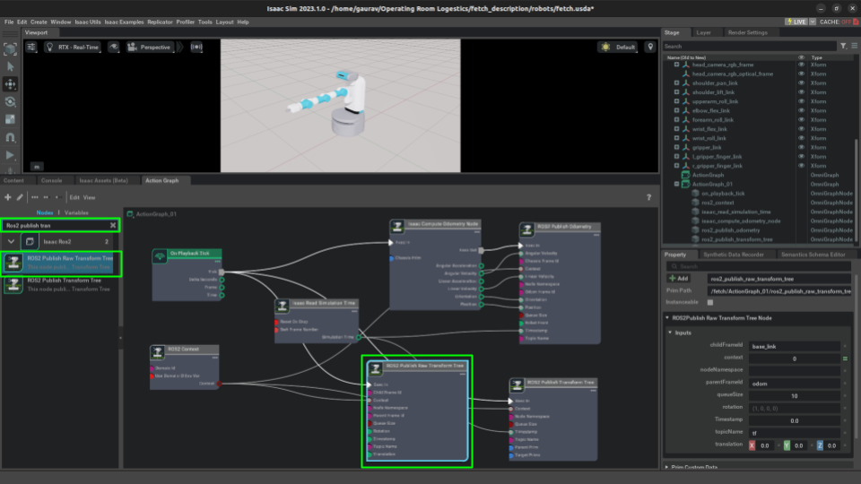

Nvidia's Isaac Sim is quickly becoming a must-know in the world of robotics training through simulation, leveraging powerful GPUs to train numerous agents simultaneously. While our project didn't involve reinforcement learning or parallel simulations, diving into Isaac Sim proved a rewarding detour.

Navigating the complexities of new software can be daunting, and while Nvidia's official documentation provides a solid foundation, it can feel insufficient for beginners. This realization struck me particularly hard as I embarked on my project—there seemed to be a surprising lack of tutorials or comprehensive guides considering Isaac Sim's burgeoning popularity.

Therefore, our took it upon ourself to shed some light on this innovative tool. This blog post aims to simplify your journey with Isaac Sim, providing insights and step-by-step guidance to make your experience as enriching as mine was. So, let’s dive into the world of advanced simulation with Isaac Sim and explore its vast potentials together!

"NVIDIA Isaac Sim is an extensible robotics simulation platform that gives you a faster, better way to design, test, and train AI-based robots. It’s powered by Omniverse to deliver scalable, photorealistic, and physically accurate virtual environments for building high-fidelity simulations".  

## The 1st look
NVIDIA's Isaac Sim is a cutting-edge robotics simulation platform designed to streamline the design, testing, and training of AI-based robots. Harnessing the power of NVIDIA's Omniverse, it offers scalable, photorealistic, and physically accurate virtual environments. This allows for the creation of high-fidelity simulations, significantly enhancing the development process of robotic systems.

But what exactly is NVIDIA Omniverse? It's a comprehensive platform comprising APIs, SDKs, and services that facilitate the integration of Universal Scene Description (OpenUSD) and RTX rendering technologies. This integration is crucial for developers looking to incorporate advanced photorealistic rendering capabilities and GPU-accelerated performance into their existing software tools and simulation workflows, particularly in AI system development.

With a better understanding of the foundational technologies behind Isaac Sim, we can now delve into the practical application of this platform. This involves utilizing Isaac Sim to simulate robotic operations, which I will guide you through step-by-step, ensuring you can leverage this powerful tool to its fullest potential. Let's explore how to effectively simulate robots using NVIDIA Isaac Sim.

## The 1st Delima
As a seasoned roboticist familiar with ROS and Gazebo, I've grown accustomed to working with URDFs (Unified Robot Description Format) when discussing simulation. However, NVIDIA's Isaac Sim introduces a shift by utilizing the USD (Universal Scene Description) format to define robot properties. While this transition might initially raise eyebrows among traditional roboticists, the USD format synergizes with the Omniverse platform to deliver exceptionally photorealistic simulations, a crucial aspect for achieving zero-shot sim-to-real transfer.

NVIDIA supports the process of importing URDF files into Isaac Sim with an [open-sourced extension](https://github.com/NVIDIA-Omniverse/urdf-importer-extension) designed specifically for this purpose. Here’s how you can integrate your existing URDF models into Isaac Sim.

#### Steps to Import URDF 

1. To access this Extension, go to the top menu bar and click Isaac Utils > Workflows > URDF Importer. 


2. Adjust the import settings to suit your robot's specifications:
- **Fix base link:** Deselect for mobile robots; select for manipulators.
- **Stage Units per meter:** Setting this to 1 equates one unit in Isaac Sim to 1 meter.
- **Joint Drive Type:** Choose between position or velocity, depending on project needs.
- **Joint Drive Strength and Joint Position Drive Damping:** Recommended values are **10000000.0** and **100000.0** respectively to ensure accurate joint movement. These values are in Isaac units, and emperically we found that, the robot joint doesn't move as they should, if the values are not specified. 
- **Self-Collision:** Typically left unselected as the importer manages collision properties adequately, though enabling it does not impede the process.

 

3. Click the **Import** button to add your robot to the stage, visualizing it within the simulation.


4. Since Isaac Sim does not automatically create a ground plane, thus we need to create a ground plane.


5. Confirm that the collision properties of your imported robot function correctly.


6. Voila, we have successfully imported our URDF to Isaac Sim! Though, the import plugin saves the USD file (check Output Directory option while importing), but that is in **.usd** format which is a file binary format, which obiously can't be read by humans. Thus we will go ahead and save it in **.usda** format. USDA is essentially an ASCII format of USD file that is encoded as UTF-8. 


## Let's Integrate with ROS

After successfully importing the URDF into Isaac Sim and saving the USD file, the next step is to ensure that all expected ROS topics are being published as anticipated. When I opened a terminal, entered the `ros2 topic list` command, and pressed enter, surprisingly, no topics appeared. I was confident that all necessary plugins were defined in the URDF. However, it became clear that the URDF importer does not handle these plugins, and Isaac Sim does not natively support ROS or ROS 2. This means that each component requiring topic publication must have a dedicated workflow defined.

These workflows are defined as Action Graphs which are a part of OmniGraph. Omnigraph is Omniverse’s visual programming framework that seamlessly integrates various systems within Omniverse, enabling the creation of customized nodes and efficient computation for applications like Replicators, ROS bridges, and sensor management in Isaac Sim. Read [this](https://docs.omniverse.nvidia.com/isaacsim/latest/gui_tutorials/tutorial_gui_omnigraph.html#isaac-sim-app-tutorial-gui-omnigraph) article from Nvidia for more details.

The steps to create an Omnigraph node that connects our simulation environment to ROS or ROS 2 can be approached in several ways: entirely through a GUI, scripting within the extension workflow, through standalone Python code, or a mix of both GUI and Python. For this tutorial, we will use GUI to make an action graph and write a script to launch the simulation. While the documentation provides numerous examples for standard sensors and actuaries, I'll briefly discuss them here, directing you to the documentation for more detailed information.

We will explore the workflow for publishing Transforms (TFs), essential for any robotic application, particularly where our project faced significant challenges. Our focus was on establishing a simulation environment for a mobile manipulator, integrating closely linked TFs and Odometry. The ROS 2 extension provides a script node for publishing TFs, requiring specific configurations that we will set up through the GUI.

### Steps to Create Action Graph

- Go to top menu bar and click Window -> Visual Scripting -> Action Graph
- Click **New Action Graph** to open an empty graph
- To start building our action graph, we start adding nodes. The first node we need to add is **'On Playback Tick'**. The On Play Tick node acts as a trigger that executes at every simulation tick, which is a single update cycle of the simulation. 


- The next node is **'ROS 2 Context'**. This node acts as a bridge between Isaac Sim and ROS 2, enabling the simulation to communicate and interact with ROS 2-based systems. It sets up the necessary configurations to ensure that the simulation can send and receive messages, services, and actions to and from ROS 2.


- One of the most important node we add is **'Isaac Read Simulation Time'** that is designed to capture and provide access to the current simulation time within the simulation environment. This node is crucial for operations and tasks that depend on the simulation's temporal state. 


- Now that all the house-keeping node are added, lets add node to which compute the odometry. Isaac Sim does include a computational node to calculate odometry named **'Isaac Compute Odometry Node'**


- Once we have the node computing odometry, we now will publish the odometry data. The ROS2 plugin has node for publishing the odometry data called the **'ROS2 Publish Odometry Node'**. 


- Similar to node which publishes odometry, the ROS2 plugin has nodes for publishing Transforms called the **'ROS2 Publish Transform Tree'**. Note that, this node will only publish transforms which are dynamics, essentially any prim which is not static. To publish transforms for the static node, we will additonally add **'ROS2 Publish Raw Transform Tree'** node, which, as the name suggest, publishes transform of static prim. Note that, if youp write a python script to load the simulation and action graph, make sure to define the path of action graph publishing the TF under the robot prim path, otherwise you would need to redefine the values which destorys the whole purpose of writing a script. (All this may not make sense, but as we read further about writing a script to launch the simulation, it will)




Awesome, now that we have our entire action graph, lets save it (in .usda format). 


## Lets Write a Launch File

Well, launch file here means slightly different from what a ros launch file is, but it does a similar action, load and run everything we need that is needed to run the entire simulation.


Unlike the differential drive plugin in Gazebo, Isaac Sim's differential drive controller doesn't automatically publish odometry data. Therefore, we need to develop an additional action graph to handle this. Isaac Sim does include a computational node to calculate odometry (Isaac Compute Odometry Node), so our action graph will take data from this node and publish it to the `/odom` topic using the ROS2 Publish Odometry Node. For the transformation tree, Isaac computes it in the background, and an action graph can simply call the ROS2 Publish Transform Tree, which takes the TF Tree, wraps it in a message format, and publishes it to the `/tf` topic. 

#### Let it be

Finally, we got URDF imported in Isaac Sim and we have saved the USD file as well. The next thing that strikes my mind is to make sure I am getting all the topics published as I would expect them to be. Opens a terminal, enters the command, ros2 topic list, pressed enter… What, why is there no topic? I am sure I had all the plugins defined in the URDF. Turns out, URDF importer doesn’t account for those plugins, and additionally, Isaac Sim doesn’t natively supports ROS or ROS 2. We need to define a workflow for each individual component which we need to be published as a topic. We can define 1 workflow which takes of everything, but that would be like asking why do we need functions in a code when we can write everything in a continuous flow. 

The steps to define an omnigraph node that connects our simulation environment to ROS or ROS 2 can be done in various ways. Entirely through GUI, scripting inside the extension workflow, through a standalone Python code, or a combination of both GUI and Python code. For obvious reasons, we will cover a combination where we can add the connections using GUI and Python together. While the documentation gives a lot of examples of standard sensors and actuators, I discuss them briefly, leaving the finer details to refer to from the documentation. 

We will first talk about TFs, essential for any robot, and the one where I faced the most bugs. Since I was establishing the simulation environment for a mobile manipulator, TFs and Odometery go hand in hand and thus the example will cover both. The ROS 2 extension already has a script node to publish TF, but it needs several inputs which we need to provide. We will use the GUI approach for configuring the TF and Odometry. 

Unlike the differential drive gazebo plugin, Isaac’s differential drive controller does not publish the odometry data by itself thus we need to develop an additional action graph to publish the odometry data. Isaac does provide a computational node to compute the odometry (Isaac Compute Odometry Node), thus action graph takes the data from compute odometry node and publishes it to /odom topic using ROS2 Publish Odometry Node. Unlike odometry, Isaac computes the transformation tree in the backend thus an action graph can simply call ROS2 Publish Transform Tree which takes the TF Tree, wraps it in message type, and publishes it to the /tf topic.


A line in between create a separate paragraph. *This is italicized.* **This is bold.** Here is [a link](/). If you want to display the URL, you can do it like this <http://ri.cmu.edu/>.

> This is a note. Use it to reinforce important points, especially potential show stoppers for your readers. It is also appropriate to use for long quotes from other texts.


#### Bullet points and numbered lists
Here are some hints on writing (in no particular order):
- Focus on application knowledge.
  - Write tutorials to achieve a specific outcome.
  - Relay theory in an intuitive way (especially if you initially struggled).
    - It is likely that others are confused in the same way you were. They will benefit from your perspective.
  - You do not need to be an expert to produce useful content.
  - Document procedures as you learn them. You or others may refine them later.
- Use a professional tone.
  - Be non-partisan.
    - Characterize technology and practices in a way that assists the reader to make intelligent decisions.
    - When in doubt, use the SVOR (Strengths, Vulnerabilities, Opportunities, and Risks) framework.
  - Personal opinions have no place in the Wiki. Do not use "I." Only use "we" when referring to the contributors and editors of the Robotics Knowledgebase. You may "you" when giving instructions in tutorials.
- Use American English (for now).
  - We made add support for other languages in the future.
- The Robotics Knowledgebase is still evolving. We are using Jekyll and GitHub Pages in and a novel way and are always looking for contributors' input.

Entries in the Wiki should follow this format:
1. Excerpt introducing the entry's contents.
  - Be sure to specify if it is a tutorial or an article.
  - Remember that the first 100 words get used else where. A well written excerpt ensures that your entry gets read.
2. The content of your entry.
3. Summary.
4. See Also Links (relevant articles in the Wiki).
5. Further Reading (relevant articles on other sites).
6. References.

#### Code snippets
There's also a lot of support for displaying code. You can do it inline like `this`. You should also use the inline code syntax for `filenames` and `ROS_node_names`.

Larger chunks of code should use this format:
```
def recover_msg(msg):

        // Good coders comment their code for others.

        pw = ProtocolWrapper()

        // Explanation.

        if rec_crc != calc_crc:
            return None
```
This would be a good spot further explain you code snippet. Break it down for the user so they understand what is going on.

#### LaTex Math Support
Here is an example MathJax inline rendering $ \phi(x\|y) $ (note the additional escape for using \|), and here is a block rendering:
$$ \frac{1}{n^{2}} $$

#### Images and Video
Images and embedded video are supported.






The video id can be found at the end of the URL. In this case, the URLs were
`https://www.youtube.com/watch?v=8P9geWwi9e0`
& `https://vimeo.com/148982525`.

## Summary
Use this space to reinforce key points and to suggest next steps for your readers.

## See Also:
- Links to relevant material within the Robotics Knowledgebase go here.

## Further Reading
- Links to articles of interest outside the Wiki (that are not references) go here.

## References
- Links to References go here.
- References should be in alphabetical order.
- References should follow IEEE format.
- If you are referencing experimental results, include it in your published report and link to it here.
