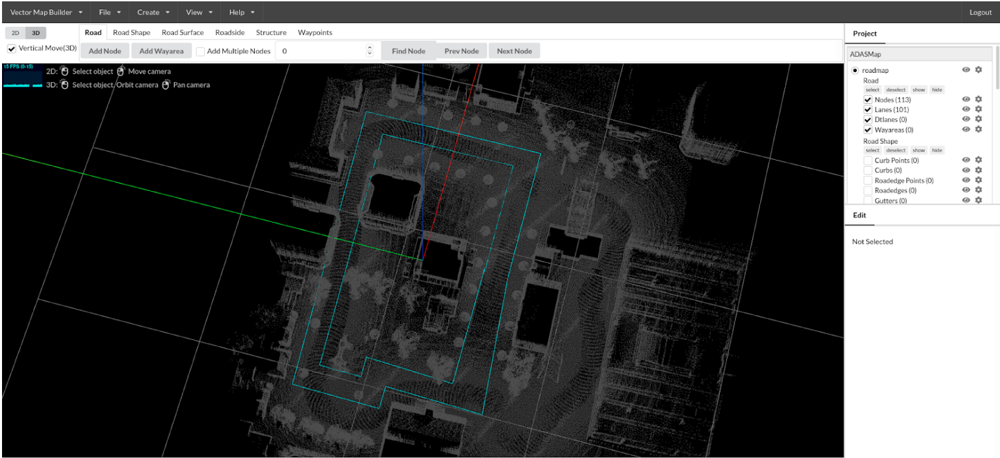
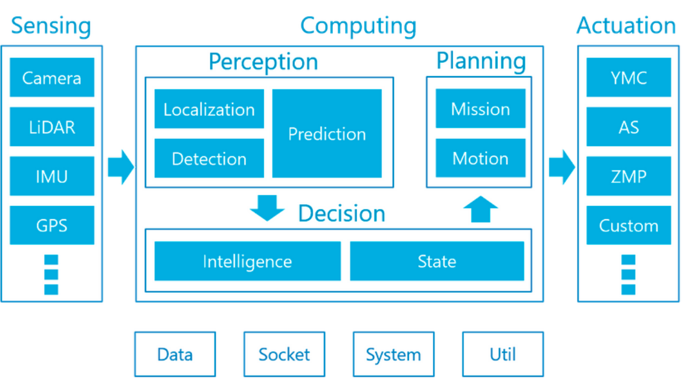
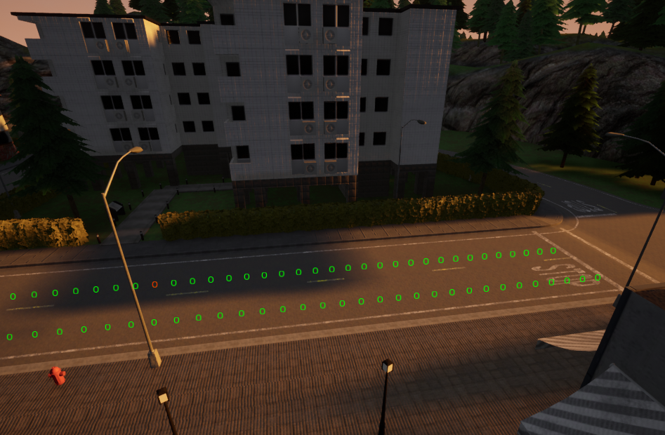

/wiki/simulation/Building-a-Light-Weight-Custom-Simulator/
---
date: 2020-05-11
title: Building a Light Weight Custom Simulator
published: true
---

# Overview

Out project makes extensive usage of simulators to test our reinforcement learning algorithm. Due to the fact that different simulators possess different functionalities and characteristics, we decided to use different simulators at different stages of the project.

# Background

While a high-fidelity simulator is always desirable for testing a robotics system from a technical perspective, but having the development process to block the testing of other modules is usually unwanted from a project management perspective. Additionally, it is better to test the system with minimal external noises at the early stage of a project. As a result, the presence of a light-weight low fidelity simulator is usually helpful to a project to allow for rapid prototyings.

# Design Considerations

As specified earlier, the design of this light-weight simulator holds a completely different philosophy from final stage testing simulators like CARLA.
1. Minimal external noises (e.g. Perception Inaccuracy, Controller Error, etc.)
2. Highly customizable (Easy to change: Vehicle Model, Environment, Agent Behavior, etc.)
3. Minimal development effort
4. Simple and reliable architecture

# Minimal External Noises

During project executions, software code base usually cannot deliver desired robustness at the beginning of the project, but it is still essential to test the best case performances of those algorithms. Therefore, as an early-stage testing tool, the light-weight simulator must minimize any noises present in the simulation.

# Highly Customizable

System design is usually not finalized at project early stages, as such many components of the system may change. Thus, the light-weight simulator must be able easily modifiable according to the design changes.

# Minimal Development Effort

Since this simulator is meant to test early stage implementation, its development should not be blocking any other tasks by taking longer than the other systems to be implemented. As a result, this simulator should only be implemented with the required functionalities with no additional workload.

# Simple and Reliable Architecture

The purpose of this simulator is to test other algorithms, and thus it should not take longer to debug than the system to be tested. Most of the time, simpler code structures are more reliable than complex ones, and especially multi-processing structures are the hardest to debug.


/wiki/simulation/Design-considerations-for-ROS-architectures/
---
date: 2020-05-11
title: Design considerations for ROS Architectures
---
# Overview
Over the past few months we have dicussed various ROS architectures, changed it at least two times in a major way and have come to appreciate the importance of designing a good architecture. We have also realized there are several important factors which need to be considered before finalizing a particular architecture. In this post we will detail the design decisions we had to make in the context of our project.

## Background of our application: Use Case of ROS in Driving simulator
To give a brief background of the project we are working on, we are learning specific driving behaviors in simulation. We have several nodes performing various tasks. The nodes are:
- **State extraction node**:  Receives the updated trajectories, updates the simulated state, and for each time step, publishes the required information about the state
- **RL agent node**: Based on the extracted state, the RL agent publishes high level decisions (go straight, turn, merge, stop). 
- **Path planning node:** Based on the current location and high level decisions from CARLA, the path planner node publishes the updated trajectory 

All of this runs in a loop for the simulation to continuously render and reset.


# Design Considerations
Some of the important considerations before designing your ROS architecture are: 
- What is the message drop out tolerance for our system?
- What is the overall latency our system can have?
- Do we need an synchronous form of communication or asynchronous form of communication?
- Which nodes need to necessarily be separated?

### Message Drop Out Tolerance

ROS is a far from ideal system. Although it uses the TCP (Transmission Control Protocol), due to various reasons (e.g. the nodes being too computationally intensive, delays, buffer overflows etc) there is an expected message drop out. This results in some of the messages not being received by the subscriber nodes. Although there is no quantifiable way to estimate how much drop out can occur, it is important to think about this for some critical nodes in your system. A couple of ways to address this issues is: 
- try a bigger queue size
- try implementing smarter logic in your nodes to check for drop outs and handle them properly

### Latency
Depending on your system, latency can cause many issues, ranging from annoying (simulation slowdown) to failures while interacting with dynamic objects in the real world. Some of the reasons for latency can be:
- Large messages
- Nodes running on different systems and communicating over LAN/WLAN
- TCP handshake delays

Some of the ways to address the problems are:

- Large messages naturally take more time to transmit and receive. A lot of delay can be removed by making your messages concise and ensuring only those nodes which need it, subscribe to them.
- Try as not to use WLAN connections for ROS communication, as usually it has the highest latency. Always prefer wired LAN over wireless LAN, and nothing is better than running the nodes on a same system for reducing latency in communication.
- Also weigh the delay of running heavy processes on a weak computer vs delay of communication while running these processes on different systems. This requires analysis of the trade off.
- Another useful trick is to switch on TCP_NODELAY transport hint for your publishers. This reduces latency of publishing.

### Synchronous vs Asynchronous Communication
ROS offers both, a synchronous mode of communication using **services** and, an asynchronous mode of communication with the **publisher/subscriber** system. It is very important to choose the correct communication in your system needs to be synchronous and which does not. Making this decision will save a lot of design effort in the future when you are implementing the logic of these nodes.

Asynchronous communication is more practical and useful in real-time systems. Synchronous communication is useful if you want to enforce a step-by-step execution of some protocol in your system. 

### Separation of tasks
In general, separation of code into modular components is recommended for clarity and the cleanliness of our development process. This rule of thumb is not the best idea when applied to ROS nodes. If nodes, which can be merged are split, for the sake of keeping code modular and clean, we simultaneously pay a price in communication delays. It is better to merge the nodes and keep them modular by maintaining classes and importing them into one node. Separate the tasks only if you feel those tasks can be performed faster and concurrently if it was given another core of the CPU.


/wiki/simulation/NDT-Matching-with-Autoware/
---
date: 2020-05-11
title: NDT Matching with Autoware
published: true
---
## Normal Distribution Transform (NDT)

3D maps enable self driving cars to localize themselves in the environment. To localize using a map and Lidar data one needs to find a way to associate the point cloud from the sensor with the point cloud from the map. This is also known as scan matching in robotics. One of the common ways to do this is Iterative Closest Point, it uses 6 degrees of freedom to find the closest point to the geometric entity from a given 3D point cloud. There exist a lot of geometric variants of ICP such as point-to-plane etc. One of the downfalls of ICP is that it needs a good approximation and a good starting point as it works on non-linear optimization and has tendencies to get stuck in local minima. In real world scenarios our points will probably be a little off from the map. Measurement errors will cause points to be slightly mis-aligned, plus the world might change a little between when we record the map and when we make our new scan.
NDT matching provides a solution for these minor errors. Instead of trying to match points from our current scan to point on the map, we try to match points from our current scan to a grid of probability functions created from the map.


Following are the two tasks performed

1. NDT mapping (Map generation) -  Transform the LiDAR point cloud into a piecewise continuous and differentiable probability density (NDT). The probability density contains a set of the normal distributions where each point in point cloud is assigned to a voxel. A voxel is a 3D lattice cube to which points are assigned depending upon their coordinate value. The Point cloud is divided into k ND voxels clouds and are combined together , and also the voxel grid filter is used to decrease the computation cost and to reduce the noise from the 3D map

2. NDT matching (Localization) - A search problem where we have to find a transform that maximizes NDT sum to match the different point clouds, a variety of minimization functions can be used for this. Newton nonlinear optimizer is used to find the best 6-DOF pose.

## Hardware Requirements
Velodyne VLP-16 and Computer running Autoware, some mobile platform with transforms known

## Software
First, setup the Velodyne sensor(s) appropriately. If you are using multiple sensors, you will need to publish their relative transforms by using tf_static_publisher after obtaining these TFs using Autoware. [see this blog post1](https://wowelec.wordpress.com/2019/06/18/setting-up-and-calibrating-multiple-lidar-sensors/). In case you just have one LIDAR, connect it to your laptop via wired Ethernet, and power it using a 8-20V DC power input (battery pack works), a VLP-16 consumes about 8W.
Then you need to set up your laptop with a static IP configuration, meaning that the wired connection should be on the 192.168.1.* subnet, and your LIDAR default IP address will be 192.168.1.201. You can reconfigure this if you are using multiple LIDARs, as described in the above blog post.
You need to initialize the LIDAR in the ROS framework by using the following ROS command (VLP-16), make sure you have the ros_velodyne_driver package installed for this to work successfully.
```
roslaunch velodyne_pointcloud VLP16_points.launch
```
You can check that the above node is publishing by doing a “rostopic echo” for the /velodyne_points topic.
Troubleshooting if it isn’t working - check the IP address, see if the Ethernet is configured correctly on your laptop, see if you are able to ping the sensor (ping 192.168.1.201 or the IP address that you have set), see if it is powered on and spinning (hold your hand on top of the sensor and you should feel the motor spinning).
Once the Velodyne LIDAR is publishing data, you can go ahead with the ROSbag collection as described below. If you want to incorporate additional sensor information like the IMU or GPS, just install the relevant ROS drivers for the sensors and ensure that they publish data onto the standard /imu_raw or /nmea (incomplete topic name) topics as required by Autoware.
Launch Autoware using the runtime_manager as follows:
```
source autoware/install/setup.bash
roslaunch runtime_manager runtime_manager.launch
```
You need to create a ROSBag of the space that you would like to map, so click on the ROSbag button on the bottom right of the main Autoware Runtime Manager console. Choose the topics that are relevant for your mapping (like /velodyne_points, /imu_raw, /nmea, etc.) and then start recording while moving the vehicle/robot very slowly through the space. If the space is really large (campus-sized or larger) then you might want to split the ROSbags to ensure that it does not fail to complete mapping at a later stage (large ROS messages cause ndt mapping to fail, and large ROSbags may be problematic to load/store/replay).
Once you have created the ROSbag, you can visualize the output of your “random walk” by replaying the ROSbag and opening Rviz to view the pointcloud that was generated at each position:
rosbag play the_rosbag_you_just_saved.bag
```
rosrun rviz rviz -f velodyne   # assuming you had a velodyne frame
```
Video reference for [rest of this post](https://www.youtube.com/watch?v=ss6Blrz23h8)
To start creating the map, launch the NDT Mapping node in Autoware by clicking on it in the Computing tab (also specify any additional sensors you used like GPS or IMU, and for the rest, default parameters are fine). Then run the ROSbag but remap your velodyne_points to /points_raw since that is what Autoware uses for the ndt_mapping node. So something like below:
```
rosbag play the_rosbag_you_just_saved.bag /velodyne_points:=/points_raw
```
Then you will see the mapping running really quickly in one terminal and the number of point-cloud poses being considered (there will be 10 every second because that is the frequency of rotation of the LIDAR). Once the full ROSbag has played, wait for all the poses to be fused into the map, because sometimes when the map is really large, the mapping might not have caught up with the ROSbag running. Additionally, when you have a very large map, use approximate_ndt_mapping instead, [refer to blog post 2 here](https://wowelec.wordpress.com/2019/06/16/running-autoware-based-mapping-in-the-cloud/).

Once you have finished creating the map, save it in your desired location with either a downsampling (to reduce the file size), or full/original quality output, by using the “app” tab in the NDT_Mapping node in the Computing tab. It will save as a .pcd file that can either be viewed using PCL_Viewer (a PCL tool) or RViz with Autoware.
The image below shows a map we made of NSH B-level on 29th January, 2020. To view a map in RViz, load Autoware, initialize the point cloud in the Mapping tab, and click on the TF button for a default TF. Then you should be able to launch RViz and visualize the point_map as shown below. You can change the point colours and axis colours to “intensity” and the sizes/transparencies as well.


/wiki/simulation/simulating-vehicle-using-autoware/
---
date: 2020-12-07
title: Simulating Vehicles Using Autoware
published: true
---
## Simulating and controlling an Ackermann drive chassis

### Requirements
- ROS (higher kinetic)
- gazebo (higher version 7)

Autoware is based on ROS and uses Gazebo for simulation. The goal of this section is to the the Gazebo simulator with Autoware packages. Autoware can use all the functionalities of ROS, it can be seen as another software layer over ROS. To simulate an ackermann vehicle we need to define an URDF or Xacro model. In this file we can change vehicle models, add actuators and sensors.
Autoware offers a default xacro file which can be customized for use, this is all available forin the `vehicle_sim package`. To customize this model we need not change the xacro file. The vehicle dynamics can be changed in the config file `vehicle_model/config/caibration.yaml`. To customize the visual appearance of the vehicle we can use a custom mesh file. Collate (`.dae`) formats can be added to mesh folder and referenced in the vehicle.xacro file. We have later discussed how sensors can be added and customized.

*Figure 1. Different vehicle models*
 
 The vehicle sim package can be downloaded from [vehicle_sim](https://github.com/yukkysaito/vehicle_sim).

### Available Worlds
Gazebo uses an ‘empty world’  which lacks any structures, to simulate the environment we need a world file. Autoware provides three templates of world files which can be downloaded from [car_sim](http://gazebosim.org/blog/car_sim )

*Figure 2. Gazebo worlds developed by autoware*
 
All three worlds also have the Point Cloud Maps (PCD files) available for download which are needed for NDT based localization.
One can always use other gazebo worlds but the PCD maps have to be manually generated and downsampled, the process can be found on [Autoware Documentation](https://readthedocs.org/projects/autoware/downloads/pdf/feature-documentation_rtd/)
 
## Using the path planning algorithms provided in Autoware
Autoware provides a number of different types of path planning algorithms. These include simpler ones like pure pursuit based on a set of pre-configured waypoints to dynamic path planning using LiDAR and camera based costmaps to a custom software package called OpenPlanner that can use vector maps and sensor data for planning.

### 1. Waypoint following:
- A set of waypoints can be generated by using the waypoint_saver node within Autoware, which will record the position, orientation and velocity at a customizable set of intervals. Within the simulation, the vehicle can be moved with teleoperation or other manual approaches, and in the real world, this may be with a joystick or manual control of the vehicle.
- The previously generated set of waypoints are loaded using the waypoint_loader node within Autoware.
- The lane_rule, lane_stop and lane_select topics are checked.
- The astar_avoid is selected (and if not selected, it will not use obstacle avoidance)
- The velocity_set is checked (configured for a fixed velocity between waypoints)
- The twist_filter node is checked (to allow for limiting of the resulting values for control of the vehicle)
- The vehicle interface nodes are selected (for control of the vehicle)
- The pure_pursuit node is checked (and at this point, the vehicle will start moving)

A sample image with waypoints is shown below.

 *Figure 3. Sample waypoints*
 
This shows how the waypoints provide a velocity and orientation at every location, and how pure pursuit plans a path that interpolates them, as well as a lookahead target for the vehicle while driving.

### 2. Using OpenPlanner for dynamic path planning
- Building a vector map with Tier IV or Assure Mapping Tools: this requires the use of proprietary softwares like Tier IV’s online Vector Map Builder tool, or the Assure Mapping Tools to build an HD vector map that provides lane, road sign/signal and other information for usage by OpenPlanner.
- Setup Autoware for localization for OpenPlanner. Launch the following nodes: ray_ground_filter (filters LIDAR ground points), vel_pose_connect (sends data through the control interface), lidar_euclidean_cluster_detect (identifies clusters within LiDAR data), lidar_kf_contour (tracks LiDAR point clouds using Kalman Filters), costmap_generator (uses LiDAR data to generate costmaps for future trajectories), op_global_planner (OpenPlanner planning from start to goal location), astar_avoid (local obstacle avoidance), velocity_set (sets maximum velocity at intermediate locations), pure_pursuit (follows the lookahead target for updating location), op_local_planner (OpenPlanner local planning). The local and global planners will use data from the vector map.
- The image below shows a set of lanes and wayareas drawn using Tier IV’s Vector Map Builder online tool. These need to be drawn very precisely and carefully to ensure that they work properly with Autoware. However, once this is done, it can do path planning for arbitrary start and goal locations on the map without requiring a prespecified set of waypoints.


*Figure 4. Vector Map*


## Simulating sensors and placing them in different locations on the vehicle
Autoware needs three sensors for efficient functioning
- Velodyne (VLP-16 or 32E)
- IMU
- Camera

However, more sensors can be added for custom use. Autoware provides drivers for all the mentioned sensors, more velodyne LiDAR drivers for gazebo can be found on [velodyne_driver](https://bitbucket.org/DataspeedInc/velodyne_simulator/src). All drivers that work on ROS and can be simulated using Gazebo can be added to Autoware with no extra effort, [Gazebo Sensor Tutorial](http://gazebosim.org/tutorials?tut=ros_gzplugins) can be referred for detailed tutorials. This includes but not limited to
- 2D Lidar
- GPS
- Compass
- Contact/Force Sensors

Various noise models can be simulated for the sensors, most of them use a parametric noise model.
Sensor Placement
Sensor position can be varied by in the configuration file `vehicle/vehicle_model/config/caibration.yaml`. Note: All the placement is relative to the rear axle center at ground level. 
Additional sensors positions can also be defined in this yaml file and later referenced in vehicle.xacro, this enables easily configuring the sensors and knowing the extrinsics by publishing the TF’s directly from the yaml file. 
 
### Visualizing Sensor Data
The Autoware GUI can be used to launch Rviz, this can be seen in the figure below

  *Figure 5. Autoware GUI*
 
Once Rviz is launched you can add sensors to visualize

*Figure 6. Rviz GUI*

To view all the sensor data in common frames we need to either visualize the base_link frame given that all sensor configurations have been correctly added. To visualize them relative to the world we need to enable localization and publish the `transform map -> odom -> base_link`. This can also be done using `p3d_base_controller` plugin in Gazebo and manually publishing a TF based on the topic assigned to the plugin. 
 
## Integrating and interfacing existing ROS packages with Autoware
Autoware contains different submodules entailing a [wide range of capabilities](https://github.com/Autoware-AI/autoware.ai/wiki/Overview) as shown below:

*Figure 7. Packages offered in Autoware*

Many at times we just need to use a simple functionality of Autoware integrated with the rest of the system built independently. To integrate a ROS package with an existing autoware package/tool, we would need to download, install the corresponding package and simply import it by incorporating it along with the CMakeLists.txt and Package.xml file of our ROS package. An example of this use case is shown below:
Various autoware messages are available here. It can be installed with the command 
```
sudo apt install ros-<distro>-autoware-msgs
```
Any of the corresponding messages can be used by correspondingly importing the headers, for ex, the centroid messages (which is an array of points of type geometry_msgs/Point) can be used by:
```
#include <autoware_msgs/Centroids.h>
void FunctionToDoWithCentroidMsgs(const autoware_msgs::Centroids& centroids);
Modify package.xml by adding:
<build_export_depend>autoware_msgs</build_export_depend>
<exec_depend>autoware_msgs</exec_depend>
```
Modify CMakeLists.txt as follows:
```
catkin_package( CATKIN_DEPENDS autoware_msgs)
```
A similar procedure can be followed to any specific autoware package that needs to be used with ROS.

## Summary
Now you can spawn a custom vehicle with a customed sensor stack in simulation. You can make use of Autoware's planning algorithms and other supported packages

## Further Reading
Read the Autoware documentation from [Autoware Documentation](https://autowarefoundation.gitlab.io/autoware.auto/AutowareAuto/)


/wiki/simulation/Spawning-and-Controlling-Vehicles-in-CARLA/
---
date: 2020-04-10
title: Spawning and Controlling Vehicles in CARLA
published: true
---
This is a short tutorial on using agents and traffic tools in CARLA. 
This wiki contains details about:
1. Spawning Vehicles in CARLA
2. Controlling these spawned Vehicles using CARLA's PID controllers.

## Pre-requisites
We assume that you have installed CARLA according to instructions on the website. 
This tutorial used CARLA 0.9.8.

Let's begin!
First, start the CARLA server:
```
./CarlaUE4.sh
```
This should open up the CARLA server and you will be greeted with a camera feed:


## Spawning a vehicle in CARLA
Now that we have the CARLA server running, we need to connect a client to it. 
Create a python file, and add the following lines to it:

```
import carla
client = carla.Client('localhost', 2000)
client.set_timeout(2.0)
```

We now have a client connected to CARLA!

Try exploring the city using the mouse and arrow keys. Try moving to a bird's eye view of the city and add the following lines to your code:
```
def draw_waypoints(waypoints, road_id=None, life_time=50.0):

  for waypoint in waypoints:

    if(waypoint.road_id == road_id):
      self.world.debug.draw_string(waypoint.transform.location, 'O', draw_shadow=False,
                                   color=carla.Color(r=0, g=255, b=0), life_time=life_time,
                                   persistent_lines=True)
                                   
waypoints = client.get_world().get_map().generate_waypoints(distance=1.0)
draw_waypoints(waypoints, road_id=10, life_time=20)
```
All roads in CARLA have an associated road_id. The code above will query the CARLA server for all the waypoints in the map, and the light up the waypoints that are present on road with road_id 10. You should see something like this:


This visualization helps us in finding out a good spawn location for a vehicle.
Let's spawn a car somewhere on road 10 now.

We first need to query for the car's blueprint.
```
vehicle_blueprint = client.get_world().get_blueprint_library().filter('model3')[0]
```
This blueprint will be used by CARLA to spawn a Tesla Model 3.

We now need to obtain a spawn location.
```
filtered_waypoints = []
for waypoint in waypoints:
    if(waypoint.road_id == 10):
      filtered_waypoints.append(waypoint)
```
This gives us a list of all waypoints on road 10. Let's choose a random waypoint from this list as the spawn point. This information, together with the blueprint, can be used to spawn vehicles.

```
spawn_point = filtered_waypoints[42].transform
spawn_point.location.z += 2
vehicle = client.get_world().spawn_actor(vehicle_blueprint, spawn_point)
```
The reason for increasing the 'z' coordinate of the spawn point it to avoid any collisions with the road. CARLA does not internally handle these collisions during spawn and not having a 'z' offset can lead to issues.

We should now have a car on road 10.


## Controlling the spawned car
We will be using CARLA's built-in PID controllers for controlling our spawned model 3.

Let's initialize the controller:
```
from agents.navigation.controller import VehiclePIDController
custom_controller = VehiclePIDController(vehicle, args_lateral = {'K_P': 1, 'K_D': 0.0, 'K_I': 0}, args_longitudinal = {'K_P': 1, 'K_D': 0.0, 'K_I': 0.0})
```
This creates a controller that used PID for both lateral and longitudinal control. Lateral control is used to generate steering signals while latitudinal control tracks desired speed. You are free to play around with the Kp, Kd and Ki gains and see how the motion of the car is affected!

Let's choose a waypoint to track. This is a waypoint on the same lane as the spawned car.
```
target_waypoint = filtered_waypoints[50]
client.get_world().debug.draw_string(target_waypoint.transform.location, 'O', draw_shadow=False,
                           color=carla.Color(r=255, g=0, b=0), life_time=20,
                           persistent_lines=True)
```
The tracked waypoint should now be red in color.




Now, track!
```
ticks_to_track = 20
for i in range(ticks_to_track):
	control_signal = custom_controller.run_step(1, target_waypoint)
	vehicle.apply_control(control_signal)
```
You should see something like the GIF below:


## Summary
That's it! You can now spawn and control vehicles in CARLA.

## See Also:
- Follow our work at https://mrsdprojects.ri.cmu.edu/2020teamd/ for more CARLA related demos.

## References
https://carla.readthedocs.io/en/latest/
