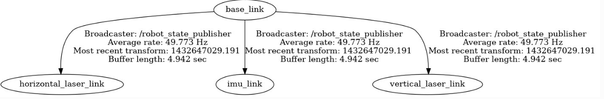

---
# Jekyll 'Front Matter' goes here. Most are set by default, and should NOT be
# overwritten except in special circumstances. 
# You should set the date the article was last updated like this:
date: 2021-10-23 # YYYY-MM-DD
# This will be displayed at the bottom of the article
# You should set the article's title:
title: Cartographer SLAM ROS Integration
# The 'title' is automatically displayed at the top of the page
# and used in other parts of the site.
---
Cartographer is a LiDAR-based SLAM algorithm built by Google that is very efficient and accurate at building large maps. From testing Cartographer qualitatively performs better than other ROS SLAM algorithms such as gmapping and rtab-map.

Links:
- [Cartographer](https://google-cartographer.readthedocs.io/en/latest/) 
- [gmapping](http://wiki.ros.org/gmapping)
- [rtab-map](http://wiki.ros.org/rtabmap_ros)

The detailed explanation of the Cartographer's algorithm and tuning can be found at their [webpage](https://google-cartographer-ros.readthedocs.io/en/latest/) and will not be repeated here. The main purpose of this guide is to show how to integrate your sensors to work with Cartographer in a ROS environment. Cartographer has both 2D and 3D SLAM, but this guide will focus only on the 2D SLAM. 

One of Cartographer's strength is that its 2D SLAM is aware of the 3D world (it will project a titled LiDAR scan to the horizontal axis). This is in contrast to gmapping which requires the LaserScan to always be perfectly level and horizontal. As seen below, the tracking frame (base_link) is not level, causing the LiDAR LaserScan to be tilted, but Cartographer takes the tilt into account.


# Installation

Refer to the [installation guide](https://google-cartographer-ros.readthedocs.io/en/latest/compilation.html#building-installation) in Cartographer's website. It is recommended to create a **separate workspace** just for Cartographer that is separate from your other ROS packages. This is because Cartographer uses ninja to build and may be incompatible with your other ROS packages. When you are using the package, remember to source the directory, e.g.

`source ~/cartographer_ws/install_isolated/setup.bash`

I recommend that you try to run Cartographer on your machine with the [demo bag](https://google-cartographer-ros.readthedocs.io/en/latest/demos.html). It is the best way to verify your installation.

## Requirements

- Ubuntu 18.04 LTS or later
- [ROS Melodic Desktop Full](http://wiki.ros.org/melodic/Installation/Ubuntu) (if using Ubuntu 18.04 LTS)
- We tested Cartographer with Nvidia AGX CPU and it works well in real-time with less than 50% CPU load

# Interface

See full details [here](https://google-cartographer-ros.readthedocs.io/en/latest/ros_api.html).

Input:

- LiDAR ([sensor_msgs::LaserScan](http://docs.ros.org/en/noetic/api/sensor_msgs/html/msg/LaserScan.html) or [sensor_msgs::MultiEchoLaserScan](http://docs.ros.org/en/noetic/api/sensor_msgs/html/msg/MultiEchoLaserScan.html))
- IMU ([sensor_msgs::Imu](http://docs.ros.org/en/melodic/api/sensor_msgs/html/msg/Imu.html)). Only angular velocities and linear accelerations are used.
- Odometry ([nav_msgs::Odometry](http://docs.ros.org/en/noetic/api/nav_msgs/html/msg/Odometry.html) and [TF](http://wiki.ros.org/tf) `odom`->`base_link`). Optional.

Output:

- map ([nav_msgs::OccupancyGrid](http://docs.ros.org/en/noetic/api/nav_msgs/html/msg/OccupancyGrid.html))
- TF (`map`->`odom`->`base_link` or `map`->`odom` depending if `odom`->`base_link` has been provided by you)

# Overview

There are a few things you need to do to get Cartographer working. This section gives you an overview of all the things you need to do before diving deep into each item.

1. Prepare the required TF transformations
2. Prepare IMU Data
3. Prepare LiDAR LaserScan data, the default ROS LiDAR driver might not work
4. To use the map as a costmap, you need to edit the Cartographer source code and add an inflation layer

## 1. Prepare TF Transformations

You need to provide a static TF transform from `base_link` to your imu frame and all of your LiDAR frames. It is recommended to use `robot_state_publisher` and not `static_transform_publisher`

Example shown below



An important point is that `base_link` needs to be **coincident** with `imu_link` (both must have the exact same position and orientation). If you need `base_link` for navigational purposes, I recommend creating one more child frame from`base_link`, e.g. `nav_link` that is at the appropriate location on the robot for navigation, e.g. centre of the wheels and at the axis of rotation.

In this example, `horizontal_laser_link` is the frame ID of the LaserScan data, and should correspond to the frame id in the LaserScan header.

## 2. Prepare IMU Data

Requirements:

- Cartographer requires IMU to be in standard ROS frame convention. x-axis facing forward, y-axis to the left, and z-axis pointing up (see figure below). Your IMU might not follow this convention, hence you need to convert them with a package such as [imu_transformer](http://wiki.ros.org/imu_transformer), or create your own node that subscribes to the raw IMU data and publishes the rectified data.
- The IMU should be fast, at around 100 Hz
- The IMU should have the correct timestamps, errors in this will cause errors in the SLAM


## 3. Prepare LiDAR LaserScan data

Cartographer can take in `sensor_msgs::LaserScan` or `sensor_msgs::MultiEchoLaserScan` as inputs. Unfortunately, sensor drivers such as [velodyne_driver](http://wiki.ros.org/velodyne_driver) will not work out of the box because it has missing metadata. If you look at the documentation of [LaserScan](http://docs.ros.org/en/noetic/api/sensor_msgs/html/msg/LaserScan.html), you will see several metadata such as `time_increment` which the standard ros drivers do not fill in for you. So your job is to edit the ros velodyne driver to suit your need. Look at the specifications of the LiDAR that you are using to fill in the metadata. For example, the correct metadata of a VLP16 Puck Hi-Res with nominal settings (600RPM and 10Hz) are:

```
const float RESOLUTION = 0.00349066;	// rad
const size_t SIZE = 2.0 * M_PI / RESOLUTION;
sensor_msgs::LaserScanPtr scan(new sensor_msgs::LaserScan());
scan->header = msg->header;
scan->angle_increment = RESOLUTION;		// rad
scan->angle_min = -M_PI;	// rad
scan->angle_max = M_PI;		// rad
scan->range_min = 0.4;		// m
scan->range_max = 130.0;	// m
scan->scan_time = 0.1;		// secs
scan->time_increment = scan->scan_time / SIZE;		// secs
```

You can refer to a sample driver [here](https://github.com/howde-robotics/velodyne).


Additionally, a parameter in Cartographer `.lua` config file that you need to change are:

```
/* Depending on whether you are using laserscan or multiecholaserscan */
num_laser_scans = 1,
// num_multi_echo_laser_scans = 1,

num_subdivisions_per_laser_scan = 1,
TRAJECTORY_BUILDER_2D.num_accumulated_range_data = 1
```

You can refer to a sample config file [here](https://github.com/howde-robotics/dragoon_bringup/blob/master/launch/include/dragoon_cartographer.lua).

# 4. Costmap Integration

Cartographer will output TF for robot pose in the map frame and an [OccupancyGrid](http://docs.ros.org/en/noetic/api/nav_msgs/html/msg/OccupancyGrid.html). However, if you want to use the provided OccupancyGrid with other navigation modules, such as move_base, the standard Cartographer OccupancyGrid will not work. This is because most navigation apps require the costmap to only have either of 3 values, FREE (0), OBSTACLES (100), or UNKNOWN (-1). Cartographer instead has a range of values depending on the confidence that the algorithms have about the state of the cells. For example, at first detection, a cell can have a value of around ~40, but as more data is collected that cell's value can go to 0 (if it is FREE) or 100 (if it is OBSTACLES). If you try to use this map as a global costmap for move_base, you will get a costmap that looks like the image below.


The workaround is to change the way Cartographer looks at obstacles. Refer to the commit [here](https://github.com/howde-robotics/cartographer/commit/93eee6e207bcbeccdbd696f2ea2f5a00234665f1) for the changes necessary. You need to change a line in `cartographer/io/submap_painter.cc` in line `209` from:

```
const uint8_t alpha_value = alpha.at(i);
```

To

```
uint8_t alpha_value = alpha.at(i);
    if (intensity_value == 0 && alpha_value > 0) {
      alpha_value = 255;
    }
```

This will immediately make an obstacle in Cartographer's OccupancyGrid to be at its maximum value.

However, if you now try to use it as a costmap, you will get something like the image below:


As you can see, it now has obstacles and walls, but they are very sparse with gaps in between. The solution is to add `inflation_layer` using the costmap package. See more [here](http://wiki.ros.org/costmap_2d/hydro/inflation). Now once you inflate the walls and obstacles you will get a costmap that looks like this:


Now that is a usable costmap for navigation.

# Future Work

There are areas that can be worked on to further improve Cartographers which our team did not have enough time to investigate.

For the best performance of Cartographer, scans should be broken down to parts of the scans and be sent as input to Cartographer as often as possible. Okay to make that sentence easier to understand, consider the nominal case of VLP16 Puck LiDAR with 10Hz scanning frequency. A typical driver such as [velodyne_driver](http://wiki.ros.org/velodyne_driver) will wait until the LiDAR makes a 360 degrees revolution before bundling all that data together into a single `LaserScan` msg and publish it on `rostopic`. However, this means that the entire revolution of scan (~100ms) shares the same timestamp, even though in reality each point is measured at different instances of time (e.g. 1st quadrant is at 0ms, 2nd quadrant is at 25ms, etc.). This degrades the performance of Cartographer that relies on accurate and tight timestamps. Therefore, one can figure out how to send the laserscans section by section every time a UDP msg is received.

# Summary

Cartographer is a fast and accurate SLAM package for your robotics needs. We believe, it is more accurate and efficient than packages such as gmapping and hector SLAM. It is able to create really large maps with its submaps methodology. But requires more work to integrate it with ROS.
