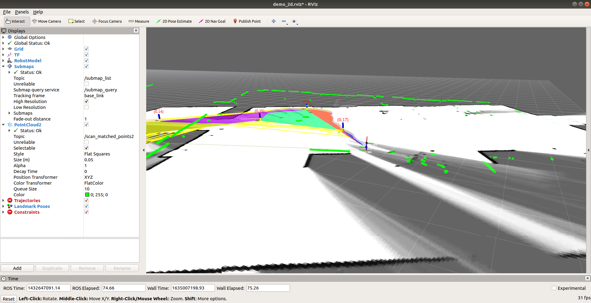
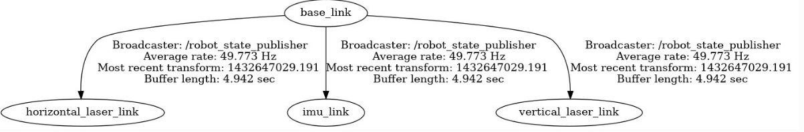
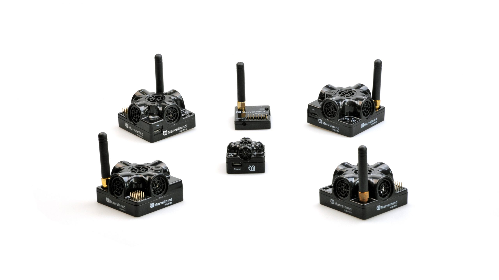
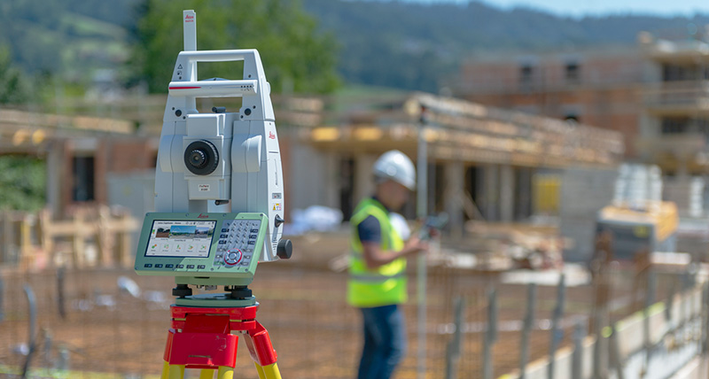
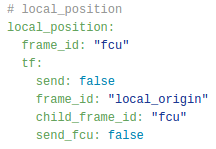
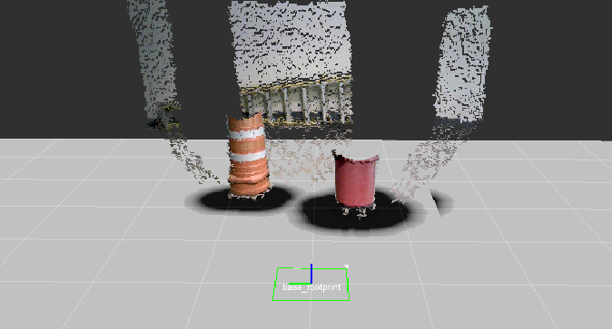

/wiki/state-estimation/adaptive-monte-carlo-localization/
---
date: 2020-02-03
title:  Adaptive Monte Carlo Localization
---
## What is a particle filter?
Particle filter are initialized by a very high number of particles spanning the entire state space. As you get additional measurements, you predict and update your measurements which makes your robot have a multi-modal posterior distribution. This is a big difference from a Kalman Filter which approximates your posterior distribution to be a Gaussian. Over multiple iterations, the particles converge to a unique value in state space.


**Figure 1:** Particle Filter in Action over Progressive Time Steps

The steps followed in a Particle Filter are:
1. **Re-sampling:** Draw with replacement a random sample from the sample set according to the (discrete) distribution defined through the importance weights. This sample can be seen as an instance of the belief.

2. **Sampling:** Use previous belief and the control information to sample 􀀀from the distribution which describes the dynamics of the system. The current belief now represents the density given by the product of distribution and an instance of the previous belief. This density is the proposal distribution used in the next step.

3. **Importance sampling:** Weight the sample by the importance weight, the likelihood of the sample X given the measurement Z.

Each iteration of these three steps generates a sample drawn from the posterior belief. After n iterations, the importance weights of the samples are normalized so that they sum up to 1.

For further details on this topic, [Sebastian Thrun's paper on Particle Filter in Robotics](https://robots.stanford.edu/papers/thrun.pf-in-robotics-uai02.pdf) is a good source for a mathematical understanding of particle filters, their applications and drawbacks.

## What is an adaptive particle filter?
A key problem with particle filter is maintaining the random distribution of particles throughout the state space, which goes out of hand if the problem is high dimensional. Due to these reasons it is much better to use an adaptive particle filter which converges much faster and is computationally much more efficient than a basic particle filter.

The key idea is to bound the error introduced by the sample-based representation of the particle filter. To derive this bound, it is assumed that the true posterior is given by a discrete, piece-wise constant distribution such as a discrete density tree or a multidimensional histogram. For such a representation we can determine the number of samples so that the distance between the maximum likelihood estimate (MLE) based on the samples and the true posterior does not exceed a pre-specified threshold. As is finally derived, the number of particles needed is proportional to the inverse of this threshold.

[Dieter Fox's paper on Adaptive Particle Filters](http://papers.nips.cc/paper/1998-kld-sampling-adaptive-particle-filters.pdf) delves much deeper into the theory and mathematics behind these concepts. It also covers the implementation and performance aspects of this technique.

## Use of Adaptive Particle Filter for Localization
To use adaptive particle filter for localization, we start with a map of our environment and we can either set robot to some position, in which case we are manually localizing it or we could very well make the robot start from no initial estimate of its position. Now as the robot moves forward, we generate new samples that predict the robot's position after the motion command. Sensor readings are incorporated by re-weighting these samples and normalizing the weights. Generally it is good to add few random uniformly distributed samples as it helps the robot recover itself in cases where it has lost track of its position. In those cases, without these random samples, the robot will keep on re-sampling from an incorrect distribution and will never recover. The reason why it takes the filter multiple sensor readings to converge is that within a map, we might have dis-ambiguities due to symmetry in the map, which is what gives us a multi-modal posterior belief.


[Dieter Fox's paper on Monte Carlo Localization for Mobile Robots](https://www.ri.cmu.edu/pub_files/pub1/fox_dieter_1999_1/fox_dieter_1999_1.pdf) gives further details on this topic and also compares this technique to many others such as Kalman Filter based Localization, Grid Based and Topological Markov Localization.

## Configuring ROS AMCL package
At the conceptual level, the AMCL package maintains a probability distribution over the set of all possible robot poses, and updates this distribution using data from odometry and laser range-finders. Depth cameras can also be used to generate these 2D laser scans by using the package `depthimage_to_laserscan` which takes in depth stream and publishes laser scan on `sensor_msgs/LaserScan`. More details can be found on the [ROS Wiki](http://wiki.ros.org/depthimage_to_laserscan).

The package also requires a predefined map of the environment against which to compare observed sensor values. At the implementation level, the AMCL package represents the probability distribution using a particle filter. The filter is "adaptive" because it dynamically adjusts the number of particles in the filter: when the robot's pose is highly uncertain, the number of particles is increased; when the robot's pose is well determined, the number of particles is decreased. This enables the robot to make a trade-off between processing speed and localization accuracy.

Even though the AMCL package works fine out of the box, there are various parameters which one can tune based on their knowledge of the platform and sensors being used. Configuring these parameters can increase the performance and accuracy of the AMCL package and decrease the recovery rotations that the robot carries out while carrying out navigation.

There are three categories of ROS Parameters that can be used to configure the AMCL node: overall filter, laser model, and odometery model. The full list of these configuration parameters, along with further details about the package can be found on the [webpage for AMCL](http://wiki.ros.org/amcl). They can be edited in the `amcl.launch` file.

Here is a sample launch file. Generally you can leave many parameters at their default values.
```
<launch>

 <arg name="use_map_topic" default="false"/>
 <arg name="scan_topic" default="scan"/>

 <node pkg="amcl" type="amcl" name="amcl">
   <param name="use_map_topic" value="$(arg use_map_topic)"/>
   <!-- Publish scans from best pose at a max of 10 Hz -->
   <param name="odom_model_type" value="diff"/>
   <param name="odom_alpha5" value="0.1"/>
   <param name="gui_publish_rate" value="10.0"/>   <!-- 10.0 -->
   <param name="laser_max_beams" value="60"/>
   <param name="laser_max_range" value="12.0"/>
   <param name="min_particles" value="500"/>
   <param name="max_particles" value="2000"/>
   <param name="kld_err" value="0.05"/>
   <param name="kld_z" value="0.99"/>
   <param name="odom_alpha1" value="0.2"/>
   <param name="odom_alpha2" value="0.2"/>
   <!-- translation std dev, m -->
   <param name="odom_alpha3" value="0.2"/>
   <param name="odom_alpha4" value="0.2"/>
   <param name="laser_z_hit" value="0.5"/>
   <param name="laser_z_short" value="0.05"/>
   <param name="laser_z_max" value="0.05"/>
   <param name="laser_z_rand" value="0.5"/>
   <param name="laser_sigma_hit" value="0.2"/>
   <param name="laser_lambda_short" value="0.1"/>
   <param name="laser_model_type" value="likelihood_field"/>
   <!-- <param name="laser_model_type" value="beam"/> -->
   <param name="laser_likelihood_max_dist" value="2.0"/>
   <param name="update_min_d" value="0.25"/>
   <param name="update_min_a" value="0.2"/>
   <param name="odom_frame_id" value="odom"/>
   <param name="resample_interval" value="1"/>
   <!-- Increase tolerance because the computer can get quite busy -->
   <param name="transform_tolerance" value="1.0"/>
   <param name="recovery_alpha_slow" value="0.0"/>
   <param name="recovery_alpha_fast" value="0.0"/>
   <remap from="scan" to="$(arg scan_topic)"/>
 </node>
</launch>
```

Best way to tune these parameters is to record a ROS bag file, with odometry and laser scan data, and play it back while tuning AMCL and visualizing it on RViz. This helps in tracking the performance based on the changes being made on a fixed data-set.


/wiki/state-estimation/Cartographer-ROS-Integration/
---
# Jekyll 'Front Matter' goes here. Most are set by default, and should NOT be
# overwritten except in special circumstances. 
# You should set the date the article was last updated like this:
date: 2021-10-23 # YYYY-MM-DD
# This will be displayed at the bottom of the article
# You should set the article's title:
title: Cartographer SLAM ROS Integration
# The 'title' is automatically displayed at the top of the page
# and used in other parts of the site.
---
Cartographer is a LiDAR-based SLAM algorithm built by Google that is very efficient and accurate at building large maps. From testing Cartographer qualitatively performs better than other ROS SLAM algorithms such as gmapping and rtab-map.

Links:
- [Cartographer](https://google-cartographer.readthedocs.io/en/latest/) 
- [gmapping](http://wiki.ros.org/gmapping)
- [rtab-map](http://wiki.ros.org/rtabmap_ros)

The detailed explanation of the Cartographer's algorithm and tuning can be found at their [webpage](https://google-cartographer-ros.readthedocs.io/en/latest/) and will not be repeated here. The main purpose of this guide is to show how to integrate your sensors to work with Cartographer in a ROS environment. Cartographer has both 2D and 3D SLAM, but this guide will focus only on the 2D SLAM. 

One of Cartographer's strength is that its 2D SLAM is aware of the 3D world (it will project a titled LiDAR scan to the horizontal axis). This is in contrast to gmapping which requires the LaserScan to always be perfectly level and horizontal. As seen below, the tracking frame (base_link) is not level, causing the LiDAR LaserScan to be tilted, but Cartographer takes the tilt into account.



# Installation

Refer to the [installation guide](https://google-cartographer-ros.readthedocs.io/en/latest/compilation.html#building-installation) in Cartographer's website. It is recommended to create a **separate workspace** just for Cartographer that is separate from your other ROS packages. This is because Cartographer uses ninja to build and may be incompatible with your other ROS packages. When you are using the package, remember to source the directory, e.g.

`source ~/cartographer_ws/install_isolated/setup.bash`

I recommend that you try to run Cartographer on your machine with the [demo bag](https://google-cartographer-ros.readthedocs.io/en/latest/demos.html). It is the best way to verify your installation.

## Requirements

- Ubuntu 18.04 LTS or later
- [ROS Melodic Desktop Full](http://wiki.ros.org/melodic/Installation/Ubuntu) (if using Ubuntu 18.04 LTS)
- We tested Cartographer with Nvidia AGX CPU and it works well in real-time with less than 50% CPU load

# Interface

See full details [here](https://google-cartographer-ros.readthedocs.io/en/latest/ros_api.html).

Input:

- LiDAR ([sensor_msgs::LaserScan](http://docs.ros.org/en/noetic/api/sensor_msgs/html/msg/LaserScan.html) or [sensor_msgs::MultiEchoLaserScan](http://docs.ros.org/en/noetic/api/sensor_msgs/html/msg/MultiEchoLaserScan.html))
- IMU ([sensor_msgs::Imu](http://docs.ros.org/en/melodic/api/sensor_msgs/html/msg/Imu.html)). Only angular velocities and linear accelerations are used.
- Odometry ([nav_msgs::Odometry](http://docs.ros.org/en/noetic/api/nav_msgs/html/msg/Odometry.html) and [TF](http://wiki.ros.org/tf) `odom`->`base_link`). Optional.

Output:

- map ([nav_msgs::OccupancyGrid](http://docs.ros.org/en/noetic/api/nav_msgs/html/msg/OccupancyGrid.html))
- TF (`map`->`odom`->`base_link` or `map`->`odom` depending if `odom`->`base_link` has been provided by you)

# Overview

There are a few things you need to do to get Cartographer working. This section gives you an overview of all the things you need to do before diving deep into each item.

1. Prepare the required TF transformations
2. Prepare IMU Data
3. Prepare LiDAR LaserScan data, the default ROS LiDAR driver might not work
4. To use the map as a costmap, you need to edit the Cartographer source code and add an inflation layer

## 1. Prepare TF Transformations

You need to provide a static TF transform from `base_link` to your imu frame and all of your LiDAR frames. It is recommended to use `robot_state_publisher` and not `static_transform_publisher`

Example shown below



An important point is that `base_link` needs to be **coincident** with `imu_link` (both must have the exact same position and orientation). If you need `base_link` for navigational purposes, I recommend creating one more child frame from`base_link`, e.g. `nav_link` that is at the appropriate location on the robot for navigation, e.g. centre of the wheels and at the axis of rotation.

In this example, `horizontal_laser_link` is the frame ID of the LaserScan data, and should correspond to the frame id in the LaserScan header.

## 2. Prepare IMU Data

Requirements:

- Cartographer requires IMU to be in standard ROS frame convention. x-axis facing forward, y-axis to the left, and z-axis pointing up (see figure below). Your IMU might not follow this convention, hence you need to convert them with a package such as [imu_transformer](http://wiki.ros.org/imu_transformer), or create your own node that subscribes to the raw IMU data and publishes the rectified data.
- The IMU should be fast, at around 100 Hz
- The IMU should have the correct timestamps, errors in this will cause errors in the SLAM


## 3. Prepare LiDAR LaserScan data

Cartographer can take in `sensor_msgs::LaserScan` or `sensor_msgs::MultiEchoLaserScan` as inputs. Unfortunately, sensor drivers such as [velodyne_driver](http://wiki.ros.org/velodyne_driver) will not work out of the box because it has missing metadata. If you look at the documentation of [LaserScan](http://docs.ros.org/en/noetic/api/sensor_msgs/html/msg/LaserScan.html), you will see several metadata such as `time_increment` which the standard ros drivers do not fill in for you. So your job is to edit the ros velodyne driver to suit your need. Look at the specifications of the LiDAR that you are using to fill in the metadata. For example, the correct metadata of a VLP16 Puck Hi-Res with nominal settings (600RPM and 10Hz) are:

```
const float RESOLUTION = 0.00349066;	// rad
const size_t SIZE = 2.0 * M_PI / RESOLUTION;
sensor_msgs::LaserScanPtr scan(new sensor_msgs::LaserScan());
scan->header = msg->header;
scan->angle_increment = RESOLUTION;		// rad
scan->angle_min = -M_PI;	// rad
scan->angle_max = M_PI;		// rad
scan->range_min = 0.4;		// m
scan->range_max = 130.0;	// m
scan->scan_time = 0.1;		// secs
scan->time_increment = scan->scan_time / SIZE;		// secs
```

You can refer to a sample driver [here](https://github.com/howde-robotics/velodyne).


Additionally, a parameter in Cartographer `.lua` config file that you need to change are:

```
/* Depending on whether you are using laserscan or multiecholaserscan */
num_laser_scans = 1,
// num_multi_echo_laser_scans = 1,

num_subdivisions_per_laser_scan = 1,
TRAJECTORY_BUILDER_2D.num_accumulated_range_data = 1
```

You can refer to a sample config file [here](https://github.com/howde-robotics/dragoon_bringup/blob/master/launch/include/dragoon_cartographer.lua).

# 4. Costmap Integration

Cartographer will output TF for robot pose in the map frame and an [OccupancyGrid](http://docs.ros.org/en/noetic/api/nav_msgs/html/msg/OccupancyGrid.html). However, if you want to use the provided OccupancyGrid with other navigation modules, such as move_base, the standard Cartographer OccupancyGrid will not work. This is because most navigation apps require the costmap to only have either of 3 values, FREE (0), OBSTACLES (100), or UNKNOWN (-1). Cartographer instead has a range of values depending on the confidence that the algorithms have about the state of the cells. For example, at first detection, a cell can have a value of around ~40, but as more data is collected that cell's value can go to 0 (if it is FREE) or 100 (if it is OBSTACLES). If you try to use this map as a global costmap for move_base, you will get a costmap that looks like the image below.


The workaround is to change the way Cartographer looks at obstacles. Refer to the commit [here](https://github.com/howde-robotics/cartographer/commit/93eee6e207bcbeccdbd696f2ea2f5a00234665f1) for the changes necessary. You need to change a line in `cartographer/io/submap_painter.cc` in line `209` from:

```
const uint8_t alpha_value = alpha.at(i);
```

To

```
uint8_t alpha_value = alpha.at(i);
    if (intensity_value == 0 && alpha_value > 0) {
      alpha_value = 255;
    }
```

This will immediately make an obstacle in Cartographer's OccupancyGrid to be at its maximum value.

However, if you now try to use it as a costmap, you will get something like the image below:


As you can see, it now has obstacles and walls, but they are very sparse with gaps in between. The solution is to add `inflation_layer` using the costmap package. See more [here](http://wiki.ros.org/costmap_2d/hydro/inflation). Now once you inflate the walls and obstacles you will get a costmap that looks like this:


Now that is a usable costmap for navigation.

# Future Work

There are areas that can be worked on to further improve Cartographers which our team did not have enough time to investigate.

For the best performance of Cartographer, scans should be broken down to parts of the scans and be sent as input to Cartographer as often as possible. Okay to make that sentence easier to understand, consider the nominal case of VLP16 Puck LiDAR with 10Hz scanning frequency. A typical driver such as [velodyne_driver](http://wiki.ros.org/velodyne_driver) will wait until the LiDAR makes a 360 degrees revolution before bundling all that data together into a single `LaserScan` msg and publish it on `rostopic`. However, this means that the entire revolution of scan (~100ms) shares the same timestamp, even though in reality each point is measured at different instances of time (e.g. 1st quadrant is at 0ms, 2nd quadrant is at 25ms, etc.). This degrades the performance of Cartographer that relies on accurate and tight timestamps. Therefore, one can figure out how to send the laserscans section by section every time a UDP msg is received.

# Summary

Cartographer is a fast and accurate SLAM package for your robotics needs. We believe, it is more accurate and efficient than packages such as gmapping and hector SLAM. It is able to create really large maps with its submaps methodology. But requires more work to integrate it with ROS.


/wiki/state-estimation/gps-lacking-state-estimation-sensors/
---
# Jekyll 'Front Matter' goes here. Most are set by default, and should NOT be
# overwritten except in special circumstances. 
# You should set the date the article was last updated like this:
date: 2022-12-05 # YYYY-MM-DD
# This will be displayed at the bottom of the article
# You should set the article's title:
title: Externally Referenced State Estimation for GPS Lacking Environments
# The 'title' is automatically displayed at the top of the page
# and used in other parts of the site.
---
Robotic systems will often encounter environments where GPS access is either lacking or denied. In these environments, it's important to still maintain some accurate global representation of the robot's state, both for localization and mapping purposes. This is a relatively common problem in robotics, and is commonly dealt with through a combination of proprioceptive sensors and an estimation of the local environment in order to perform [SLAM](https://www.mathworks.com/discovery/slam.html). This is effective in environments where there are unique features to localize off of, but can struggle in uniform or dynamic environments. For that reason, there is benefit in considering sensor suites that take advantage of external infrastructure to provide a fixed positional reference. This fixed positional reference can mitigate drift or catastrophic localization error for robotic systems where signifacant state estimation errors are disallowed or not preferable. 


## Common Types of External Referencing Positioning Systems

### UltraWideband Beacons (UWB)

UltraWideband is a short-range wireless communication protocol, allowing connected devices to communicate across short ranges, similar to bluetooth. Unlike blueooth, UltraWideband transmits over a wider frequency, allowing for a more precise and wider bandwith of communication, albeit over a shorter range. 

Ultrawideband positioning takes advantage of the communication pulses to sense distances between transmitters through a two-way ranging protocol described in detail [here](https://forum.qorvo.com/uploads/short-url/5yIaZ3A99NNf2uPHsUPjoBLr2Ua.pdf). As a simplification, it is able to measure the time period that messages take to transmit between devices, while accouting for potential clock and frequency shift between devices. 

By using multiple stationary devices, a single or multiple mobile beacons can be tracked by combining ranges through trilateration. 


[Source](https://www.researchgate.net/profile/Teijo-Lehtonen/publication/281346001/figure/fig4/AS:284460038803456@1444831966619/DecaWave-UWB-localization-system-SDK-5.png)

At the time of writing, one of the most common modules for UWB is the DWM1001. Since these modules are mass manufactured, they can be purchased very inexpensively and should be considered one of the most affordable options for positioning systems.

### Ultrasonic Positioning

Ultrasonic positioning works in a similar way to UWB, but rather than transitting frequencies at a very high frequency, the products instead rely on a combination of lower frquency communication pulses and beamforming. By using a sensor array on each device, they are able to claim a 2D positioning accuracy of +-2cm.



[Source](https://marvelmind.com/)

As an important note, ultrasonic pulses are harmful to human hearing over an extended period of time and should not deployed around humans without ear protection.

### Robotic Total Stations

Total stations have an extended heritage in civil engineering, where they have been used to precisely survey worksites since the 1970s. The total station sends beams of light directly to a glass reflective prism, and uses the time-of-flight properties of the beam to measure distances. The robotic total station tracks it's calibration orientaiton to high precision, such that the measured distance can be converted into a high-precision 3D position mesaurement. Total stations, depending on the prism type and other factors, can accurate track with in millimeter range at up to 3.5km [Leica-Geosystems](file:///home/john/Downloads/Leica_Viva_TS16_DS-2.pdf).


[Source](https://leica-geosystems.com/)

## Key Factors to Consider

When considering external referencing positioning systems, it's important to consider the following:

- What is the environmental conditions? Is the robot running indoors or outdoors? interference)
- Will there be humans in environment
- Will the robot have line-of-sight to the fixed infrastructure?
- What are the accuracy and precision requirements?


/wiki/state-estimation/OculusPrimeNavigation/
---
date: 2017-08-15
title: Oculus Prime Navigation
---

There are multiple techniques to carry out way-point navigation on the Oculus Prime platform using the navigation stack.

1. **"Pure" ROS:** To set a single goal the pure ROS way, bypassing the use of the oculusprime browser UI altogether, first run:
```
$ roslaunch oculusprime globalpath_follow.launch
```
Or try:
```
$ roslaunch oculusprime remote_nav.launch
```
  - This `globalpath_follow` launch file sets up the basic nodes necessary to have Oculus Prime go where ROS Navigation wants it to go, and launches the rest of the navigation stack. Once it’s running, you can [set initial position and goals graphically using Rviz](http://wiki.ros.org/oculusprime_ros/navigation_rviz_tutorial)

2. **Via Command Line:** You can also send coordinates via command line (AFTER you set initial position using the web browser or Rviz map). Enter a command similar to:
```
$ rostopic pub /move_base_simple/goal geometry_msgs/PoseStamped \
'{ header: { frame_id: "map" }, pose: { position: { x: 4.797, y: 2.962, z: 0 }, orientation: { x: 0, y: 0, z: 0.999961751128, w: -0.00874621528223 } } }'
```
  - Change the coordinates shown to match where your goal is. An easy way to find goal coordinates is to set the goal on the map with a mouse, and while the robot is driving there, enter:
```
$ rostopic echo /move_base/current_goal
```
  - An example of doing this via a python ROS node, starting with simpler coordinates (x,y,th), can be found [here](https://gist.github.com/xaxxontech/6cbfefd38208b9f8b153).

3. **Waypoints:** If you want to choose from a list of waypoints instead, you can use the functionality built into the oculusprime server and do it via oculusprime commands:
  - First read the waypoints:
```
state rosmapwaypoints
```
  - This should return a long comma-separated string with no spaces using the format "name,x,y,th," for all the waypoints, similar to `<telnet> <state> waypointA, 4.387, -0.858, -0.3218, waypointB, 2.081, 2.739, -1.5103`.
  - Change the coordinates of the particular waypoint you want to change within the string, then send the whole string to the savewaypoints command, eg:
Advanced -> telnet text command -> enter command:
```
savewaypoints waypointA,5.456,-2.345,-0.3218,waypointB,2.081,2.739,-1.5103
```
  - Then drive to the new coordinates by sending:
```
gotowaypoint waypointA
```


/wiki/state-estimation/orb-slam2-setup/
---
date: 2019-05-07
title: ORB SLAM2 Setup Guidance 
---
This tutorial will help you in setting up the ORB SLAM2 on SBC. We will start with the installation procedure for the stereo mode and then we will discuss the changes required in the stereo camera's yaml configuration file. Since the ORB SLAM2 code doesn't publish pose output, we have added a separate section which explains how to add the ROS publisher support for the stereo mode. 

# Table of Contents
1. [Introduction](#Introduction)
2. [Installation for stereo mode](#Installation-for-stereo-mode)
3. [Setting up yaml configuration file](#Setting-up-yaml-configuration-file)
4. [Adding ROS publisher support for the stereo mode](#Adding-ROS-publisher-support-for-the-stereo-mode)
5. [References](#References)

## Introduction
ORB-SLAM2 is a SLAM library for Monocular and Stereo cameras that computes the camera trajectory and a sparse 3D reconstruction. It is a feature-based SLAM method which has three major components: tracking, local mapping and loop closing. This [link](https://medium.com/@j.zijlmans/lsd-slam-vs-orb-slam2-a-literature-based-comparison-20732df431d) nicely explains all the components of ORB SLAM2 technique in detail. Also, it briefly discusses the different part of ORB SLAM2 code and explains how changing the different parameters in different modules like local mapping, loop-closure, ORBextractor, etc. will affect the performance of ORB SLAM2.

## Installation for stereo mode
ORB-SLAM2 has multiple dependencies on other ROS libraries which includes Pangolin, OpenCV, Eigen3, DBoW2, and g2o. **[Pangolin](https://github.com/stevenlovegrove/Pangolin)** library is used for the visualization and user interface.**[OpenCV](https://docs.opencv.org/3.4.3/d7/d9f/tutorial_linux_install.html)** is used for image manipulation and feature extraction. **[Eigen3](http://eigen.tuxfamily.org)** library is used for performing mathematical operations on the Matrices. Finally, **[DBoW2](https://github.com/dorian3d/DBoW2)** is an improved version of the DBow library, for indexing and converting images into a bag-of-word representation. It implements a hierarchical tree for approximating nearest neighbors in the image feature space and creates a visual vocabulary. It also implements an image database with inverted and direct files to index images and enables quick queries and feature comparisons. **[G2o](https://github.com/RainerKuemmerle/g2o)** is C++ library for optimizing graph-based nonlinear error functions. This helps in solving the global BA problem in ORB-SLAM2.<br/>
Now we will discuss the installation steps, First, clone the below repository:
```
git clone https://github.com/raulmur/ORB_SLAM2.git ORB_SLAM2
```
Then execute following set of commands to build the library:
```
cd ORB_SLAM2
chmod +x build.sh
./build.sh
```
Even after installing above dependencies, if you face compilation error related to boost system, you need to install boost libraries and set the path to where you installed it in the makefile. This path should have the include/ and lib/ folders with header files and compiled .so binaries.

```
${PROJECT_SOURCE_DIR}/../../../Thirdparty/DBoW2/lib/libDBoW2.so
${PROJECT_SOURCE_DIR}/../../../Thirdparty/g2o/lib/libg2o.so
${PROJECT_SOURCE_DIR}/../../../lib/libORB_SLAM2.so
-lboost_system
)
```
To build the stereo node, add the path including Examples/ROS/ORB_SLAM2 to the ROS_PACKAGE_PATH environment variable. Replace PATH by the folder where you cloned ORB_SLAM2 and then execute the build_ros script. 
```
export ROS_PACKAGE_PATH=${ROS_PACKAGE_PATH}:PATH/ORB_SLAM2/Examples/ROS
chmod +x build_ros.sh
./build_ros.sh
```
For a stereo input from topic /camera/left/image_raw and /camera/right/image_raw, we need to remap the left and right camera frame output to the ORB-SLAM2 input ROS topic. A sample roslaunch doing the ROS topic remapping is shown below. 
```
<?xml version="1.0"?>
<launch>
    <node name="ORB_SLAM2" pkg="ORB_SLAM2" type="Stereo" output="screen" args="/home/administrator/ORB_SLAM2/Vocabulary/ORBvoc.txt /home/administrator/ORB_SLAM2/Examples/Stereo/zed.yaml true">
    <remap from="/camera/left/image_raw" to="/left/image_raw_color"/>
    <remap from="/camera/right/image_raw" to="/right/image_raw_color"/>
    </node>
</launch>
```
```
roslaunch ORB_SLAM2 <launch_file>
```
Above launch file also runs the ORB_SLAM2/Stereo node. You will need to provide the vocabulary file and a yaml settings file to run the Stereo node. Just use the same Vocabulary file because it's taken from a huge set of data and works pretty good.  All the popular stereo cameras like ZED, Intel Realsense, Asus Xtion Pro provides the pre-rectified images. So, if you are using one of those cameras, you don't need to provide rectification matrices else you need to add rectification matrices in the yaml configuration file (sample matrices are shown in next section).

## Setting up yaml configuration file
As mentioned in the previous section that the Stereo node command takes a yaml configuration file as input. This yaml configuration file includes the stereo camera calibration parameters, ORB parameters, rectification matrices if the images are not pre-rectified. <br/>
Below is a sample yaml file settings for our calibrated stereo camera (ZED). Camera calibration and distortion parameters can be found from the intrinsic calibration matrix. Other parameters like width, height, fps depend on the resolution of your camera.
```
# Camera calibration and distortion parameters (OpenCV) 
Camera.fx: 435.2046959714599
Camera.fy: 435.2046959714599
Camera.cx: 367.4517211914062
Camera.cy: 252.2008514404297

Camera.k1: 0.0
Camera.k2: 0.0
Camera.p1: 0.0
Camera.p2: 0.0

Camera.width: 640
Camera.height: 480

# Camera frames per second 
Camera.fps: 20.0

# stereo baseline times fx
Camera.bf: 47.90639384423901

# Color order of the images (0: BGR, 1: RGB. It is ignored if images are grayscale)
Camera.RGB: 1

# Close/Far threshold. Baseline times.
ThDepth: 35
```
When number of features in the environment is less, the keyframes will not get initialized and system will not go in SLAM/Localization mode. So, tweak below parameters to improve the performance of the ORB SLAM2. 
```
#--------------------------------------------------------------------------------------------
# ORB Parameters
#--------------------------------------------------------------------------------------------

# ORB Extractor: Number of features per image
ORBextractor.nFeatures: 1200

# ORB Extractor: Scale factor between levels in the scale pyramid 	
ORBextractor.scaleFactor: 1.2

# ORB Extractor: Number of levels in the scale pyramid	
ORBextractor.nLevels: 8

# ORB Extractor: Fast threshold
# Image is divided in a grid. At each cell FAST are extracted imposing a minimum response.
# Firstly we impose iniThFAST. If no corners are detected we impose a lower value minThFAST
# You can lower these values if your images have low contrast			
ORBextractor.iniThFAST: 20
ORBextractor.minThFAST: 7
```
Below is the sample of rectification matrices.
```
#--------------------------------------------------------------------------------------------
# Stereo Rectification. Only if you need to pre-rectify the images.
# Camera.fx, .fy, etc must be the same as in LEFT.P
#--------------------------------------------------------------------------------------------
# LEFT.height: 720
# LEFT.width: 1280
# LEFT.D: !!opencv-matrix
#    rows: 1
#    cols: 5
#    dt: d
#    data:[-0.28340811, 0.07395907, 0.00019359, 1.76187114e-05, 0.0]
# LEFT.K: !!opencv-matrix
#    rows: 3
#    cols: 3
#    dt: d
#    data: [458.654, 0.0, 367.215, 0.0, 457.296, 248.375, 0.0, 0.0, 1.0]
# LEFT.R:  !!opencv-matrix
#    rows: 3
#    cols: 3
#    dt: d
#    data: [0.999966347530033, -0.001422739138722922, 0.008079580483432283, 0.001365741834644127, 0.9999741760894847, 0.007055629199258132, -0.008089410156878961, -0.007044357138835809, 0.9999424675829176]
# LEFT.P:  !!opencv-matrix
#    rows: 3
#    cols: 4
#    dt: d
#    data: [435.2046959714599, 0, 367.4517211914062, 0,  0, 435.2046959714599, 252.2008514404297, 0,  0, 0, 1, 0]

# RIGHT.height: 720
# RIGHT.width: 1280
# RIGHT.D: !!opencv-matrix
#    rows: 1
#    cols: 5
#    dt: d
#    data:[-0.28368365, 0.07451284, -0.00010473, -3.555907e-05, 0.0]
# RIGHT.K: !!opencv-matrix
#    rows: 3
#    cols: 3
#    dt: d
#    data: [457.587, 0.0, 379.999, 0.0, 456.134, 255.238, 0.0, 0.0, 1]
# RIGHT.R:  !!opencv-matrix
#    rows: 3
#    cols: 3
#    dt: d
#    data: [0.9999633526194376, -0.003625811871560086, 0.007755443660172947, 0.003680398547259526, 0.9999684752771629, -0.007035845251224894, -0.007729688520722713, 0.007064130529506649, 0.999945173484644]
# RIGHT.P:  !!opencv-matrix
#    rows: 3
#    cols: 4
#    dt: d
#    data: [435.2046959714599, 0, 367.4517211914062, -47.90639384423901, 0, 435.2046959714599, 252.2008514404297, 0, 0, 0, 1, 0]

```

## Adding ROS publisher support for the stereo mode
ROS interface for the ORB SLAM2 is present in the below folder. So, all the changes discussed here will be done in the ros_stereo.cc file.
```
ORB_SLAM2/Examples/ROS/ORB_SLAM2/src/ros_stereo.cc
```
Firstly, we need to add below header files for using geometric ROS messages (PoseStamped, Point) and the TransformBroadcaster. Two boolean variables are added in the ImageGrabber class for publishing pose and broadcasting transform.  
```
#include <geometry_msgs/PoseStamped.h>
#include <geometry_msgs/Point.h>
#include <geometry_msgs/Quaternion.h>
#include <tf/transform_broadcaster.h>
#include <vector>

class ImageGrabber
{
    public:
        ImageGrabber(ORB_SLAM2::System* pSLAM):mpSLAM(pSLAM){}


        ORB_SLAM2::System* mpSLAM;
        bool do_rectify, pub_tf, pub_pose;
        cv::Mat M1l,M2l,M1r,M2r;
        ros::Publisher* orb_pub;

        void GrabStereo(const sensor_msgs::ImageConstPtr& msgLeft,const sensor_msgs::ImageConstPtr& msgRight);
        void SetPub(ros::Publisher* pub);

};

```
Below advertise() function returns a ros::Publisher object, which contains a publish() method that lets you publish geometric messages onto the "orb_pose" ROS topic and the function below initializes the ORB publisher.  
```
ros::Publisher pose_pub = nh.advertise<geometry_msgs::PoseStamped>("orb_pose", 100);
igb.SetPub(&pose_pub);
```

```
void ImageGrabber::SetPub(ros::Publisher* pub)
{
    orb_pub = pub;
}
```
Now, Rotation and Translation matrices (R_,t_) are initialized for storing the output pose. T_ stores the output pose from the ORB SLAM2.
```
cv::Mat T_,R_,t_;
T_ = mpSLAM->TrackStereo(cv_ptrLeft->image,cv_ptrRight->image,cv_ptrLeft->header.stamp.toSec());
        
if (T_.empty())
return;
```
Now you can use ROS tf library to get the quaternion and position information from the transformation matrix. Then, these position elements and the rotation elements are set in the tf (transform).
```
if (pub_tf || pub_pose)
{    
    R_ = T_.rowRange(0,3).colRange(0,3).t();
    t_ = -R_*T_.rowRange(0,3).col(3);
    vector<float> q = ORB_SLAM2::Converter::toQuaternion(R_);
    float scale_factor=1.0;
    tf::Transform transform;
    transform.setOrigin(tf::Vector3(t_.at<float>(0, 0)*scale_factor, t_.at<float>(0, 1)*scale_factor, t_.at<float>(0, 2)*scale_factor));
    tf::Quaternion tf_quaternion(q[0], q[1], q[2], q[3]);
    transform.setRotation(tf_quaternion);
}
```
Below piece of code sends the transform with a TransformBroadcaster. In the first argument, we pass in the transform itself.
In second argument, we need to give the transform being published a timestamp, we will just use the timestamp when the camera image is published. Then, we need to pass the name of the parent frame of the link we're creating, in this case "world". Finally, we need to pass the name of the child frame of the link we're creating, in this case we have defined it as "ORB_SLAM2_STEREO".
```
if (pub_tf)
{
   static tf::TransformBroadcaster br_;
   br_.sendTransform(tf::StampedTransform(transform, ros::Time(cv_ptrLeft->header.stamp.toSec()), "world", "ORB_SLAM2_STEREO"));
}
```
Below piece of code publishes the pose output. Here also we will use the timestamp when the camera image is published. We will define this frame as "ORB_SLAM2_STEREO". Finally, we need to convert the pose transform to ROS pose message before publishing.
```
if (pub_pose)
{
   geometry_msgs::PoseStamped pose;
   pose.header.stamp = cv_ptrLeft->header.stamp;
   pose.header.frame_id ="ORB_SLAM2_STEREO";
   tf::poseTFToMsg(transform, pose.pose);
   orb_pub->publish(pose);
}
```

## References
This is the official [github repository](https://github.com/raulmur/ORB_SLAM2) of the ORB SLAM2.


/wiki/state-estimation/radar-camera-sensor-fusion/
---
date: 2019-11-13
title: 'Sensor Fusion and Tracking'
published: true
---
Fusing data from multiple sensor is an integral part of the perception system of robots and especially Autonomous Vehicles. The fusion becomes specially useful when the data coming from the different sensors gives complementary information. In this tutorial we give an introduction to Radar-Camera sensor fusion for tracking oncoming vehicles. A camera is helpful in detection of vehicles in the short range, however recovering the 3D velocity of the vehicles solely based on vision is very challenging and inaccurate, especially for long-range detection. This is where the RADAR comes into play. RADAR is excellent for determining the speed of oncoming vehicles and operation in adverse weather and lighting conditions, whereas the camera provides rich visual features required for object classification. 

The position and velocity estimates are improved through the fusion of RADAR and camera data. We will first go through the details regarding the data obtained and the processing required for the individual sensors and then go through sensor fusion and tracking algorithm details. 

## Camera
This section will explain how you use the information from a camera to estimate the rough position of a object in the world. The method described below makes an assumption that ego vehicle or a robot with the camera mounted and the other objects that we would like to track are all on the same plane in the world.

### Object Detection
The first step is to detect 2D bounding boxes of the object you want to track. State-of-the-art techniques for object detection that run in real-time are deep learning based single shot detector models such as SSD or YOLOv3. You can read more about single shot detectors [here](https://leonardoaraujosantos.gitbooks.io/artificial-inteligence/content/single-shot-detectors.html). This tutorial uses the YOLOv3 model for object detection. [This](https://github.com/AlexeyAB/darknet) fork of the original implementation is recommended as it has additional optimizations for real-time inference. 

Clone the repository and build the framework on your system.

```
git clone https://github.com/AlexeyAB/darknet
cd darknet
make
```

Refer to `README` in the repository for more instructions on how to build Darknet for different platforms. Make sure you select the correct GPU architecture in the `Makefile`. Additionally, you can set build flags such as `CUDNN_HALF=1` to accelerate training and inference.

The repository also provides a Python API (`darknet_video.py`) to load the YOLOv3 model for inference using an OpenCV image  as the input and return a list of bounding box detections. The detections contain the following data.

```
[class_label confidence x y h w]
```

You could also use any other technique for object detection and get a similar list of detections.

### Object Tracking in Images 
Although the goal of camera based perception is to only estimate a position of the object, you can also track the bounding boxes in the image as well to better associate the detection later in sensor fusion and the main tracker. This step is optional and can be skipped.

A popular approach or technique for real-time tracking is [SORT](https://arxiv.org/abs/1602.00763) (Simple Online and Real-Time Tracking). It follows a tracking-by-detection framework for the problem of multiple object tracking (MOT) where objects are detected in each frame and represented as bounding boxes. SORT makes use of Kalman filter to predict the state of the bounding box in the next frame. This helps keep track of the vehicles even if the bounding box detections are missed over few frames.

The official implementation [here](https://github.com/abewley/sort) is recommended. Follow the instructions in the `README` of this repository to setup SORT. Below is the gist of how to instantiate and update SORT.

```
from sort import *

#create instance of SORT
mot_tracker = Sort() 

# get detections
...

# update SORT
track_bbs_ids = mot_tracker.update(detections)

# track_bbs_ids is a np array where each row contains a valid bounding box and track_id (last column)
...
```


### Inverse Perspective Mapping
Inverse Perspective Mapping is basically a perspective transformation or a homography between two planes in the world. The idea here is to project the camera view (image plane) on to the ground plane in the world to obtain a birds-eye-view of the scene. One way to do this is to directly pick a set of points (minimum 4) in the image corresponding to a rectangular region on the ground plane and then estimate the homography matrix.

In order to estimate the homography, you need a set of correspondences. You need a reference object lying flat on the world ground plane (any rectangular shaped board would do). Measure the location of the corner points of the board in the world frame and log the projection of these point on the image plane as well. You can use OpenCV's `cv2.getPerspectiveTransform` to feed in the corresponding points and obtain the homography.

Once the homography is known, pick the bottom center of all the bounding boxes, as this point most closely represents the point on the ground plane, and apply the homography to this image point to obtain an estimate of location in the world frame.


There are many pitfalls and assumptions in this technique. As mentioned earlier, the objects to detect must lie on the same ground plane and the relative distance of the camera sensor and orientation with respect to the ground plane must remain constant. If the bounding box detection is inaccurate, a small deviation in the image point might lead to a significant error in the estimated position in the world frame.

You can also model the uncertainty in the position estimate to generate an occupancy grid with the mean and covariance of the position of the object. We will later see how to fuse these estimates with another sensor modality such as a Radar to refine our estimate and track these detections as well.


#### Camera Output
Camera returns two states for every detections. According to our current camera configuration, state (Ego vehicle frame) of the detections are given as: 
- Position in x direction 
- Position in y direction 
To make things clear, we consider these x and y directions in birds eye view of the ego vehicle frame, where x represents how far the detection is in longitudinal direction and y represents the offset of the detection in lateral direction. 

## Radar
Radar is becoming an important automotive technology. Automotive radar systems are the primary sensor used in adaptive cruise control and are a critical sensor system in autonomous driving assistance systems (ADAS). In this tutorial it is assumed that the radar internally filters the raw sensor data and gives the final positions and velocities of the vehicles within the field of view. This is a reasonable assumption since most of the automotive grade radars already do such filtering and tracking and return the tracked vehicle estimate in the Cartesian coordinates.

#### Radar Output
Radar provides four states for every detections, moreover depending on the use case there could be multiple detections. According to our current Radar configuration, state (Ego vehicle frame) of the detections are given as: 
- Position in x direction 
- Position in y direction 
- Velocity in x direction 
- Velocity in y direction

Following is the result of camera detection and estimated position in the 3D world. The detection was performed on image stream from Carla simulator and the results are visualized in Rviz. The blue cubes represent estimates from camera and red cubes are the Radar detections.


## Tracker Framework
The framework has the following major components:
- Data Association - Sensor Measurements
- Sensor Fusion - Kalman Filter
- Track Updates
- Motion Compensation of Tracks
- Track Association
- Tracker Evaluation and Metrics

### Data Association - Sensor Measurements
Tracker gets an array of detections from camera and Radar for every frame. First of all the data needs to be linked to the corresponding detections in both (all) the sensors. This is  done by computing a distance cost volume for each detection from one sensor with each detection from another sensor. Scipy library provides good resources for computing such functions in Python. Then you need to use a minimization optimization function to associate detections such that overall cost (Euclidean distance) summed up over the entire detections is minimized. For doing that, Hungarian data association rule is used. It matches the minimum weight in a bipartite graph. Scipy library provides good functionality for this as well. 

### Tracker - Kalman Filter
Kalman Filter is an optimal filtering and estimation technique which uses a series of measurements (with noise) over time to estimate the unknown variables which tend to be more accurate than the individual estimates. It is widely used concept in a variety of fields ranging from state estimation to optimal controls and motion planning. The algorithm works as a two step process which are as follows:
- Prediction Step
- Measurement Step

In our case we use Kalman Filter to estimate states of the vehicles in the environment using data from Radar and Camera. The states consist of the position and velocity of the vehicle, which are provided by the tracker in the form of measurement.

#### Prediction Step
Prediction step is the step where we will estimate the state of the vehicle in the next timestep using data we have currently and a motion model. We chose to use a constant velocity (CV) motion model for prediction. This model considers the vehicle as a point object which can move at a constant velocity in the x and y direction. This is not the best model to represent the dynamics of a vehicle but since we dont have information about the steering or throttle data of the vehicle, we will have to be satisfied with this. When we predict the future state, we also need to estimate the noise that might have propped up in the system due to a variety of reasons. This noise is called the process noise and we assume that it is dependant on the motion model and the timestep. This [link](https://github.com/balzer82/Kalman/blob/master/Kalman-Filter-CV.ipynb?create=1) gives a good idea about the CV motion model and the process noise associated with it.

The pseudo-code for the prediction step is
```
def predict():
    predicted_state = transition_matrix * old_state
    predicted_covariance = transition_matrix' * old_covariance * transition_matrix + process_noise

```

#### Measurement Step
Our measurement step is actually divided into two parts, one for the camera measurement and the other for the radar measurement. While updating the states of the filter we need to be sure that the timestep of the measurement and the predictions match. The update step is much more complicated and 

The pseudo-code for the prediction step is
```
def update():
    residual = sensor_measurement - measurement_function * predicted_state
    projected_covariance = measurement_function * predicted_covariance * measurement_function + sensor_noise
    kalman_gain = measurement_function' * projected_covariance * 
    new_state = predicted_state + kalman_gain * residual
    new_covariance = (identity - kalman_gain * measurement_function) * projected_covariance

```
 
### Track Updates
This is the most important step in the framework. Here you need to specify the time steps length for which the tracklets will be continued to be predicted (continue predicting the state of the track) even though the vehicle was not detected in a continuous set of frames. Another tuning parameter is how long you want to continuously detect the object through sensors to confirm that the object is a valid track.

Here you need to define the misses (age of non-matched detections) for each measurement. The point of this parameter is that you will increment this age if that corresponding state (to that track) is not observed through sensors. Once any of the state from detections from sensors is able to associate with the prediction produced by the tracks then we again set back that track parameter to 0.

### Motion Compensation of Tracks
This block basically transforms all the track predictions at a timestep by the ego vehicle motion. This is an important block because the prediction (based on a vehicle motion model) is computed in the ego vehicle frame at the previous timestep. If the ego vehicle was static, the new sensor measurements could easily be associated with the predictions, but this would fail if the ego vehicle moved from its previous position. This is the reason why we need to compensate all the predictions by ego motion first, before moving on to data association with the new measurements. The equations for ego motion compensation are shown below.

\\[\left[ \begin{array} { c } { X _ { t + 1 } } \\\ { Y _ { t + 1 } } \\\ { 1 } \end{array} \right] = \left[ \begin{array} { c c c } { \cos ( \omega d t ) } & { \sin ( \omega d t ) } & { - v _ { x } d t } \\\ { - \sin ( \omega d t ) } & { \cos ( \omega d t ) } & { - v _ { y } d t } \\\ { 0 } & { 0 } & { 1 } \end{array} \right] \left[ \begin{array} { c } { X _ { t } } \\\ { Y _ { t } } \\\ { 1 } \end{array} \right]\\]
 
### Track Association
Once you have the motion compensated tracks, you need to follow the same algorithm to associate new tracks with existing tracks. To give some intuition, here you are matching the predicted state in the last time for every track with the measurements of the current timestep. 


#### Final Results of Tracking and Sensor Fusion
 


### Tracker Evaluation and Metrics
The most widely used metrics for validation are MOTA (Multi-object tracking accuracy) and MOTP (Multi-object tracking precision). MOTP is the total error in estimated position for matched object-hypothesis pairs over all frames, averaged by the total number of matches made. It shows the ability of the tracker to estimate precise object positions, independent of its skill at recognizing object configurations, keeping consistent trajectories, and so forth. The MOTA accounts for all object configuration errors made by the tracker, false positives, misses, mismatches, over all frames.

To evaluate your tracker, you can use the [`motmetrics`](https://github.com/cheind/py-motmetrics) Python library.

```
pip install motmetrics
```

At every frame instance, you need the ground truth position and track ID along with the predicted detection and track ID. Use the accumulator to record all the events and you can generate a summary and list the metrics and the end of the sequence. Refer to the README [here](https://github.com/cheind/py-motmetrics) for details on how to use this library. Following is an example of the results summary generated.

```
      IDF1   IDP   IDR  Rcll  Prcn GT MT PT ML FP FN IDs  FM  MOTA  MOTP
seq1 83.3% 83.3% 83.3% 83.3% 83.3%  2  1  1  0  1  1   1   1 50.0% 0.340
seq2 75.0% 75.0% 75.0% 75.0% 75.0%  2  1  1  0  1  1   0   0 50.0% 0.167

```

## See Also:
- [Delphi ESR Radar](https://github.com/deltaautonomy/roboticsknowledgebase.github.io/blob/master/wiki/sensing/delphi-esr-radar.md)

## Further Reading
- [Single Shot Object Detectors](https://leonardoaraujosantos.gitbooks.io/artificial-inteligence/content/single-shot-detectors.html)
- [YOLOv3 Implementation](https://github.com/pjreddie/darknet)
- [SORT Tracker Repository](https://github.com/abewley/sort)
- [Kalman Filter in Python](https://github.com/balzer82/Kalman)


/wiki/state-estimation/ros-cost-maps/
---
date: 2017-08-15
title: Cost Maps in ROS
---
## Package to Use
- ROS Package: http://wiki.ros.org/costmap_2d
- Git Code: https://github.com/ros-planning/navigation/tree/jade-devel/costmap_2d

## When to use this:
You should use this package whenever you want to create a costmap for your robot to navigate through. This package has the ability to use depth sensor information in order to create a costmap with information about obstacles in the map. You can also enter your own cost information in order to specify areas of your map where the robot should not go.

## ROS Interface
The main interface to `costmap_2d` is the object `costmap_2d::Costmap2DROS`. This maintains much of the ROS related functionality and contains `costmap_2d::LayeredCostmap` to keep track of each of the layers. Each layer is instantiated in the Costmap2DROS library using [pluginlib](http://wiki.ros.org/pluginlib) and is added to the `LayeredCostmap`. Layers themselves can be compiled individually, allowing arbitrary changes to the costmap made through the interface `costmap_2d::Costmap2D`.

## Transforms
In order to insert data from sensor sources into the costmap, the object is highly dependent on the [tf package](http://wiki.ros.org/tf) in ROS. This assumes that all transforms between the coordinate frames specified by the `global_frame`, `robot_base_frame`, and sensor sources are connected and up-to-date.

## Subscribed Topics
- `geometry_msgs/Polygon` specification of the footprint of the robot.

## Published Topics
- `nav_msgs/OccupancyGrid` values in the costmap.
- `map_msgs/OccupancyGridUpdate` values of the updated area of the costmap
- `costmap_2d/VoxelGrid` optionally advertised when the underlying occupancy grid uses voxels and the user requests the voxel grid to be published.

## Map Updates
### Updates
The costmap update cycles at the rate specified by the update_frequency parameter.
Each update, the costmap will mark and clear objects.
Costmap automatically subscribes to sensor topics over ROS and updates itself accordingly.
Each sensor is used to:
1. **Mark:** Insert obstacle information into costmap
  - A marking operation is just an index into an array to change the cost of a cell
2. **Clear:** Remove obstacle information from the costmap
  - Raytracing through a grid from the origin to the sensor outwards for each observation reported
3. Both mark and clear

If a 3D structure is used to store obstacle information, obstacle information from each column is projected down into 2D when put into the costmap

### Update Structure
Underlying structure is capable of representing only three different values with each status having a special cost value assigned to it upon projection into costmap:
- Free: `costmap_2d::FREE_SPACE`
  - Columns that have not reached the unknown_threshold parameter are assigned a cost:
- Occupied: `costmap_2d::LETHAL_OBSTACLE`
  - Columns that have a certain number of occupied cells (`mark_threshold` parameter)
- Unknown: `costmap_2d::NO_INFORMATION`
  - Columns that have a certain number of unknown cells (`unknown_threshold` parameter)

## Inflation
Process of propagating cost values from the occupied cells that decrease with distance.
There are five symbols for costmap values defined:
1. **Lethal:** If robot's center were in that cell, the robot would collide with obstacle
2. **Inscribed:** an occupied cell is less than the inscribed radius away from an actual obstacle.
3. **Possibly Circumscribed:** Similiar to **inscribed**, but uses the robot's circumscribed radius as cutoff distance. Could not really be an obstacle cell, but some user-preference that puts a particular cost value into the map.
4. **Freespace:** Assumed to be zero.
5. **Unknown:** No information about cell.

## Setting up the Robot
The following tutorial uses a Quadrotor with RGB-D Sensor as the base platform. The navigation stack has a tutorial for setting up a robot. This tutorial can be found at [Robot Setup Tutorial](http://wiki.ros.org/navigation/Tutorials/RobotSetup).
Here is the setup:

Quadrotor (`base_link`): [3DR Iris+](https://store.3dr.com/products/IRIS)


Depth Sensor (`camera_link`): [Xtion Pro Live](https://www.asus.com/us/3D-Sensor/Xtion_PRO_LIVE/)


### Setup of the camera
The Xtion Pro Live is a sensor made by Asus. It is a structured light stereo camera that is able to generate 3D point clouds indoors. If you want to read more about structured light cameras, here is a link to [the Wikipedia page](https://en.wikipedia.org/wiki/Structured-light_3D_scanner). [This paper](http://fofi.pagesperso-orange.fr/Downloads/Fofi_EI2004.pdf) that covers the general methods of structured light cameras. The Asus Xtion Pro Live is able to provide RGB and depth data. This data needs to be manipulated by a package that is able to handle point cloud information. OpenNI is a convenient package that is able to handle complicated camera sensor data and suited for this purpose.

The command to download OpenNI binaries to Ubuntu the command in the command line is:
```
$ sudo apt-get install ros-indigo-openni2-launch
```

This will download a package that is able to communicate camera information through ROS. The OpenNI package documentation can be found [here](http://wiki.ros.org/openni_launch). Once the camera has been setup, you can get the camera information with the following ROS command:
```
$ roslaunch openni2_launch openni2.launch depth_registration:=true
```

This command runs the `openni2.launch` file. In order to get the depth information, we need to have the depth information published. This is where the `depth_registration:=true` command comes in. `depth_registration` allows to have more consistent depth information published. It publishes them on a separate ROS topic.

### Setup the Transforms
The navigation stack requires two very important things:
1. A point cloud
2. Appropriate transforms

There are two specific transforms that the navigation stack requires:
1. `map` (Global frame) -> `base_footprint` (Robot body frame)
2. `base_footprint` (Robot body frame) -> `camera_link` (Camera body frame)

This then gives us a transform between the global frame and the camera frame. The `camera_link` frame should also have the transforms between the `camera_link` frame and the lens frame. When using an RGB-D sensor like the Asus Xtion Pro Live, there are two different lens frames (one for each lens in a stereo camera). Luckily, by running the `openni2.launch` file, the transforms from the two different lenses to the `camera_link` frame are being published automatically. Thus, we only need to get the transform from the `map` to the `base_footprint` frame and the `base_footprint` to the `camera_link`.

The transformation between the `map` and `base_footprint` is fairly arbitrary. It all depends on where you want to set the origin of the global frame to be. There are two ways that we considered doing this:
1. Set the origin of the global frame to be (0,0,0,0,0,0,0) = (x,y,z,Quat(1x4))
2. Set the origin to be the original pose that the robot was whenever the node was run.

For our purposes, we will use the latter. The source code for this approach can found [here](https://github.com/ColumnRobotics/column/blob/SLAM_stuff/src/pose_tf.cpp).
The code is a publisher-subscriber function that subscribes to the odometry information from the quadrotor (through `mavros` from the PIXHAWK flight controller).

The first time it is run, it sets the first pose that the robot was found in at the beginning of the node's run. It then published the transform as the difference between the original pose and the new pose. One thing that is worth noticing is that we always set the Z direction to be zero. This is due to the fact that the cost map is a 2D costmap and is made for a ground robot. The navigation stack is not designed to work with robots that can fly. The costmap can still be effective, but can only be considered as a 2D map.

Broadcasting a transform is a simple procedure in ROS. All transforms that are broadcast are also published to the `\tf` topic so that you can visualize them in [rviz](http://wiki.ros.org/rviz).

You can also publish a static transform which broadcasts a transform continuously. This can be done on the command line or through a launch file. An example of the line in a launch file to publish a static transform is shown below.
```
	<node pkg="tf" type="static_transform_publisher" name="camera_to_base" args="0 0 0 0 0 0 /base_footprint /camera_link 100"/>
```

Let's dissect this:
- The `pkg="tf"` specifies the ROS package that is being run. This is the tf package in ROS.
- The `type="static_transform_publisher"` part specifies the node in the tf package to be run. This is the static transform node that constantly publishes a single transform that doesn't change.
- The `name="camera_to_base"` does not affect performance, but it provides a name that can help in debugging.
- The major part of the code is the `args` part. There are two ways to specify the arguments. You can either specify 6 or 7 initial arguments.
  - If you choose 6 you must specify `(x,y,roll,pitch,yaw)`.
  - If you specify 7 you must specify `(x,,y,Quaternion(1x4))`.
  - Remember that this is the transformation between two frames, so you must specify the transform and not the frames themselves.
- The next two arguments (here `/base_footprint` and `/camera_link`) specify the transformation as `/parent_frame` `/child_frame`.
- The final argument is the rate to be published.

If you wanted to go with the origin at (0,0,0,0,0,0,0) there is an easy way to do this in [MAVROS](http://wiki.ros.org/mavros). MAVROS is a ROS wrapper for [MAVlink](https://en.wikipedia.org/wiki/MAVLink) which is a communication protocol that the PIXHAWK flight controller uses. In order to get mavros, you can run the following command in your terminal:
```
$ sudo apt-get install ros-indigo-mavros`
```
Once mavros is installed, you can run mavros with two different commands depending on which version of the flight controller firmware you are running: [PX4](http://dev.px4.io/) or [APM](http://ardupilot.org/ardupilot/index.html).
- PX4: `$ roslaunch mavros px4.launch`
- APM: `$ roslaunch mavros apm.launch`

The PX4 firmware stack is the one recommended, because it is made for developers unlike the APM planner which is designed for products. The Iris+ originally came with the APM firmware, but it is quite an easy shift to the PX4 firmware. If you are running the PX4 firmware, you can change the config file in your MAVROS folder in order to have it publish the transforms that you want. You can get to this file by running the command:
```
$ roscd mavros
```
The source code for MAVROS, which will be similar to the folder you will find by running the above command can be found at this [link](https://github.com/mavlink/mavros/tree/master/mavros/launch).

You will want to find the file named `px4_config.yaml` or `apm_config.yaml` depending on which of the flight controller firmware you are running. If you are running the PX4 firmware, you are going to want to open `px4_config.yaml` and find this section:



Once you find it, you will want to change:
- `frame_id: "local_origin"` to `frame_id: "map"`
- `child_frame_id: "fcu"` to `child_frame_id: "base_footprint"`
- `send: false` to `send: true`

This will get MAVROS to publish the frames correctly, and you will have the correct transformation between `map` and `base_footprint`.

You can find the transform between `base_footprint` and `camera_link` yourself and use the static publisher `.launch` file to publish a single transform. If your camera is attached to the base, you can just find the (x,y,roll,pitch,yaw) between the frames. Once you have these, you can then just change the arguments and all of your transforms will be broadcast correctly.

Now that we have the transforms correct and the depth information publishing, we can begin to start looking at the navigation stack configuration files.

## Setting up the cost map configuration files
This again comes from the navigation stack setup [robot tutorial](http://wiki.ros.org/navigation/Tutorials/RobotSetup) that we mentioned earlier. I will explain how we set these configuration files up for our robot.

### Common costmap configs
The link to our paramaters file can be found [here](https://github.com/ColumnRobotics/column/blob/SLAM_stuff/costmap_common_params.yaml).

The following part of the code describes to the costmap the footprint of the robot. It will be centered on the base_footprint frame and will extend to the footprint that you specify below in meters. The padding will specify if you want to create a little bit of a cushion between your footprint and the obstacles. The footprint should be calculated yourself and is very important. It will tell the planner of collisions. The inflation radius determines how much the obstacle is inflated. This is discussed in the inflation section above.
```
footprint:[[ 0.3, 0.3], [-0.3, 0.3], [-0.3, -0.3], [ 0.3, -0.3]]
footprint_padding: 0.03
inflation_radius: 0.55
```

The next part is the most important as it will cause the costmap to fail if not specified correctly. We must tell the navigation stack which topic to listen to for the point cloud information. We must also specify the type of the source so that it knows how to handle it.
```
observation_sources:point_cloud_sensor

point_cloud_sensor:{sensor_frame: camera_rgb_frame, data_type: PointCloud2, topic: /camera/depth_registered/points, marking: true, clearing: true}
```
We are using an RGB-D sensor, and so we supply it with `point_cloud_sensor` for the `observation_sources` parameter.

The next section defines the `point_cloud_sensor`. We must specify the frame that we are looking in. This frame should be the frame that the point cloud information is in. We get this frame from the tf information that is posted by OpenNI. The data type is PointCloud2. We can find this by running the command
```
$ rostopic info
```
On the topic that is publishing the point cloud information.

### Local and global costmap configs
These configuration files are more self-explanatory and are found here:
- [local_costmap_params.yaml](https://github.com/ColumnRobotics/column/blob/SLAM_stuff/local_costmap_params.yaml)
- [global_costmap_params.yaml](https://github.com/ColumnRobotics/column/blob/SLAM_stuff/global_costmap_params.yaml)

### Move Base Launch File
The launch file that we use, `move_base.launch`, is found [here](https://github.com/ColumnRobotics/column/blob/SLAM_stuff/launch/move_base.launch).

The early parts of the file are not informative and are setting up the transforms that I mentioned earlier. The bottom part is what you need to run:
```
<!-- Move Base Package -->
<node pkg="move_base" type="move_base" respawn="false" name="move_base" output="screen">

<rosparam file="$(find column)/costmap_common_params.yaml" command="load" ns="global_costmap" />

<rosparam file="$(find column)/costmap_common_params.yaml" command="load" ns="local_costmap" />

<rosparam file="$(find column)/local_costmap_params.yaml" command="load" />

<rosparam file="$(find column)/global_costmap_params.yaml" command="load" />

</node>
```
### How to run the setup
In order to run the setup you must first run OpenNI in order to get your transforms from the lenses to `camera_link`. And then you must publish the transform from the map to the `base_transform` and the `base_transform` to the camera_link.

Our setup can be run by issuing the following commands in separate terminals or in a bash script.
```
$ roslaunch openni2_launch openni2.launch depth_registration:=true
$ roslaunch mavros px4.launch
$ roslaunch column move_base.launch
```
### Output
The output of the costmap is shown here.


## Communications with PIXHAWK
The APM firmware stack is not as powerful as the PX4 firmware. In order to get communication from the PIXHAWK flight controller to the onboard computer you need to use the Telem 1 or Telem 2 port to transfer information through UART. More information can be found [here](http://ardupilot.org/copter/docs/common-telemetry-port-setup-for-apm-px4-and-pixhawk.html). You can also transfer through USB, which is often unreliable, however.


/wiki/state-estimation/ros-mapping-localization/
---
date: 2017-08-15
title: ROS Mapping and Localization
---
## Mapping
To map the environment, there are many ROS packages which can be used:
1. #### [Gmapping](http://wiki.ros.org/gmapping)
  - Gmapping requires odometry data from the mobile robot. So, if one has odometry data coming from the robot, Gmapping can be used.
2. #### [Hector Mapping](http://wiki.ros.org/hector_mapping)
  - The advantage of using Hector Mapping is that it does not need Odometry data and it just requires the LaserScan data. Its disadvantage is that it does not provide loop closing ability but it is still good for real-world scenarios specially when you do not have odometry data.
  - Even if one has odometry data, Hector Mapping is preferred over Gmapping. Hector Mapping also gives good pose estimates of the robot.
  - Using Hector Mapping, one can create a very good map of the environment. The other
  option is to generate a map in softwares like Photoshop. However, one should make sure to have a proper resolution while making a map in Photoshop.

## Localization
#### [AMCL](http://wiki.ros.org/amcl)
For localization of the robot, the ROS package of AMCL (Adaptive Monte Carlo
Localization) works well. It is straightforward to run the AMCL ROS package. AMCL can not handle a laser which moves relative to the base and works only with laser scans and laser maps. The only thing which should be taken care of is that it requires an odometry message. There are different ways to generate this odometry message. The odometry data can be taken from wheel encoders, IMUs, etc.. which can be used to generate the odometry message which can be supplied to AMCL. Another neat trick is to use pose obtained from the Hector mapping to generate an odometry message which can be then supplied to AMCL. If Hector mapping pose
is used to generate odometry message, then no external odometry is required and the result is
pretty accurate.

/wiki/state-estimation/ros-navigation/
---
date: 2017-08-15
title: Setting up the ROS Navigation Stack for Custom Robots
---

## Dealing With Transforms
Setting up the ROS navigation stack on a robot that is not officially supported by ROS/3rd party is little bit tricky and can be time consuming. The [robot setup guide](http://wiki.ros.org/navigation/Tutorials/RobotSetup) is informative and helpful but can be confusing to many simply because it goes over a variety of steps. After a while, people may end up just following the lines without actually understanding the underlying reasons. This post tries to complement the information available on the ROS wiki and elsewhere to provide a better understanding of the components of navigation stack for a custom built robot.

It is easy to follow the ROS wiki on setup and configuration of the navigation stack on a robot. This series of posts outline the procedure with in-place reference to the ROS wiki and complementary information to help one better understand the process. The following post is the first one in the series which deals with the coordinate transform setup process.

### Setup the coordinate transform tree for the robot
This involves defining the physical coordinate transform between different high-level components of the robot. This could be the transform between the coordinate axis of the base of the robot and the LIDAR and/or Kinect and/or the IMU and/or etc. depending on the sensors present on the robot. Once the tf tree is defined, converting a point represented in one coordinate frame into any other coordinate frame present in the tree will be taken care by ROS libraries. For example, the position of an object can be obtained from the RGB-D data from the kinect. To command a manipulator to grasp the object, the position of the object has to be converted to the manipulator's frame of reference. If these transforms are defined in the tf tree, we can get the transformed point with a few lines of code. The following C++ code snippet illustrates how to get the transformed point.
```
geometry_msgs::PointStamped pt_to_be_transformed;
geometry_msgs::PointStamped transformed_pt;
pt_to_be_transformed.header = kinectPtCloud->header;
pt_to_be_transformed.point.x = kinectPtCloud->points[1].x;
pt_to_be_transformed.point.y = kinectPtCloud->points[1].y;
pt_to_be_transformed.point.z = kinectPtCloud->points[1].z;

tf::TransformListener manipulator_IK_goal_listener;
manipulator_IK_goal_listener.transformPoint("target_frame", pt_to_be_transformed, transformed_pt);
```

Follow the [transform configuration guide](http://wiki.ros.org/navigation/Tutorials/RobotSetup/TF) to setup the coordinate frames and the transform trees. The guide should be straight forward to understand and follow. What the guide does not tell us is what to do when things go wrong. When dealing with custom robots, quite often the set up will be different from the standard wiki setups and guides but the procedure should be the same. Once the tf tree is defined, we can debug or figure out most of the problems by looking at the transform configuration tree. The coordinate transform tree can be visualized by using the following command:
```
rosrun tf view_frames
```

This will generate a file 'frames.pdf' in the current directory which will contain information about the existing coordinate frames, the links between two frames, their publishing frequencies etc.

### Debugging example
An example tf tree with a robot setup with a laser scanner that uses hector mapping for scan matching and visual odometry is shown in the figure below.


If someone is expecting their robot to navigate with the above tf configuration, they will have a hard time seeing anything move. As you can guess from the above coordinate transform tree, the tf tree is not complete. The path planner will be happy with the above configuration because it can get the laser scan matching at /laser with respect to the world coordinate frame but the robot base will not be able to command the wheel actuators. The error can be fixed by adding the transform between the world coordinate frame and the wheel odometry frame of the robot and the resulting tf tree is shown below:


Other useful tf tools for debugging are `tf_echo` and `tf_monitor`

### Additional Notes on Transforms
Refer to the [tf setup page on ROS wiki](http://wiki.ros.org/navigation/Tutorials/RobotSetup/TF) for code samples to write a transform publisher and a transform listener. Do note that it is not necessary to write dedicated nodes for publishing/listening to transforms. A transform can be published or subscribed from any ROS node. Another point to be noted is that, when you are using an URDF (for describing your sensor, manipulator etc.) the `robot_state_publisher` will publish the transforms from the URDF and therefore there is no need to publish the transforms separately. The r`obot_state_publisher` reads the description of the robot from the URDF (which specifies the kinematics), listens to the state of the joints/frames and computes the transforms for all the frames.

If the robot has no movable fixtures/sensors/devices (for example is the Kinect/LIDAR is fixed on the robot without any actuation) then, the `static_transform_publisher` node can be used to define the transformation between these immovable fixtures/sensors/devices to a fixed frame on the robot (usually the robot base). A static transform can be easily setup from the command line using the following line:
```
rosrun tf2 static_transform_publisher x y z yaw pitch roll frame_id child_frame_id  period(milliseconds)
```

## Choosing the right Localization and Mapping Tools
After setting up the tf tree, sensor sources and the odometry information for your robot, the next step is to implement localization algorithms/mapping algorithms or Simultaneous Localization and Mapping(SLAM) algorithms. Although quite a few packages exist on the ROS repository, people often get confused on what to use for their robot. This post tries to provide you with some information that will complement the information present on the ROS wiki pages to help you choose the right set of algorithms/packages.

If you have tried at least once to look at the navigation stack in ROS, you must be aware of Gmapping, Hector mapping, robot_pose_ekf, robot_localization and AMCL. Let us quickly look at when to use these packages and what each one of them require.

1. Gmapping:
  - When to use this?
    - Use this SLAM algorithm/package if you want to create a floor plan/ occupancy grid map using laser scans and pose information of the robot. Note that this algorithm can create only a 2D occupancy grid map. It should be sufficient for any ground robot that always navigates on a given plane.
  - What does it require?
    - It requires `sensor_msgs/LaserScan` topic ( laser scan source) and the `tf/tfMessage` topic (pose of the robot) to be published.
2. Adaptive Monte Carlo Localization (AMCL):
  - When to use this?
    - As the name suggests, this algorithm provides localization for your robot. It is a particle filter based probabilistic localization algorithm which estimates the pose of a robot against a known given map.Yes, AMCl requires a map to start with. In a nutshell, AMCL tries to compensate for the drift in the odometry information by estimating the robot's pose with respect to the static map.
  - What does it require?
    - It requires `nav_msgs/OccupancyGrid` (map) , `sensor_msgs/LaserScan` topic ( laser scan source), `tf/tfMessage` topic (pose of the robot) and the `geometry_msgs/PoseWithCovarianceStamped` (initial pose of the robot) to be published.
3. Robot_pose_EKF:
  - When to use this?
    - If you have different sensors that can measure the position/velocity of the robot, for example if you have IMU, wheel encoders and a visual sensor all of which can provide the odometry information of the robot, you can use this package to fuse all the odometry information along with the dynamic model of the robot to produce a single odometry source which is more reliable that any of the individual source of information on its own. As you all can guess, it is essential a Kalman filter which uses the robot's motion model along with the measurements/observations to provide a better estimate of the robot's pose (position and orientation).
    - Note that the output of this package on `robot_pose_ekf/odom` or `robot_pose_ekf/odom_combined` gives only the 6D pose of the robot and not velocity.
  - What does it require?
    - It requires `nav_msgs/Odometry` (x,y,theta from the wheel encoders), `sensor_msgs/Imu` (3D orientation from the IMU. Roll & Pitch are absolute values with respect to the world frame and the Yaw value is the angle of the robot base frame with respect to the world frame) and the `nav_msgs/Odometry` (visual odometry providing the 3D pose).
4. Robot_Localization:
  - When to use this?
    - Use this when `robot_pose_ekf` is not enough for your robot! This package offers all the goodness of robot_pose_ekf and more. It provides non-linear state estimation using the Extended Kalman Filter (EKF) and the Unscented Kalman Filter (UKF) to fuse information from arbitrary number of sensors. It also provides `navsat_transform_node` which helps in integrating GPS data (fixes) for the robot's localization. The following picture from the Wiki is informative:

  - What does it require?
    - It requires `/odometry/filtered` topic of type `nav_msgs/Odometry`, `/imu/data` topic of type `sensor_msgs/Imu` and the `/gps/fix` topic of type `sensor_msgs/NavSatFix`

### Additional Considerations
For Gmapping, AMCL, and Robot_Pose_EKF:
  - All the three sources of information are not required at every instance of fusion. This means that the sensor information can all arrive at different rates and it is okay if some measurements are lost. For the package to work, apart from the IMU measurements, either the wheel encoder measurements or visual odometry measurements should be present.
  - With every sensor source, a covariance (uncertainty) value has to be supplied. Since the wheel encoders can only measure x,y and the theta (2D pose) it's covariance values for the other values of the 3D pose (z, roll, pitch) should be set to a very high value as it does not measure them.
For Robot_Localization:
  - There is no restrictions on the number of the sensor sources. It even works with redundant sensor information like multiple IMUs and multiple odometry information.
  - Ability to discard a particular sensor's measurements in software on a case by case basis.
  - Similar to the robot_pose_ekf package and as with any Kalman filter based pose estimators, covariance estimates in the form of `geometry_msgs/PoseWithCovarianceStamped`, or `geometry_msgs/TwistWithCovarianceStamped` messages should also be made available along with the sensor information.


/wiki/state-estimation/sbpl-lattice-planner/
---
date: 2017-08-15
title: SBPL Lattice Planner
---
This tutorial covers implementing the Search Based Planning Lab's Lattice Planner in ROS indigo

## What is the problem to install SBPL_lattice_planner?
When you try the official way to install sbpl_lattice_planner, you'll get some below error because navigation_experimental package which include sbpl_lattice_planner is not being maintained in the ROS Indigo version and has some compatibility problem with recent version.
```
git clone https://github.com/ros-planning/navigation_experimental.git

-- +++ processing catkin package: 'assisted_teleop'
-- ==> add_subdirectory(navigation_experimental/assisted_teleop)
-- Using these message generators: gencpp;genlisp;genpy
CMake Error at navigation_experimental/assisted_teleop/CMakeLists.txt:25 (find_package):
  By not providing "FindEigen.cmake" in CMAKE_MODULE_PATH this project has
  asked CMake to find a package configuration file provided by "Eigen", but
  CMake did not find one.
```

## How to resolve the build error
So, we need other way to get around this error, there is other sbpl_lattice_planner maintained by Technische University Darmstadt.
```
git clone https://github.com/tu-darmstadt-ros-pkg/sbpl_lattice_planner.git
```
Catkin_make would succeed to build the sbpl_lattice_planner. If not, there is some package dependency problem with regards to the SBPL, you can install SBPL library by apt-get.
```
sudo apt-get install ros-indigo-sbpl
```

## Furthure Reading
1. Navigation Experimental Git: https://github.com/ros-planning/navigation_experimental
2. SBPL_lattice_planner in `tu-darmstadt-ros-pkg` Git: https://github.com/tu-darmstadt-ros-pkg/sbpl_lattice_planner


/wiki/state-estimation/visual-servoing/
---
date: 2019-11-13
title: 'Visual Servoing'
published: true
---
## Visual Servoing Motivation

Visual servoing is a technique which uses feedback from a vision sensor to control the motion of a robot. This idea was primarily used to control the motion of robot arms and is useful when it's difficult to find an analytical solution to the inverse kinematic problem. We have seen visual servoing being applied to mobile robots in applications with poor state estimation.
This page highlights the use of visual servoing to control the motion of a drone. Our application was to control a drone such that it aligns perfectly over a block. This is a hard problem even if the exact coordinates of the block is known since the primary state estimation method is obtained by fusing IMU and GPS data. Hence this would allow us to be around a 2m radius from the known position and we will execute visual servoing in order to refine the position. Our tests resulted in achieving a final position accuracy of around 20cm with this strategy.
The following sections describe the visual servoing forumulation and we present our implementation and results using a DJI M210 drone.

## Visual Servoing Variants

There are two main visual servoing strategies and they differ based on the formulation of the state vector:

1. Pose Based Visual Servoing (PBVS): In this method, the pose of an object in the image is estimated and the 3D pose of the robot relative to the camera is computed. This pose can directly provide a state estimate to the robot and the motion can be computed to minimize the error between the desired and current pose using direct feedback control.
2. Image Based Visual Servoing (IBVS): In this method, feature points in the image are computed and the error between the desired and current image coordinates is mapped to task space velocities that would be minimized using a velocity controller. This method is more robust to errors in measurements since it doesn't require estimating a 3D pose from the image. We can directly control the robot from information that could be accurately computed in the image.

Our implementation uses as IBVS approach since our position state estimate is noisy. We will be able to control the robot by directly tracking desired instantaneous velocities instead of a goal position. The DJI M210 drone allows us to control the robot by sending velocity commands and this makes the IBVS method ideal for our application.

## Visual Servoing Formulation
The aim of visual servoing is to minimize the error \\( e(t) \\)
where \\( \begin{equation} \mathbf{e}(t)=\mathbf{s}(\mathbf{m}(t), \mathbf{a})-\mathbf{s}^{*} \end{equation} \\)

The vector \\( m(t) \\) is a set of image measurements (e.g., the image coordinates of interest points or the image coordinates of the centroid of an object). The vector \\( s^* \\)  contains the desired values of the features.
For a 3D point with coordinates \\( \mathbf{X} = (X,Y,Z) \\)  in the camera frame, which projects in the image as a 2D point with coordinates \\( \mathbf{x} = (x,y) \\)  we have
\\[ x = X/Z = (u - u_0)/p_x \\]
\\[ y = Y/Z = (v - v_0)/p_y \\]
where \\( \mathbf{m}=(u,v) \\) gives the coordinates of the image point expressed in pixel units, and \\( \mathbf{a}=(u_0,v_0, p_x,p_y) \\) is the set of camera intrinsic parameters: \\( u_0 \\) and \\( v_0 \\) are the coordinates of the principal point, while \\( p_x \\) and \\( p_y \\) are the ratio between the focal length and the size of a pixel.
Let the spatial velocity of the camera be denoted by \\( v_c = (v_c , \omega_c ) \\), with \\( v_c \\) the instantaneous linear velocity of the origin of the camera frame and \\( \omega_c \\) the instantaneous angular velocity of the camera frame.
The relationship between \\( \mathbf{\dot{e}} \\) and \\( v_c \\) is given by: \\[ \begin{equation} \mathbf{\dot{e}}=\mathbf{L_x v_c} \end{equation} \\]

where \\( L_e \in R_{k \times 6} \\) is the interaction matrix and is given by :-
\\[ \begin{equation} \begin{bmatrix} -1/Z & 0 & x/Z & xy & -(1+x^2) & y\\\0 & -1/Z & y/Z & 1+y^2 & -xy & -x \end{bmatrix} \end{equation} \\]
Considering \\( \mathbf{v_c} \\) as the input to the robot controller, and if we would like for instance to try to ensure an exponential decoupled decrease of the error, we obtain:-
\\[ \mathbf{v_c} = -\lambda \mathbf{l_x^+ e} \\]
In the matrix \\( L_x \\) , the value \\( Z \\) is the depth of the point relative to the camera frame.

For our application for using the quadcopter to servo over a block, the interaction matrix would be of the form \\( L_e \in R_{k \times 4} \\) as its movement is constrained in \\( x,y,z,\psi \\).

## Visual Servoing Application
We used the formulation described above in order to build an application where the drone uses 4 corners of a block as feature points in the image in order to align over the block. The desired coordinates of the feature points were used as input and the servoing system computed the required velocities in order to move towards the desired configuration. We made sure to clip the output velocities to a value of 0.4m/s for safety and we were able to successfully servo over the block. We also needed to make sure that we are servoing at an appropriate height in order to ensure the block stays in the field of view.

|  |
|:--:|
| *Visual Servoing in action from the onboard camera* |


## Further Reading
- [VISP: Visual Servoing Platform](https://visp.inria.fr/)
- [Visual Servo control, Part 1: Basic Approaches](https://hal.inria.fr/inria-00350283/document)
- [Image Moments: A General and Useful Set of Features for Visual Servoing](https://hal.inria.fr/inria-00352019/document)
