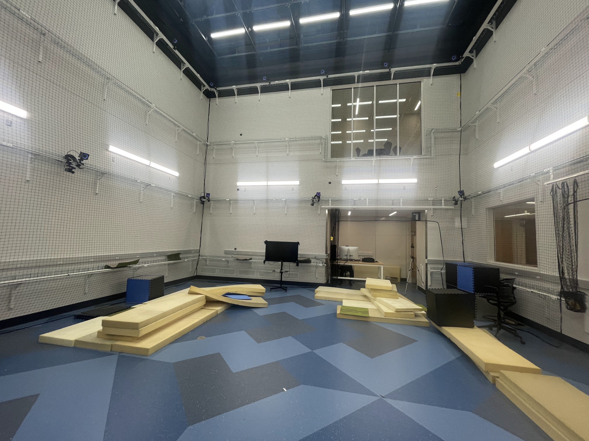
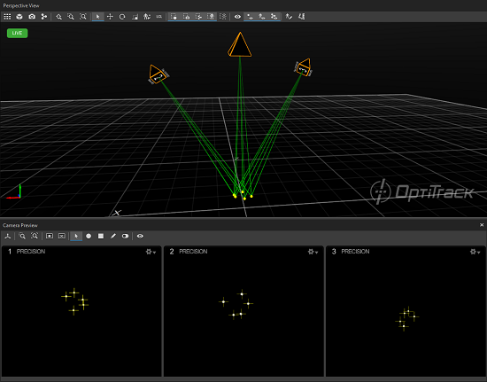
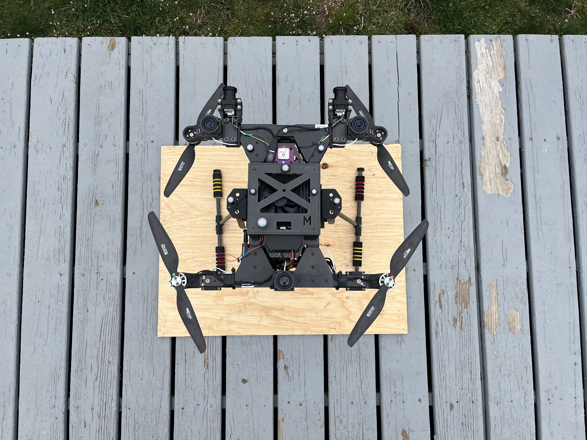

---
# Jekyll 'Front Matter' goes here. Most are set by default, and should NOT be
# overwritten except in special circumstances. 
# You should set the date the article was last updated like this:
date: 2024-05-01 # YYYY-MM-DD
# This will be displayed at the bottom of the article
# You should set the article's title:
title: External Position Estimation using OptiTrack Motion Capture System
# The 'title' is automatically displayed at the top of the page
# and used in other parts of the site.
---
## Overview
This guide will give a overview of the steps required to set-up a external Pose estimation pipeline for your robot using [OptiTrack]() Motion Capture system.



This tutorial assumes that you already have a well calibrated motion capture setup/rig. If not please refer to the information available [here](https://docs.optitrack.com/quick-start-guides/quick-start-guide-getting-started#hardware-setup). Please refer the sections [*Hardware Setup*](https://docs.optitrack.com/quick-start-guides/quick-start-guide-getting-started#hardware-setup) to [*System Calibration*](https://docs.optitrack.com/quick-start-guides/quick-start-guide-getting-started#system-calibration).

Please continue with the further sections of this guide once this one-time setup is complete.

## Working Principle 


The OptiTrack Motion Capture system utilizes optical tracking technology where multiple cameras around a designated area capture the movement of reflective markers attached to a subject. These markers reflect infrared light emitted by the cameras back towards them, allowing the cameras to detect and record their precise locations. 

Through camera calibration, the exact positions and orientations of each camera are known, enabling software to triangulate and reconstruct the 3D positions of the markers by comparing their 2D positions as captured from different angles. 

This 3D data is then analyzed to understand and replicate the subject's movement, translating physical motions into digital data that can be used for various applications.

## Key Elements
**OptiTrack Server PC:** The OptiTrack system is paired with a dedicated PC running the necessary software for processing the incoming camera data and streaming the poses. We will refer to this PC as the **Server** in the subsequent sections.

**Motive GUI Software:** This will be our primary means of interfacing with the motion capture system. This is the main piece of software running on the server PC which enables to configure the setup, add/remove new bodies as well stream the poses over network.

## Capturing Your Robot


### Adding IR Markers
To use the OPtiTrack system to capture the Pose of your Robot, we first need to the optitrack system to ***see*** your robot.

This is done by first adding IR-reflective OptiTrack markers to your robot body. Please find more detailed explanation about the best-practices to be followed while adding the markers [here](https://docs.optitrack.com/motive/markers#marker-placement). (TLDR: No Occlusions, No Symmetry, Large enough markers) 

Please see the image below for reference of a example marker placement for a MAV platform:



### Registering Rigid Body with Motive
Once we have the markers secured to the robot, we will configure the Motive software to actually record our robot as a unique standalone rigid body in space.

Please refer to the sections [Creating a Rigid Body](https://docs.optitrack.com/motive/rigid-body-tracking#creating-a-rigid-body) to [Tracking a Rigid Body](https://docs.optitrack.com/motive/rigid-body-tracking#tracking-a-rigid-body) for detailed setps on the process.

After completing the steps above, we should now be able to select our robot from the list of all registered models and be able to see the system the track the robot in the GUI as well as inspect the real-time pose being estimated.

### Pose Streaming over Network
Now that we have succesfully recorded the robot with the MoCap system, now we need to relay this information over network so that we can consume this inside our Robotics applications for motion control, analysis etc.

There are several [workflows](https://docs.optitrack.com/motive/data-streaming) for this, but for ROS-centric workflows, we shall stick with the ***[NaturalNetwork](https://docs.optitrack.com/motive/data-streaming#natnet-streaming)*** streaming pipeline

Please refer to this [section](https://docs.optitrack.com/motive/data-streaming#natnet-streaming) for details on the configurations required.

Once this setup is done, we should have the poses of all active bodies being streamed over the network.

### NatNet ROS Interface

To intercept the ***NaturalNetwork*** pose packets over network we need two pre-requisites:

- Our client PC should be on the same LAN as the Server PC running the Motive GUI.
- We need a appropriate client built on top of the ***NaturalNetwork SDK***.

For ROS-centric applicaitons we will be using the [`natnet_ros_cpp`](https://github.com/L2S-lab/natnet_ros_cpp) catkin package developed by [L2S Lab](https://l2s.centralesupelec.fr/).

#### Clone and build the package
``` bash
# navigate to your catkin_ws src directory
cd <path-to-catkin-ws>/src
# clone and checkout to the stable tag
git clone https://github.com/L2S-lab/natnet_ros_cpp.git
cd natnet_ros_cpp
git checkout 5242cb0
# build the package
cd ../../
catkin build natnet_ros_cpp #if using catkin_tools
#else use catkin_make
catkin_make
# source your workspace
source devel/setup.bash #or setup.zsh if using ZSH instead
```

### Modify launch params

Please find the directions for configuration of the launch file as per your prior NatNet configuration on the Motive-side [here](https://github.com/L2S-lab/natnet_ros_cpp/tree/v1.1.1#natnet-4-ros-driver).

Important thing here is to keep track of the corrdinate system defined during the pose streaming set-up in Motive and making sure that adheres to the requirements defined for the package above (relevant details are presented in the link above).

### Running the package
``` bash
# launch the natnet_ros node
roslaunch natnet_ros_cpp natnet_ros.launch 
```

If your body is active in Motive (and within the operating area), now you should be able to see a topic with the estimated pose as a `geomerty_msgs/PoseStamped` topic named `/natnet_ros/<body-name-provided-in-motive>/pose`.

**NOTE: Please note that pose being streamed here is defined with respect to the OptiTrack coordinate axes defined during the calibration process. Please be mindful of the position of this origin before sending any motion commands to the robot to prevent damage to equipment/life.**

## Summary
This guide walks you through the complete setup and use of the OptiTrack Motion Capture system for external pose estimation of a robot. Starting with a calibrated motion capture setup, the guide details the process of affixing IR reflective markers on the robot, ensuring their optimal placement for accurate tracking. It further describes how to configure the Motive software to recognize the robot as a unique entity within the system. Essential processes covered include the streaming of the robot's pose over the network using the NaturalNetwork pipeline, and how to integrate this data into ROS-centric applications using the `natnet_ros_cpp` package. By following these instructions, you can effectively utilize the OptiTrack system for precise motion tracking and pose estimation to enhance robotics applications in environments where GPS is not viable.

## See Also:
- Other means of GPS-denied external pose estimation methods available [here](https://roboticsknowledgebase.com/wiki/state-estimation/gps-lacking-state-estimation-sensors.md).

## Further Reading
- Please refer to the official OptiTrack [documentation](https://docs.optitrack.com/) for additional information.

