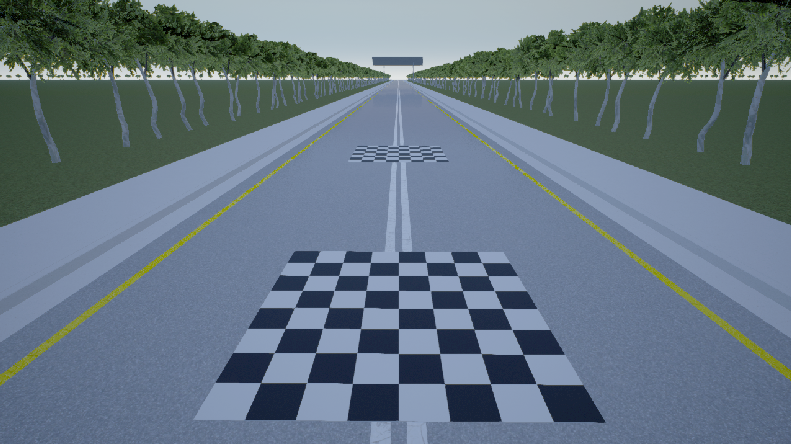
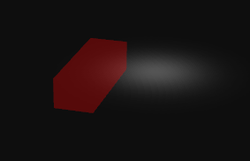
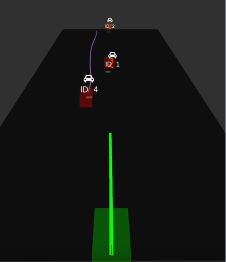
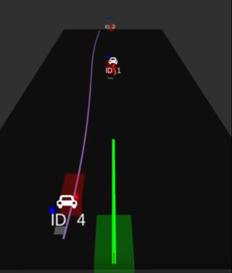

Fusing data from multiple sensor is an integral part of the perception system of robots and especially Autonomous Vehicles. The fusion becomes specially useful when the data coming from the different sensors gives complementary information. In this tutorial we give an introduction to Radar-Camera sensor fusion for tracking oncoming vehicles. A camera is helpful in detection of vehicles in the short range, however recovering the 3D velocity of the vehicles solely based on vision is very challenging and inaccurate, especially for long-range detection. This is where the RADAR comes into play. RADAR is excellent for determining the speed of oncoming vehicles and operation in adverse weather and lighting conditions, whereas the camera provides rich visual features required for object classification. 

The position and velocity estimates are improved through the fusion of RADAR and camera data. We will first go through the details regarding the data obtained and the processing required for the individual sensors and then go through sensor fusion and tracking algorithm details. 

## Camera
This section will explain how you use the information from a camera to estimate the rough position of a object in the world. The method described below makes an assumption that ego vehicle or a robot with the camera mounted and the other objects that we would like to track are all on the same plane in the world.

### Object Detection
The first step is to detect 2D bounding boxes of the object you want to track. State-of-the-art techniques for object detection that run in real-time are deep learning based single shot detector models such as SSD or YOLOv3. You can read more about single shot detectors [here](https://leonardoaraujosantos.gitbooks.io/artificial-inteligence/content/single-shot-detectors.html). This tutorial uses the YOLOv3 model for object detection. [This](https://github.com/AlexeyAB/darknet) fork of the original implementation is recommended as it has additional optimizations for real-time inference. 

Clone the repository and build the framework on your system.

```
git clone https://github.com/AlexeyAB/darknet
cd darknet
make
```

Refer to `README` in the repository for more instructions on how to build Darknet for different platforms. Make sure you select the correct GPU architecture in the `Makefile`. Additionally, you can set build flags such as `CUDNN_HALF=1` to accelerate training and inference.

The repository also provides a Python API (`darknet_video.py`) to load the YOLOv3 model for inference using an OpenCV image  as the input and return a list of bounding box detections. The detections contain the following data.

```
[class_label confidence x y h w]
```

You could also use any other technique for object detection and get a similar list of detections.

### Object Tracking in Images 
Although the goal of camera based perception is to only estimate a position of the object, you can also track the bounding boxes in the image as well to better associate the detection later in sensor fusion and the main tracker. This step is optional and can be skipped.

A popular approach or technique for real-time tracking is [SORT](https://arxiv.org/abs/1602.00763) (Simple Online and Real-Time Tracking). It follows a tracking-by-detection framework for the problem of multiple object tracking (MOT) where objects are detected in each frame and represented as bounding boxes. SORT makes use of Kalman filter to predict the state of the bounding box in the next frame. This helps keep track of the vehicles even if the bounding box detections are missed over few frames.

The official implementation [here](https://github.com/abewley/sort) is recommended. Follow the instructions in the `README` of this repository to setup SORT. Below is the gist of how to instantiate and update SORT.

```
from sort import *

#create instance of SORT
mot_tracker = Sort() 

# get detections
...

# update SORT
track_bbs_ids = mot_tracker.update(detections)

# track_bbs_ids is a np array where each row contains a valid bounding box and track_id (last column)
...
```


### Inverse Perspective Mapping
Inverse Perspective Mapping is basically a perspective transformation or a homography between two planes in the world. The idea here is to project the camera view (image plane) on to the ground plane in the world to obtain a birds-eye-view of the scene. One way to do this is to directly pick a set of points (minimum 4) in the image corresponding to a rectangular region on the ground plane and then estimate the homography matrix.

In order to estimate the homography, you need a set of correspondences. You need a reference object lying flat on the world ground plane (any rectangular shaped board would do). Measure the location of the corner points of the board in the world frame and log the projection of these point on the image plane as well. You can use OpenCV's `cv2.getPerspectiveTransform` to feed in the corresponding points and obtain the homography.

Once the homography is known, pick the bottom center of all the bounding boxes, as this point most closely represents the point on the ground plane, and apply the homography to this image point to obtain an estimate of location in the world frame.



There are many pitfalls and assumptions in this technique. As mentioned earlier, the objects to detect must lie on the same ground plane and the relative distance of the camera sensor and orientation with respect to the ground plane must remain constant. If the bounding box detection is inaccurate, a small deviation in the image point might lead to a significant error in the estimated position in the world frame.

You can also model the uncertainty in the position estimate to generate an occupancy grid with the mean and covariance of the position of the object. We will later see how to fuse these estimates with another sensor modality such as a Radar to refine our estimate and track these detections as well.



#### Camera Output
Camera returns two states for every detections. According to our current camera configuration, state (Ego vehicle frame) of the detections are given as: 
- Position in x direction 
- Position in y direction 
To make things clear, we consider these x and y directions in birds eye view of the ego vehicle frame, where x represents how far the detection is in longitudinal direction and y represents the offset of the detection in lateral direction. 

## Radar
Radar is becoming an important automotive technology. Automotive radar systems are the primary sensor used in adaptive cruise control and are a critical sensor system in autonomous driving assistance systems (ADAS). In this tutorial it is assumed that the radar internally filters the raw sensor data and gives the final positions and velocities of the vehicles within the field of view. This is a reasonable assumption since most of the automotive grade radars already do such filtering and tracking and return the tracked vehicle estimate in the Cartesian coordinates.

#### Radar Output
Radar provides four states for every detections, moreover depending on the use case there could be multiple detections. According to our current Radar configuration, state (Ego vehicle frame) of the detections are given as: 
- Position in x direction 
- Position in y direction 
- Velocity in x direction 
- Velocity in y direction

Following is the result of camera detection and estimated position in the 3D world. The detection was performed on image stream from Carla simulator and the results are visualized in Rviz. The blue cubes represent estimates from camera and red cubes are the Radar detections.


## Tracker Framework
The framework has the following major components:
- Data Association - Sensor Measurements
- Sensor Fusion - Kalman Filter
- Track Updates
- Motion Compensation of Tracks
- Track Association
- Tracker Evaluation and Metrics

### Data Association - Sensor Measurements
Tracker gets an array of detections from camera and Radar for every frame. First of all the data needs to be linked to the corresponding detections in both (all) the sensors. This is  done by computing a distance cost volume for each detection from one sensor with each detection from another sensor. Scipy library provides good resources for computing such functions in Python. Then you need to use a minimization optimization function to associate detections such that overall cost (Euclidean distance) summed up over the entire detections is minimized. For doing that, Hungarian data association rule is used. It matches the minimum weight in a bipartite graph. Scipy library provides good functionality for this as well. 

### Tracker - Kalman Filter
Kalman Filter is an optimal filtering and estimation technique which uses a series of measurements (with noise) over time to estimate the unknown variables which tend to be more accurate than the individual estimates. It is widely used concept in a variety of fields ranging from state estimation to optimal controls and motion planning. The algorithm works as a two step process which are as follows:
- Prediction Step
- Measurement Step

In our case we use Kalman Filter to estimate states of the vehicles in the environment using data from Radar and Camera. The states consist of the position and velocity of the vehicle, which are provided by the tracker in the form of measurement.

#### Prediction Step
Prediction step is the step where we will estimate the state of the vehicle in the next timestep using data we have currently and a motion model. We chose to use a constant velocity (CV) motion model for prediction. This model considers the vehicle as a point object which can move at a constant velocity in the x and y direction. This is not the best model to represent the dynamics of a vehicle but since we dont have information about the steering or throttle data of the vehicle, we will have to be satisfied with this. When we predict the future state, we also need to estimate the noise that might have propped up in the system due to a variety of reasons. This noise is called the process noise and we assume that it is dependant on the motion model and the timestep. This [link](https://github.com/balzer82/Kalman/blob/master/Kalman-Filter-CV.ipynb?create=1) gives a good idea about the CV motion model and the process noise associated with it.

The pseudo-code for the prediction step is
```
def predict():
    predicted_state = transition_matrix * old_state
    predicted_covariance = transition_matrix' * old_covariance * transition_matrix + process_noise

```

#### Measurement Step
Our measurement step is actually divided into two parts, one for the camera measurement and the other for the radar measurement. While updating the states of the filter we need to be sure that the timestep of the measurement and the predictions match. The update step is much more complicated and 

The pseudo-code for the prediction step is
```
def update():
    residual = sensor_measurement - measurement_function * predicted_state
    projected_covariance = measurement_function * predicted_covariance * measurement_function + sensor_noise
    kalman_gain = measurement_function' * projected_covariance * 
    new_state = predicted_state + kalman_gain * residual
    new_covariance = (identity - kalman_gain * measurement_function) * projected_covariance

```
 
### Track Updates
This is the most important step in the framework. Here you need to specify the time steps length for which the tracklets will be continued to be predicted (continue predicting the state of the track) even though the vehicle was not detected in a continuous set of frames. Another tuning parameter is how long you want to continuously detect the object through sensors to confirm that the object is a valid track.

Here you need to define the misses (age of non-matched detections) for each measurement. The point of this parameter is that you will increment this age if that corresponding state (to that track) is not observed through sensors. Once any of the state from detections from sensors is able to associate with the prediction produced by the tracks then we again set back that track parameter to 0.

### Motion Compensation of Tracks
This block basically transforms all the track predictions at a timestep by the ego vehicle motion. This is an important block because the prediction (based on a vehicle motion model) is computed in the ego vehicle frame at the previous timestep. If the ego vehicle was static, the new sensor measurements could easily be associated with the predictions, but this would fail if the ego vehicle moved from its previous position. This is the reason why we need to compensate all the predictions by ego motion first, before moving on to data association with the new measurements. The equations for ego motion compensation are shown below.

\\[\left[ \begin{array} { c } { X _ { t + 1 } } \\\ { Y _ { t + 1 } } \\\ { 1 } \end{array} \right] = \left[ \begin{array} { c c c } { \cos ( \omega d t ) } & { \sin ( \omega d t ) } & { - v _ { x } d t } \\\ { - \sin ( \omega d t ) } & { \cos ( \omega d t ) } & { - v _ { y } d t } \\\ { 0 } & { 0 } & { 1 } \end{array} \right] \left[ \begin{array} { c } { X _ { t } } \\\ { Y _ { t } } \\\ { 1 } \end{array} \right]\\]
 
### Track Association
Once you have the motion compensated tracks, you need to follow the same algorithm to associate new tracks with existing tracks. To give some intuition, here you are matching the predicted state in the last time for every track with the measurements of the current timestep. 


#### Final Results of Tracking and Sensor Fusion
 


### Tracker Evaluation and Metrics
The most widely used metrics for validation are MOTA (Multi-object tracking accuracy) and MOTP (Multi-object tracking precision). MOTP is the total error in estimated position for matched object-hypothesis pairs over all frames, averaged by the total number of matches made. It shows the ability of the tracker to estimate precise object positions, independent of its skill at recognizing object configurations, keeping consistent trajectories, and so forth. The MOTA accounts for all object configuration errors made by the tracker, false positives, misses, mismatches, over all frames.

To evaluate your tracker, you can use the [`motmetrics`](https://github.com/cheind/py-motmetrics) Python library.

```
pip install motmetrics
```

At every frame instance, you need the ground truth position and track ID along with the predicted detection and track ID. Use the accumulator to record all the events and you can generate a summary and list the metrics and the end of the sequence. Refer to the README [here](https://github.com/cheind/py-motmetrics) for details on how to use this library. Following is an example of the results summary generated.

```
      IDF1   IDP   IDR  Rcll  Prcn GT MT PT ML FP FN IDs  FM  MOTA  MOTP
seq1 83.3% 83.3% 83.3% 83.3% 83.3%  2  1  1  0  1  1   1   1 50.0% 0.340
seq2 75.0% 75.0% 75.0% 75.0% 75.0%  2  1  1  0  1  1   0   0 50.0% 0.167

```

## See Also:
- [Delphi ESR Radar](https://github.com/deltaautonomy/roboticsknowledgebase.github.io/blob/master/wiki/sensing/delphi-esr-radar.md)

## Further Reading
- [Single Shot Object Detectors](https://leonardoaraujosantos.gitbooks.io/artificial-inteligence/content/single-shot-detectors.html)
- [YOLOv3 Implementation](https://github.com/pjreddie/darknet)
- [SORT Tracker Repository](https://github.com/abewley/sort)
- [Kalman Filter in Python](https://github.com/balzer82/Kalman)
