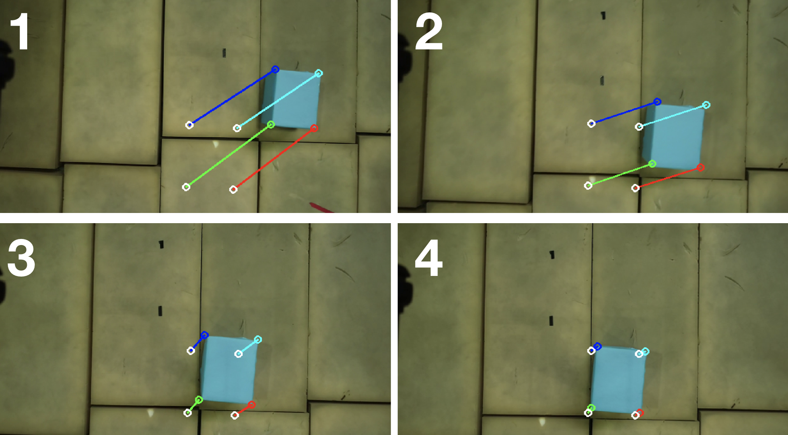

## Visual Servoing Motivation

Visual servoing is a technique which uses feedback from a vision sensor to control the motion of a robot. This idea was primarily used to control the motion of robot arms and is useful when it's difficult to find an analytical solution to the inverse kinematic problem. We have seen visual servoing being applied to mobile robots in applications with poor state estimation.
This page highlights the use of visual servoing to control the motion of a drone. Our application was to control a drone such that it aligns perfectly over a block. This is a hard problem even if the exact coordinates of the block is known since the primary state estimation method is obtained by fusing IMU and GPS data. Hence this would allow us to be around a 2m radius from the known position and we will execute visual servoing in order to refine the position. Our tests resulted in achieving a final position accuracy of around 20cm with this strategy.
The following sections describe the visual servoing forumulation and we present our implementation and results using a DJI M210 drone.

## Visual Servoing Variants

There are two main visual servoing strategies and they differ based on the formulation of the state vector:

1. Pose Based Visual Servoing (PBVS): In this method, the pose of an object in the image is estimated and the 3D pose of the robot relative to the camera is computed. This pose can directly provide a state estimate to the robot and the motion can be computed to minimize the error between the desired and current pose using direct feedback control.
2. Image Based Visual Servoing (IBVS): In this method, feature points in the image are computed and the error between the desired and current image coordinates is mapped to task space velocities that would be minimized using a velocity controller. This method is more robust to errors in measurements since it doesn't require estimating a 3D pose from the image. We can directly control the robot from information that could be accurately computed in the image.

Our implementation uses as IBVS approach since our position state estimate is noisy. We will be able to control the robot by directly tracking desired instantaneous velocities instead of a goal position. The DJI M210 drone allows us to control the robot by sending velocity commands and this makes the IBVS method ideal for our application.

## Visual Servoing Formulation
The aim of visual servoing is to minimize the error \\[ e(t) \\]
where \\[ \begin{equation} \mathbf{e}(t)=\mathbf{s}(\mathbf{m}(t), \mathbf{a})-\mathbf{s}^{*} \end{equation} \\]

The vector \\( m(t) \\) is a set of image measurements (e.g., the image coordinates of interest points or the image coordinates of the centroid of an object). The vector \\( s^* \\)  contains the desired values of the features.
For a 3D point with coordinates \\( \mathbf{X} = (X,Y,Z) \\)  in the camera frame, which projects in the image as a 2D point with coordinates \\( \mathbf{x} = (x,y) \\)  we have
\\[ x = X/Z = (u - u_0)/p_x \\]
\\[ y = Y/Z = (v - v_0)/p_y \\]
where \\( \mathbf{m}=(u,v) \\) gives the coordinates of the image point expressed in pixel units, and \\( \mathbf{a}=(u_0,v_0, p_x,p_y) \\) is the set of camera intrinsic parameters: \\( u_0 \\) and \\( v_0 \\) are the coordinates of the principal point, while \\( p_x \\) and \\( p_y \\) are the ratio between the focal length and the size of a pixel.
Let the spatial velocity of the camera be denoted by \\( v_c = (v_c , \omega_c ) \\), with \\( v_c \\) the instantaneous linear velocity of the origin of the camera frame and \\( \omega_c \\) the instantaneous angular velocity of the camera frame.
The relationship between \\( \mathbf{\dot{e}} \\) and \\( v_c \\) is given by: \\[ \begin{equation} \mathbf{\dot{e}}=\mathbf{L_x v_c} \end{equation} \\]

where \\( L_e \in R_{k \times 6} \\) is the interaction matrix and is given by :-
\\[ \begin{equation} \begin{bmatrix} -1/Z & 0 & x/Z & xy & -(1+x^2) & y\\\0 & -1/Z & y/Z & 1+y^2 & -xy & -x \end{bmatrix} \end{equation} \\]
Considering \\( \mathbf{v_c} \\) as the input to the robot controller, and if we would like for instance to try to ensure an exponential decoupled decrease of the error, we obtain:-
\\[ \mathbf{v_c} = -\lambda \mathbf{l_x^+ e} \\]
In the matrix \\( L_x \\) , the value \\( Z \\) is the depth of the point relative to the camera frame.

For our application for using the quadcopter to servo over a block, the interaction matrix would be of the form \\( L_e \in R_{k \times 4} \\) as its movement is constrained in \\( x,y,z,\psi \\).

## Visual Servoing Application
We used the formulation described above in order to build an application where the drone uses 4 corners of a block as feature points in the image in order to align over the block. The desired coordinates of the feature points were used as input and the servoing system computed the required velocities in order to move towards the desired configuration. We made sure to clip the output velocities to a value of 0.4m/s for safety and we were able to successfully servo over the block. We also needed to make sure that we are servoing at an appropriate height in order to ensure the block stays in the field of view.

|  |
|:--:|
| *Visual Servoing in action from the onboard camera* |

## Further Reading
- [VISP: Visual Servoing Platform](https://visp.inria.fr/)
- [Visual Servo control, Part 1: Basic Approaches](https://hal.inria.fr/inria-00350283/document)
- [Image Moments: A General and Useful Set of Features for Visual Servoing](https://hal.inria.fr/inria-00352019/document)
