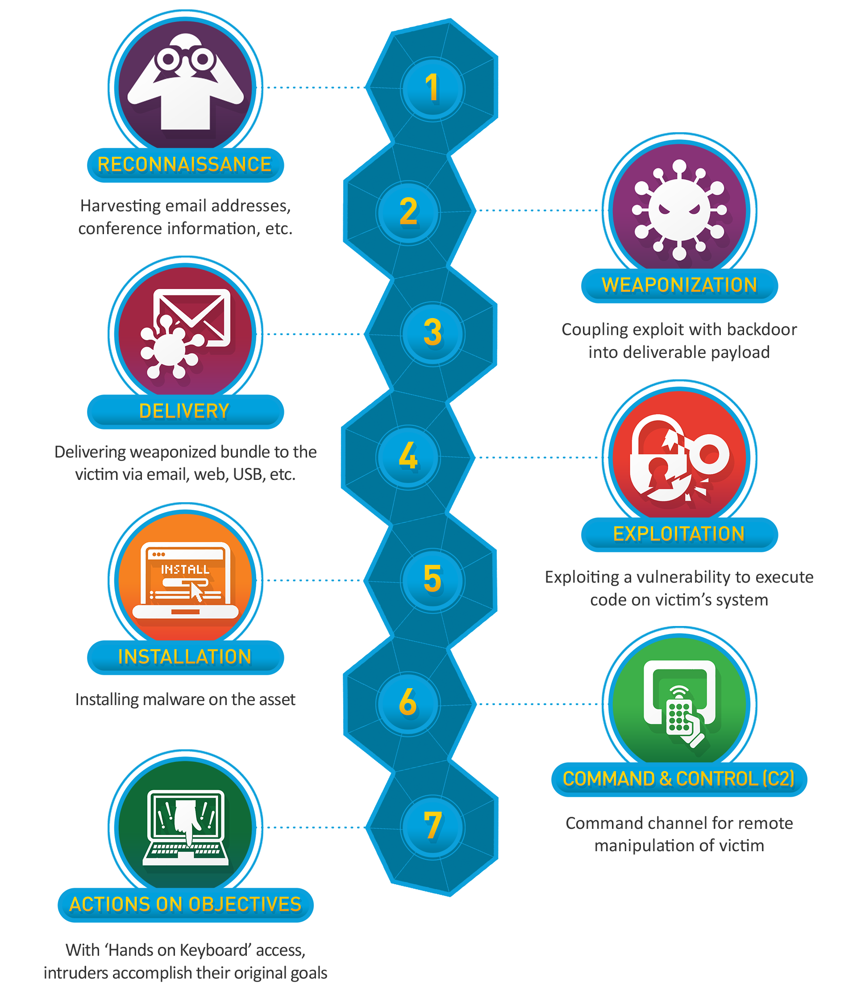
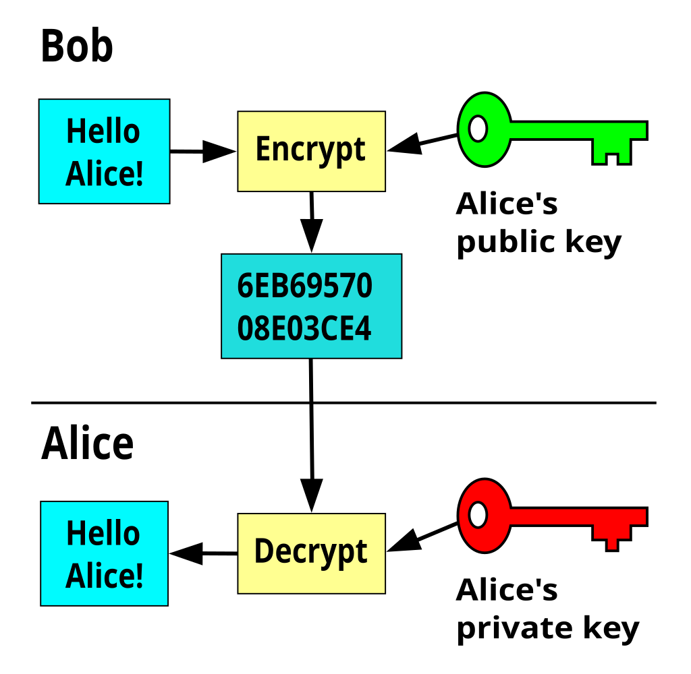
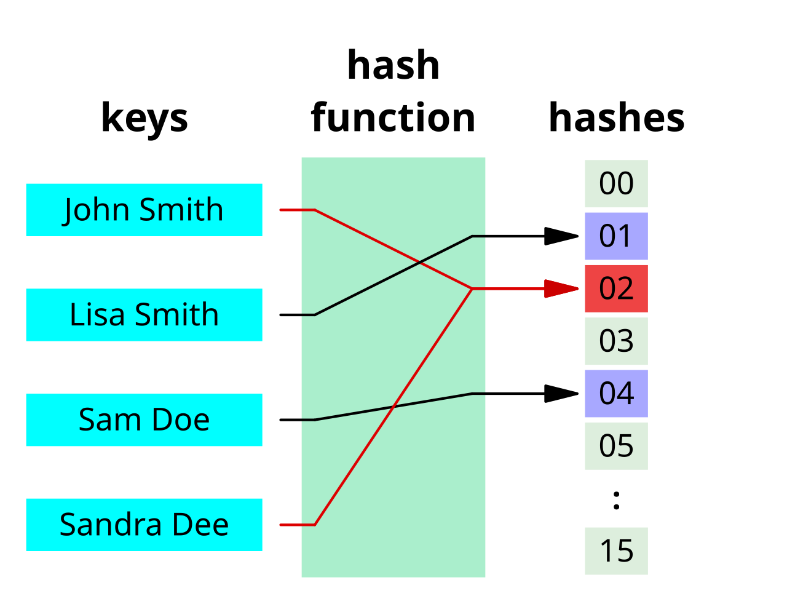
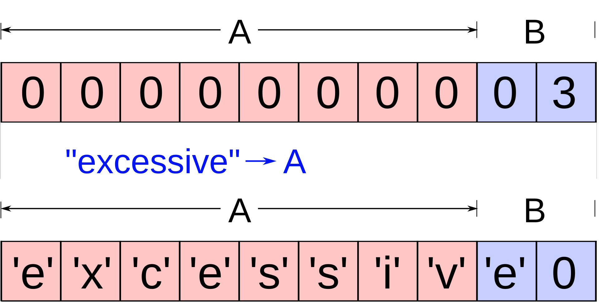

---
# Jekyll 'Front Matter' goes here. Most are set by default, and should NOT be
# overwritten except in special circumstances. 
# You should set the date the article was last updated like this:
date: 2024-03-12 # YYYY-MM-DD
# This will be displayed at the bottom of the article
# You should set the article's title:
title: Introduction to Cybersecurity in Embedded Devices and Robotics
# The 'title' is automatically displayed at the top of the page
# and used in other parts of the site.
---
[TOC]

## Introduction

With each passing day, robots become a more common part of our day-to-day lives. However, when studying robotics, very little time is devoted to making these systems secure. Roboticists are used to thinking about reliability or meeting performance requirements, but wondering how your system might be attacked is usually an afterthought. 

Sure, many systems don't have to worry about that. No one is going to attack a robotic arm used for research in some basement somewhere. But if you're working on developing drones for the US military, you might do well to check if your system is secure. If you don't secure your system and it gets attacked, very bad things can happen:

- [Your robot can insult you](https://www.malwarebytes.com/blog/news/2024/10/robot-vacuum-cleaners-hacked-to-spy-on-insult-owners)
- [Your car's lidar can go crazy](https://www.autoweek.com/news/a60043383/autonomous-vehicles-hacking-spoofing/)
- [Your industrial processes can be disrupted](https://www.themanufacturer.com/articles/industrial-robots-are-vulnerable-to-advanced-hackers-report-reveals/)

And the list goes on...

Some countries are starting to take these threats to marketed devices more seriously. The European Union has adopted laws regarding cybersecurity for IoT, such as the [CSA-2019 ](https://eur-lex.europa.eu/legal-content/EN/TXT/PDF/?uri=CELEX:32019R0881)and the [CRA-2024](https://www.european-cyber-resilience-act.com/). In the United States, most of the regulatory framework has been in the form of executive actions, such as [Executive Order 14028](https://www.nist.gov/itl/executive-order-14028-improving-nations-cybersecurity). Roboticists will need to incorporate these (and future laws) into their designs.

This article aims to give students in robotics at least a superficial sense of the field of cybersecurity. Of course, this will not make anyone an expert, but it is a starting place. Students are encouraged to dig into these topics on their own as well so that their future designs can incorporate the best principles of robot security in order to deliver resilient products. The bulk of this article has [1] as a source, which is a fundamental book that any roboticist should read.

## General Principles of Cybersecurity

### Starting Point

The term *security* is usually defined somewhat vaguely for people with no experience in the field. This leads to some fuzzy notions about what should be done to make the system *secure*. 

The first step is actually to think about what **assets** you're trying to protect. The reality is that not everything in your system needs to be protected (usually). Say, for example, that a hacker can make your robot turn on an LED. That is probably not the end of the world. But if they can, for example, alter the robot's firmware with their own, then you have a much more serious problem. 

The list of assets you wish to protect in your system is the starting point of any cybersecurity discussion. Once you have identified these assets, then you need to think about what exactly needs to be secured. This is where the "**CIA triad**" framework becomes important.

This classical security framework tries to identify the following protection goals for each asset:

- C - Confidentiality. This is usually what people think about when discussing cybersecurity. In reality, this is only one possible goal, concerned with keeping things "secret". One example could be the robot's software itself, which you might want to keep as a trade secret; or maybe cryptographic kept inside your device. All these things should be kept hidden and unrecoverable from attackers.
- I - Integrity. This means an asset should not be altered, either accidentally or maliciously. The first case can be covered with redundancy checks. This is very common in satellites, for example. The second case needs some additional protection, meaning some way of making sure no one has tempered with the asset.
- A - Availability. Some assets, especially in real-time systems, need to be available. If someone hits your robot with a [denial of service attack](https://en.wikipedia.org/wiki/Denial-of-service_attack) while it is performing something critical, results can be severe.

No one goal is more important than another. In reality, all these have to work together to secure your assets. It is also important, that there can be **levels of access**. For example, a service available to one user might not be available to another and so on. 

This framework has been expanded to include some additional goals such as:

- Au - Authenticity. you should verify the origin of a given asset. Say for example you get data (the asset) from a lidar.  Even if the data has not been tampered with, can you prove it came from the lidar it said it came from? In [zero-trust platforms](https://nvlpubs.nist.gov/nistpubs/specialpublications/NIST.SP.800-207.pdf), this is a crucial step.
- Pr - Privacy. This is closely tied with the new cybersecurity laws from recent years. If your device works with personal assets (e.g. medical data), it should not be possible for an attacker to identify the person in question. 

You can (and should) incorporate these goals into your device design as requirements once they have been established. An example could be:

| **Requirement** |                  Description                   | Goal  |
| :-------------: | :--------------------------------------------: | :---: |
|       R1        |    System shall only manufacturer firmware     | I, Au |
|       R2        | System shall not store passwords in plain text |   C   |
|       ...       |                      ...                       |  ...  |


### Types of Attackers

Once you have identified assets and goals, the level of security you implement depends on what threat you're facing. Hobbyists tinkering with your system is one thing; foreign intelligence is another. We can estimate attackers from weakest to strongest, based on resources and motivation:

|   Attacker    |                         Description                          | Skill and Resources |
| :-----------: | :----------------------------------------------------------: | :-----------------: |
|   Hobbyists   | These are people that will basically try to exploit your robot for "funsies", while not usually seeking any higher-level objective. |          1          |
|  Researchers  | Will try to break into the robot as a research exercise. Usually affiliated with Universities. You should pay attention to these guys because they usually publish their findings. |          2          |
| Professionals | These attackers have a financial incentive to exploit your device. They could be cyber criminals, security companies or even competitors that want to "lift the hood" of your product. |         2-4         |
| State Actors  | These groups are sanctioned by states to carry out cyber warfare activities as part of strategic goals. These actors will go to great lengths to achieve their goals (read [Stuxnet](https://en.wikipedia.org/wiki/Stuxnet), [EternalBlue](https://en.wikipedia.org/wiki/EternalBlue), and [Flame](https://en.wikipedia.org/wiki/Flame_(malware))). Such groups constitute the bulk of what are called Advanced Persistent Threats (APTs). MITRE keeps a [database of these entities](https://attack.mitre.org/groups/). |          5          |

If you're interested in learning how systematic attackers approach their targets, Lockheed Martin has developed a very interesting concept called "The Cyber Kill Chain":



Once you have identified which actors (and methods/attacks) you want to guard against, you can start thinking about the level of security in your system. Do you need to encrypt all data? Do users need to go through special training? Do you only need a login password and call it a day?

There is no right answer to the questions above. It will all depend on your project management risk/reward assessment.    

## Cryptography Toolbox

The main help you can get when designing a robotic system, at least from a design tool, is from the field of cryptography. Over many years, mathematicians have developed tools to ensure data safety and integrity. Knowing how to operate on all these cryptographic blocks is not the end of all possible security troubles, but it is a good start.

### Kerckhoffs' principle

The first thing to know is that you should never try to gain security by obscurity.  "Oh, I made a program that is secure because no one understands it" is not a good approach. This is not that common to hear, I admit, but one very common conception people have is "if I only give customers the machine code, no one will ever figure out how my product works" (these people should read [this](https://www.copperpodip.com/post/reverse-engineering-source-code). Although source code is copyrighted, reverse engineering is not the hardest task in the world). 

In the field of cryptography, this broader notion is encapsulated under Kerckhoffs' principle: "a system should still be secure even if everything about the system, except the key, is known". The common crypto-systems out there follow this principle: their whole operation is known and standardized. Consult these standards and don't try to create your own solutions to the problems of security. 

### Tools and Standards

#### Encryption

The most common building block of cryptography is encryption. The broad idea behind encryption is you take a message (the plain text), run it through an algorithm with the message and a key as inputs. The algorithm spits cipher text, which the intended receiver can then decrypt by running through an algorithm with their key. The figures below illustrate this process for symmetric and asymmetric encryption.




In symmetric encryption, both the sender and the receiver use the same key. This method usually offers more safety and is easier to implement. Of course, you have to figure out a way to get both parties to use the key beforehand (you can try [DHKE](https://en.wikipedia.org/wiki/Diffie%E2%80%93Hellman_key_exchange), but be aware this method doesn't safeguard against man-in-the-middle attacks). For manufactured devices, you might want to burn the keys into one-time-programmable memory, but be careful to check if your encryption method allows the reuse of keys.

The old standard for symmetric encryption in the US was the Data Encryption Standard (DES). Many legacy systems still use this. There was an attempt at retro-compatibility with Triple DES, but the reality is that DES is just obsolete. Indeed, DES's key is only 56 bits long, which can be [cracked in a day](https://en.wikipedia.org/wiki/EFF_DES_cracker) by modern computers. The current standard is the [Advanced Encryption Standard (AES)](https://en.wikipedia.org/wiki/Advanced_Encryption_Standard). This is what you should use in 99% of the cases where you're trying to implement symmetric encryption (consider Salsa20 and its kids for the other 1%). NIST has documented the AES in [FIPS 197](https://csrc.nist.gov/pubs/fips/197/final).

Asymmetric encryption does away with the problem of key sharing by working with different keys. The receiver creates a private-public key pair. The public key is, of course, public, meaning it is not kept hidden. Only the private key is kept hidden. Anyone wishing to address the receiver encrypts their message using the public key. The message can then only be decrypted by the receiver.

While asymmetric ciphers are great in theory, they are usually harder to implement correctly. There are a lot of possible pitfalls that even experienced developers fall prey to. Estonia notoriously messed up when [implementing asymmetric cryptography in their ID cards](https://www.usenix.org/conference/usenixsecurity20/presentation/parsovs). Their security guarantees are also less robust than symmetric ciphers, as asymmetric system are only as hard to break as the mathematical problem underlying it. 

If you wish to implement asymmetric encryption, there are two common choices. The first is [RSA](https://en.wikipedia.org/wiki/RSA_(cryptosystem)), which is based on the problem of semi-prime factorization. The other is Elliptic-Curve Cryptography (ECC), based on finding discrete logarithms in elliptic curves. Although there is no clear-cut winner between the two, the industry has been moving to ECC. The table below summarizes some key differences:

|                                                          | RSA                                                          | ECC                                                          |
| -------------------------------------------------------- | ------------------------------------------------------------ | ------------------------------------------------------------ |
| Standard                                                 | RSA-OAEP in [NIST 800-56B](https://csrc.nist.gov/pubs/sp/800/56/b/r2/final) | ECC in [NIST 800-56A](https://csrc.nist.gov/pubs/sp/800/56/a/r3/final). <br />Note: this standard is VERY controversial in its choice of curves |
| Complexity of implementation                             | Less complex, but prone to implementation pitfalls           | More complex. Also involves choosing a curve                 |
| Speed<br />Note: most MCUs include hardware acceleration | Generally faster                                             | Generally slower                                             |
| Security (for same size key)                             | Less secure                                                  | More secure                                                  |

#### Hashing

Encryption is a two-way street, meaning you can encrypt and decrypt messages. Hashing is a one-way street: because it maps arbitrary strings to a fixed size, the information loss means you can't recover the original string. 

 

"One-wayness" is more a requirement of a good hash function than a given. In fact, good hash functions should be:

- Non-invertible 
- Non-collideable, meaning it should be hard to find two strings that give the same hash
- Avalanched, meaning a single bit change in the input should result in a very different hash
- Etc.

Hashes are a great form to store passwords, for example. Even if the passwords leak, an attacker can't use them because the leak is in the hashed format. In many places you're actually required to do that: Meta is facing a huge fine for [storing user passwords without hashing](https://www.cnet.com/tech/services-and-software/meta-fined-102m-for-storing-facebook-passwords-in-plain-text/).  

As with DES, there is a lot of legacy systems running on SHA-1, MD4, and MD5 hashes (some old Windows systems still use this). Please refrain from using those hashes. The better choice is the SHA-2 family, specified in NIST's [FIPS 180-4](https://csrc.nist.gov/pubs/fips/180-4/upd1/final). Also, remember to always [salt](https://en.wikipedia.org/wiki/Salt_(cryptography)) your hashes for extra security.

#### Authentication and Integrity

Encryption **does not** protect against tampering in general. It only protects secrecy. You can, however, use the tools provided to generate MACs, message authentication codes, that are used as a check by the receiver to ensure the message they are getting is legit, both in content (integrity) and in sender (authenticity). Common alternatives are based on hashing or on encryption:

- Hash-based MAC (HMAC): you can run a combination of the message with its encryption key through a hash function to generate an HMAC that an attacker can't replicate. Check out [RFC 2104](https://datatracker.ietf.org/doc/html/rfc2104).
- Cipher-based MAC (CMAC): use a cipher such as AES in a specific way to get a MAC. Check out [RFC 4493](https://www.rfc-editor.org/rfc/rfc4493.html). You can also use asymmetric ciphers to sign messages, such as Elliptic-Curve Digital Signature Algorithm (ECDSA), found in [FIPS 186-5](https://csrc.nist.gov/pubs/fips/186-5/final).

### Key and Random Number Generation

A big part of good cryptography is generating random information, for use in keys, salts, [nonces](https://en.wikipedia.org/wiki/Cryptographic_nonce), etc. Please, do not use ```python random``` for this purpose. Random numbers generated for cryptographic purposes must have a lot of entropy to avoid a decrease in your security level.

Most devices offer random number generator (RNG) services. True RNGs are a hardware construct, such as ring oscillators or even [lava lamps](https://blog.cloudflare.com/randomness-101-lavarand-in-production/). Most MCUs offer this as a peripheral, e.g. Nordic's nRF52840 cryptocell. Pseudo-RNGs can be offered either in hardware (e.g. xoroshiro128) or in software (e.g. ```secrets.randbelow(n)``` in Python from the ```secrets``` package) and their aim is to approximate a TRNG using functions that don't allow for backtracking and prediction. Whether you use one or the other depends on your application and hardware capabilities.

### Levels of Security

All the tools presented above have customizable levels of security, measured in bits. This means the search space an attacker needs to brute-force to crack your system. In AES, for example, you can use key sizes of 128, 192 and 256 bits, with corresponding levels of security. With asymmetric systems like RSA, the key size is not equivalent to the level of security. For example a 2048-bit key only gives you 112 bits of security, showing the drop in security when you switch to an asymmetric system from a symmetric one. 

The security level you implement depends on the hardware and product you have, but try to aim above 128-bit. Of course, government devices will have their own standards.

### A Word on Quantum Computers

Although quantum computers are not yet commercially available, it is crucial to recognize the profound implications they hold for modern cryptography. Once fully realized, quantum computers will have the capability to render most asymmetric key cryptographic schemes obsolete due to their immense computational power. Algorithms such as RSA and ECC, which form the backbone of much of today's secure communication and data protection, are particularly vulnerable. This vulnerability arises from the fact that quantum computers can efficiently solve problems—like integer factorization and discrete logarithms—that these cryptographic methods rely on for security.

For example, Shor's algorithm, a well-known quantum computing algorithm, can break RSA by factoring large integers exponentially faster than classical computers. Similarly, ECC (Elliptic Curve Cryptography), which is widely used for secure connections in IoT devices, embedded systems, and robotics, would also fall prey to the computational prowess of quantum systems. This disruption could have widespread ramifications for industries that depend on these encryption methods for safeguarding sensitive information.

For those interested in understanding the details of this emerging challenge, [this reference](https://leonardompp.github.io/assets/articles/quantum.pdf) provides an in-depth explanation of how quantum computing poses a threat to current cryptographic standards. It delves into the mathematics behind quantum vulnerabilities and discusses the urgency of transitioning to post-quantum cryptographic algorithms that can resist quantum attacks.

While quantum computers may still be years away from widespread use, their potential impact on cybersecurity is a pressing issue for researchers, developers, and engineers across all fields, including robotics and embedded systems. Planning for a quantum-resilient future now—by adopting post-quantum cryptography and building awareness of these issues—will be essential to ensuring secure systems in the decades to come. It's a topic worth serious thought and preparation as technology marches forward.

## Embedded Security

The design of secure embedded systems is a whole topic unto itself and beyond the scope of this article, but some general ideas can be shared here. Robots usually have an embedded device for brains built around a PCB, so it is useful to know some general principles abut their security.

Again, many MCUs come with modules to accelerate cryptographic models. The previously mentioned Nordic nRF52840 offers support for RNG, AES, RSA, ECC, Hashing and more. Now, offering these capabilities in hardware is not trivial, and encryption hardware can sometimes fall under the scope of export control. As such, even products inside the same brand offer different capabilities. STM, for example, offers acceleration in some products of its "eval" line, but not in their "discovery" of "nucleo" lines. Remember: these capabilities are a function of the MCU, not the CPU, so just because an MCU uses Cortex M4 doesn't mean it will offer crypto support.

As for additional functions, consider what your component offers when designing the specs of the system. Can it implement a [secure boot](https://theembeddedkit.io/blog/enable-secure-boot-in-embedded-systems/) process? Can it communicate using TLS 1.3? All these are questions that will need to be elicited from the requirements, and those requirements are what will ultimately drive the selection of your component for the robot's brain.

Finally, it is also important to consider hardware security. Not all attacks happen in software. You can have the most robust software ever, but if you ship a robot with a brain that has [debug ports](https://developer.arm.com/documentation/101636/0100/Debug-and-Trace/JTAG-SWD-Interface), then the attacker's life becomes significantly easier. Hardware attacks can also render secure crypto protocols null. For example, [fault injection](https://www.sciencedirect.com/science/article/abs/pii/S0167404821002959) on the wires of a PCB is a pretty common attack vector. This all means that the security of the board itself must be considered during the design phase.

## ROS Security Principles

All roboticists have encountered ROS in their lives at some point. Over the years, ROS has become a very fundamental part of robotics. But ROS 1, which will be present in many legacy systems despite its end-of-life date in 2025, was definitely not designed with security in mind. Even though there were some efforts in that direction, such as in [this paper](https://link.springer.com/chapter/10.1007/978-3-319-91590-6_11), the original ROS 1 design doesn't account for that. In 99% of the ROS 1 robots, as soon as you're in the same network as the robot you can make it do whatever you want.

ROS 2 attempted to fix those problems by having a more secure design in mind. For starters, you can define a domain ID, which already somewhat limits people on the network from reading the robot's messages. Additionally, the DDS layer in ROS 2 handles most of the security implementation, and the user needs only to define the security policies, in the form of ```security enclaves```, that will be enforced when the nodes run. 

To read more about security in ROS 2, check out these articles:

- [Security in ROS 2 tutorial page](https://docs.ros.org/en/humble/Concepts/Intermediate/About-Security.html)
- [Security enclaves design document](https://design.ros2.org/articles/ros2_security_enclaves.html)
- [DDS security integration](https://design.ros2.org/articles/ros2_dds_security.html)

This [paper](https://ieeexplore.ieee.org/document/8836824) assessed that ROS 2 could withstand several attacks but was slowed down significantly because of them, meaning the availability goal could be compromised depending on overall design choices.

## C Language Troubles: Is Rust the Way?

Finally, there have been big pushes in recent years to move away from the C programming language. Even the [White House](https://www.whitehouse.gov/wp-content/uploads/2024/02/Final-ONCD-Technical-Report.pdf) and several [US agencies](https://www.techradar.com/pro/us-government-wants-businesses-to-stop-using-c-and-c) have started asking developers to migrate from C and C++. All roboticists know that C is a major tool of the trade, with pretty much all embedded devices being programmed in that language. C++ is also very common, especially in production software and ROS packages. 

Most of the concern about C and C++ regards their [memory safety](https://en.wikipedia.org/wiki/Memory_safety). Part of what makes these languages powerful and dangerous at the same time is how lax they are when letting programmers access memory. In C, for example, especially in embedded development, it is very common to work with memory addresses directly. Neither C nor C++ provides any memory safety guarantees.

These safety problems can result in runtime issues, such as reading garbage from the wrong memory location, dereferencing null pointers and dangling pointers. Some of these errors can also lead to very well-known exploits, such as buffer overflows. 

It is possible to offer a simplified explanation of buffer overflow [2]. When a function is called in C, many things get pushed to the stack for storage. One of these things is the return address of the function. If this called function queries user input, it allocates space - the buffer - to hold this input, usually on the stack. If the user input exceeds this buffer, it will start overwriting other components in the stack, possibly including the return address. If an attacker can hijack this address, the program execution will rerun at a place of their choosing (possibly shellcode). 



There are many ways to protect memory in C and C++. Some are possible in the language itself, such as always checking for bounds before accessing an array. Some are external tools, such as [static program analyzers](https://en.wikipedia.org/wiki/Static_program_analysis) that will raise flags if some memory safety constraints have been violated. Some are techniques, such as [canaries](https://en.wikipedia.org/wiki/Buffer_overflow_protection#Canaries) for stack checking, and those can even be implemented by tools such as [StackGuard](https://www.usenix.org/legacy/publications/library/proceedings/sec98/full_papers/cowan/cowan.pdf). And some safety assistance can even be performed by the CPU itself, such as the [ARM Cortex MPU](https://developer.arm.com/documentation/100166/0001/Memory-Protection-Unit/About-the-MPU).

The US government has been pushing to replace C and C++ with memory-safe languages, especially Rust. It is true that memory safety in Rust is opt-out, rather than the opt-in design of C/C++. But just because a language is memory-safe, it doesn't mean its code is bug-free. Javascript is memory safe and the Internet is full of bugs... 

Programmers make programs, not the language. Better than shying away from C and C++, which are the languages that absolutely dominate the robotics market, it is better to educate better programmers, who are aware of what the languages can and can't do.

## Tools and Resources

There are numerous online resources available for those looking to deepen their understanding of system security, particularly from the perspective of embedded devices and robotics. These resources provide practical and theoretical insights that can be applied to designing secure systems. One of the most notable contributors in this field is MITRE, an organization that has consistently led the charge in advancing cybersecurity practices. Recently, they introduced [EMB3D](https://www.mitre.org/news-insights/news-release/mitre-releases-emb3d-cybersecurity-threat-model-embedded-devices), a comprehensive threat model specifically designed for embedded devices. EMB3D serves as a valuable framework for identifying and addressing vulnerabilities unique to embedded systems, which are a cornerstone of modern robotics.

In addition to their threat modeling efforts, MITRE hosts the annual [embedded CTF](https://ectf.mitre.org) (Capture the Flag) competition, a high-profile event that challenges participants to develop innovative solutions to real-world security problems in embedded systems. Carnegie Mellon University (CMU) has been particularly successful in this competition, securing wins in several recent years. The projects and posters produced by CMU teams not only showcase their expertise but also serve as a rich resource for understanding state-of-the-art security practices. Many of these approaches can be directly applied to enhancing the security of robotic systems.

For instance, CMU's 2024 project focused on securing medical devices, offering insights into protecting sensitive patient data and ensuring device reliability ([view the poster](https://drive.google.com/file/d/1NR2wtIJol3k3sktESW7Hzks5JPSEn2-d/preview)). The 2023 project tackled vulnerabilities in key fobs, a common access control mechanism, and demonstrated how to safeguard these devices against potential attacks ([view the poster](https://ectf.mitre.org/wp-content/uploads/2023/04/2023_eCTF_CMU_Poster.pdf)). In 2022, CMU addressed secure avionics, providing solutions for protecting critical aerospace systems from cyber threats ([view the poster](https://ectf.mitre.org/wp-content/uploads/2022/05/2022-CMU.pdf)). These projects highlight the importance of embedding security measures into the design process, offering lessons that are highly relevant for anyone working in robotics or embedded systems. By leveraging resources like these, aspiring engineers and researchers can stay at the forefront of cybersecurity advancements while creating more robust and secure robotic technologies.

## Summary
This article aimed to explain a few key concepts of cybersecurity and illustrate how they intersect with the world of robotics, especially when considering the role of embedded devices, which serve as a critical backbone for a robot's functionality and operation. By exploring these connections, the article highlights the importance of addressing security vulnerabilities that could compromise the integrity and reliability of robotic systems. The goal of compiling this information is not only to shed light on potential threats and mitigation strategies but also to inspire and encourage future students to adopt a security-first mindset when designing and developing robotic systems. By integrating these principles early on, students can contribute to creating safer, more resilient robotic technologies that are better equipped to withstand the challenges of a rapidly evolving digital landscape.

## See Also:
- [How quantum computing relates to cryptography](/wiki/computing/quantum/)

## References
[1] D. Merli, *Engineering Secure Devices*. No Starch Press, 2024. 

[2] R. E. Bryant and D. R. O’hallaron, *Computer systems : a programmer’s perspective*. Boston: Pearson Education, 2016.


‌
