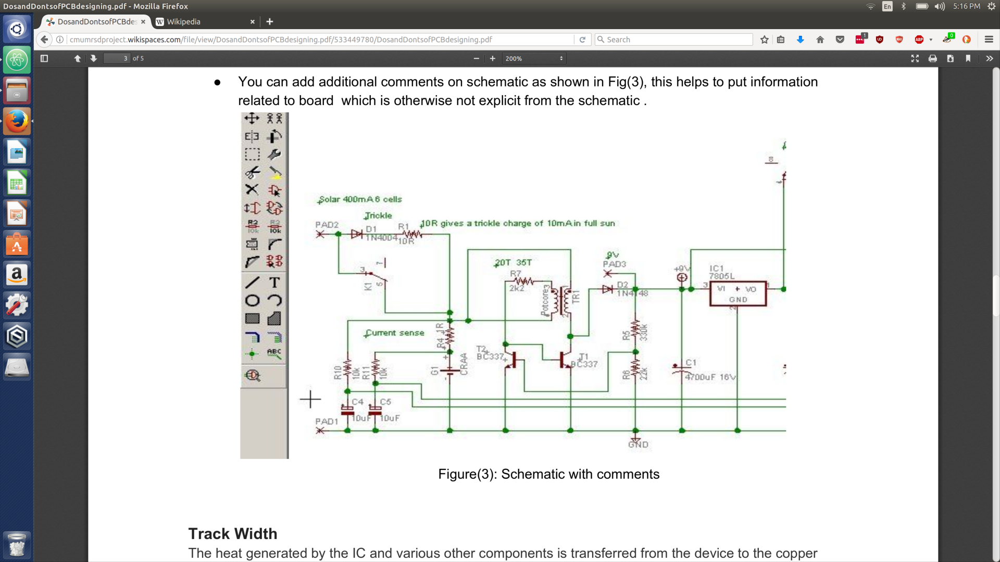

## Software Tools
- [Eagle CAD](http://www.cadsoftusa.com/download-eagle/freeware/?language=en) - Freemium CAD software package
  - Free version limited to 4" X 3.2" board sizes w/ two layers
  - [CAD Soft Tutorials](https://www.cadsoftusa.com/training/tutorials/)
  - [Spark Fun Tutorials](https://www.sparkfun.com/tutorials/108)
- [GerbMerge](http://ruggedcircuits.com/gerbmerge) - Free Python program for panellizing generated PCBs
  - [Ubuntu install instructions](http://eliaselectronics.com/installing-gerbmerge-on-ubuntu/)
  - [GerbMerge Tutorial](http://pauljmac.com/projects/index.php/Gerbmerge)
- [Atlium Circuitmaker](https://circuitmaker.com/) - Alternative to Eagle CAD currently in Open Beta

## Vendors
### Search Engines
- [FindChips](http://www.findchips.com/)
- [Octopart](http://octopart.com/)

### Discrete components Suppliers
- [Mouser](http://www.mouser.com/)
- [Digi-Key](http://www.digikey.com/)

### DIY breakouts and other components
- [Adafruit Industries](http://www.adafruit.com/)
- [Sparkfun](https://www.sparkfun.com/)
- [Pololu](http://www.pololu.com/)

### PCB Fabrication Houses
- [OSH Park](http://oshpark.com/): FOSS Hardware community service
- [Advanced Circuits](http://www.4pcb.com/): Recommended by CMU Gadgetry
  - [33 Each Service](http://www.4pcb.com/33-each-pcbs/): Great for small batches of panellized boards

## Design Guidelines
### General Guidelines
#### Schematics
- Before designing a schematic have a clear idea of what are your system requirements. Discuss it thoroughly with your team members.
- You should be aware of the power ratings, current ratings each component requires. This will help in selecting the components.
- Label the schematic such that it makes sense as per your requirement. For example:
  - A connector for 5V relay that will be used for paint system can be named as "5relayPaint."" This will help later on to debug.
- Select the right package that you are going to use for all the components (TH,SMD).
- Ensure proper protection circuitry for all the critical paths and components (as shown in **Figure 2**). For example:
  - Fuses for overcurrent protection, zener­diodes for over voltage protection, capacitors
(electrolytic and non­electrolytic) for noise­reduction.
- It is important to have proper LED indication  on the PCB (as shown in **Figure 1** and **Figure 2**) for testing and accountability. Use LED  indicators to ensure proper functioning of the board.

**Figure 1: LED indication in schematic with noise reduction cap**

**Figure 2: Labeled Fuse and Zener­diode for Protection**

- You can add additional comments on schematic as shown in **Figure 3**, this helps to put information related to board  which is otherwise not explicit from the schematic.

**Figure 3: Schematic with comments**

#### Track Width
The heat generated by the IC and various other components is transferred from the device to the copper layers of the PCB. The ideal thermal design will result in the entire board being the same temperature. The copper thickness, number of layers, continuity of thermal paths, and board area will have a direct impact on the operating temperature of components. Track width is an important factor to maintain thermal stability.
Track width for both and POWER and GROUND lines should be sufficiently thick to be able to carry the estimated current to prevent heat damage.  A web tool to calculate the appropriate width can be found [here](http://circuitcalculator.com/wordpress/2006/01/31/pcb­trace­width­calculator/). Use a 1 oz/ft^2 thickness. This is the thickness value most PCB manufacturer use.
Your board can look like what has been shown below in **Figure 4.** It can have variable track widths depending on the requirements. Also, avoid 90 degree turns while laying down traces.

#### Drill Size
As you get your board design ready, please keep in mind that you want to have some clearance between the hole and the component's terminal lead for the solder to fill up. If your component has a 20mil round lead, don't specify a 20mil hole diameter. In addition to needing a gap, keep in mind that as part of the PCB
manufacturing process, some metal is going to be deposited inside each hole. This reduces the diameter of the hole, making it smaller than it was when it was drilled. As a rule of thumb, add 8­12mils to the nominal round lead diameter, and round up if you need to match the diameter to a particular drill size list. Keep in mind that a bit bigger is better than too small; you don't want to find yourself filing a lead that is too big (you
cannot make the hole bigger, because it would remove the through­hole metal). Double­check and make sure that none of the holes is smaller than 0.015” diameter, and that neither tracks nor clearances between tracks/pads/planes are smaller than 0.006”.

**Figure 4: Variable Track Width**

#### Structural Stability
For proper structural support place proper mounting holes on all the sides.
#### Package
Custom package designing can be the most critical part. If there are components for which custom library needs to be generated, few things need to be kept in mind. The package layout as per the supplier datasheet can be in BOTTOM view and not TOP view. It is important to take care of the top/bottom view when you create a layout in PCB designing software. If the package was created in bottom view, and if you place it on the TOP layer of PCB, make sure it is mirrored.  If this issue was not considered, you might
render the PCB board useless if the pins of the component are asymmetrical. A few things to try if you're running out of space
- Use both sides of the board to place components. Some (or all) of the SMD components can go in the bottom layer, while the through­hole ones can be placed in the top layer. Some of the SMD can be mounted on the opposite side of bulky things, like DC­DC converters, to save space (unless these converters need a ground plane directly underneath it).
- Components like through­hole diodes and resistors can be placed vertically instead of horizontally. Though not the best choice, this helps if space is limited. Just make sure to cover the long terminal with some tubing or extra protection when you solder it.
- Try to find a different type of connector that is more compact, like a terminal block, to concentrate all the connections in a single connector (but not a terminal block per se, but something that saves the need for individual fasteners per connector).

#### PCB Manufacturing
The PCB’s documents should include the hardware dimensional drawings, schematic, BOM, layout file, component placement file, assembly drawings and instructions, and Gerber file set. User guides also are useful but aren’t required. The Gerber file set is PCB jargon for the output files of the layout that are used by PCB manufacturers to create the PCB. A complete set of Gerber files includes output files generated from the board layout file:
- Silkscreen top and bottom
- Solder mask top and bottom
- All metal layers
- Paste mask top and bottom
- Assembly drawing top and bottom
- Drill file
- Drill legend
- FAB outline (dimensions, special features)
- Netlist file
- [Video](http://www.youtube.com/watch?v=B_SbQeF83XU) covering how to create gerber files for manufacturing.

#### Minimize manufacturing cost
In general once you create all your gerber files, you can print them on paper before sending them for
manufacturing. This will help to:
- Check whether all your drill holes look alright
- Whether track widths are perfect
- Text is readable
- All your components and their packages are on appropriate layer

#### Other Recommendations
- Check trace widths with [PCB Trace-Width Calculator](http://www.circuitcalculator.com/wordpress/2006/01/31/pcb-trace-width-calculator/)
- Design with 1oz Copper and +25 C max in mind
- Use straight & 45 degree runs, no curvy stuff, no right angles!
- 50mil (.05in, ~1.27mm) pin spacing is reasonable for hand soldering (20mils is way to small)

### Surface Mount Package Selection Guide
#### Discrete Components (RCL)
- 1206 is easiest to solder and takes most board space
- 1210 is slightly wider (usually used for capacitors), and so on
- 0603 is half as big in each dimension (very difficult to hand solder anything this size or smaller)

#### Semiconductors
- Diodes – SMA, SMB, SMC
- SOT223 is a good-sized SMT regulator
- TQFP, SOIC are usually good for ICs
- NO QFN, LC*, or BGA PACKAGES! (very bad for hand assembly)

## EAGLE Board Export Process
### Gerber files
1. Click the CAM Processor button
2. Export Layers
  1. Go to file->open job
  2. Select gerb274x
  3. Hit “Process Job”
3. Export Drill files
  1. Go to file->open job
  2. Select excellon
  3. Hit “Process Job”
4. Verify generated files
  1. [FreeDFM](http://www.freedfm.com/) - Associated with 4pcb
  2. [OSH Park](http://oshpark.com/) - FOSS Hardware community service
###Bill of Materials
1. In Eagle: File -> Export ->
2. Choose 'CSV' for the format, rename and save the file
3. Open the spreadsheet, add Supplier Part #s and links.

PCB Panelization

    Methods of PCB Panelization
