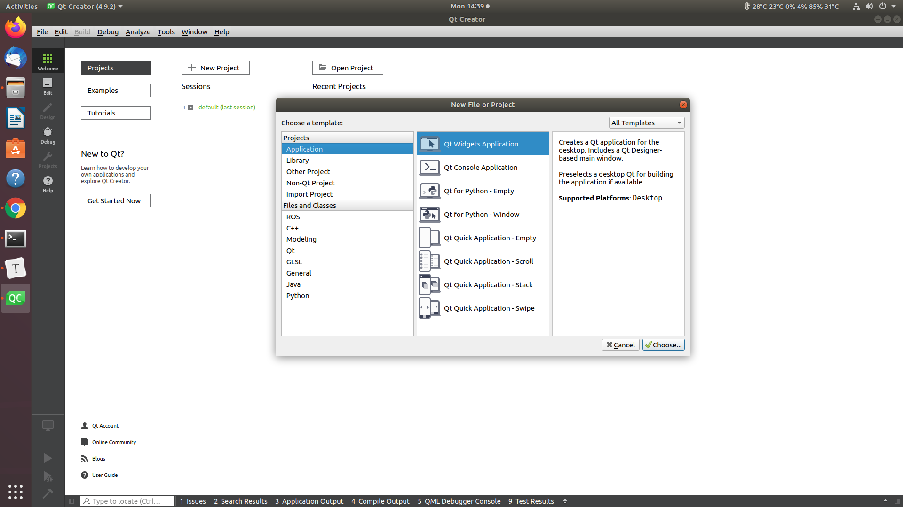
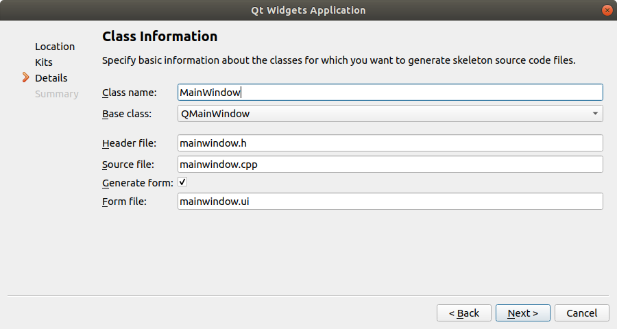
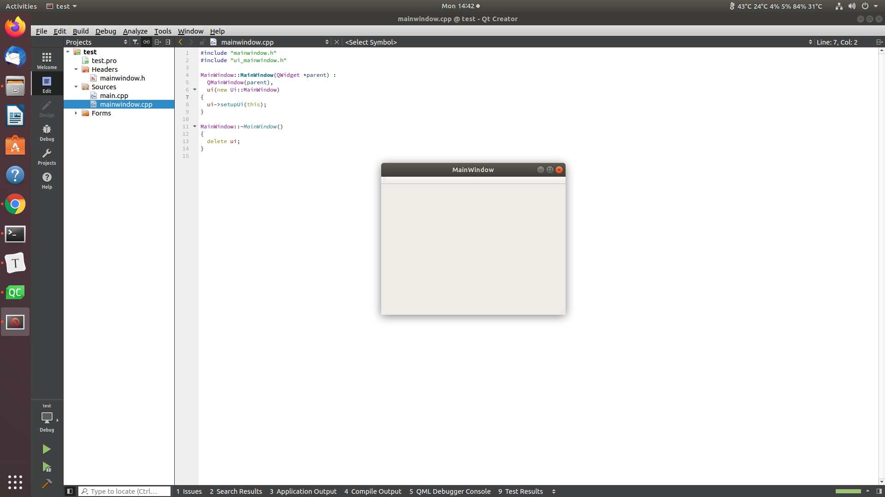
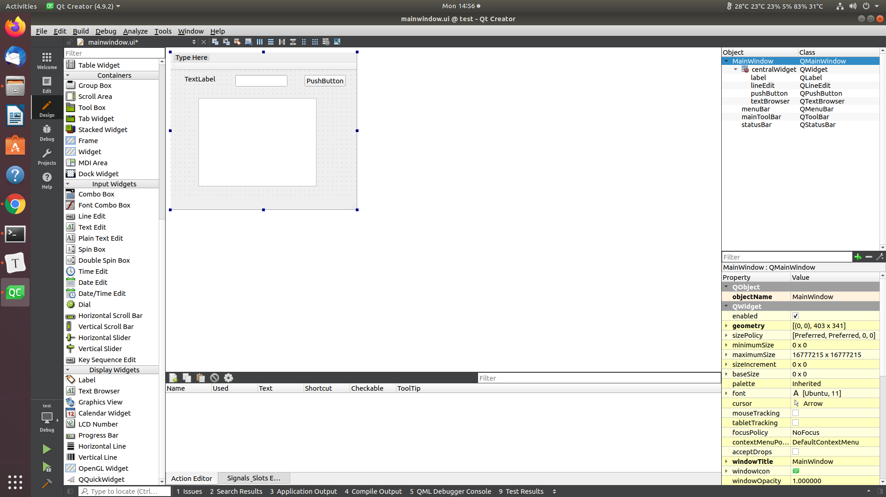
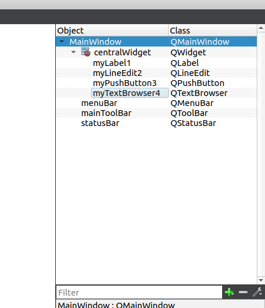
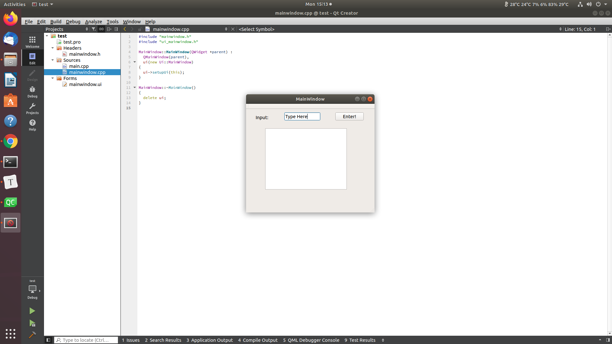

---
# Jekyll 'Front Matter' goes here. Most are set by default, and should NOT be
# overwritten except in special circumstances. 
# You should set the date the article was last updated like this:
date: 2021-03-15 # YYYY-MM-DD
# This will be displayed at the bottom of the article
# You should set the article's title:
title: Qtcreator User-Interface with ROS
# The 'title' is automatically displayed at the top of the page
# and used in other parts of the site.
---
[Qtcreator](https://doc.qt.io/qtcreator/index.html) is a popular user interface integrated development environment (IDE) that can interface easily with ROS. It supports multiple platforms, such as x86 desktop, arm-based embedded devices, and mobile platforms such as Android and iOS. However, this tutorial will focus on using this tool to create a user interface with ROS integrated in it.

 #### Why use Qtcreator and not [ROS Qt (rqt)](http://wiki.ros.org/rqt)

rqt is great for 'quick and dirty' UI where-by you can fix together different plugins (or make your own plugin) in a dockable window. However, if you want to make highly customized UI with your own graphics asset, animation, and granular control, creating a Qt application is a better option.

# Installation

Do not install the standard Qtcreator from their [website](https://www.qt.io/), this version is meant for the more generic version of Qt for all application. We want instead to install the Qtcreator that has been tailored for ROS development.

## Requirements

- Ubuntu 18.04 LTS (please check what is available in this [website](https://ros-qtc-plugin.readthedocs.io/en/latest/_source/How-to-Install-Users.html))
- [ROS Melodic Desktop Full](http://wiki.ros.org/melodic/Installation/Ubuntu) (if using Ubuntu 18.04 LTS)

## Installation Steps

- Download the online installer for Users (not Developers). This is the latest [link](https://qtcreator-ros.datasys.swri.edu/downloads/installers/bionic/qtcreator-ros-bionic-latest-online-installer.run) for Ubuntu 18.04 but I suggest to Google `qtcreator ros install` yourself and download the latest stable release

- Run the installer through the command line terminal, e.g. if you download it to your ~/Downloads folder

  ```bash
  $ chmod +x ~/Downloads/qtcreator-ros-bionic-latest-online-installer.run
  $ ~/./Downloads/qtcreator-ros-bionic-latest-online-installer.run
  ```

- Select all the default configuration in the setting window. It should install Qtcreator at your home directory

- Test your installation by launching the program

```bash
$ qtcreator-ros
```

A program window should open similar to this:


## Installation Troubleshooting

1. Qt library files not found

   if you see this error when launching `qtcreator-ros`:

   ```bash
   error while loading shared libraries: libQt5Core.so.5 cannot open object file: No such file or directory.
   ```

   whereby a Qt .so file is not found, this means that either:

   - You used the wrong installer file (the default qtcreator instead of qtcreator-ros for example, or the wrong Ubuntu version)
   - You accidentally removed Qt library files. These should have been installed automatically when you installed ROS Melodic through the command `sudo apt install  ros-melodic-desktop-full`. One possibility is that you used the Qt MaintenanceTool and selected `Remove all components`

## Make your own Hello World example

This section will guide you to create your first simple Hello-World Qt program

1. Run the `qtcreator-ros` application

2. Create new project using `File -> New File or Project -> Application -> Qt Widgets Application`

   

3. Name your project/application

   

4. If you installed correctly, the Kit will be detected automatically, if not this [link](https://stackoverflow.com/questions/26499404/qtcreator-no-valid-kits-found) might be useful

   

5. Name your main class. Although this is not the main function, it acts as the entry point of the application

   

6. Select finish

7. A project folder should be created, you can navigate with the menu on the left side.

8. Click the green arrow at the bottom left side or use `Ctrl + R` to build and run. You should see a blank application window like this one

   

9. Close the program by clicking on the red cross on the `MainWindow` window. and navigate to the `mainwindow.ui` file under `Forms` on the left menu. It will automatically switch to the `Design` tab and open this UI editor tool

   

10. The left menu is now switched to the basic UI widgets available. You can put them through drag and drop. Try to drag and drop these 4 types of widgets:

    1. `Buttons -> Push Button`
    2. `Input Widgets -> Line Edit`
    3. `Display Widgets -> Label`
    4. `Display Widgets -> Text Browser`

    

11. Some of the widgets have text that is displayed on them such as the `Label` and `Push Button`, you can double-left-click on them and edit the display text 

    

12. On the right menu you should see a summary of all the objects and widgets that you have created. Here we can see the 4 widgets we added. An important distinction here is that the left column is the name of the object (unique entity) and the right column is the class name (not unique). Hence, you can have multiple labels, but these are based on `QLabel` class

    

13. To drive the point home, try to rename the objects. It is advisable to give it meaningful name as you would name a variable. Also, remember to save often with `Ctrl + S`

    

14. Run the program again `Ctrl + R` and you should see your widget. Try to type on the line edit widget

    

# Qt communication framework

Similar to ROS's communication framework, different Qt objects can communicate to each other through trigger events. However, instead of using Publisher/Subscriber system like in ROS, Qt uses signal/slot system. A signal is a message that is sent out (analogous to a publisher), and a slot receives a signal (analogous to a subscriber). Therefore, a slot function is similar to a callback function whereby you execute a piece of code whenever a new message is received.

There is no need to create a signal/slot object like in ROS, when you create any a class whose parent class is a QtObject, the inherited class will have the signal/slot capabilities. Signals and slots are represented as functions in a class. For example:

```C++
class AClass : public QObject {
	Q_OBJECT
public:
    AClass() {}
signals:
    void mySignal1(int);
    void mySignal2(float, int);
    void mySignal3();
public slots:
    void mySlot1(double);
    void mySlot2();
private:
    int memberVar;
};
```

Let's take a more concrete example between two classes, one of them is the class above `AClass` and another `BClass` as defined below:

```C++
class BClass : public QObject {
	Q_OBJECT
public:
    BClass();
    void run();
signals:
    void mySignalFromB(double);
public slots:

private:
	AClass* aClass;
};

void BClass::BClass() {
    aClass = new AClass();
    connect(this, SIGNAL(mySignalFromB(double)), aClass, SLOT(mySlot1(double)));
}

void BClass::run() {
    std::cout << "B: sending signal from B" << std::endl;
    double var = 1.0;
    emit mySignalFromB(1.0);
}

void AClass::mySlot1(double msg) {
    std::cout << "A: receiving signal from B to slot in A" << std::endl;
    std::cout << "message value: " << msg << std::endl;
}

int main() {
    BClass bClass;
    bClass.run();
    return 0;
}
```

The output of this program will be

```bash
B: sending signal from B
A: receiving signal from B to slot in A
message value: 1.0
```

#### Summary of important components in Qt communication

- signals are functions that send an argument that will be received by a slot
- signals do not perform any other function beside passing the arguments
- slot function is where you define events, akin to callbacks in ROS
- In the constructor, you need to setup which signals connect to which slot with the `connect` function by specifying the source object address, signal function, destination object address, and slot function
- Use the `emit` command to send signals    

You can read more about it [here](https://doc.qt.io/qt-5/signalsandslots.html)

## How to integrate ROS in Qt application

Most GUIs have some sort of a while loop to continuously process the GUI and Qt works in a similar fashion. Therefore, you can't put `ros::spin()` inside the main function as you would normally do in a ROS node as the thread will be busy processing the GUI.

The approach we will take is to create a ROS node to handle the publishing and subscription, instantiate them in the `mainwindow.cpp` class and send them to be processed concurrently on different threads.

### Steps:

1. Add ROS include in the .pro file

   The project's .pro file is analogous to CMakeLists.txt where you specify dependencies. Here's a sample of the libraries you need for ROS development

   ```C++
   QT       += core gui
   
   greaterThan(QT_MAJOR_VERSION, 4): QT += widgets printsupport
   
   INCLUDEPATH += /opt/ros/melodic/include
   
   LIBS += -L/opt/ros/melodic/lib -lroscpp -lroslib -lrosconsole -lroscpp_serialization -lrostime -lrviz
   ```

2. `ros::NodeHandle` will be created as a member of the `mainwindow` class, do not create new one elsewhere

3. Create a class for subscriber:

   1. It will have a pointer to a nodehandle (`ros::NodeHandle`) as a member, and the address of the nodehandle object will be passed to this member variable in the constructor

   2. It will have a slot function that initializes the `ros::Subscriber` and a while loop that runs `emit` signals and `ros::spinOnce()`

      ```C++
      // run ROS
      ros::Rate loop_rate(20);
      while (ros::ok()) {
          emit signal_data_callback(msg.data);
      
          ros::spinOnce();
          loop_rate.sleep();
      }
      ```

4. Create a class for publisher

   1. It will have a pointer to a nodehandle (`ros::NodeHandle`) as a member, and the address of the nodehandle object will be passed to this member variable in the constructor
   2. It will have a slot function that runs the `publish()` function

5. Edit the `MainWindow` class, this is where most of the action happens

   1. Create a `ros:NodeHandle`, a pointer that handles the subscriber/publisher class that you made, and `QThread` objects for each of your subscriber/publisher class

      ```C++
      private:
        Ui::MainWindow *ui;
        ros::NodeHandle nh_;
        SubscriberNode *p_subscriber_node_;
        PublisherNode *p_publisher_node_;

        QThread p_subcriber_node_thread_;
        QThread p_publisher_node_thread_;
      ```

   2. Create slots for your GUI elements by right clicking on them in the edit window --> `Go to slot...`, this will create a member function

      ```C++
      private slots:
        void on_Button_clicked();
      ```

   3. Create slots to receive messages from your subscriber class as a member function, add the data type as the function parameter (e.g. float, int, bool)

      ```C++
      private slots:
        void slot_msgFb(float);
      ```

   4. Create signals to send messages to your publisher class as a member function, add the data type as the function parameter (e.g. float, int, bool)

      ```C++
      signals:
        void sigSignal(float);
      ```

   5. Use the `connect` function to connect slots and signals together in the class constructor

      ```C++
      connect(this, SIGNAL(sigSignal(float)), p_publisher_node_, SLOT(slotSignal(float)));
      ```

   6. Move the subscriber and publisher class to the `QThread` that you made

      ```C++
      publisher_class_ptr->moveToThread(&publisher_class_thread);
      publisher_class_thread.start();
      ```

   7. Call `emit` signals and write your logic in `slot` functions accordingly

      ```C++
      emit sigSignal(5.0)
      ```

## Summary
Qt is a tool to create custom GUI that can integrate with ROS directly. It is slightly complicated to learn and use, but it provides a very tight integration.
