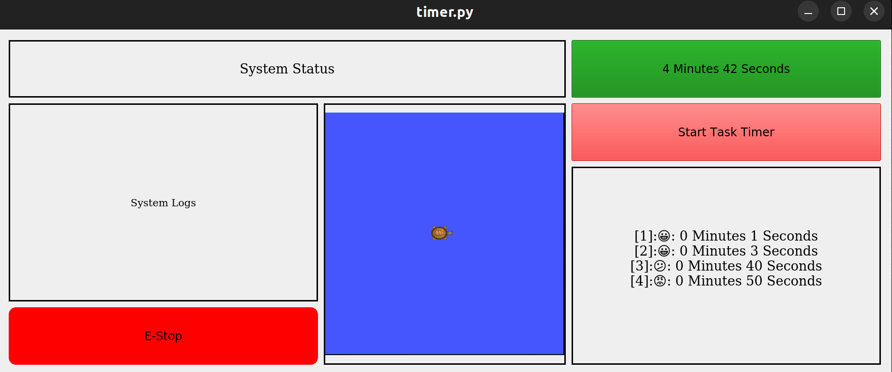
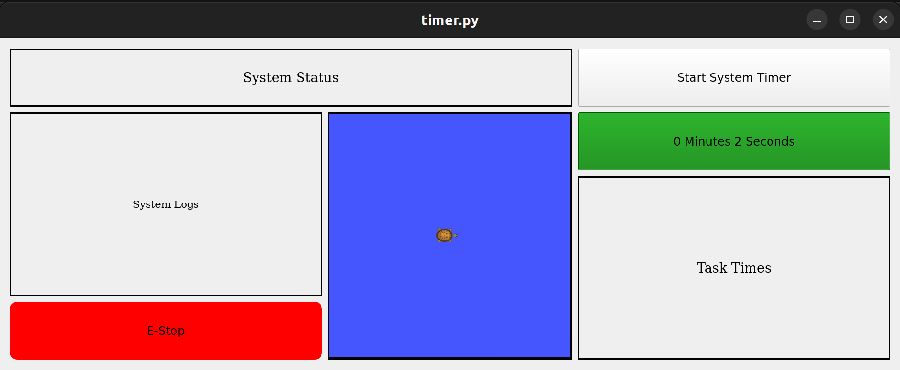
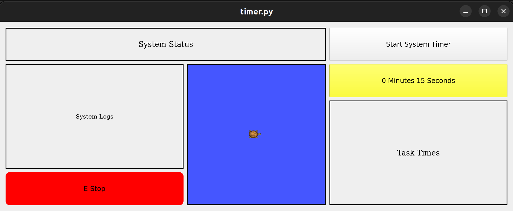
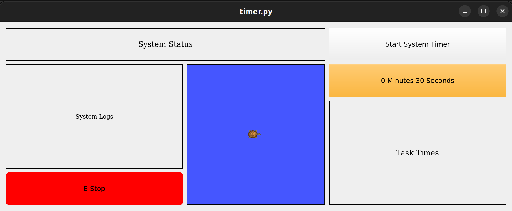
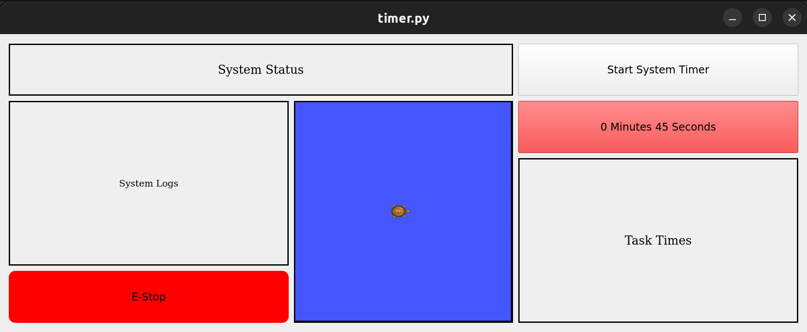
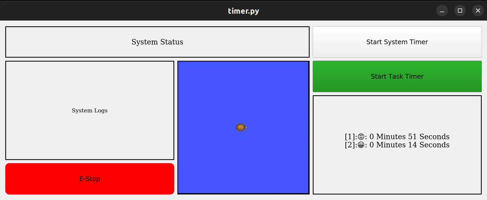

---
# Jekyll 'Front Matter' goes here. Most are set by default, and should NOT be
# overwritten except in special circumstances. 
# You should set the date the article was last updated like this:
date: 2023-05-02 # YYYY-MM-DD
# This will be displayed at the bottom of the article
# You should set the article's title:
title: Framework GUI for robotic system using ROS
# The 'title' is automatically displayed at the top of the page
# and used in other parts of the site.
---
PyQt is a easy to implement user interface that can be easily integrated with ROS. It is easily customizable and can be deployed on multiple platforms. This documentation provides a basic GUI framework that all robotics system using ROS can start on. 

## Requirements

- This application assumes your workspace has ROS installed. [Install ROS](http://wiki.ros.org/ROS/Installation)

- This application can be used on any Operating System including Linux, Windows and Mac. 

- This application can be used for ROS1 and ROS2


### Installation

To use PyQt5, 

```bash
$ pip install PyQt5
```

## Overview of Final Application

This is the final application you can get by following this tutorial. Blocks that need customization will be explained throughout the documentation.



## Application Walkthrough

### Timers 

The application has two timers 

1. System level timer: allows you to keep track of your entire system operation time.

2. Task level timer: allows you to keep track of your task operation time. 

### System Level Timer

The system level timer should only be triggered upon starting and ending the entire system. This can be done by pressing on the timer as the timer is a button. The color of the timer will change based on the ` color_change_times ` and ` color_change_colors`. This may change depending on each system's requirements.

The color change for the timers are as follows:

Green Button

Yellow Button

Orange Button

Red Button


The code block for 
```
def SystemTimerBlock(self):
    self.system_count = 0
    self.system_start = False
    self.system_end = False

    self.system_timer_button = QPushButton("Start System Timer", self)
    self.system_timer_button.setFixedSize(self.win.frameGeometry().width(),self.win.frameGeometry().height()//4)
    self.grid.addWidget(self.system_timer_button, 0, 2)
    self.system_timer_button.clicked.connect(self.system_timer_controller)

    system_timer = QTimer(self)
    system_timer.timeout.connect(self.system_timer)
    system_timer.start(1000) # modify to match system needs
```

### Task Level Timer

The task level timer should only be triggered upon starting and ending one task. This can be done by pressing on the timer as the timer is a button. This button also changes color as time requirements are closely reached. 

One additional feature that the task level timer has is that it saves the task logs and outputs it in the `Task Times` block. 

Logs Block filled as tasks done accumulates. 


```
def TaskTimerBlock(self):
        self.task_times = {}
        self.task_count = 0
        self.task_start = False
        self.task_end = False

        self.task_timer_button = QPushButton("Start Task Timer", self)
        self.task_timer_button.setFixedSize(self.win.frameGeometry().width(),self.win.frameGeometry().height()//4)
        self.grid.addWidget(self.task_timer_button, 1, 2)
        self.task_timer_button.clicked.connect(self.task_timer_controller)

        task_timer = QTimer(self)
        task_timer.timeout.connect(self.task_timer)
        task_timer.start(1000) # modify to match system needs

        self.task_times_label = QLabel("Task Times", self)
        self.grid.addWidget(self.task_times_label, 2, 2, 2, 1)
        self.task_times_label.setStyleSheet("border : 3px solid black")
        self.task_times_label.setFont(QFont('Times', 10))
        self.task_times_label.setAlignment(Qt.AlignCenter)
```

### EStop Button 

The EStop button is a ROS publisher that will publish to a topic 

You need to change 
```
self.estop_pub = rospy.Publisher('/mrsd/estop', Bool, queue_size=10)
```
and customize it for your system. Your ROS system main code should also have a estop subscriber that will shut down the entire system once the button is pressed.  


### System Status

The system status block subscribes to the 
```
self.status_sub = rospy.Subscriber('/mrsd/status', String, self.status_callback)
```
topic. Thus your main system should publish a `/mrsd/status` topic. Ideally, your state machine will have a topic publisher that this application can subscribe to. 

### System Log

This block is left for your system customization. It subscribes to

```
self.system_log_sub = rospy.Subscriber('/mrsd/system_log', String, self.system_log_callback)
```

and you should add some code to format the output. This section could be used to display

1. How many peppers you have harvested
2. How many people you have saved
3. What process are up next
4. etc


### Visualization Block

The visualization block is there for any of your team's visuals. Use cases can be 

1. Robot localization within the map
2. 3D point clouds
3. Object detection results
4. etc.


### Entire code
<details>
  <summary>pyqt-ros.py</summary>
    
  ```
  # importing libraries
from PyQt5.QtWidgets import *
from PyQt5.QtGui import *
from PyQt5.QtCore import *
import sys, emoji, rospy
from PyQt5.QtGui import QPixmap

# system level requirements
total_demo_time = 60*20 # assuming SVD is 20 minutes
one_task_max = 60 # assuming each task is 60 seconds
color_change_times = [0.25, 0.5, 0.75, 1.0]
color_change_colors = ['green', 'yellow', 'orange', 'red']

gui_x, gui_y = 700, 600

class Window(QMainWindow):
    def __init__(self):
        super().__init__()
        self.setWindowTitle("Python ")
        self.win = QWidget()
        self.grid = QGridLayout()

        self.UiComponents()
        self.win.setLayout(self.grid)
        self.win.setGeometry(0, 0, gui_x, gui_y)
        self.win.show()


        # self.status_sub = rospy.Subscriber('/mrsd/status', String, self.status_callback)
        # self.estop_pub = rospy.Publisher('/mrsd/estop', Bool, queue_size=10)
        # self.system_log_sub = rospy.Subscriber('/mrsd/system_log', String, self.system_log_callback)

    def SystemTimerBlock(self):
        self.system_count = 0
        self.system_start = False
        self.system_end = False

        self.system_timer_button = QPushButton("Start System Timer", self)
        self.system_timer_button.setFixedSize(self.win.frameGeometry().width(),self.win.frameGeometry().height()//4)
        self.grid.addWidget(self.system_timer_button, 0, 2)
        self.system_timer_button.clicked.connect(self.system_timer_controller)

        system_timer = QTimer(self)
        system_timer.timeout.connect(self.system_timer)
        system_timer.start(1000) # modify to match system needs
    
    def TaskTimerBlock(self):
        self.task_times = {}
        self.task_count = 0
        self.task_start = False
        self.task_end = False

        self.task_timer_button = QPushButton("Start Task Timer", self)
        self.task_timer_button.setFixedSize(self.win.frameGeometry().width(),self.win.frameGeometry().height()//4)
        self.grid.addWidget(self.task_timer_button, 1, 2)
        self.task_timer_button.clicked.connect(self.task_timer_controller)

        task_timer = QTimer(self)
        task_timer.timeout.connect(self.task_timer)
        task_timer.start(1000) # modify to match system needs

        self.task_times_label = QLabel("Task Times", self)
        self.grid.addWidget(self.task_times_label, 2, 2, 2, 1)
        self.task_times_label.setStyleSheet("border : 3px solid black")
        self.task_times_label.setFont(QFont('Times', 10))
        self.task_times_label.setAlignment(Qt.AlignCenter)

    def EStopBlock(self):
        self.estop_button = QPushButton("E-Stop", self)
        self.estop_button.setStyleSheet("background-color: red; border-radius: 15px")
        self.estop_button.setFixedWidth(self.win.frameGeometry().width())
        self.estop_button.setFixedHeight(self.win.frameGeometry().height()//4)
        self.grid.addWidget(self.estop_button, 3, 0, 1, 1)
        self.estop_button.clicked.connect(self.estop_button_clicked)

    def SystemLogsBlock(self):
        self.system_logs = QLabel("System Logs", self)
        self.grid.addWidget(self.system_logs, 1, 0, 2, 1)
        self.system_logs.setStyleSheet("border : 3px solid black")
        self.system_logs.setFont(QFont('Times', 8))
        self.system_logs.setAlignment(Qt.AlignCenter)

    def VisualizationBlock(self):
        self.pixmap = QPixmap('turtlesim.png')
        self.image_label = QLabel(self)
        self.image_label.setPixmap(self.pixmap)
        self.image_label.setStyleSheet("border : 3px solid black")
        self.grid.addWidget(self.image_label, 1, 1, 3, 1)
        
    def SystemStatusBlock(self):
        self.system_status = QLabel("System Status", self)
        self.system_status.setStyleSheet("border : 3px solid black")
        self.system_status.setFont(QFont('Times', 10))
        self.system_status.setAlignment(Qt.AlignCenter)
        self.grid.addWidget(self.system_status, 0, 0, 1, 2)

    def UiComponents(self):
        self.SystemTimerBlock()
        self.TaskTimerBlock()
        self.EStopBlock()
        self.SystemLogsBlock()
        self.VisualizationBlock()
        self.SystemStatusBlock()

    
    def format_time(self, seconds):
        return f'{seconds // 60} Minutes {seconds % 60} Seconds'
    def change_system_color(self):
        if self.system_count/total_demo_time < color_change_times[0]:
            color = color_change_colors[0]
        elif self.system_count/total_demo_time < color_change_times[1]:
            color = color_change_colors[1]
        elif self.system_count/total_demo_time < color_change_times[2]:
            color = color_change_colors[2]
        else:
            color = color_change_colors[3]
        self.system_timer_button.setStyleSheet(f"background-color: {color}")
    def system_timer(self):
        if self.system_start == True:
            self.system_count += 1
            text = self.format_time(self.system_count)
            self.system_timer_button.setText(text)
            self.change_system_color()

        if self.system_end == True:
            self.system_start = False
            self.system_end = False
    def system_timer_controller(self):
        if self.system_start == False:
            self.system_start = True
            self.system_end = False
        else:
            self.system_start = False
            self.system_end = True
            self.system_timer_button.setText("Start System Timer")
    def change_task_color(self):
        if self.task_count/one_task_max < color_change_times[0]:
            color = color_change_colors[0]
            emoji = '😀'
        elif self.task_count/one_task_max < color_change_times[1]:
            color = color_change_colors[1]
            emoji = '😐'
        elif self.task_count/one_task_max < color_change_times[2]:
            color = color_change_colors[2]
            emoji = '😕'
        else:
            color = color_change_colors[3]
            emoji = '😡'
        self.task_timer_button.setStyleSheet(f"background-color: {color}")
        return emoji
    
    def task_timer(self):
        if self.task_start == True:
            self.task_count += 1
            text = self.format_time(self.task_count)
            self.task_timer_button.setText(text)
            self.change_task_color()

        if self.task_end == True:
            self.task_start = False
            self.task_end = False
            self.task_times[len(self.task_times)] = (self.task_count, self.change_task_color())
            self.task_count = 0
            self.task_times_label.setText(self.timer_label_format())
    def task_timer_controller(self):
        if self.task_start == False:
            self.task_start = True
            self.task_end = False
        else:
            self.task_start = False
            self.task_end = True
            self.task_timer_button.setText("Start Task Timer")
    def timer_label_format(self):
        text = ""
        for i in range(len(self.task_times)):
            text += f"[{i+1}]:{self.task_times[i][1]}: {self.format_time(self.task_times[i][0])}\n"
        return text
    def estop_button_clicked(self):
        print("estop clicked")
        # self.estop_pub.publish(True)

    def status_callback(self, msg):
        # updates the system status when status information is received
        if msg.data != '':
            self.system_status_label.setText(msg.data)

    def system_output_callback(self, msg):
        # updates the system output when system information is received
        # should modify to display the system output in a more readable format for each team
        if msg.data != '':
            self.system_logs.setText(msg.data)

App = QApplication(sys.argv)
window = Window()
sys.exit(App.exec())
  ```
    
</details>


## Summary
This article provides a walkthrough of a basic framework code structure for PyQt5 ROS UI development. It highlights parts that need to be modified in your system level ROS code as well as suggests possible modifications. 

## See Also:
- [PyQt5 Official Documentation](https://doc.qt.io/qtforpython-5/)

## Further Reading
- Links to articles of interest outside the Wiki (that are not references) go here.

