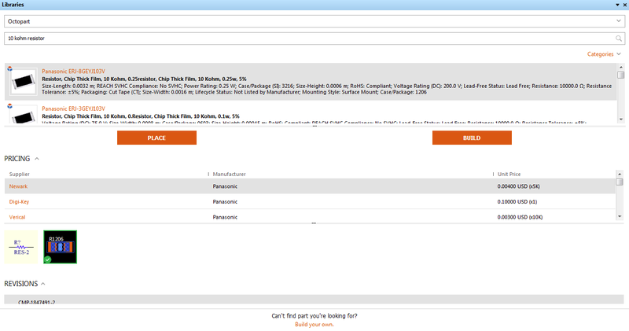
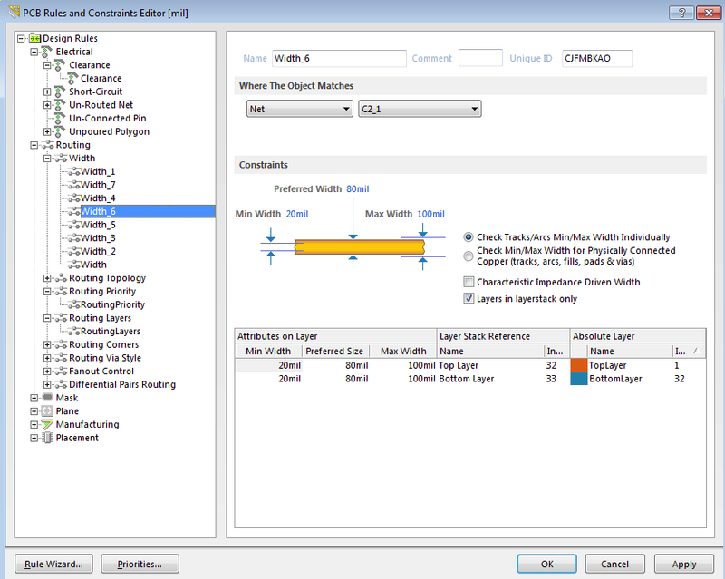
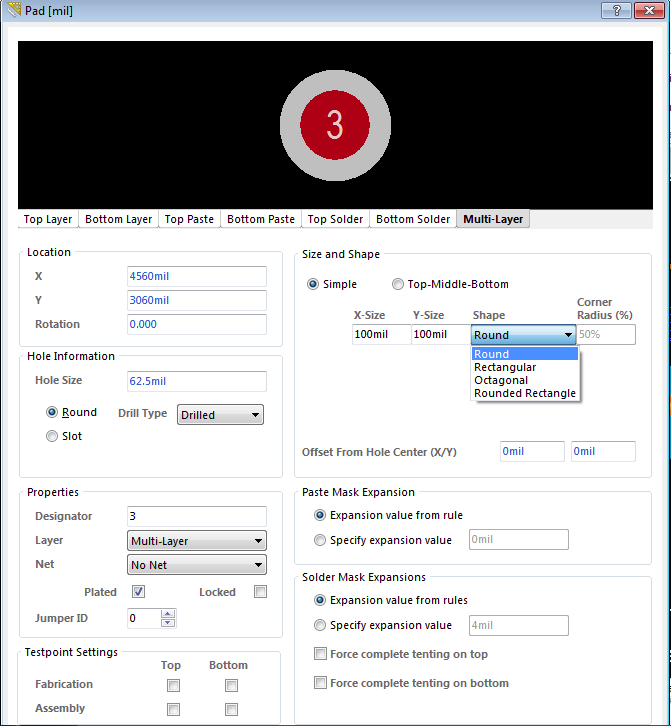

Altium Circuitmaker is a Community Driven PCB Design Application. Circuitmaker can be downloaded [here](http://www.circuitmaker.com). It requires a user account since most of its features are cloud-based.

## Strengths and Weaknesses
### Benefits
1. Cloud based part library drawn from the Octopart database
  - Users can search keywords to find a matching part in the Octopart database. The ones that show up first are the ones that are immediately ready to be used in Circuitmaker.
  - If you need something that isn't made yet, building the part is not difficult and users can import existing symbols and footprints to make it easier. It even includes a list of where you can buy parts and prices. However, it tries to open web pages in the UI -- this is slow, inefficient.
  - 
2. Friendlier UI
  - This is strictly a comparison to EagleCAD. Eagle's UI is a more involved style, which lets the user get deeper into things, but is also not nearly as easy for the casual or new user, or for someone in a hurry.
  - There are also some common sense updates that likely haven't happened because Eagle is more interested in improving functionality than usability. For example, double clicking things in Circuitmaker opens property windows so you can adjust lengths, widths, names, etc.
  - Circuitmaker also displays part purchasing information if you hover over them (though this is still buggy and may require multiple attempts).
  - 
  - There are also more keyboard shortcuts that can be used during actions like placing and wiring, as well as naming nets to make it easier in routing. Even making new library entries is simple since you can almost always find a symbol that matches and usually a footprint that is either close or the same form factor as your part.
  - 
3. Can output STEP files and view the part in 3D in Circuitmaker
  - This feature allows users to see parts in 3D while they were placed on the board. This has the added benefits of identifying items placed in the wrong direction and getting a feel for sizes. However, not all parts have a 3D model and they're a bit harder to find currently in the 'existing parts' library. Making a new 3D view is harder than drawing symbols and footprints. That said, when there is a model, it's helpful to have. Additionally, you can output your board to a STEP file and put it in your Solidworks model. This allows users to see where you want to place the board on the assembly.
  - 
4. The autorouter appears somewhat smarter
  - Partially due to the easier UI, it also feels like it takes it less time and effort to find a good path. You can make multiple profiles of routing schemes and widths, and choose to route only one net at a time. However, by putting in multiple width rules that each cover a single net, you can autoroute every net at once at the correct width.
  - 
5. Collaborative cloud based development method
 - Teams can build their system without all being on the same computer doing it. Other teams can comment on things on the schematic if they want. This allows teams to edit and fork PCB designs rather than trying to put it all through one person (or trying to contribute separate files). Commenting on schematics is another distinct advantage.
6. Outputs include an excel BOM
  - Though the formatting can be problematic, being able to output a list of parts, quantities, and appropriate designators on schematics are time savers.
7. No trial version; all functionality provided for free in the open beta.
  - There was originally going to be a pay-license version, but now all the functionality is being released in return for it being entirely cloud-based.

### Drawbacks
1. No preloaded set of common drill sizes
  - Users have to have a chart of sizes handy to avoid inputting a diameter that doesn't exist. This is a minor but surprising oversight given that common drill sizes should be an easy thing to include in a dropdown. It may be because there is no actual 'drill' button, just an option to place a generic 'pad' which shows up as a through hole like all the others, but without being attached to a larger part. As you can see, there are a lot of options, but it doesn't have a dropdown for standard drills.
  - 
2. No board outline by default
  - Users have to draw an outline on a different layer. Some companies don't like keepout layers, so users may put it both there and on the silkscreen layer.
3. Poor default wiring options
  - If users don't put the elbow in the right place, they will end up with your net spanning every pin on one side of a part. On the other hand, there are lots of keyboard shortcuts for changing wiring routes. You can even place wire at different angles.
4. Copper Pours are not intelligent
  - Copper pours automatically make cutouts even for traces on their defined net. This only happens at first pour or when you 'repour' to fix problems. However, if a repour is necessary then you have to fix the cutouts manually. If found a rule to change the way it connects to pins inside the plane that are on its target net, but not for traces. If users play with that rule, they might figure it out, but that's the status right now.
  - 
5. Some UI still obviously in need of tweaking
  - It seems to be quite stable now, but there are key features and UI windows that need to be made more friendly. The worst is the library search box. The screenshot in the library UI section is the full screen version, and usually it's best used as a sidebar.
  - 
  - It needs to be laid out better so that it can fit more into the window. I think eliminating the pricing and editions segments might help, or turning it into two columns. Either way, this is a minor nuisance compared to having to make your own library or hunt around for ones that already exist.

### Summary
In many ways, Circuitmaker is an improvement over EagleCAD. As an *open beta*, there are occasional stability issues as well as very long periods where it stops to work through an instruction. It's far enough along that the instability issues are a minor nuisance and do not appear to affect better computers. As for the freezes, Circuitmaker is a bit slow to start and to close, to load menus, and there are peak usage periods where it's slow to fetch new part information from the cloud. Otherwise it runs quite well. For projects, it could save a lot of time. In Eagle, the teams all make and remake the same parts, and often do much the same kind of thing throughout their project if they rely on PCBs. With Circuitmaker, all the parts fetch from Octopart entries and if a team has to make a part, it's available to the entire community both to use and review for accuracy. There's also a great collaborative aspect, so that multiple teams can share similar systems with each other if they are doing similar work. That way, an assignment done in Circuitmaker can be structured to help the community by filling in common parts that need importing.
