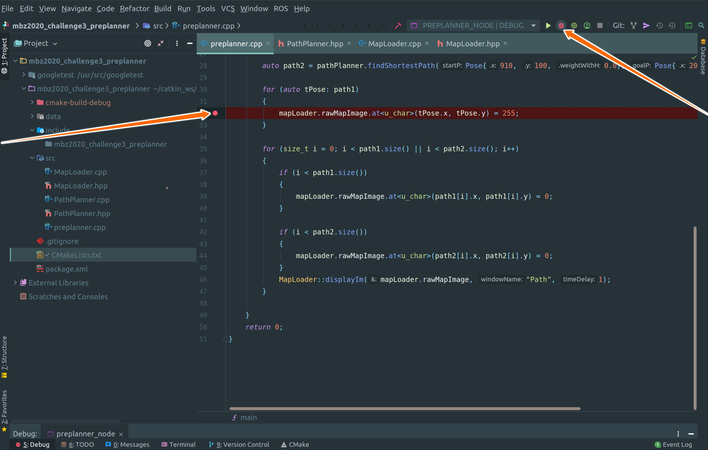
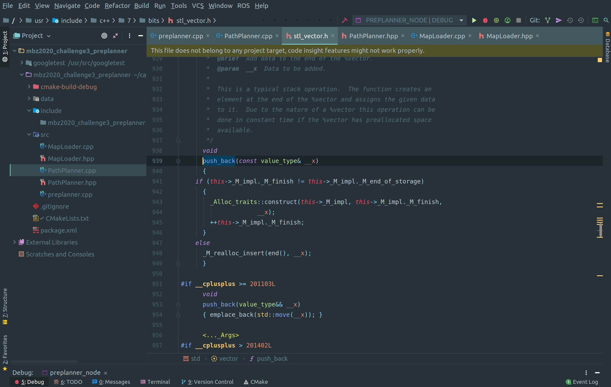

---
# Jekyll 'Front Matter' goes here. Most are set by default, and should NOT be
# overwritten except in special circumstances. You should set the article's title:
title: CLion IDE
# The 'title' is automatically displayed at the top of the page
# and used in other parts of the site.
---

[CLion](https://www.jetbrains.com/clion/) (pronounced "sea lion") is a cross-plateform IDE for C and C++ framework developed by JetBrains.

An integrated development environment (**IDE**) is a software application that provides comprehensive facilities to computer programmers for software development. It includes various functionality that enhances the productivity of the developer significantly. IDE has a learning curve associated with it along with necessary setup time. In long term, it's no brainer that IDE saves a lot of time and effort in writing, debugging and maintaining software stack. 

For small school level projects that have limited time span, a simple text-editor gets the job done. Sublime, VIM, VS Code are some of the most popular text-editors. They have a simple user interface, they are fast and have support for many plug-ins to do almost anything. However, setting up various plug-ins is a complicated task especially if someone wants various functionality. IDE has all the functionality packed together in single package.

If you are already comfortable using other IDE (not text-editor) than switching to CLion may not a worth while time investment. However if you have never used an IDE then CLion has a potential to make your life 10 times better. To give an example, developer spends hours debugging trivially simple mistakes. Without IDE the debugging task envelopes adding and removing printf/std::cout statements which is tiresome. A debugger functionality in IDE allows you to pause the code at any moment and view all the local, global variables and their values in a GUI form factor. This is one of many ways of how IDE makes developers life more productive.

## Installation

CLion is [available](https://www.jetbrains.com/clion/download/#section=linux) for the following Operating Systems.

- Windows
- macOS
- Linux

While CLion is not free software, students can get a free license to use the same. Use your school email id to create a Jetbrains account.

> Since most of the programming is done on ROS on the Linux platform, this article will focus on CLion on the Linux platform. Most of the discussion is invariant of the operating system.

## Running

For Linux, run `./clion.sh` in the terminal inside the bin folder of the extracted package. For ease of use, you can add the path of the bin folder in the `.bashrc` to open CLion from any directory.

> While you can also run the CLion using the GUI of the Linux Distribution, if you want to use CLion with any ROS C++ package, it's important that you launch CLion using the terminal. Also, make sure that  `source catkin_ws/devel/setup.bash` is added in the `~/.bashrc` so that CLion can link the required ROS packages

## Features

Like any other IDE, CLion has countless features. These can also be extended by installing plug-ins. Some of the advance key features are explained in this article. However, it's important to note that these features do not form an exhaustive list.

#### Debugging

After opening the project folder in CLion, right-click on the `CMakeLists.txt` and choose Reload CMake Project. The various executable target added in the CMake file will be available in the drop-down menu at the top right as shown in the above image.

Add the breakpoint in the code where you want to pause the code and press the debug button as shown in the image.

CLion will pause the execution at the breakpoint. You can view all the global, local variables and their values in the variable inspector. It also provides the functionality to run the code line by line by using various step in, step over, step out function. You can also press the resume button to continue execution till the next break-point. You can add new breakpoints even when code is paused at a breakpoint.

#### Re-factor Code

Refactoring is one of the most powerful tools in the CLion. Simplest re-factor operation is renaming a variable.

While simple text-editor can do find and replace, it is not context-aware. CLion re-factor is context-aware meaning renaming of the variable will only happen inside the scope of that variable. To rename variable using refactor select the variable:`right-click -> Refactor -> Rename`
A more useful refactoring tool is to extract the method or extract the function from the bigger function. Writing a method of a class is one of the most cumbersome parts of C++ programming. If want to create a new method of a class, we have to modify the header file as well and figure out what variable needs to be passed and what's their datatype. CLion can automate this entire process with a click of a button.

Select the text that you want to extract the function from and then: `right-click -> Refactor -> Extract -> Method`

Refactor will analyze the selected text and identify the variables that need to be passed to the new function. It will show those variables in the GUI form as shown in the above image. Will GUI interface, user can add, rename, delete variables that are being passed as well change the name of the function. After verifying the function signature, the user can press the `Extract` button. It will cut the code from the original place and will put it inside a new function along with all the necessary changes in the header file to add that function/method.

#### Entity Linking

Entity linking is very useful in efficiently navigating code-base in CLion. The press the `Ctrl` button on the keyboard and then click on any entity in the code. CLion will figure out the origin of that entity and will take you to that entity. 

- Variable: If the selected entity is a variable CLion will take you to the place where that variable was declared. 

- Function: If the selected entity is a function/method. CLion will take you to the  function definition.

- Class: If the selected entity is a class/struct. CLion will take you to the definition of that class.

Entity linking works to the imported library as well. If you have imported some C++ library and want to check the source code inside the library, just use entity linking. It will open the source code of the library if it's available. For example, in the below image, definition of `std::vector::push_back()` is opened using entity linking of CLion.

#### Context-Aware Search

Given a function or a variable, all its usage inside the code can also be searched by 

simply `right-click -> Find Usages`

Above image shows the various usages CLion found of the private variable `costMap` inside the repository.

## Summary

One of the important part of transitioning to professional life is using tools that increases productivity specifically for large complicated projects. IDE is one such tool which may be overkill for a school assignment but is essential and rewarding for tackling future challenges. 

## See Also:

- [Pycharm IDE for Python](https://www.jetbrains.com/pycharm/)
- [VIM](http://roboticsknowledgebase.com/wiki/tools/vim/)
- [Sublime-Text](https://www.sublimetext.com/)
- [Sublime-Merge](https://www.sublimemerge.com/)

## References

- [CLion official website](https://www.jetbrains.com/clion/)
- [CLion Documentation](https://www.jetbrains.com/help/clion/clion-quick-start-guide.html)
- [CLion Quick Tour](https://www.youtube.com/watch?v=Srnw1dI1iAA)
