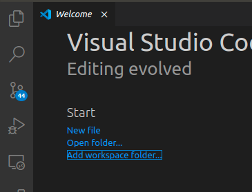
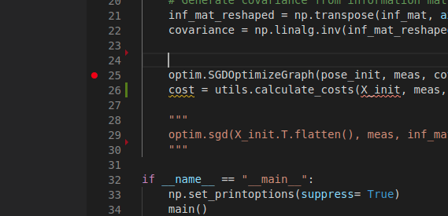
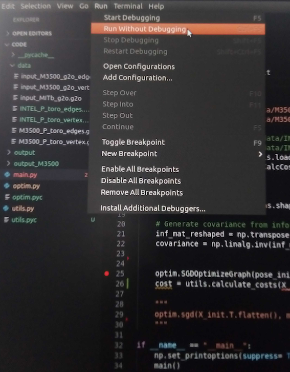
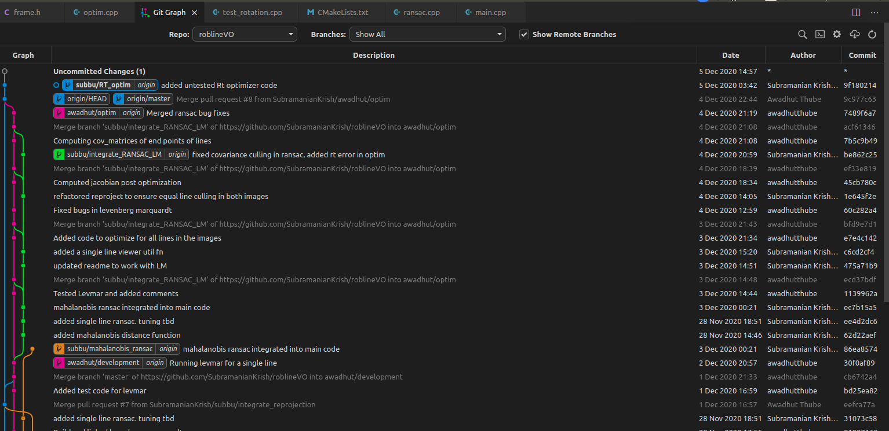

---
# Jekyll 'Front Matter' goes here. Most are set by default, and should NOT be
# overwritten except in special circumstances. 
# You should set the date the article was last updated like this:
date: 2020-12-06 # YYYY-MM-DD
# This will be displayed at the bottom of the article
# You should set the article's title:
title: Code Editors - Introduction to VS Code and Vim
# The 'title' is automatically displayed at the top of the page
# and used in other parts of the site.
---
This article will provide you with some basic features for both VS Code and Vim, and perhaps it helps you decide which to start with!

## Prelude: Why code editors?

For a few scripts, like CMU some homework, it is very easy to manage the codebase. However, say it’s a python project that imports multiple modules from many places. To figure out the data inside different classes, you’d need a way to jump to definitions of the modules. Say it’s a c++ project, you’d want to know the origin of a variable. Or in development, want to change the name of a variable across all occurrences. Code editors give you this functionality and many many more. They make your life easier. Helps improve productivity. Plus they make your code look cool.

## Outline
* Introduction
* VS Code
    * Install VS Code
    * Setup
    * Features
    * Plugins
* Vim
    * Installation
    * Vim Basics
    * Popular Plugins

### Introduction
Many code editors exist out there. Know the difference between the code editor and IDE (Integrated Dev Env): IDE lets you compile code and dig into runtime debugging. A code editor, on the other hand, sets up text editor functionalities that are cross accessible across all languages. Spyder and PyCharm are famous IDEs for Python. CLion and Eclipse are popular for C++ IDE. But this blog isn’t about IDE. So, popular code editors: VS Code, Vim, Sublime Text, Atom, (gedit, nano, emacs ← terminal editors).

In this, we concentrate on the VS Code and Vim. Why these two? One is a GUI based editor, the other a terminal editor.

But why a terminal editor? Many robots you use may have an onboard compute that you SSH into and you wanna edit code on the fly. Vim is the easy setup there. VS Code offers SSH but given only the on-board computer access, you would not be able to setup VS Code on it since it’s not a terminal editor. Moreover, Vim offers variant customization if you are super into it and every plugin is open-source. In fact, lots of VS Code features name themselves over Vim packages.

Why VS Code? Super-versatile compared to its competitors. Lightweight too. Sublime text is lightweight but plugin functionality is comparatively lower. Atom has good plugins but slow/heavy. What is slow/fast/lightweight? How fast the editor opens up, sets up access to files, finds keywords across directories, installs and maintains plugins, hogs how much memory/RAM? Plus VS Code is maintained by Microsoft and is free (Wow, an MS product that’s free. That’s a first). The devs are VS Code knows the programmer in and out. The plugin functionality is insane.

Now, let’s dig into VS Code and Vim separately and whoever is reading this could then choose the one you like better as your code editor!

### VS Code
Standard VS Code comes built with these standard features. This article deals with setup and introducing how to use some of these features.

#### Install VS Code (assuming Linux - obviously)
A link for [downloading](https://code.visualstudio.com/download).
1. Download the deb file
2. `$ sudo apt-get install ./path/to/file/deb_file_name`

#### Setup
1. To set up any project [python or C++], ensure all project files can be seen in the current workspace.
2. Open VS Code (can use the Linux search/windows button). Source folders into the workspace.
3. The top left tab gives you file explorer. Click it!



#### Features
1. **Keyword search**: Right-click inside the file explorer space. Check out “Find in Folder..” and try searching for a keyword and you’d see lightning fast multi-file search (or) click on the search button below the explorer and use the find and replace options.


2. **Seek definition**: Open any file and right-click to peek at the definition of functions. Why is this useful? Reading code implies trying to figure out what each function is doing. Super useful in projects. Works for variables, classes, functions. You name it. VS-code can define it.


3. **Open the file by name**: Ctrl+P, and type file name.
4. **Shortcuts**: I use sublime shortcuts on VS Code. That’s the cool thing. You can configure it to work for your style. How to configure? You can install a sublime text key-bindings plugin. More on plugins later. But this specific one is called: ms-vscode.sublime-keybindings.
    * Ctrl+shift+k  → delete line
    * Ctrl+shift+d → copy line
    * Ctrl+shift+up/down →  move line
    * Ctrl+shift+left/right → word select withhold
    * Ctrl+d → select next occurrence of the same word in the current file
    * Alt + 1/2/3/ → choose tab
    * Split-screen → alt+shift+2
    * Ctrl + \ → comment/uncomment
Add all custom shortcuts in preferences, keyboard shortcuts. Do ctrl+shift+P and type keyboard shortcuts. Add whatever you need.

5. **Integrated terminal**: Click on terminal and open a new terminal. 


Now you can run programs without rotating between terminal and editor. Reduces a lot of strain on the eyes. You can also create multiple screens in the terminal.

6. **Python debugger**: You can put breakpoints and run python programs and look into the state of the program for faster debugging. Click next to the line number and that should drop a BP. Now start debugging. Choose whichever option makes sense (for trials go for current file).





You can step through the lines or move to the next BP or let the program run till the end.

Drawback: Image data cannot be displayed. Spyder offers that option. You cannot change variables and call functions to see the functionality. This is not a substitute for ipdb.set_trace(). This shows you program variables and memory.

7. **Language support**: What we MRSD people use? It supports all of it. Python, C++, Markdown, JSON, YAML, XML, CMake. How to change? Click on python/whatever there is.


Random thoughts: Spaces to tabs, the right-hand small screen helps find easy chunks of code, terminal focus shortcuts, file explorer shows modified files, tracked/untracked files, squiggles show if invalid syntax, auto-complete, function argument list displays.

#### Plugins
1. **Git graph**:
I think git support is auto existing on baseline VS Code but this just ups it. Why good?


When you do a git rebase/merge, conflicts show up in nice blocks which you can just choose. No more million backspaces to remove code.


If you use it with the integrated terminal, you can just choose a file from the terminal output, choose a block of code to stay, and continue rebasing.



2. **Python**:
This covers all the python debugging tools + module search functionality.

3. **Remote-SSH**:
Important for remote robot login and changing code. Why? I interned during COVID with a company in Boston while I was in Pittsburgh. I had to ssh over VPN into their robot to change code, compile, and test. How can I seek function when I’m on a terminal? This plugin is the answer. Install,
Connect to ssh via this, open required folders in VS Code.

What’s nice? It’s fast. No SSH lag. Why? I think it makes local changes and updates them all when you save. So that’s really fast. SSH over terminal was quite slow.

4. **C/C++ [Intellisense]**:
The beast. This is the ultimate C++ engine that any C++ programmer should get. What does it offer? Auto-completion, datatype checking, c++ compiler rules are checked on the fly as you type. If there’s a data type mismatch, it’ll shout at you. If there’s a semi-colon missing, it’ll squiggle away. If there’s an extra bracket :whistle_away: Peek/seek definition, declaration of objects/functions/namespaces. 

### Vim

We will focus on the installation, the basic commands in Vim which allow you to navigate around and edit the code like a pro, as well as some popular open-source extension plugins and how they could make your life much easier than you could have ever imagined.

#### Installation

Vim (Vi IMproved) is a text editor that is upwards compatible with Vi. While Vi is installed by default in macOS/OS X & Ubuntu, we need one extra step to install Vim.
```
$sudo apt-get install vim
```
That’s it!
To open any file with Vim, simply `vim file.txt` and let’s code.

#### Vim Basics
Before we start, let me give you some high-level guidelines when it comes to Vim. Vim is a modal editor. Now, you might not know what “modal” even means, but you shall get some idea that Vim doesn’t act like a normal editor, say Google doc or Gedit. You don’t just type characters and press the backspace or delete to remove words from the document. What are “modal” editors then? How could they benefit our lives?

I admit the learning curve for Vim is slightly higher than normal editors, but once you learn about it, I guarantee you would stick to it forever. Before jumping into the features, I shall introduce you to the 5 modes in Vim: Normal, Insert, Visual, Command, and Replace. Please don’t be intimidated just yet. To get started, all you have to know is really the Normal mode and the Insert mode. Others are left as some advanced usage which readers can explore once they get the taste of Vim.

1. **Normal Mode** a.k.a. Where one would spend most of their time when using Vim. Have you ever tried to edit a word at the beginning of a line and to move the cursor to the very front, you had to press and hold the left arrow key for so long? Now, you might argue that why not use the mouse to click on whatever position you want to edit? See, you are now spending time and efforts to move your hand to the mouse and back to the keyboard. As a programmer, we want to be as lazy as we could. Normal mode is here to help, By default, Vim starts in “normal” mode. Normal mode can be accessed from other modes by pressing Esc. In Normal mode, key presses don’t work as one would expect. That is, they don’t insert text into the document; instead, certain key presses can perform various functions, including moving the cursor around or manipulating the text.
    * **Moving the cursor (navigation)**: To prove the point, some common and in fact, the keys you would press the most when using Vim, are as follows:
        * `h` to move one character left, `j` to move one row down, `k` to move one row up, and `l` to move one character right. Notice that these four characters are right there when you place your right hand on the keyboard, which is meant for easy access. Compared to the arrow keys, you are saving the efforts to move your right hand to the far bottom-right corner just to move the cursor!
        * `w` to move the cursor one word ahead, and `b` to move the cursor one word backward. Now, can you imagine how much easier will your life be with this function? There isn’t such feature in every common editor, even though most of the time when we want to fix a typo, it is somewhere around the cursor but not so close that you could just press an arrow key for less than 5 times.
        * `0` to move to the beginning of the line, `^` to move to where the first character of the line exists, and `$` to move to the end of the line. Forget the Home and End key if you are already smart enough to press those instead of holding some arrow keys for 10 seconds. Even though the Home and End keys could possibly move the cursor to the front or the end of the line, they are sitting in some corners of the keyboard so far that you don’t even know where they are! In fact, how many of you know where those two keys are in a Macbook? Vim offers these common navigations in the Normal mode with keys easily accessible. Use Vim.

    * **Manipulating the text**: What do you do when you want to delete a line? I bet you first move your cursor to the end of the line by holding on the right arrow key for 15 seconds, and then you press on the backspace key for another 20 seconds to delete the whole sentence. Vim is here to save your time.
        * `dd` to delete the whole line, `dw` to delete a word forward, and `db` to delete a word backward. Basically, you could combine `d` with every navigation commands that we mentioned earlier. Once you get used to it, you can really save yourself lots of time when editing texts. One should be able to observe the number of keys you have to press to get a specific task done.
        * The exact same logic for `d` applies to `y` as well. While `d` deletes whatever the next character command represents, `y` yanks the words or line instead. Basically, it is the Ctrl-C without having to select the texts.
        * To paste whatever text you just deleted by using either `d` or `y`, simply move the cursor to the target position/line and `p` to paste the text after the current position/line or `P` to paste the text before the current position/line.
    Some other common usages include: `x` to delete a single character, `u` to undo, `Ctrl-r` to reverse undo, `r` followed by a character to replace the current character with the correct one.

    * **Repeating Actions**: For the abovementioned examples, you can always put some numbers before the command itself to indicate how many times you would like the operation to happen. For example, if you want to delete 3 lines, you can type `3dd`. If you want to yank 5 words starting from the current position, you can `5yw` and move to the target position then `p`. You can also navigate to the target position/line using this logic. To illustrate, `8l` to move the cursor 8 characters right and `4j` to go down 4 rows.

2. **Insert Mode**: This is the second most used mode and will be the most familiar behavior to most people. Once in insert mode, typing inserts characters just like a regular text editor. To enter Insert mode from Normal mode, we can either type in `i`, `a` or `o`.
    * `i` lets you insert characters before the current cursor.
    * `a` lets you append characters after the current cursor.
    * `o` inserts a new line and enters insert mode directly.
Beginners tend to rely on Insert mode too often because it acts just like the normal editors. However, if you do not appreciate the beauty of Normal mode, you are really missing out here. We should only enter Insert mode when this is our last option since if a job can be done in Normal mode, it is often much more efficient than typing or editing character by character in Insert mode.

#### Popular Plugins

Now, let me introduce you to some popular plugins that can be easily installed by inserting some lines in your `~/.vimrc` file. Almost all of them are maintained by some Github repositories, and the installation tutorials would be on their `README` page obviously. Just follow the steps and enjoy!

1. [NERDTree](https://github.com/scrooloose/nerdtree) - A popular plugin to display an interactive file tree view in a side panel, which can be useful when working on a larger project.
2. [CtrlP](https://github.com/ctrlpvim/ctrlp.vim) - A Full path fuzzy file, buffer, MRU, tag, ... finder for Vim. In fact, the shortcut for VS Code to open a file is a copy from this Vim Plugin.
3. [Syntastic](https://github.com/vim-syntastic/syntastic) - A syntax checking plugin for Vim. Basically, the basic features that you would expect a normal IDE would have. People criticize editors like Vim to not have this kind of feature when all you need to do is really to install an additional plugin.
4. [ACK](https://github.com/mileszs/ack.vim/tree/master) - allows searching with ack from within Vim and shows the results in a split window.
5. [Fugitive](https://github.com/tpope/vim-fugitive) -  Fugitive is the premier Vim plugin for Git. Or maybe it's the premier Git plugin for Vim? Either way, it's "so awesome, it should be illegal". That's why it's called Fugitive.

Just to name a few. The list is still super long. Vim plugins are powerful. However, one might not know how they could help your life if we just blindly install it. I suggest that beginners start by familiarizing themselves with the basics - Normal mode, Insert mode, Replace mode, Command mode, and Visual mode. Only when you are familiar with those modes can you find out what features you would probably need and thus search for a Vim plugin, which is probably there already, to leverage it. In this way, you can easily understand the documentation of that package on the Github page, and you know what you are doing when it comes to customizing the plugin usages.

## Summary
There of course is not a single best code editor that one should use. People have different preferences and situations. In fact, the debate about which code editor is the best has been around for decades. People still strive to speak for their favorite editors while once a person is stuck with an editor, it is often really hard for them to make up their mind to change. However, VS Code and Vim are certainly two of the most used code editors nowadays. I hope the above context could help you decide the one you would like to try it out. Good luck coding!

## See Also:
- Vim Text Editor: <https://roboticsknowledgebase.com/wiki/tools/vim/>

## Further Reading
- [Transitioning from VS Code to Vim](https://medium.com/@kalebzeray/transitioning-from-vscode-to-vim-dc3b23e35c58)
- [Why I switched to Vim from Visual Studio Code](https://freshman.tech/from-vscode-to-vim/)

## References
- Learn vim For the Last Time: A Tutorial and Primer, <https://danielmiessler.com/study/vim/>
- Vim Editor Modes Explained, <https://www.freecodecamp.org/news/vim-editor-modes-explained/>
