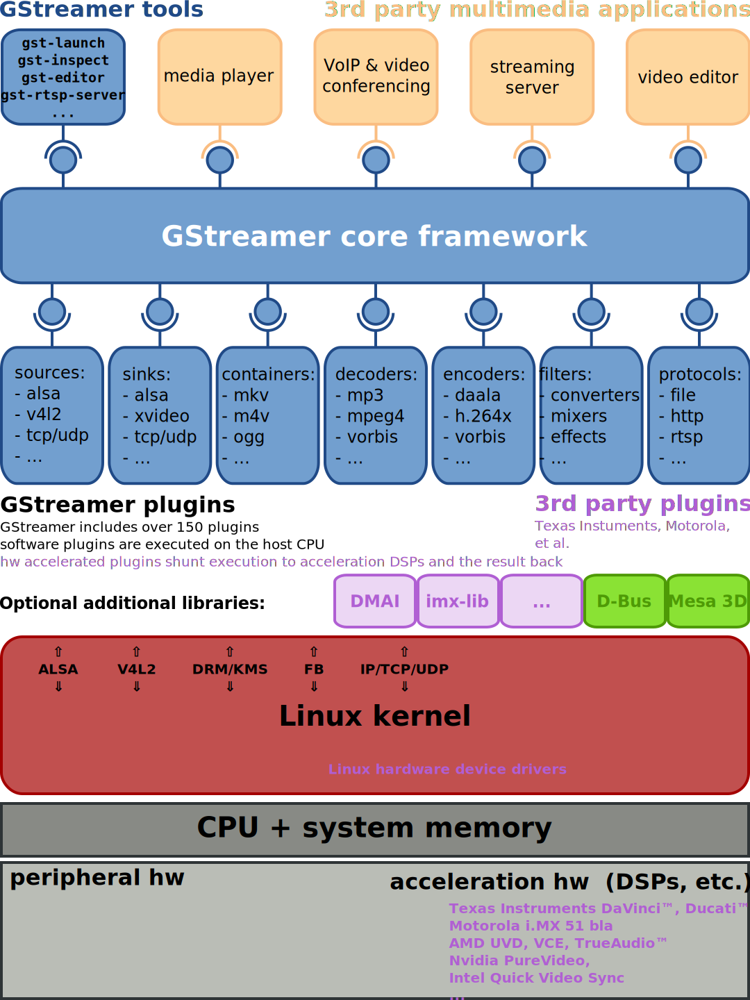
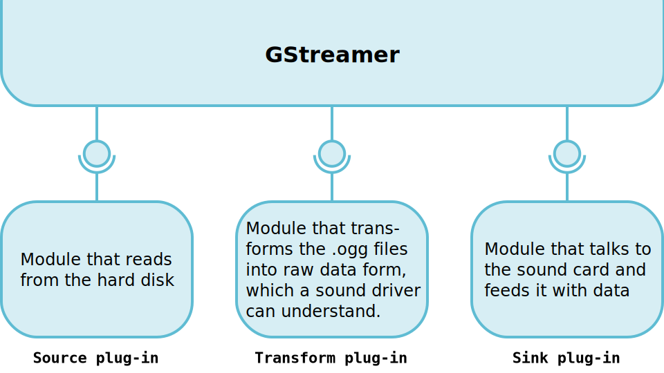
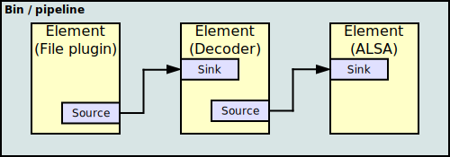

# Low-latency Video Streaming using GStreamer for Robotics Applications

As the title of the entry suggests, this tutorial is aimed at providing the necessary foundational background and technical details to enable one to harness the power of the [GStreamer](https://gstreamer.freedesktop.org/) library for multimodal low-latency video streaming for robotics applications.


## The GStreamer Library

GStreamer is a pipeline-based multimedia framework that links together a wide variety of media processing systems to complete complex workflows. For instance, GStreamer can be used to build a system that reads files in one format, processes them, and exports them in another. The formats and processes can be changed in a plug and play fashion.

GStreamer supports a wide variety of media-handling components, including simple audio playback, audio and video playback, recording, streaming and editing. The pipeline design serves as a base to create many types of multimedia applications such as video editors, transcoders, streaming media broadcasters and media players.

It is designed to work on a variety of operating systems, e.g. the BSDs, OpenSolaris, Linux, Android, macOS, iOS, Windows, OS/400.

GStreamer is free and open-source software subject to the terms of the LGPL-2.1-or-later.



### Key Concepts and Terminologies in GStreamer

Understanding GStreamer involves grasping its core concepts and terminologies. Below, we break down the essential elements, terms, and mechanisms fundamental to working with GStreamer effectively.

<!-- --- -->

#### **1. Elements and Plugins**

**Elements** are the fundamental building blocks of a GStreamer pipeline. Each element performs a specific task, such as reading data from a source, decoding media, or displaying a video stream. Elements are classified into three main types:

- **Source Elements**: Generate or retrieve data, such as reading from a file or capturing video from a camera.
- **Filter Elements**: Process or transform data, such as decoding, encoding, or applying effects.
- **Sink Elements**: Output data to a destination, such as playing audio, rendering video, or streaming over a network.

**Plugins** provide the implementation of these elements. GStreamer includes a large collection of plugins, offering support for various codecs, protocols, and devices. Users can extend functionality by writing custom plugins for specific use cases.



<!-- --- -->

#### **2. Pads**

**Pads** are the connection points on elements, enabling data flow between them.

- **Source Pads**: Push data out of an element (output).
- **Sink Pads**: Receive data into an element (input).

Pads must be connected for elements to exchange data. A pipeline forms when source and sink pads are linked across a series of elements. Each pad specifies the type of data it can handle using **capabilities (caps)**.



<!-- --- -->

#### **3. Caps (Capabilities)**

**Caps** define the media type and format that a pad can accept or produce. This includes information like:

- Media type: Audio, video, or image.
- Encoding format: MP3, H.264, etc.
- Resolution and frame rate (for video).
- Sampling rate and channels (for audio).

Capabilities negotiation occurs during pipeline construction, ensuring connected pads can handle the same media type. For example, a source element outputting raw video cannot connect directly to a sink expecting encoded H.264 without a conversion element in between.

<!-- --- -->

#### **4. Bins and Pipelines**

- **Bins**: Group multiple elements together, managing them as a single unit. Complex applications often use bins for modularity.
- **Pipelines**: A specific type of bin that manages the entire data flow. Pipelines control the execution of elements and manage their state transitions (e.g., PLAYING, PAUSED, STOPPED).

<!-- --- -->

#### **5. Buffers**

Buffers are the data packets passed between elements in a pipeline. For instance, a buffer may hold a video frame or a segment of audio samples. Buffers move from the source to the sink in real-time during playback or streaming.

<!-- --- -->

#### **6. States**

GStreamer elements and pipelines operate in one of four states:

- **NULL**: No resources allocated; initial state.
- **READY**: Resources allocated; prepared for data flow.
- **PAUSED**: Ready to process data but not actively doing so.
- **PLAYING**: Actively processing and streaming data.

State transitions are essential for managing playback, streaming, and pipeline teardown.

<!-- --- -->

#### **7. GStreamer Media Types**

GStreamer supports a wide range of media types, categorized broadly into:

- **Encoded Formats**: Compressed data like MP3, AAC, H.264, etc.
- **Raw Formats**: Uncompressed data such as raw video (RGB, YUV) or raw audio (PCM).
- **RTP Streams**: Real-time media streams for low-latency applications.

Each media type has associated plugins and elements to handle specific tasks.

### Command-Line Utilities

GStreamer provides a set of powerful command-line utilities to simplify development, testing, and debugging of multimedia pipelines. Two of the most commonly used utilities are `gst-play` and `gst-inspect`.

---

#### **1. `gst-play`**

`gst-play` is a versatile command-line media player that can play audio and video files, as well as stream media from various sources. It is particularly useful for quickly testing pipelines without writing custom code. Also used to create a pipeline and set it to PLAYING state.

##### **Key Features**
- Plays both local media files and network streams.
- Supports various media formats and codecs based on available GStreamer plugins.
- Displays information such as playback time and metadata during playback.

##### **Usage**

Basic usage of `gst-play` involves specifying the media file or URI as an argument:

```bash
gst-play-1.0 <file / URI / pipeline>

# Example (following pipeline can be used to decode and view a encoded MP4 media file)
gst-play-1.0 filesrc location=video.mp4 ! decodebin ! autovideosink
```

#### **2. `gst-inspect`**

`gst-inspect` is a command-line tool that provides detailed information about GStreamer plugins, elements, pads, and capabilities. It is invaluable for exploring the GStreamer ecosystem and understanding the capabilities of various components.

##### **Key Features**
- Lists all available plugins and their elements.
- Displays detailed information about a specific plugin or element.
- Shows the capabilities (caps) and properties of elements.
- Helps in debugging pipelines by identifying compatible elements.

##### **Usage**

To list all available plugins and elements:
```bash
gst-inspect-1.0
```
To get detailed information about a specific plugin or element:
```bash
gst-inspect-1.0 <plugin or element>

# For example:
gst-inspect-1.0 videoconvert
gst-inspect-1.0 avdec_h264
```
Understanding the Output
The output of `gst-inspect` includes:
- Description: A brief summary of the element's purpose.
- Capabilities: Supported media types and formats.
- Pads: Information about source and sink pads, including their caps.
- Properties: Configurable properties for the element.

## API support

### GStreamer API: C++ and Python

GStreamer provides robust APIs for both C++ and Python, enabling developers to build complex multimedia applications. Here, we provide a high-level overview of each API and its key features.

---

#### **1. GStreamer C++ API**

The GStreamer C++ API, often accessed via the [GStreamer core library](https://gstreamer.freedesktop.org/documentation/), offers low-level control and is ideal for performance-critical applications or situations requiring fine-grained control over media pipelines.

##### **Key Features**
- Access to the full feature set of GStreamer, including custom plugin development.
- High performance and low overhead, suitable for real-time applications.
- Fine-grained control over pipeline states, element properties, and event handling.
- A strong type system ensures type safety and error checking at compile time.

##### **Common Use Cases**
- Developing real-time video and audio processing applications.
- Building custom elements and plugins for specialized tasks.
- Integrating multimedia features into robotics, IoT, or embedded systems.

##### **Basic Workflow**
1. Initialize GStreamer with `gst_init()`.
2. Create a pipeline and elements using functions like `gst_pipeline_new()` and `gst_element_factory_make()`.
3. Link elements and set their properties.
4. Transition the pipeline to the `PLAYING` state using `gst_element_set_state()`.
5. Monitor pipeline events using a `GMainLoop`.

#### **2. GStreamer Python API**

The GStreamer Python API, available through the [PyGObject bindings](https://pygobject.readthedocs.io/), simplifies multimedia application development while retaining access to GStreamer's powerful features. It is suitable for rapid prototyping and applications where ease of use is a priority.

##### **Key Features**
- High-level interface for building and managing pipelines.
- Extensive library of plugins accessible through Python objects.
- Integration with GUI frameworks like PyGTK and PyQt for multimedia applications.
- Minimal boilerplate code compared to C++.

##### **Common Use Cases**
- Rapid prototyping of multimedia pipelines.
- Developing video streaming, playback, or processing tools.
- Building multimedia-enabled robotics control systems.

##### **Basic Workflow**
1. Import the `gi.repository.Gst` module and initialize GStreamer using `Gst.init()`.
2. Create a pipeline and elements using `Gst.parse_launch()` or individual constructors.
3. Link elements and set their properties.
4. Transition the pipeline to the `PLAYING` state using `set_state()`.
5. Handle events using the GStreamer bus.

## Installation

Please refer to the official installation/setup guide provided [here](https://gstreamer.freedesktop.org/documentation/installing/on-linux.html?gi-language=c)


## Bridging ROS and GStreamer

Now that we have a good understanding the underlying GStreamer library terminologies and concepts, we are ready to build some cool video streaming apps with ROS support.

But why use GStreamer for streaming video in ROS, wont running ROS over a shared network allow us to tap in to the image/video stream provided by the corresponding `sensor_msgs/Image` topic?

The answer is simple: network bandwidth. When using the raw image transport in ROS the image data is not compressed and for a 30Hz stream these can translate into very large network bandwidth requirements. For example a lets say we want to stream 8-bit FHD (1920x1080) RGB image stream at 30Hz; the resulting bandwidth usage would be (1920*1080*3*8*30) 1.49Gbits/s.

The answer, use Gstreamer's inbuilt transcoders for encoding/decoding media for lightweight transport. Note that ROS also provides something similar using the [compressed](https://wiki.ros.org/compressed_image_transport) image transport layer, but this offers CPU encoding only and does not support a wide range of codecs.

### Example application

The following application was developed for streaming real-time video streams from a user-provided topic list for [Team B - EmberEye](https://mrsdprojects.ri.cmu.edu/2024teamb/) GCS subsystem.

Please refer to the implementation [here](https://github.com/EmberEye-MRSD/rsun_gcs_streaming/tree/hw_mods)

#### The Server (Sender)

The streaming server is run on the robot with sensors generating/providing `sensor_msgs/Image` data over one or more ROS topics.

1. **Initialization**:
   - The node initializes ROS parameters, such as image topics, text overlays, and UDP settings.
   - A ROS publisher is set up for the `/stream_info` topic to broadcast metadata about the streams.
   - Subscribers are created for each image topic provided in the parameters.

2. **Image Processing**:
   - The `image_callback` function processes incoming ROS `sensor_msgs/Image` messages using `cv_bridge`.
   - It converts images into OpenCV format, handling various encodings (`mono16`, `rgb8`, `mono8`, etc.).
   - For some encodings like `mono16`, the program performs histogram equalization (`hist_99`) to adjust the contrast and then converts the image to `bgr8` format.

3. **Stream Information (`stream_info` Topic)**:
   - Each stream is associated with a set of metadata, including the topic name, UDP address, port, FPS, width, height, and encoding type.
   - This information is published to the `/stream_info` topic using the `StreamInfoArray` message. The metadata helps configure the receiver side and ensures that the sender and receiver are aligned in terms of video format, resolution, and codec.

4. **GStreamer Pipeline Creation**:
   - For each image topic, the program creates a GStreamer pipeline if it does not exist already. This pipeline takes the processed image and streams it over UDP.
   - The pipeline uses the `appsrc` element to inject the image data into the stream, and the `udpsink` element sends it over UDP to the specified host and port.
   - The pipeline is configured with video properties like resolution and framerate (`fps`), as well as an optional text overlay that identifies the camera/topic.

5. **Streaming**:
   - The image is converted into raw bytes and pushed into the GStreamer pipeline using `push-buffer`. The pipeline then encodes the image (e.g., H.264 via `x264enc`) and sends it to the specified UDP address and port.

6. **Cleanup**:
   - When the node is shut down, the `cleanup` function ensures that all pipelines are stopped by setting them to the `NULL` state.

<!-- --- -->

##### Role of the `stream_info` Topic

The `stream_info` topic plays a crucial role in managing the metadata of the image streams. It provides real-time information about each stream, such as:
- **Topic name**: The ROS topic that the image is being streamed from.
- **UDP address and port**: The destination address and port for the UDP stream.
- **Frame rate (FPS)**: The rate at which frames are being captured and streamed.
- **Width and height**: The resolution of the image.
- **Encoding type**: The format of the image (e.g., `bgr8` or `mono16`).

This metadata is essential for the receiver to correctly interpret the incoming video streams. The `stream_info` is published every second, ensuring that any changes in the stream's properties (e.g., resolution or encoding) are communicated to subscribers.

<!-- --- -->

##### Key Points
- The program subscribes to multiple ROS image topics and streams them over UDP using GStreamer.
- It processes images, encodes them, and sends them over the network.
- The `stream_info` topic provides vital metadata that helps configure the streaming pipeline and ensures compatibility with receivers.

#### The Client (Receiver)

The client node is run on the offboard PC running ROS (over the same network).

1. **Initialization**:
   - The node initializes ROS and sets up a subscriber to the `/stream_info` topic, which provides the metadata for each video stream (e.g., UDP port, FPS, etc.).
   - A dictionary `self.streams` is created to manage the GStreamer pipeline, publisher, and timer for each video stream.

2. **Stream Information Handling**:
   - The `stream_info_callback` function is called when new `StreamInfoArray` messages are received from the `/stream_info` topic. These messages contain metadata for the video streams, such as the topic name, UDP port, FPS, and other properties.
   - For each stream, the program checks whether the stream is already in the `self.streams` dictionary. If not, it creates a new pipeline and publisher for the stream and starts a ROS timer to pull frames at the specified FPS.

3. **GStreamer Pipeline Creation**:
   - The `create_pipeline` function sets up a GStreamer pipeline to receive video streams over UDP using `udpsrc` as the source element.
   - The pipeline expects an RTP stream with H.264 encoded video, which is depayloaded, parsed, decoded (`avdec_h264`), and converted to raw BGR format (`videoconvert`).
   - The resulting frames are passed to `appsink`, where they can be pulled and processed in the client.

4. **Frame Pulling and Conversion**:
   - The `timer_callback` function is called periodically based on the FPS of each stream. It pulls a frame (sample) from the `appsink` element in the GStreamer pipeline.
   - The frame is retrieved from the buffer and mapped to a NumPy array. The image is then reshaped and converted to a ROS `Image` message using `cv_bridge`.
   - The `Image` message is published to the respective topic for the stream (e.g., `topic/streamed`).

5. **Cleanup**:
   - When the ROS node shuts down, the `cleanup` function ensures that all pipelines are stopped by setting them to the `NULL` state and all timers are shut down.

<!-- --- -->

##### Role of the `stream_info` Topic

The `stream_info` topic provides essential metadata about the video streams that the client is subscribing to. The key information from this topic includes:
- **Topic name**: The ROS topic name of the stream.
- **UDP port**: The UDP port that the client will listen to for receiving the video stream.
- **FPS**: The frame rate at which frames should be pulled and published.
- **Other stream properties**: Information such as encoding type (e.g., H264) and stream format.

This metadata is used by the client to configure the GStreamer pipeline appropriately, ensuring that the correct parameters are set (e.g., port, FPS, encoding type) for each video stream.

<!-- --- -->

##### Key Points
- The program subscribes to the `/stream_info` topic to receive metadata about each video stream.
- It uses this information to create GStreamer pipelines dynamically for each stream, pulling frames from the pipeline at the specified FPS.
- The frames are converted into ROS `Image` messages and republished to corresponding topics (e.g., `topic/streamed`).

## Conclusion

In this tutorial, we explored how to use GStreamer for low-latency video streaming in robotics applications, leveraging its robust capabilities to handle complex multimedia workflows. By understanding core concepts like GStreamer elements, pipelines, pads, and capabilities, as well as utilizing its command-line utilities, developers can build flexible and high-performance multimedia systems for robotics.

One practical example of this integration is the [`rsun_gcs_streaming`](https://github.com/EmberEye-MRSD/rsun_gcs_streaming/tree/hw_mods) repository, developed for Team B - EmberEye's Ground Control Station (GCS) subsystem. This repository demonstrates the power of combining ROS with GStreamer for real-time video streaming. It showcases how multiple video streams from ROS `sensor_msgs/Image` topics can be efficiently processed, encoded, and transmitted over UDP using GStreamer pipelines. The server node handles image conversion, encoding, and streaming, while the client node subscribes to the `/stream_info` topic, dynamically creates pipelines, and republishes the video streams with minimal latency. The project illustrates the importance of metadata management through the `stream_info` topic, ensuring smooth operation and synchronization between the sender and receiver.

By leveraging GStreamer’s transcoding features and ROS’s flexibility, developers can create efficient, low-latency video streaming applications tailored for robotic systems with high bandwidth requirements.

## References

- GStreamer Documentation: [https://gstreamer.freedesktop.org/documentation/](https://gstreamer.freedesktop.org/documentation/)
- ROS Wiki on Compressed Image Transport: [https://wiki.ros.org/compressed_image_transport](https://wiki.ros.org/compressed_image_transport)
- `rsun_gcs_streaming` Repository: [https://github.com/EmberEye-MRSD/rsun_gcs_streaming](https://github.com/EmberEye-MRSD/rsun_gcs_streaming)
- GStreamer GitHub Repository: [https://github.com/GStreamer/gstreamer](https://github.com/GStreamer/gstreamer)


