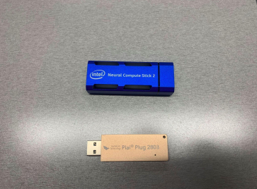
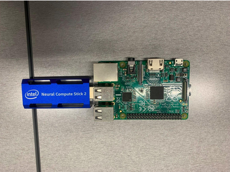
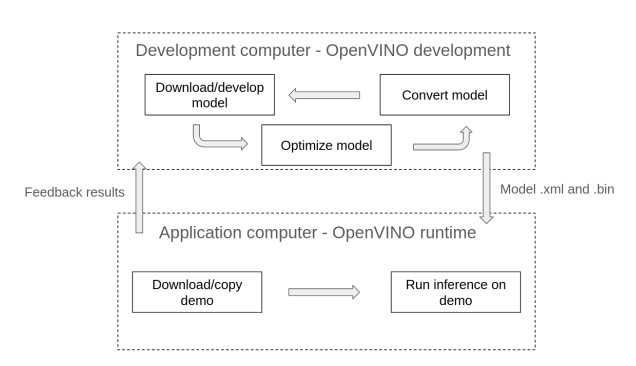
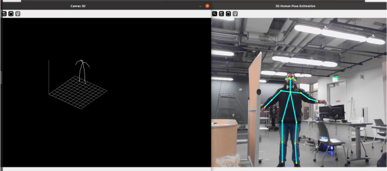
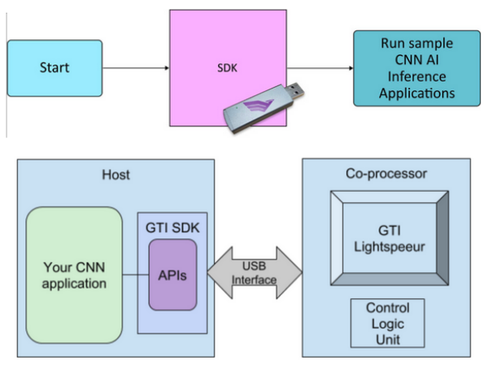

---
# Jekyll 'Front Matter' goes here. Most are set by default, and should NOT be
# overwritten except in special circumstances. 
# You should set the date the article was last updated like this:
date: 2024-04-30 # YYYY-MM-DD
# This will be displayed at the bottom of the article
# You should set the article's title:
title: Tutorial on Using USB Compute Sticks
# The 'title' is automatically displayed at the top of the page
# and used in other parts of the site.
---
USB compute sticks are meant to enhance the visual processing power of your hardware setup. Since documentation on these sticks is sorely lacking online, the point of this tutorial is to show
users how to get them working in a fast and effective way.

## Introduction
As of the time of writing, we have found at CMU:

- 4 Intel Neural Compute Stick (NCS) 2
- 6 Gyrfalcon Tech Plai Plug 2803



In terms of usefulness, these sticks don’t add that much power to most modern computers. Your typical notebook GPU (and even CPU) will generally be able to handle more visual processing than the sticks, especially considering real-time applications. **These sticks are useful, however, when you have to do visual inference on low-power hardware, such as running object detection using a Raspberry Pi, for example. Or when the CPU/GPU of your system will already be in full demand, such as in autonomous drone flight. In these cases, the sticks can increase the speed of your program.**



### Pros and cons of each stick
**Intel NCS2**:

+Documentation provided by intel

+Can find some level of community support online

+Ready demos available online

-Software support has been discontinued, so an older version has to be used

-NCS2 has also been discontinued, so no hardware updates nor new versions

-Getting the stick to work is not trivial 

**Gyrfalcon Tech Plai Plug 2803**:

+Honestly, I didn’t find any… but please feel free to use this stick and prove me wrong

-Stick (and support for it) seems to have been discontinued

-Community support pretty much non-existent

-Newest SDK has broken install instructions, and I couldn't get it to work. Had to use an older version 

-The SDK was made for Ubuntu 16, so getting it to work in newer versions requires some hacking

-Uses a lot of legacy software like python 2, CV 3.0, etc.


## Intel Neural Compute Stick (NCS) 2

### Introduction and functioning

The Intel Neural Compute Stick 2 is powered by the Intel Movidius X VPU to power on-device AI applications at high performance with ultra-low power consumption. With new performance enhancements, the Intel Movidius Myriad X VPU is a power-efficient solution revolving around edge computing that brings computer vision and AI applications to edge devices such as connected computers, drones, smart cameras, smart home, security, VR/AR headsets, and 360-degree cameras. You can read more at: <https://viso.ai/edge-ai/intel-neural-compute-stick-2/>.

In order to use the NCS2, you are going to need OpenVINO. OpenVINO is an Intel deep learning toolkit that can be used in multiple platforms, including the stick. Its idea is to be kinda like Java, a sort of “meta-framework” that abstracts from torch, tensorflow, etc. And like Java, it is a pain to understand and use. There are two versions of OpenVINO:

- OpenVINO runtime: this is what you will use to run your neural network application for inference. It has to be configured to run with the GPU/NCS2.

- OpenVINO development tools: this package contains runtime, plus several other applications such as model optimizer and open_model_zoo tools. For python developers, you can just install the pypi version. For C++ developers, you will need to first install and build the runtime version separately before using the development tools. If you are not developing any new models/demos, the python version should work fine for you, as you can run C++ demos using the runtime version (but you’ll not be able to develop new ones).

For full instructions, please consult <https://docs.openvino.ai/2022.3/get_started.html>. For this example, we will be installing python development tools and OpenVINO runtime on an Ubuntu 20 computer, using an existing model and demo to show how the process works. Please adapt as needed to suit your application.

> Support for the NCS2 only goes as far as OpenVINO 2022.3.1 LTS, so be sure to use the correct version when installing or consulting documentation.




### Installing OpenVINO development tools in your computer

We are going to install OpenVINO development tools on an Ubuntu 20 computer running python 3.8. From your home directory, run the following commands:

```shell
$ python3 -m venv openvino_env
$ source openvino_env/bin/activate
$ python3 -m pip install --upgrade pip
$ pip install openvino-dev[caffe,kaldi,mxnet,ONNX,pytorch,tensorflow2]==2022.3.1
```

> The arguments inside the square brackets are frameworks that OpenVINO will be able to work with. If you would rather work with tensorflow 1, use “tensorflow1” instead of “tensorflow2” in the arguments. Also, remember to activate the environment whenever you want to use the OpenVINO development tools (by running the source command).

Once the download is complete, you can verify the installation by doing:

```shell
$ mo -h
```

The help page for the model optimizer should come up.

You can also run:

```shell
$ omz_downloader --print_all
```

To list all the available models in the open model zoo (omz). The omz is an online repository full
of pre-trained neural network models that you can use in your applications. The omz also
provides demos to showcase these models.

The demo we are going to use is this tutorial is the "3D Human Pose Estimation Python* Demo"
(<https://github.com/openvinotoolkit/open_model_zoo/blob/releases/2022/3/demos/human_pose_estimation_3d_demo/python/README.md>), since the pipeline to get this demo working makes
use of most OpenVINO commands. This demo needs a model to run:

- human-pose-estimation-3d-0001

Create a folder where you want to store and convert your models:


```shell
$ mkdir models
$ cd models/
```

From inside the models folder, you can use the omz_downloader command to get these models
from the open model zoo. Remember to change the name of the model accordingly:

```shell
$ omz_downloader --name human-pose-estimation-3d-0001 --precisions FP16 -o .
```

> The NCS2 only supports FP16 precision.

You can see all installed models by running:

```shell
$ find .
```

You must have a .bin and .xml file for each model in order to use them. As usually happens with
public models (like ours), that is not the case. If your model is in any other format, you will need
to run the omz_converter command, like the example below. This will generate the .xml and .bin
files.

```shell
$ omz_converter --name human-pose-estimation-3d-0001 --precisions FP16 -d . -o .
```

If you do run the conversion command, make sure you have installed the framework (torch,
tensorflow, etc.) used by the original model.

Now that the model has been downloaded and converted, **copy the .bin and .xml files into the
computer where you will run the application**.

### Installing OpenVINO runtime in your computer

Go to the link for OpenVINO runtime and select your system <https://docs.openvino.ai/2022.3/openvino_docs_install_guides_install_runtime.html>.

> It is recommended that you install from archive files.

In the case of an Ubuntu 20 computer, for example, you should do:

```shell
$ sudo mkdir /opt/intel
$ cd Downloads
$ curl -L https://storage.openvinotoolkit.org/repositories/openvino/packages/2022.3.1/linux/l_openvino_toolkit_ubuntu20_2022.3.1.9227.cf2c7da5689_x86_64.tgz --output openvino_2022.3.1.tgz
$ tar -xf openvino_2022.3.1.tgz
$ sudo mv l_openvino_toolkit_ubuntu20_2022.3.1.9227.cf2c7da5689_x86_64 /opt/intel/openvino_2022.3.1
$ cd /opt/intel/openvino_2022.3.1
$ sudo -E ./install_dependencies/install_openvino_dependencies.sh
```

These commands should download all necessary dependencies for OpenVINO runtime. Next
you should install the dependencies for Python specifically and create a link to you OpenVINO
folder:

```shell
$ cd /opt/intel/openvino_2022.3.1
$ python3 -m pip install -r ./python/python3.<x>/requirements.txt
$ cd /opt/intel/opt/intel$ sudo ln -s openvino_2022.3.1 openvino_2022
```

Finally, you should configure the environment. We also recommend adding the command to .bashrc so you don’t forget it. Otherwise, you will have to run it anytime you use OpenVINO.

```shell
$ source /opt/intel/openvino_2022/setupvars.sh
$ echo "source /opt/intel/openvino_2022/setupvars.sh" >> ~/.bashrc
```

Before proceeding, you also need to configure the NCS2. Instructions can be found in this link <https://docs.openvino.ai/2022.3/openvino_docs_install_guides_configurations_for_ncs2.html>. They are reproduced below for your convenience:

```shell
$ sudo usermod -a -G users "$(whoami)"
$ cd /opt/intel/openvino_2022/install_dependencies/
$ sudo cp 97-myriad-usbboot.rules /etc/udev/rules.d/
$ sudo udevadm control --reload-rules
$ sudo udevadm trigger$ sudo ldconfig
```

Reboot the computer after running these commands.

After rebooting, plug the NCS2 into your machine.

To check if the installation was successful, open a terminal window and type:

```shell
$ python3 -c "from openvino.runtime import Core; print(Core().available_devices)"
```

If everything is correct, you should see a list that includes a device called ‘MYRIAD’. That is the
NCS2. If the device did not show up, check the steps in <https://stackoverflow.com/collectives/articles/70864843/how-to-run-openvino-with-neural-compute-stick-2-on-linux> to see where the process broke down.


To run a demo, we will download the open model zoo repository, which is found at <https://github.com/openvinotoolkit/open_model_zoo/tree/releases/2022/3>. 

> The date of the branch matters. Get the one shown below.

```shell
$ git clone --recurse-submodules https://github.com/openvinotoolkit/open_model_zoo.git --branch releases/2022/3
```

The link at <https://github.com/openvinotoolkit/open_model_zoo/tree/releases/2022/3/demos> also contains instructions on how to build the C++ demos or demos that require native Python, reproduced below:

```shell
$ cd open_model_zoo/demos
$ python3 -mpip install --user -r ./requirements.txt
$ pip install ./common/python
$ mkdir build
$ cd build
$ cmake -DCMAKE_BUILD_TYPE=Release -DENABLE_PYTHON=ON ..
$ cmake --build .
$ export PYTHONPATH="$(pwd)/intel64/Release:$PYTHONPATH"
```

> Remember to export the PYTHONPATH whenever you open a new terminal.

Navigate to the desired demo. In our case:

```shell
$ cd ../human_pose_estimation_3d_demo/python/
```

Some demos won’t support MYRIAD out of the box. Since OpenVINO is supposed to run on
any platform, usually all you need to do is add MYRIAD to some list of allowed devices at the
beginning of the program, like below:

```py
DEVICE_KINDS = ['CPU', 'GPU', 'HETERO', 'MYRIAD']
```

> Remember you’ll need to recompile files if you change the source code on are a cpp demo.

Finally, to run your demo, run:

```shell
$ python3 human_pose_estimation_3d_demo.py -m <path-to-model>/human-pose-estimation-3d-0001.xml -i 0 -d MYRIAD
```




## Gyrfalcon Tech Plai Plug 2803

### Introduction and functioning

Gyrfalcon Technology’s (GTI) silicon chips are high performance and low power hardware
accelerators used for convolutional neural network (CNN) solutions. They contain an optimized,
expandable parallel CNN processing engine and efficient on-chip memory. The hardware
accelerators can be integrated into embedded systems deployed at the edge or in servers.
(From GTI website)

Typical use of the Plai Plug involves developing neural network models then using the SDK to
get the models to run on the chips.




> You need premium membership for accessing model development kits (MDKs).

> The stick is ancient, so all software used for it is legacy. This tutorial assumes the
use of Ubuntu 20. For older OSs, installation may be easier.

### Accessing the GTI website

You will need to download the GTI software from their website. AIMS has an account for that.
Navigate to <https://dev.gyrfalcontech.ai/wp-login.php> and log in with credentials. The AI Maker
Space in Tepper has credentials you can ask for in order to work with the sticks.

> Ignore the expired certificate warning.

You will be able to download the SDK now.

### Downloading and unpacking the SDK

Click on “Software Downloads” on the left-side menu and navigate to “SDK (4.x)”. Download the
appropriate version (e.g. “SDK for Linux x86 (version 4.5.0.3) – 887 MB” for the 2803). After the
download has finished, navigate to your home folder and run:

```shell
$ mkdir GTI
$ tar zxvf ./Downloads/GTISDK-Linux_x86_64_v4.5.0.3.tgz -C GTI --strip-components=1
```

### Setting up the dependencies

As mentioned, the stick uses legacy software, so you need to add repositories to get it to work.
In a terminal, run the following command to add a repository for opencv dependencies:

```shell
$ sudo add-apt-repository ppa:linuxuprising/libpng12
```

Then run:

```shell
$ sudo gedit /etc/apt/sources.list
```

And add the following lines to the end of the file:

```
# Xenial repos for old packages
deb http://dk.archive.ubuntu.com/ubuntu/ xenial main
deb http://dk.archive.ubuntu.com/ubuntu/ xenial universe
```

Finally, refresh apt and install the dependencies for the stick:

```shell
$ sudo apt update
$ sudo apt install libx11-dev libgtk2.0-dev pkg-config libavcodec-dev libavformat-dev libswscale-dev libjpeg-dev python-numpy python-tk libopencv-dev libpng-dev python-opencv
$ sudo apt install libcanberra-gtk-module
```

> This will install the package python-is-python2, which adds a symbolic link to your bin that makes the python command point to python2 instead of python3. This might break other applications, so be careful.


### Sourcing the stick

Plug the stick into one of your computer’s USB ports.


Go inside the GTI folder created previously where you extracted the package and run:


```shell
$ source SourceMe.env
```

Press y to install EUSB rules. Press y to install FTDI rules. Press n when prompted to install
PCIe driver (you don’t need it and the install is broken anyway). Press y when prompted if you
want to install gtilib.

Remember to source SourceMe.env whenever you want to use the Plai Plug stick.


### Running demos

All demos are in the Apps folder. For python demos (example):

```shell
$ cd Apps/Python
$ python demo.py image ../Models/2803/gti_gnet1_fc1000_2803.model ../Data/Image_bmp_c1000/beach.bmp
```

For C demos (example):

```shell
$ cd Apps/Demos
$ demo image ../Models/2803/gti_gnet1_fc1000_2803.model ../Data/Image_bmp_c1000/beach.bmp
```

For more information on running demos, consult the manual in the Documents folder of the GTI
package you downloaded.

