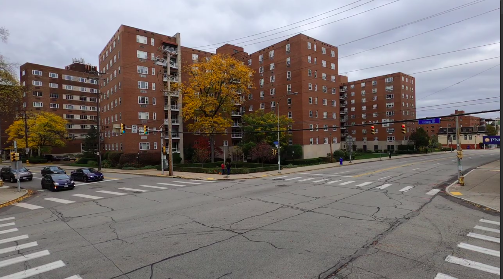
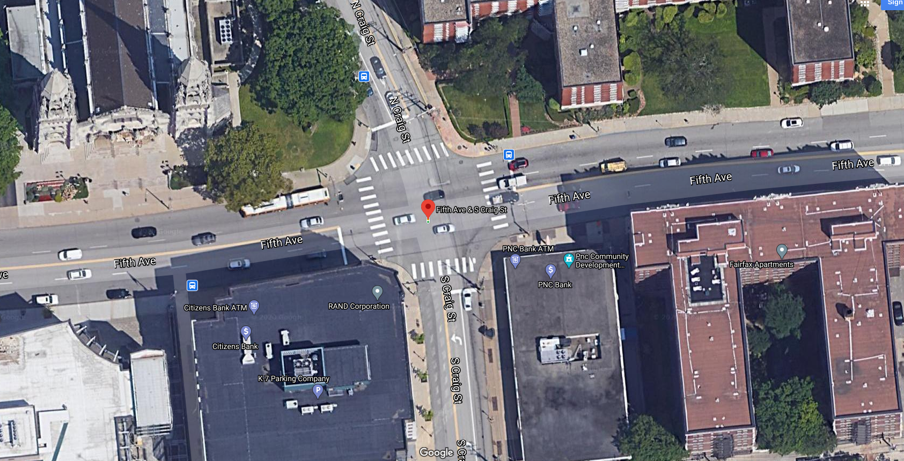

Tracking vehicles using static camera is a useful tool for various use cases pertaining to both macro/micro traffic flow. We present a system where we extract vehicle trajectories using a monocular camera mounted at an intersection.

We utilize a HD map and precompute homographies between the image plane of the camera and a bird's eye view plane where we finally project our trajectories.

1. ### 2D detection and tracking
We use detectron 2 and SORT as preliminary vehicle detection and tracking algorithms in the camera frame. The algorithms give a bounding box on estimate.

2. ### Homography estimation to transform points image plane corresponding to a bird's eye view
A ransac based homography is required to be precomputed between 2 image planes in camera and bird's eye view space. OpenCV's `cv::findhomography()` might be handy here.

3. ### Bird's eye view and region of interest
For getting a bird's eye view of an
The bird's eye view can capture a fairly large space of the map depending on where the view is taken from. However the homography estimate is not good at the points far away from the camera origin. For this case we predefine a region of interest in the bird's eye view space and any vehicle out of this region is ignored.

4. ### HD Map
A HD Map for the world is a prerequisite. Since the intersection we captured data from didn't have a prior map available, we ended up creating our own vanilla map. The major requirements for the map are the information containing the lanes, their directions and the corresponding lane center lines.  
    

5. ### Tracking in the bird's eye view space
For sake of avoiding confusion with the tracker in the camera space (SORT) , we will call this tracker as the BEV tracker throughout the rest of this post. This tracker tracks the position and velocity of the vehicles in the bird's eye view frame.

#### Why is a tracker in bird's eye view required when there is one in camera frame already?
Because sometimes occlusions occur in camera frame and not in bird's eye view frame. 
#### Why is a tracker in camera frame required when there is one in bird's eye view frame already?
Because sometimes occlusions occur in bird's eye view frame and not in camera frame. For instance as with the case of a overhead bridge.

Tracked state of a vehicle - **[x, y, vx, vy]**

* #### Preprocess incoming data from SORT/detector -  
    Incoming data -  
    ***{id1: [x,y,vx,vy],***     
    ***id2:[x,y,vx,vy]...}***  
    * Eliminate any incoming vehicle positions that are out of the region of interest. 
    * Do not track any vehicle yet which is not seen for a minimum threshold of n frames.(To avoid tracking false positives from the detector)

* #### Predict tracked vehicles' positions -
    For the vehicles which are tracked by the BEV tracker we predict their positions for the next frame. We use a point based constant velocity model. We find that it works better than point based constant acceleration model. 

* #### Data Association - 
    The ID association problem is modeled as a linear sum assignment. We use the Hungarian  algorithm to solve this. The cost is defined as the euclidean distance between states of any two vehicles.
    
    * This is then formed into a matrix where rows contain ids from bev tracker and columns contain ids from SORT.
    
    * Adding the priors from SORT- 
    The same IDs from tracker and SORT (say i and j), we assign the cost
    between those vehicles as 0 or Cij = 0.
    * Solving the above problem results in associated id list such as say- **[(ik, jl); (ik', jl');(ik'', jl'')]**
    * It is better to model any constraint in the cost function itself. However, a custom feasibility check of these associations can also be added afterwards. 
    * Those vehicles for which associations are not found, are identifed as new vehicles.

* #### Fuse states - 
    We do a weighted average of the predicted states from SORT and bev tracker. The weights are kept static and set in the beginning. One could try estimating the noise model from the SORT and then possibly make updates via a extended kalman filter.

* ####  Postprocess - 
    * Use map to estimate position -
    We assume all vehicles go along the center line of the lane it is in. For each of the vehicles to account for the wrong perspective as well as bev tracking prediction errors we shift them to the nearest center line.
    * Smoothen the trajectories -
    The results from data association and the operation of moving to center lane can be noisy, so we smoothen the previous trajectory of the vehicle for nmin frames. This number is usually kept as a function of the FPS of the captured images.
    * Remove the vehicles not seen for more than nmax frames.
    * Avoid collisions. We ignore any prediction which results in a collision with a neighbouring / leading vehicle. This usually happens due to some noisy assoiation or vehicle state input.
    * Limit the local vehicle velocities to maximum threshold.
* #### Maintain history -
    * Apart from keeping the vehicle states, we maintain the following history of the tracked vehicles alongside- 
        * The lanes they have traversed.
        * Number of  consecutive frames they are seen for.
        * Number of  consecutive frames they have not been seen for.

#### References:
* [1] Yuxin Wu, Alexander Kirillov, Francisco Massa, Wan-Yen Lo, and Ross Girshick.Detectron2. https://github.com/facebookresearch/detectron2, 2019.
* [2] Alex Bewley, ZongYuan Ge, Lionel Ott, Fabio Ramos, and Ben Upcroft. Simple online and real-
time tracking. CoRR, abs/1602.00763, 2016.
* [3] Scipy linear sum assignment. https://docs.scipy.org/doc/scipy-0.18.1/reference/generated/scipy.optimize.linear_sum_assignment.html.
